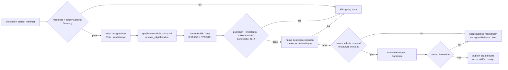

# New product signing checklist

Use this when adding a Windows desktop product to the company publisher. It is
an execution index, not a second copy of the Azure commands or receipt schema.
Provider details live in `azure-artifact-signing-setup.md`; workflow details
live in `signing-gates.md`. If nobody remembers how the existing chain was
built, read
[azure-artifact-signing-setup.md §6](azure-artifact-signing-setup.md#6-reconstructing-the-setup-when-nobody-remembers)
first — it reconstructs the current state read-only and explains why there is no
certificate file to find. Before trusting or modifying the shared helpers,
run `scripts/self-test.sh`; it is local, synthetic and consumes no signing
transaction.

## Markdown tree DAG

- [ ] define the signed product boundary
  - [ ] enumerate every distributable PE/DLL by OS and ISA from a checked-in
    manifest; no glob-discovered extras
  - [ ] state which files are transformed and therefore which native
    post-sign courts own them
  - [ ] give every signed file a product/version resource and an initially
    empty Authenticode Security Directory
  - [ ] establish per-file and per-archive size budgets before signatures add
    bytes
- [ ] establish one repository identity
  - [ ] reuse the company Artifact Signing account and Public Trust profile
  - [ ] create a distinct Entra application/service principal for this repo
  - [ ] bind the exact immutable GitHub Environment subject
  - [ ] grant only Certificate Profile Signer at profile scope
  - [ ] put OIDC identifiers in Environment secrets and provider coordinates
    in Environment configuration; never in source or receipts
  - [ ] run `scripts/check-github-signing-environment.sh OWNER/REPOSITORY` and
    require the exact name sets without printing values; separately verify the
    immutable OIDC subject and profile-scoped RBAC with
    `scripts/check-azure-signing-state.sh`
- [ ] implement an explicit policy split
  - [ ] `off` path never enters the protected Environment or signing actions
  - [ ] `required` path fails closed when configuration/signature is missing
  - [ ] active validators accept only the current provider; archived or
    declined providers cannot authorize new bytes
  - [ ] qualification while `off` is allowed only with
    `release_eligible=false`
  - [ ] Candidate/Promotion validators require `release_eligible=true`
- [ ] install the reusable inspection court
  - [ ] copy both canonical `inspect-authenticode.ps1` and
    `inspect-authenticode.sh`, plus `fetch-microsoft-trust-bundle.sh`, into the
    product's `scripts/` directory
  - [ ] keep the copies byte-identical at contract
    `pns-authenticode-inspector/v3`; product-specific expected name/version are
    command arguments, not forks of the inspector
  - [ ] run `scripts/check-product-inspectors.sh <PRODUCT_REPOSITORY_ROOT>`
    from this skill and require both checks to report `OK`
  - [ ] retain Windows as the authoritative trust court; portable inspection
    is diagnostic when its local CA chain is incomplete
- [ ] bind exact bytes
  - [ ] consume one successful exact-SHA unsigned build/Candidate without
    rebuilding
  - [ ] record upstream run id/attempt and every before SHA-256
  - [ ] upload the immutable unsigned signing input before provider mutation
  - [ ] accept exactly the declared output paths, then record after hashes,
    byte counts, public certificate facts and timestamp facts
  - [ ] audit the public receipt for protected provider/OIDC coordinate keys
- [ ] qualify before release
  - [ ] run `scripts/check-product-signing-readiness.sh
    <PRODUCT_REPOSITORY_ROOT>` before dispatch; require `READY` and preserve its
    exact-main SHA as the proposed Candidate identity
  - [ ] when reusing an unexpired Candidate at an immutable published tag solely
    to prove the provider mechanism, run
    `scripts/check-historical-signing-qualification.sh PRODUCT_ROOT OWNER/REPOSITORY SOURCE_SHA CANDIDATE_RUN_ID`;
    keep the current controller SHA and historical payload SHA distinct in the
    evidence, and require `release_eligible=false`
  - [ ] Windows reports every signature `Valid`, expected company `O=`, a
    timestamp certificate, and unchanged requested VERSIONINFO
  - [ ] execute every transformed after-SHA on its native ISA courts
  - [ ] record the archive/file SHA actually consumed by each runtime court and
    match it to the signing receipt's after-SHA in the aggregate
  - [ ] scan the same extracted final bytes with Microsoft Defender
  - [ ] aggregate only the current run attempt and exact expected cell set
  - [ ] preserve a redacted evidence summary; never promote qualification
    artifacts
- [ ] deliberately activate one version
  - [ ] Candidate preflight rejects an already published version/tag before
    expensive build or signing work
  - [ ] owner selects `required` in checked-in release policy
  - [ ] exact-SHA Candidate repeats signing and all final-byte courts
  - [ ] human Promotion publishes sealed bytes without rebuilding or signing
  - [ ] downloaded Release assets are re-hashed, re-executed and independently
    inspected
- [ ] establish operations before the first signed Release
  - [ ] estimate signing operations from the exact file catalog and review the
    account-wide quota/current price instead of signing every development build
  - [ ] correlate provider transactions to source/run identity and keep
    provider diagnostic logs in private company storage, never the public repo
  - [ ] review federated credentials and profile-scoped signer roles; one
    product identity must not silently become another product's signer
  - [ ] document the stop-signing response separately from irreversible
    certificate revocation; deleting a profile is not revocation
  - [ ] retain timestamp evidence because the service certificates themselves
    have a short managed lifetime

## Mermaid flowchart memory palace

## Handoff evidence

Return only:

- repository-relative implementation and policy paths;
- exact source SHA plus unsigned/signing run ids and attempts;
- public artifact hashes, sizes, publisher/timestamp facts and native-court
  results;
- signing policy mode and whether the receipt is release-eligible;
- remaining human authority gate.

Never return tenant, subscription, app, validation, account, profile, resource
group or credential values. A provider action may need protected values as
inputs; that does not make those values public provenance.
