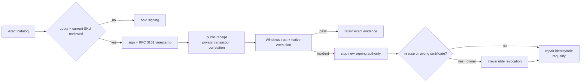

# Artifact Signing operations

Use this branch after provider setup exists. It owns routine cost and access
review, private signing-transaction evidence, certificate lifetime, and
incident response. Product workflows still own exact bytes and release gates.

## Markdown tree DAG

- routine release operation
  - sign only exact qualification or Candidate catalogs, not ordinary commits
  - estimate one operation per file presented for signing, then reconcile the
    provider's actual transaction record after the run
  - retain public before/after hashes and certificate facts in the product
    receipt; retain protected provider transaction logs only in company storage
  - review current pricing and quota before changing the catalog or SKU
- certificate lifetime
  - Artifact Signing manages certificate issuance and renewal inside the
    service; no product repository owns a PFX or renewal cron
  - Public Trust signing certificates have a three-day lifetime
  - every signature therefore requires the configured Microsoft RFC 3161
    SHA-256 timestamp; absence is a hard failure
  - re-check old Release bytes on Windows periodically so timestamp-chain or
    revocation changes become observable
- monthly operations
  - the Basic account allows one profile of each available type; share the
    company Public Trust profile and isolate products with separate OIDC apps
  - signing quota covers activity across every profile in the account
  - Azure bills the SKU for the full month rather than pro-rating it
  - prices and included operation counts are live service facts: consult the
    official pricing/SKU page at review time instead of copying numbers here
  - optionally route the `Sign Transactions` diagnostic category to private
    Azure Storage; storage billing and retention are separate decisions
  - run `scripts/check-azure-signing-state.sh`; it reports only counts and
    policy facts, and fails on an extra profile, human signer, unexpected role,
    inactive profile or non-immutable GitHub subject without printing protected
    identifiers
- suspected misuse or wrong publisher data
  - stop new signing first: cancel active signing runs and remove or disable the
    affected repository's federated credential/profile-scoped signer role
  - preserve source/run identity, public receipts, exact hashes, and private
    provider transaction records for the investigation
  - distinguish resource deletion from certificate revocation: deleting a
    certificate profile stops future renewal/signing but does not revoke
    certificates already used
  - certificate revocation is irreversible and makes affected signed files
    invalid beginning at the selected revocation time; it requires an explicit
    owner decision and the provider's supported portal/support process
  - after recovery, create the replacement identity/profile only after the
    legal subject and least-privilege boundaries are reverified, then repeat a
    non-promotable qualification before any signed Candidate

## Mermaid flowchart memory palace

## Official live references

- [Signing integrations and three-day certificate lifetime](https://learn.microsoft.com/en-us/azure/artifact-signing/how-to-signing-integrations)
- [SKU, quota, and cost management](https://learn.microsoft.com/en-us/azure/artifact-signing/how-to-change-sku)
- [FAQ: quota scope, billing, deletion, and abuse response](https://learn.microsoft.com/en-us/azure/artifact-signing/faq)
- [Route Sign Transactions logs to private storage](https://learn.microsoft.com/en-us/azure/artifact-signing/how-to-sign-history)
- [Certificate-profile revocation semantics](https://learn.microsoft.com/en-us/azure/artifact-signing/how-to-cert-revocation)

These pages are operational dependencies and can change. Re-read them before a
SKU change, resource deletion, revocation, or incident response; repository
memory records the decision boundary, not a frozen copy of Azure pricing.
