# MiniCon product requirements

MiniCon is a terminal that is one file: no installer, no bundled runtime, and
no authority beyond local terminal hosting. This compact root is the product
index and decision map. Details and history live in the owning `prd/PRD_*.md`;
machine alignment is `alignment-contract.json`, and public evidence identities
are in `evidence-registry.json`.

Legend: `[x]` shipped, `[~]` partial, `[ ]` planned, `[-]` explicit non-goal.

## Product outcome

A user can launch one small executable, organize independent local terminals,
type through a dedicated input area, and automate the visible GUI through a
bounded local CLI. Failure in one child, tab, callback, parser or request does
not destroy unrelated sessions or the host.

MiniCon remains useful precisely because it is not AgenTerm: it has no
workbench server, persistent workspace, Fleet, mux, MCP, script runtime,
plugin host, or Agent permission policy. AgenTerm is the Agent-era workbench
on the same platform layer. MiniCon `--control` is a GUI-lifetime local
socket/pipe inside that window, not AgenTerm's server. Details:
`prd/PRD_02_23_minicon.md`, `prd/PRD_02_26_con_control_cli.md`.

## Markdown-tree DAG PRD

The root tree records outcomes, owners and current decisions only. Follow the
linked module for behavior, evidence, delivery mechanics and history.

```text
MiniCon — one-file local terminal
├── Charter and authority
│   ├── local terminal host; one executable; operating-system libraries only
│   ├── host process RSS is scarce; idle one-tab intent is 10 MiB; child shells excluded
│   ├── [-] no server, persistence, Fleet, mux, MCP, scripts or Agent policy
│   └── prd/PRD_02_23_minicon.md
├── User capabilities
│   ├── Terminal runtime and rendering
│   │   ├── PTY lifecycle, bounded VT/rendering, CJK and native presentation
│   │   └── prd/PRD_02_24_con_terminal.md
│   ├── Workspace and human input
│   │   ├── stable tab tree, composer, IME, selection, clipboard and scrollback
│   │   └── prd/PRD_02_25_con_workspace.md
│   └── Scriptable observation and control
│       ├── GUI-lifetime endpoint, bounded protocol, waits, snapshots and PNG
│       └── prd/PRD_02_26_con_control_cli.md
├── Delivery and portability
│   ├── six cells: {win,lnx,osx} × {x86_64,aarch64}
│   ├── build once; runtime courts execute exact artifacts without compiling
│   ├── independent evidence lanes
│   │   ├── GitHub native runners — fast regression and real ISA
│   │   └── local UTM — partnernetsoftware/utm-court; MiniCon calls it at test time
│   ├── [x] v0.1.2 stable — 3 archives covering 4/6 cells + SHA-256 sidecars
│   ├── [x] v0.1.3 released — 5 native archives cover all 6 cells
│   │   ├── 5 archives: win/lnx × {x86_64,arm64} + macOS Universal
│   │   ├── unsigned by explicit release-policy.json configuration
│   │   ├── exact Candidate bytes + Defender on both Windows executables
│   │   └── exact Candidate promoted without rebuild after gates + human authority
│   ├── [x] v0.1.4 released — unsigned native six-cell + Linux X11 runtime fix
│   │   ├── 5 archives: win/lnx × {x86_64,arm64} + macOS Universal
│   │   ├── SignPath not configured; signing.mode remained off
│   │   ├── minicon.com remained excluded by policy
│   │   └── prd/archive/v0.1.4-release-history.md
│   ├── [x] v0.1.5 released — unsigned minicon.com + native six-cell set
│   │   ├── one build; six APE execute-only courts; exact three-PE Defender court
│   │   ├── exact Candidate promoted without rebuild; public bytes re-executed
│   │   └── prd/archive/v0.1.5-release-history.md
│   ├── [x] v0.1.6 released — multiline paste + unsigned six-cell + minicon.com
│   │   └── prd/archive/v0.1.6-release-history.md
│   ├── [x] v0.1.7 released — UI groundwork; last unsigned line
│   │   └── prd/archive/v0.1.7-release-history.md
│   ├── [x] v0.1.9 released — FIRST dual-signed (Windows Authenticode + macOS notarized)
│   │   ├── both signing switches required; PARTNERNET SOFTWARE PTY LTD
│   │   └── prd/archive/v0.1.9-release-history.md
│   ├── [x] v0.1.10 released — complete UI (settings panel, themes, crosshair); dual-signed + signed .dmg
│   │   └── prd/archive/v0.1.10-release-history.md
│   ├── [x] v0.1.11 released — per-theme terminal colors; dual-signed (latest)
│   │   └── prd/archive/v0.1.11-release-history.md
│   └── prd/PRD_02_27_con_delivery.md
├── Reuse boundaries
│   ├── host-neutral shared rules only
│   └── prd/PRD_02_28_shared_core.md
├── Future experiments — not current-version scope
│   ├── qjswasm + TinyVM portable logic; six native OS shells remain
│   │   └── prd/PRD_02_28_qjswasm_horizon.md
│   └── dedicated OS/HarmonyOS feasibility belongs to portfolio horizon
└── Executable truth
    ├── alignment-contract.json — capability → owner → command → evidence
    ├── evidence-registry.json — evidence identity → public test target
    ├── tests/ — black-box journeys
    └── .github/workflows/ — qualification and release automation
```

## Mermaid flowchart memory palace

Read left to right: user value enters a capability room, crosses the product/
platform boundary, is judged by exact-artifact evidence, and only then reaches
a release decision. Dashed paths are optional or future work.

```mermaid
flowchart LR
    U["User value<br/>one file · real terminals<br/>human + script control"]

    subgraph UX["Capability rooms"]
        T["Terminal<br/>PTY · VT · rendering"]
        W["Workspace<br/>tabs · composer · IME"]
        C["Control<br/>CLI · waits · snapshots"]
    end
    subgraph B["Authority boundary"]
        H["MiniCon host<br/>local product policy"]
        P["Platform adapters<br/>window · PTY · input · IPC"]
        K["minicon-core<br/>host-neutral rules"]
        N["Explicitly absent<br/>server · persistence · mux · scripts"]
    end
    subgraph E["Exact-artifact evidence"]
        X["Build owner<br/>six artifacts · source identity"]
        GH["GitHub native six-grid<br/>fast regression · real ISA"]
        VM["utm-court CLI<br/>controlled images · permissions"]
        R["Lane-labelled receipts<br/>same contracts · independent verdicts"]
    end
    subgraph REL["Release evolution"]
        V12["v0.1.2 stable<br/>three packages"]
        C13["v0.1.3 released<br/>5 native archives · 6 cells · unsigned"]
        G13["qualified exact bytes<br/>runtime · control · Defender"]
        V13["public immutable Release<br/>no rebuild"]
        C14["v0.1.4 released<br/>unsigned native six-cell · X11 fix"]
        C15["v0.1.5 released<br/>native six-cell + unsigned minicon.com"]
        C16["v0.1.6 released<br/>multiline paste + unsigned six-cell"]
        C17["v0.1.7 released<br/>UI groundwork · last unsigned"]
        SR9["v0.1.9 released<br/>FIRST dual-signed · Win Authenticode + macOS notarized"]
        R110["v0.1.10 released<br/>complete UI · dual-signed · signed .dmg"]
        R111["v0.1.11 released<br/>per-theme terminal colors · dual-signed · latest"]
        KEEP["rejected Linux Candidate<br/>repair transitive runtime"]
    end
    subgraph F["Future, dependency-gated"]
        SP["SignPath Foundation<br/>declined 2026-09 · path closed"]
        SI["company Artifact Signing<br/>account · OIDC signer identity"]
        SV["Public Organization validation<br/>Completed 2026-09-03"]
        SC["MiniCon Public Trust profile<br/>Active · company-signing.yml wired"]
        QE["agenterm qjswasm + TinyVM ready"]
        QX["portable-logic experiment<br/>one body + six native shells"]
        QG{"total size + startup + memory<br/>six-cell parity pass?"}
    end

    U --> T & W & C
    K & P --> H
    N -. constrains .-> H
    H --> T & W & C
    T & W & C --> X
    X --> GH & VM
    GH & VM --> R
    R --> V12 --> C13
    C13 --> G13 --> V13 --> C14 --> C15 --> C16
    C15 -. rejected precursor .-> KEEP
    C16 --> C17 --> SR9 --> R110 --> R111
    SP -. declined .-> SI
    SI --> SV -->|Completed| SC
    SC -->|first exact signed run| SR9
    SP -. path closed; company path shipped .-> SR9
    QE -. later .-> QX
    X -. native baseline .-> QX
    QX --> QG
    QG -->|fail| KEEP
```



## Governing invariants

- Child exit retains its tab, final screen and exit status until explicit close.
- Closing a parent promotes direct children; parent cycles are rejected.
- One tab cannot corrupt, indefinitely block or terminate another tab or host.
- Composer editing and terminal input have exactly one focus owner.
- Structured state, pixels, pointer ownership and screenshots describe the
  same presented frame.
- PTY traffic, parsing, control, waits, queues, dimensions, screenshots,
  allocations and shutdown are bounded and fail locally.
- MiniCon host process RSS is scarce and named by profile and target. Idle
  one-tab intent is 10 MiB. Child shells are outside that budget.
- Native callbacks never unwind across FFI.
- A public claim names its target/profile and exact evidence; one platform's
  measurement never silently becomes universal.

## Capability ownership

| User problem | Owner | Observable success | Safe failure |
|---|---|---|---|
| Run real local shells | [Terminal](prd/PRD_02_24_con_terminal.md) | real-child and sustained-output journeys | reject or close only the affected session |
| Organize and type without output corrupting drafts | [Workspace](prd/PRD_02_25_con_workspace.md) | multitab, composer, IME and interaction journeys | cancel unfinished interaction; never target a stale tab |
| Automate what the GUI really shows | [Control](prd/PRD_02_26_con_control_cli.md) | catalog, wait, snapshot and PNG black boxes | bounded typed error; cancel waits with their owner |
| Ship portable exact artifacts | [Delivery](prd/PRD_02_27_con_delivery.md) | six-cell runtime and release receipts | block the artifact or claim; never weaken it silently |
| Stay small in RAM | [Delivery](prd/PRD_02_27_con_delivery.md) | idle host RSS court; named regression ceiling | fail the claim; do not kill user sessions |
| Reuse host-neutral rules | [Shared core](prd/PRD_02_28_shared_core.md) | dependency and source-boundary tests | keep code product-local until proven neutral |

## Current frontier

- [x] v0.1.11 is the latest public release: the six-cell native set plus a
  signed `minicon.com` and a signed, notarized macOS `.dmg`, with per-theme
  terminal colors, the settings panel, three themes, and the grid crosshair.
  History: `prd/archive/v0.1.11-release-history.md`.
- [x] Every release since **v0.1.9** is dual-signed: Windows executables and
  `minicon.com` are Authenticode-signed via Azure Artifact Signing, and the
  macOS build is Developer ID-signed and Apple-notarized, as PARTNERNET
  SOFTWARE PTY LTD. `release-policy.json` keeps `signing.mode` and
  `signing.macos.mode` at `required`; missing credentials block a release
  rather than fall back to unsigned. Enrollment history:
  `prd/archive/azure-work-tenant-signing-enroll.md`.
- [x] The QVM false-positive experiment selected the current Windows release
  profile; do not reintroduce compacting changes without reputation evidence.
  Decision record: `plan/archive/design-qvm-false-positive-experiment.md`.
- [x] Native window title is `<title> — MiniCon <version>` (empty workspace:
  `MiniCon <version>`). Owner: `prd/PRD_02_25_con_workspace.md`.
- [~] Host process RSS intent is 10 MiB idle. Font leakage, duplicate Retina
  canvas, old-frame retention and post-screenshot malloc caches are repaired.
  Named macOS aarch64 release
  idle observations are now about 78–87 MiB; the 10 MiB gap remains open.
  Native Hello/input/menu and terminal-increment investigations are recorded
  under `prd/PRD_02_27_con_delivery.md`.
- [~] Host-UI readability is reopened: tab/header and composer-button
  text remains too small on macOS. Make `z / 0 / Z` affect those roles, enlarge
  their nominal text, and reclaim padding/gaps/margins instead of growing empty
  toolbar space. Owner: `prd/PRD_02_25_con_workspace.md`.
- [~] Run `33263135546` localized the remaining cloud pack latency: macOS cells
  compiled in about 4s, Windows cells in 2.65s/1.27s, but Linux dual-LTO took
  about 2m51s and cargo-xwin re-downloaded the MSVC CRT for 1m56s because the
  workflow cached Linux's `~/.cache/cargo-xwin` path on a macOS builder. Cache
  the actual `~/Library/Caches/cargo-xwin` path, then remeasure before changing
  compilation semantics. The approximately one-minute target remains open.
  Owner: `prd/PRD_02_27_con_delivery.md`.
- [~] Linux LTO already spent the remaining **linker** size knob. Linux
  dual desktop (winit Wayland+X11 + `x11rb`) is **retained** — not a size
  cut. Further APE shrink is still a product ruling (optional AT-SPI,
  Darwin native pixel host, or Darwin/Win LTO), not strip/RELR/
  `panic=abort`/ceiling raise. Owner: `prd/PRD_02_27_con_delivery.md`.
- [~] GitHub-native and local-UTM lanes are independent. Neither inherits the
  other's verdict; unavailable runtime evidence is `BLOCKED`. Local UTM
  lifecycle is `partnernetsoftware/utm-court`; MiniCon keeps product runners
  only. Owner: `prd/PRD_02_27_con_delivery.md`,
  `plan/plan-utm-court-extract.md`.
- [~] Local courts are automation-capable but not sealed release baselines.
  Lima is optional acceleration; Rosetta is a provisional OSX x86_64 userspace
  court; real native runners retain claims translation cannot make.
- [ ] Ordinary push/PR CI remains parked.
- [ ] qjswasm portable logic waits for a stable AgenTerm engine and a decisive
  complete-product experiment; it is not current-version scope.

Details and historical run records stay in the owning modules.

## How product work advances

1. Select one owning leaf and state its problem, invariant, evidence, safe
   failure and non-goal.
2. Update the owning module; keep this root an index, not a duplicate.
3. Implement at the narrowest shared/native/product boundary.
4. Add public black-box evidence and register public capabilities/commands.
5. Qualify one exact source state; a failed cell narrows or blocks the claim.
