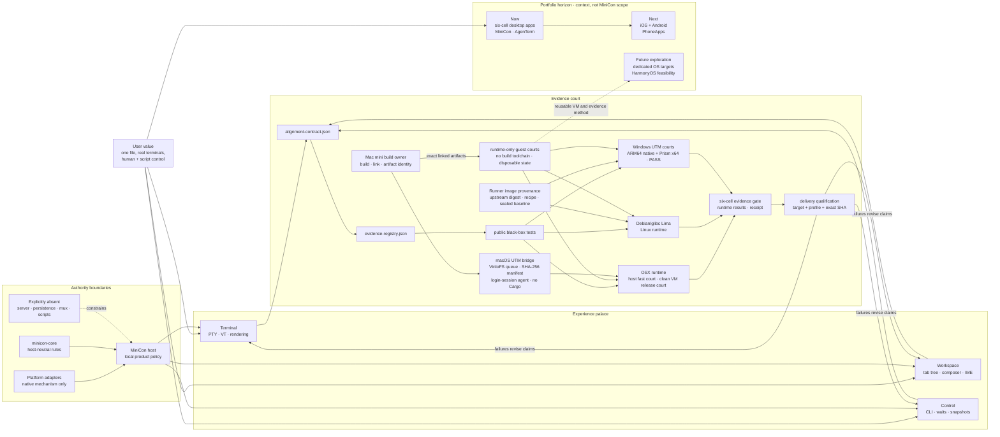

# MiniCon product requirements

MiniCon is a terminal that is one file: no installer, no bundled runtime, and
no product authority beyond local terminal hosting. This file is the product
index and decision map. Detailed requirements live in the owning module under
`prd/`; machine alignment lives in `alignment-contract.json`, and public
black-box evidence identities live in `evidence-registry.json`.

Legend: `[x]` shipped, `[~]` partial, `[ ]` planned, `[-]` explicit non-goal.

## Product outcome

A user can launch one small executable, run and organize several independent
local terminals, type through a dedicated input area, and automate the visible
GUI through a bounded local CLI. Child exit, malformed output, resize storms,
native callback failure, and one saturated tab do not destroy unrelated tabs or
the host.

MiniCon remains useful precisely because it is not AgenTerm: it has no server,
persistent workspace, Fleet, mux, MCP, script runtime, plugin host, or Agent
permission policy.

Portfolio context does not enlarge MiniCon's authority. The current product
program prioritizes six-cell desktop delivery for MiniCon and AgenTerm together
with iOS/Android PhoneApps. Reproducible UTM runners may later seed dedicated-OS
experiments, including a HarmonyOS feasibility court, but that horizon cannot
displace current desktop/mobile evidence or be presented as committed scope.

## Product tree

```text
MiniCon — one-file local terminal
├── Product charter and boundaries
│   ├── current product focus: six-cell desktop MiniCon
│   ├── portfolio context: desktop MiniCon/AgenTerm + iOS/Android PhoneApps
│   ├── future exploration, not current scope
│   │   ├── dedicated operating-system test targets
│   │   └── HarmonyOS feasibility
│   └── prd/PRD_02_23_minicon.md
├── User capability branches
│   ├── Terminal runtime and rendering
│   │   ├── PTY lifecycle and backend selection
│   │   ├── bounded parsing and scheduling
│   │   ├── VT/CJK/glyph rasterization and native present
│   │   └── prd/PRD_02_24_con_terminal.md
│   ├── Workspace and human input
│   │   ├── stable tab tree and child promotion
│   │   ├── dedicated composer, focus and IME
│   │   ├── selection, clipboard and scrollback
│   │   └── prd/PRD_02_25_con_workspace.md
│   └── Scriptable observation and control
│       ├── GUI-lifetime local endpoint
│       ├── bounded ATC1/JSON protocol
│       ├── stable commands, waits, snapshots and screenshots
│       └── prd/PRD_02_26_con_control_cli.md
├── Product integrity branches
│   ├── Package, portability and delivery
│   │   ├── one executable and OS-library-only load boundary
│   │   ├── unwind-safe native callback containment
│   │   ├── platform-qualified size claims and exact-SHA delivery
│   │   ├── Mac-hosted six-cell qualification
│   │   │   ├── host builds every artifact; guests are runtime test targets only
│   │   │   │   ├── no compiler or source checkout required in a guest
│   │   │   │   └── copy exact linked artifacts into disposable runtime courts
│   │   │   ├── macOS runtime courts
│   │   │   │   ├── host-native arm64 + Rosetta x86_64 fast courts
│   │   │   │   └── clean ARM64 macOS VM release/permission court (building)
│   │   │   │       ├── official IPSW + Apple Virtualization baseline
│   │   │   │       ├── VirtioFS exact-artifact job bridge; no Cargo or source
│   │   │   │       └── clean-user, first-launch, TCC and packaging evidence
│   │   │   ├── Debian/glibc Lima runtime courts for Linux cells
│   │   │   │   ├── ARM64 VZ native + x86_64 Rosetta function court
│   │   │   │   └── x86_64 QEMU kernel/logic court
│   │   │   ├── Windows runtime courts
│   │   │   │   ├── UTM guest-agent artifact bridge
│   │   │   │   ├── InteractiveToken desktop dispatcher
│   │   │   │   ├── Windows 11 ARM64 + Guest Tools baseline
│   │   │   │   └── ARM64-native + Prism-x64 full runtime evidence
│   │   │   ├── Reproducible runner images
│   │   │   │   ├── signed upstream ISO/QCOW2 + immutable digest
│   │   │   │   ├── cloud-init/Autounattend provisioning recipe
│   │   │   │   ├── sealed local baseline + disposable overlay
│   │   │   │   └── low-power idle baseline; raise resources only for owning test
│   │   │   └── exact-artifact machine receipt
│   │   └── prd/PRD_02_27_con_delivery.md
│   └── Shared core and reuse boundary
│       ├── host-neutral minicon-core leaves
│       ├── tested dependency direction with AgenTerm
│       └── prd/PRD_02_28_shared_core.md
└── Executable truth
    ├── alignment-contract.json — capability → PRD owner → command → evidence
    ├── evidence-registry.json — evidence identity → public test target
    ├── tests/ — black-box journeys and contract gates
    └── .github/workflows/ — qualification and release automation
```

## Knowledge palace

The diagram is a reasoning map, not a second requirement catalog. Follow a path
from user value to its owning capability, implementation boundary, observable
evidence, and delivery decision; edit the linked module rather than duplicating
its requirements here.



## Governing invariants

- A child process exit retains its tab, final screen, and exit status until an
  explicit close.
- Closing a parent promotes its direct children; cycles are rejected.
- One tab cannot corrupt, indefinitely block, or terminate another tab or the
  GUI host.
- Composer editing and terminal input have exactly one focus owner; local edit,
  selection, clipboard, and IME behavior cannot leak into the wrong PTY.
- Structured state, native pixels, pointer ownership, and screenshots describe
  the same presented frame.
- PTY traffic, parser work, control frames, waits, queues, dimensions,
  screenshots, allocations, and shutdown are bounded and fail locally.
- Native callbacks never unwind across FFI; official builds preserve unwind
  containment.
- A public product claim names its target and build profile and points to owned
  evidence. Measurements from one platform never silently become universal.

## Capability ownership

| User problem | Public owner | Governing boundary | Observable success | Safe failure |
|---|---|---|---|---|
| Run real local shells without a modern-runtime floor | [Terminal](prd/PRD_02_24_con_terminal.md) | one PTY/parser/viewport owner per tab | real-child and sustained-throughput journeys | reject or close only the affected session while retaining valid state |
| Organize terminals and type without output corrupting the draft | [Workspace](prd/PRD_02_25_con_workspace.md) | `Workspace` owns topology; focus has one owner | multitab, composer-focus and native-IME journeys | cancel unfinished interaction; never deliver to a stale tab |
| Automate what the real GUI shows | [Control](prd/PRD_02_26_con_control_cli.md) | GUI-lifetime local endpoint; bounded protocol | command catalog, waits, snapshot and PNG black boxes | bounded typed error; cancel waits when their owner disappears |
| Ship a genuinely portable single executable | [Delivery](prd/PRD_02_27_con_delivery.md) | OS-library-only imports; unwind callbacks; exact artifact identity | import probe, target builds, alignment and release gates | block the affected artifact or claim; never weaken the promise silently |
| Reuse rules without coupling product authorities | [Shared core](prd/PRD_02_28_shared_core.md) | only host-neutral leaves move downward | dependency and source-boundary tests | keep code product-local until the dependency direction is proven |

## Current frontier

- [~] Independent CI is present as `.github/workflows/ci-minicon.yml.disabled`
  but has not yet run as this repository's active feedback owner.
- [x] `scripts/six-cell-qualify.sh` builds and links every Cargo target for all
  six `{x86_64,aarch64} × {win,lnx,osx}` cells from one Apple Silicon Mac and
  runs the complete macOS arm64 suite. Rosetta runs the same macOS x86_64
  suite. A Debian/glibc ARM64 Lima court runs the cross-linked Linux ARM64
  artifact through unit, public GUI/PTY, AT-SPI, control, and sustained-output
  tests. The same VZ guest uses Rosetta for Linux plus Debian amd64 multiarch
  libraries to run the complete x86_64 suite; a QEMU guest separately proves
  x86_64-kernel startup and logic tests. A UTM Windows 11 ARM64 guest with
  Guest Tools runs both the native ARM64 and Prism-translated x86_64 product,
  portability, console-agent, control, GUI black-box, and throughput courts.
  The exact-byte integrated 2026-08-26 receipt records
  `PASS 38 / FAIL 0 / BLOCKED 0` with a stable dirty-tree fingerprint. Every
  absent future court is
  recorded as `BLOCKED`, never inferred from link success. Runner portability
  means an immutable upstream digest plus a declarative provisioning recipe
  and disposable local overlay, not an untrusted redistributed guest disk.
- [ ] Define any future artifact-size ceiling per target and profile before
  restoring a hard gate. Current measured sizes are evidence, not a universal
  sub-1-MiB promise.
- [ ] Complete `minicon-core` Stage 2 only through pure leaf extraction and a
  tested dependency direction; terminal-core extraction remains unscheduled.

These are the only cross-module frontier items. Detailed module work stays in
the owning PRD and changes status there first.

## How product work advances

1. Select one leaf from the tree and state the user problem, invariant,
   observable evidence, safe failure result, and explicit non-goal.
2. Update the owning module PRD before or with implementation; do not add a
   competing file map or duplicate requirements in this index.
3. Implement at the narrowest authority boundary: host-neutral rule, native
   mechanism, or MiniCon product policy.
4. Add public black-box evidence for shipped behavior, then register it in
   `evidence-registry.json` and map it through `alignment-contract.json` when it
   owns a public capability or command.
5. Qualify the exact integrated source state. A failed platform, profile, or
   artifact check narrows the claim or blocks delivery; it is never silently
   skipped.
