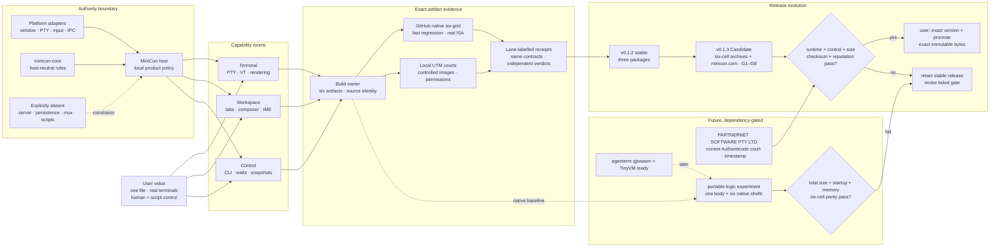

# MiniCon product requirements

MiniCon is a terminal that is one file: no installer, no bundled runtime, and
no authority beyond local terminal hosting. This compact root is the product
index and decision map. Details and history live in the owning `prd/PRD_*.md`;
machine alignment is `alignment-contract.json`, and public evidence identities
are in `evidence-registry.json`.

Legend: `[x]` shipped, `[~]` partial, `[ ]` planned, `[-]` explicit non-goal.

## Product outcome

A user can launch one small executable, organize independent local terminals,
type through a dedicated input area, and automate the visible GUI through a
bounded local CLI. Failure in one child, tab, callback, parser or request does
not destroy unrelated sessions or the host.

MiniCon remains useful precisely because it is not AgenTerm: it has no
workbench server, persistent workspace, Fleet, mux, MCP, script runtime,
plugin host, or Agent permission policy. AgenTerm is the Agent-era workbench
on the same platform layer. MiniCon `--control` is a GUI-lifetime local
socket/pipe inside that window, not AgenTerm's server. Details:
`prd/PRD_02_23_minicon.md`, `prd/PRD_02_26_con_control_cli.md`.

## Markdown-tree DAG PRD

The root tree records outcomes, owners and current decisions only. Follow the
linked module for behavior, evidence, delivery mechanics and history.

```text
MiniCon — one-file local terminal
├── Charter and authority
│   ├── local terminal host; one executable; operating-system libraries only
│   ├── [-] no server, persistence, Fleet, mux, MCP, scripts or Agent policy
│   └── prd/PRD_02_23_minicon.md
├── User capabilities
│   ├── Terminal runtime and rendering
│   │   ├── PTY lifecycle, bounded VT/rendering, CJK and native presentation
│   │   └── prd/PRD_02_24_con_terminal.md
│   ├── Workspace and human input
│   │   ├── stable tab tree, composer, IME, selection, clipboard and scrollback
│   │   └── prd/PRD_02_25_con_workspace.md
│   └── Scriptable observation and control
│       ├── GUI-lifetime endpoint, bounded protocol, waits, snapshots and PNG
│       └── prd/PRD_02_26_con_control_cli.md
├── Delivery and portability
│   ├── six cells: {win,lnx,osx} × {x86_64,aarch64}
│   ├── build once; runtime courts execute exact artifacts without compiling
│   ├── independent evidence lanes
│   │   ├── GitHub native runners — fast regression and real ISA
│   │   └── local UTM — controlled-image release and interactive reproduction
│   ├── [x] v0.1.2 stable — 3 archives covering 4/6 cells + SHA-256 sidecars
│   ├── [~] v0.1.3 Candidate — all 6 cells + minicon.com exact bytes
│   │   ├── 5 archives: win/lnx × {x86_64,arm64} + macOS Universal
│   │   ├── minicon.com is the sixth downloadable executable asset
│   │   ├── G1–G8 plan: research/minicon-com-loader/v0.1.3-candidate-plan.md
│   │   ├── hard ceiling: 9437184 bytes (9 MiB)
│   │   ├── existing six-cell smoke is evidence, not a Candidate pack
│   │   └── no tag/Release before every gate + user names exact version and `promote`
│   └── prd/PRD_02_27_con_delivery.md
├── Reuse boundaries
│   ├── host-neutral shared rules only
│   └── prd/PRD_02_28_shared_core.md
├── Future experiments — not current-version scope
│   ├── qjswasm + TinyVM portable logic; six native OS shells remain
│   │   └── prd/PRD_02_28_qjswasm_horizon.md
│   └── dedicated OS/HarmonyOS feasibility belongs to portfolio horizon
└── Executable truth
    ├── alignment-contract.json — capability → owner → command → evidence
    ├── evidence-registry.json — evidence identity → public test target
    ├── tests/ — black-box journeys
    └── .github/workflows/ — qualification and release automation
```

## Mermaid flowchart memory palace

Read left to right: user value enters a capability room, crosses the product/
platform boundary, is judged by exact-artifact evidence, and only then reaches
a release decision. Dashed paths are optional or future work.



## Governing invariants

- Child exit retains its tab, final screen and exit status until explicit close.
- Closing a parent promotes direct children; parent cycles are rejected.
- One tab cannot corrupt, indefinitely block or terminate another tab or host.
- Composer editing and terminal input have exactly one focus owner.
- Structured state, pixels, pointer ownership and screenshots describe the
  same presented frame.
- PTY traffic, parsing, control, waits, queues, dimensions, screenshots,
  allocations and shutdown are bounded and fail locally.
- Native callbacks never unwind across FFI.
- A public claim names its target/profile and exact evidence; one platform's
  measurement never silently becomes universal.

## Capability ownership

| User problem | Owner | Observable success | Safe failure |
|---|---|---|---|
| Run real local shells | [Terminal](prd/PRD_02_24_con_terminal.md) | real-child and sustained-output journeys | reject or close only the affected session |
| Organize and type without output corrupting drafts | [Workspace](prd/PRD_02_25_con_workspace.md) | multitab, composer, IME and interaction journeys | cancel unfinished interaction; never target a stale tab |
| Automate what the GUI really shows | [Control](prd/PRD_02_26_con_control_cli.md) | catalog, wait, snapshot and PNG black boxes | bounded typed error; cancel waits with their owner |
| Ship portable exact artifacts | [Delivery](prd/PRD_02_27_con_delivery.md) | six-cell runtime and release receipts | block the artifact or claim; never weaken it silently |
| Reuse host-neutral rules | [Shared core](prd/PRD_02_28_shared_core.md) | dependency and source-boundary tests | keep code product-local until proven neutral |

## Current frontier

- [~] v0.1.3 remains gated. Exact-SHA run `33250748539` built once, embedded
  green G3 lifecycle evidence, and passed six native GUI/control cells;
  Candidate `33250998985` sealed five platform archives covering all six cells
  plus `minicon.com`, then rehashed and executed every native archive. That was
  an unsigned rehearsal and is no longer promotable. Its exact APE is red at
  G6: Microsoft Defender reports
  `Program:Win32/Contebrew.A!ml`. Submit that exact SHA through the vendor
  false-positive channel. The company-signing before→after SHA workflow and
  signed-byte six-grid are implemented but not yet dispatched; Azure Public
  Trust identity/OIDC setup, signed-byte Defender rerun, and
  explicit user Promotion remain open. No tag
  or Release exists.
- [x] Unsigned exact-SHA rehearsal `33259779184` at `033e582` independently
  re-proved the new signing input contract: one pack, G3 green, all six native
  GUI/control cells green, APE Authenticode layout ready, SHA matched, and
  8,909,562 bytes under 9 MiB. It is rehearsal evidence, not a Candidate,
  because no company signature was applied.
- [~] Formal releases should carry `PARTNERNET SOFTWARE PTY LTD` publisher
  identity. Authenticode-compatible APE header layout is now proven locally;
  company identity validation, timestamped signing and signed-byte six-grid /
  Defender evidence remain before this Candidate can claim it.
- [~] Workspace chrome readability is reopened: tab/header and composer-button
  text remains too small on macOS. Make `z / 0 / Z` affect those roles, enlarge
  their nominal text, and reclaim padding/gaps/margins instead of growing empty
  toolbar space. Owner: `prd/PRD_02_25_con_workspace.md`.
- [ ] Warm `minicon.com` pack improved from 5m29s to 4m38s in rehearsal
  `33259779184`, still far above the approximately one-minute target; profile
  and remove setup/cache/repeated-build waste without weakening
  one-pack/six-execute coverage. Owner: `prd/PRD_02_27_con_delivery.md`.
- [~] GitHub-native and local-UTM lanes are independent. Neither inherits the
  other's verdict; unavailable runtime evidence is `BLOCKED`.
- [~] Local courts are automation-capable but not sealed release baselines.
  Lima is optional acceleration; Rosetta is a provisional OSX x86_64 userspace
  court; real native runners retain claims translation cannot make.
- [ ] Ordinary push/PR CI remains parked.
- [ ] qjswasm portable logic waits for a stable agenterm engine and a decisive
  complete-product experiment; it is not part of v0.1.3.

Details and historical run records stay in the owning modules.

## How product work advances

1. Select one owning leaf and state its problem, invariant, evidence, safe
   failure and non-goal.
2. Update the owning module; keep this root an index, not a duplicate.
3. Implement at the narrowest shared/native/product boundary.
4. Add public black-box evidence and register public capabilities/commands.
5. Qualify one exact source state; a failed cell narrows or blocks the claim.
