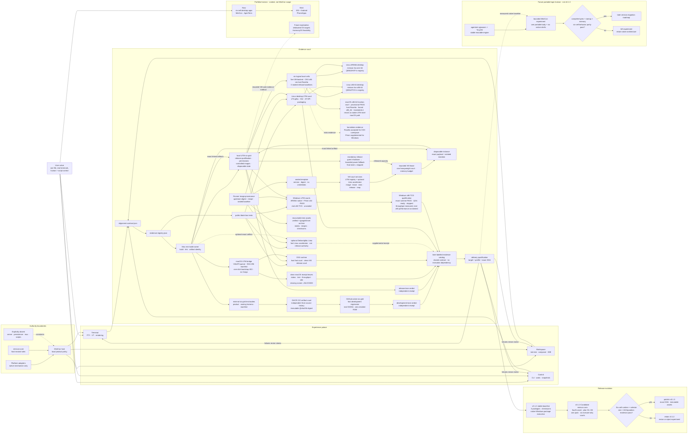

# MiniCon product requirements

MiniCon is a terminal that is one file: no installer, no bundled runtime, and
no product authority beyond local terminal hosting. This file is the product
index and decision map. Detailed requirements live in the owning module under
`prd/`; machine alignment lives in `alignment-contract.json`, and public
black-box evidence identities live in `evidence-registry.json`.

Legend: `[x]` shipped, `[~]` partial, `[ ]` planned, `[-]` explicit non-goal.

## Product outcome

A user can launch one small executable, run and organize several independent
local terminals, type through a dedicated input area, and automate the visible
GUI through a bounded local CLI. Child exit, malformed output, resize storms,
native callback failure, and one saturated tab do not destroy unrelated tabs or
the host.

MiniCon remains useful precisely because it is not AgenTerm: it has no server,
persistent workspace, Fleet, mux, MCP, script runtime, plugin host, or Agent
permission policy.

Portfolio context does not enlarge MiniCon's authority. The current product
program prioritizes six-cell desktop delivery for MiniCon and AgenTerm together
with iOS/Android PhoneApps. Reproducible UTM runners may later seed dedicated-OS
experiments, including a HarmonyOS feasibility court, but that horizon cannot
displace current desktop/mobile evidence or be presented as committed scope.

## Markdown-tree DAG PRD

This tree is the human entry point into the requirement DAG. Indentation means
product decomposition; a linked owning PRD or machine contract is a dependency
edge, not permission to duplicate its detailed requirements here. Read the
stable capability branches first, then the current delivery evolution branch.

```text
MiniCon — one-file local terminal
├── Product charter and boundaries
│   ├── current product focus: six-cell desktop MiniCon
│   ├── portfolio context: desktop MiniCon/AgenTerm + iOS/Android PhoneApps
│   ├── future exploration, not current scope
│   │   ├── dedicated operating-system test targets
│   │   └── HarmonyOS feasibility
│   └── prd/PRD_02_23_minicon.md
├── User capability branches
│   ├── Terminal runtime and rendering
│   │   ├── PTY lifecycle and backend selection
│   │   ├── bounded parsing and scheduling
│   │   ├── VT/CJK/glyph rasterization and native present
│   │   └── prd/PRD_02_24_con_terminal.md
│   ├── Workspace and human input
│   │   ├── stable tab tree and child promotion
│   │   ├── dedicated composer, focus and IME
│   │   ├── selection, clipboard and scrollback
│   │   └── prd/PRD_02_25_con_workspace.md
│   └── Scriptable observation and control
│       ├── GUI-lifetime local endpoint
│       ├── bounded ATC1/JSON protocol
│       ├── stable commands, waits, snapshots and screenshots
│       └── prd/PRD_02_26_con_control_cli.md
├── Product integrity branches
│   ├── Package, portability and delivery
│   │   ├── persistent development goal (PRD is the cross-session SSOT)
│   │   │   ├── tree management: outcome → capability → behavior/evidence/delivery/non-goal leaves
│   │   │   ├── memory palace: Mermaid keeps dependencies and court roles spatially recoverable
│   │   │   ├── time folding: caches + sealed images + immutable bodies turn prior hours into seconds
│   │   │   └── parallel thinking: independent builds, uploads and runtime courts converge at one receipt
│   │   ├── one executable and OS-library-only load boundary
│   │   ├── unwind-safe native callback containment
│   │   ├── platform-qualified size claims and exact-SHA delivery
│   │   ├── repository-pinned Rust 1.97 toolchain; release builders never inherit rolling `stable`
│   │   ├── bounded build-state lifecycle
│   │   │   ├── one shared dry-run-first cleaner; build scripts select narrow scopes
│   │   │   ├── current symlink + receipt build root + newest snapshots + active markers are protected
│   │   │   ├── ordinary Cargo state expires after 14 days; six-cell snapshots after 7 days
│   │   │   ├── below 64 GiB free: pressure court keeps protected + newest two, expires inactive snapshots after 1 hour
│   │   │   ├── cloud bodies require a verified immutable-archive receipt before local expiry
│   │   │   ├── VM images are never part of automatic garbage collection
│   │   │   └── macOS LaunchAgent runs low-priority maintenance daily at 03:17
│   │   ├── Release evolution
│   │   │   ├── [x] v0.1.2 stable baseline
│   │   │   │   ├── exact source tag `v0.1.2`
│   │   │   │   ├── Windows x86_64 ZIP, Linux x86_64 tarball, macOS Universal tarball
│   │   │   │   ├── per-artifact SHA-256 sidecars
│   │   │   │   └── Windows package re-downloaded and executed on a native Windows runner before publication
│   │   │   └── [~] v0.1.3 Candidate: `minicon.com` as fourth Release asset (not tagged)
│   │   │       ├── ruling A (cdx): freeze v0.1.2 three packages; never mix into v0.1.2
│   │   │       ├── G4 stamp: `minicon.com` ≤ 9437184 bytes (9 MiB); 12 MiB is rehearsal-only
│   │   │       ├── plan: `research/minicon-com-loader/v0.1.3-candidate-plan.md` (G1–G8)
│   │   │       ├── smoke-only green: `.github/workflows/minicon-com.yml` run `33238478661` at `459d5cb`
│   │   │       ├── Promotion copies exact Candidate bytes; no rebuild; no pre-release substitute
│   │   │       └── no tag/Release until G1–G8 + human promote
│   │   ├── [ ] qjswasm portable-logic horizon (not current-version scope)
│   │   │   ├── dependency: agenterm qjswasm + TinyVM becomes a stable reusable engine
│   │   │   ├── one portable product-logic body + six native OS/ISA shells
│   │   │   ├── native shells retain window, PTY, font, input, IME, clipboard and IPC authority
│   │   │   ├── size reduction is a measured hypothesis, never a predeclared outcome
│   │   │   └── owner: `prd/PRD_02_28_qjswasm_horizon.md`
│   │   ├── Mac-hosted six-cell qualification
│   │   │   ├── host builds every artifact; remote runners and local guests are runtime test targets only
│   │   │   │   ├── no compiler or source checkout required in a guest
│   │   │   │   └── copy exact linked artifacts into disposable runtime courts
│   │   │   ├── cloud six-grid runtime service
│   │   │   │   ├── Mac mini cross-builds six exact products + owning test harnesses once
│   │   │   │   ├── minimal per-cell bodies → GHCR OCI artifacts addressed only by `@sha256:`
│   │   │   │   ├── six bounded parallel layer uploads → one canonical serial top-level seal
│   │   │   │   ├── GitHub native `{lnx,win,osx} × {arm,x86}-64` runners pull and execute; no checkout/Rust/Cargo
│   │   │   │   ├── aggregate native `test` verdict: six-cell PASS; failed-cell rerun classifies timing flakes without rebuilding
│   │   │   │   ├── attempt-aware evidence ledger
│   │   │   │   │   ├── every attempt retains cell status + runtime log size/SHA-256 under an attempt-scoped artifact
│   │   │   │   │   ├── aggregate FAIL is itself uploaded; a rerun cannot erase first-failure evidence
│   │   │   │   │   ├── intentional failure classification requires an executed probe marker, not merely a requested probe cell
│   │   │   │   │   └── [x] controlled failure → same-digest failed-job rerun → `reverified-pass`, with both attempt logs retained
│   │   │   │   ├── screenshot response scheduling
│   │   │   │   │   └── pending owned capture yields Wake-side PTY backlog to redraw; the 10-second product deadline remains unchanged
│   │   │   │   ├── public-repo standard runners are free; manual/candidate trigger + 20-minute cell deadline still bound waste
│   │   │   │   └── six runtime receipts bind source SHA + source-tree digest + OCI digest + actual runner OS/ISA
│   │   │   │       └── independent dual-lane contract
│   │   │   │           ├── GitHub native runners: elastic fast-development regression lane + real-ISA backstop
│   │   │   │           ├── local UTM: controlled-image release-qualification lane + interactive reproduction
│   │   │   │           ├── lanes share test contracts and may consume identical bytes, but neither executes through nor depends on the other
│   │   │   │           └── receipts remain lane-labelled; local release authority becomes final only after all required baselines are sealed
│   │   │   ├── macOS runtime courts
│   │   │   │   ├── host-native arm64 + Rosetta x86_64 local function courts
│   │   │   │   │   └── x86_64 receipt must prove Mach-O ISA + forced `arch -x86_64` execution + translated-process state
│   │   │   │   └── clean ARM64 macOS VM release/permission court
│   │   │   │       ├── official IPSW + Apple Virtualization baseline
│   │   │   │       ├── VirtioFS exact-artifact job bridge; no Cargo or source
│   │   │   │       │   └── Apple automount first; verified bootstrap sentinel
│   │   │   │       ├── one-click read-only bootstrap ISO; no credentials
│   │   │   │       ├── unified receipt leaves; absence is BLOCKED
│   │   │   │       └── clean-user, first-launch, TCC and packaging evidence
│   │   │   ├── optional Debian/glibc Lima acceleration courts for Linux cells
│   │   │   │   ├── ARM64 VZ native + x86_64 Rosetta function court
│   │   │   │   └── x86_64 QEMU kernel/logic court
│   │   │   │       └── opt-in only; image/lease/exec/release/reap + mandatory stop-on-exit
│   │   │   ├── Linux desktop UTM release courts (both ISAs automation-ready; local baselines unsealed)
│   │   │   │   ├── Ubuntu 24.04 ARM64 GNOME Minimal primary desktop
│   │   │   │   ├── `minicon-lnx-arm-64`; ARM64 guest, QEMU/HVF backend metadata
│   │   │   │   │   └── Guest Agent owns credential-free automation
│   │   │   │   ├── digest-pinned QCOW2 → 32 GiB sparse raw + local credential seed
│   │   │   │   │   └── interactive launcher owns hidden password handoff
│   │   │   │   ├── QEMU+HVF writable virtio root + NoCloud CD/DVD
│   │   │   │   │   ├── VZ removable-USB seed discovery is rejected by evidence
│   │   │   │   │   ├── QEMU Guest Agent owns credential-free host control
│   │   │   │   │   └── provisioning powers off; host starts the sealed baseline
│   │   │   │   └── low-frequency Ubuntu 24.04 x86_64 QEMU kernel desktop court
│   │   │   │       ├── pinned Server ISO + Xubuntu Minimal desktop recipe
│   │   │   │       ├── `minicon-lnx-x86-64`; true x86-64 guest ISA
│   │   │   │       ├── disk-only cold boot + auto-login + QGA + visible XFCE desktop
│   │   │   │       ├── exact x86_64 artifact: help + control + pane text + PNG + close
│   │   │   │       └── 2 vCPU / 4 GiB / QEMU TCG; correctness, not performance
│   │   │   ├── Local six-cell execution inventory (logical courts, not six mandatory VMs)
│   │   │   │   ├── [~] present + automation-ready + local-unsealed: `minicon-lnx-arm-64`, `minicon-lnx-x86-64`, `minicon-osx-arm-64`, `minicon-win-arm-64`
│   │   │   │   ├── [~] present + installed + QGA-ready + local-unsealed: `minicon-win-x86-64`
│   │   │   │   │   ├── exact x86_64 runtime PASS on Windows 11 build 26200: 128 host + 38 core + 2 portability + 7 console-agent + control + 25 GUI/PTY
│   │   │   │   │   ├── request-id/result replay closes TCG pipe 109/233 without repeating mutations
│   │   │   │   │   ├── QEMU/TCG throughput measured 32.09 s and 32.57 s for 33,439,744 bytes; correctness evidence only, not the 30 s performance authority
│   │   │   │   │   └── disposable lease receipt ends `released` + `stopped`; baseline remains local-unsealed
│   │   │   │   ├── [~] host Rosetta court replaces routine `minicon-osx-x86-64` VM work on Apple Silicon
│   │   │   │   │   ├── PASS: forced x86_64 + translated=1; 124 units + 22 GUI/PTY + control + 38 core + release-fast throughput
│   │   │   │   │   ├── owns small CLI/App x86_64 userspace behavior; does not claim an Intel kernel or old-macOS compatibility
│   │   │   │   │   ├── absent from the UTM registry by design; self-test rejects a planned x86_64 macOS VM row
│   │   │   │   │   ├── provisional, not permanent: revisit when UTM/community offers a stable, reusable and automatable Intel-macOS image path
│   │   │   │   │   └── stopped Catalina/OpenCore scratch remains recoverable research evidence; real Intel runner is the exceptional fallback
│   │   │   │   ├── [ ] no local cell yet owns a sealed release baseline
│   │   │   │   └── registry row ≠ VM presence ≠ installed OS ≠ automation-ready ≠ sealed release authority
│   │   │   ├── Translation courts
│   │   │   │   ├── Rosetta is the accepted local OSX x86_64 userspace court for MiniCon
│   │   │   │   ├── Prism remains supplemental to the real Windows x86_64 UTM guest
│   │   │   │   └── neither translation court claims an x86_64 kernel
│   │   │   ├── Windows runtime courts
│   │   │   │   ├── UTM guest-agent artifact bridge
│   │   │   │   │   └── Guest Tools = VirtIO/SPICE desktop drivers + QEMU Guest Agent control plane
│   │   │   │   ├── InteractiveToken desktop dispatcher
│   │   │   │   ├── Windows 11 ARM64 + Guest Tools baseline
│   │   │   │   ├── ARM64-native + Prism-x64 full runtime evidence
│   │   │   │   └── Windows 11 x86_64 TCG baseline: QGA ready, exact runtime PASS, stopped, local-unsealed
│   │   │   ├── Reproducible runner images
│   │   │   │   ├── image-first supply: official gallery → trusted versioned community box → official cloud image → ISO install
│   │   │   │   │   ├── importable `.utm`/QCOW2 must prove OS, ISA, provenance, digest and update age
│   │   │   │   │   ├── dated official/community image shelf lives in the delivery PRD
│   │   │   │   │   │   └── community Debian 12 `bookworm` includes ARM64 + AMD64 cloud boxes
│   │   │   │   │   └── an unavailable target cell, not habit, is the only reason to hand-install
│   │   │   │   ├── signed upstream ISO/QCOW2 + immutable digest
│   │   │   │   ├── cloud-init/Autounattend provisioning recipe
│   │   │   │   ├── logical image tag + machine-readable cold-image contract
│   │   │   │   ├── sealed local baseline + disposable overlay
│   │   │   │   ├── Packer recipe is preferred over repeating interactive installation
│   │   │   │   └── low-power idle baseline; raise resources only for owning test
│   │   │   ├── Agent-facing VM court CLI
│   │   │   │   ├── one registry maps logical court → OS × ISA × VM × adapter
│   │   │   │   ├── list/status/resources/lease/release/exec/push/pull lifecycle
│   │   │   │   ├── sealed immutable template → disposable test instance → evidence
│   │   │   │   ├── 24 GiB host admits one heavyweight lease; peers stop and release RAM
│   │   │   │   │   └── only automation-ready peers are reclaimable; provisioning VMs are protected
│   │   │   │   ├── no always-on VM: cold start on demand, bounded graceful stop, power fallback
│   │   │   │   ├── atomic active lease → immutable released/reaped receipt
│   │   │   │   ├── abandoned lease is explicitly reaped before capacity is reused
│   │   │   │   ├── fake-backend contract test covers reuse/recovery/release without a VM
│   │   │   │   ├── payload self-test proves status/test executable ownership without a VM
│   │   │   │   ├── runner-registry self-test pins Linux/Windows bridges to canonical court IDs
│   │   │   │   ├── OSX, Windows and Linux UTM runners own product jobs only
│   │   │   │   │   └── QGA transports owning executables, never an entire Cargo profile
│   │   │   │   ├── product harnesses consume the CLI; they do not own UTM mechanics
│   │   │   │   └── unavailable VM/adapter/ISA is typed BLOCKED, never skipped
│   │   │   ├── Recoverable local test assets
│   │   │   │   ├── verified ~/googleDrive/minicon-assets-v2/ recovery archive
│   │   │   │   ├── signed media + digest + recipe + sealed reusable baseline
│   │   │   │   └── exclude credentials, live overlays, logs and transient build output
│   │   │   └── exact-artifact machine receipt
│   │   └── prd/PRD_02_27_con_delivery.md
│   └── Shared core and reuse boundary
│       ├── host-neutral minicon-core leaves
│       ├── tested dependency direction with AgenTerm
│       └── prd/PRD_02_28_shared_core.md
└── Executable truth
    ├── alignment-contract.json — capability → PRD owner → command → evidence
    ├── evidence-registry.json — evidence identity → public test target
    ├── tests/ — black-box journeys and contract gates
    └── .github/workflows/ — qualification and release automation
```

## Mermaid flowchart memory palace

The diagram is a reasoning map, not a second requirement catalog. Follow a path
from user value to its owning capability, implementation boundary, observable
evidence, and delivery decision; edit the linked module rather than duplicating
its requirements here.



## Governing invariants

- A child process exit retains its tab, final screen, and exit status until an
  explicit close.
- Closing a parent promotes its direct children; cycles are rejected.
- One tab cannot corrupt, indefinitely block, or terminate another tab or the
  GUI host.
- Composer editing and terminal input have exactly one focus owner; local edit,
  selection, clipboard, and IME behavior cannot leak into the wrong PTY.
- Structured state, native pixels, pointer ownership, and screenshots describe
  the same presented frame.
- PTY traffic, parser work, control frames, waits, queues, dimensions,
  screenshots, allocations, and shutdown are bounded and fail locally.
- Native callbacks never unwind across FFI; official builds preserve unwind
  containment.
- A public product claim names its target and build profile and points to owned
  evidence. Measurements from one platform never silently become universal.

## Capability ownership

| User problem | Public owner | Governing boundary | Observable success | Safe failure |
|---|---|---|---|---|
| Run real local shells without a modern-runtime floor | [Terminal](prd/PRD_02_24_con_terminal.md) | one PTY/parser/viewport owner per tab | real-child and sustained-throughput journeys | reject or close only the affected session while retaining valid state |
| Organize terminals and type without output corrupting the draft | [Workspace](prd/PRD_02_25_con_workspace.md) | `Workspace` owns topology; focus has one owner | multitab, composer-focus and native-IME journeys | cancel unfinished interaction; never deliver to a stale tab |
| Automate what the real GUI shows | [Control](prd/PRD_02_26_con_control_cli.md) | GUI-lifetime local endpoint; bounded protocol | command catalog, waits, snapshot and PNG black boxes | bounded typed error; cancel waits when their owner disappears |
| Ship a genuinely portable single executable | [Delivery](prd/PRD_02_27_con_delivery.md) | OS-library-only imports; unwind callbacks; exact artifact identity | import probe, target builds, alignment and release gates | block the affected artifact or claim; never weaken the promise silently |
| Reuse rules without coupling product authorities | [Shared core](prd/PRD_02_28_shared_core.md) | only host-neutral leaves move downward | dependency and source-boundary tests | keep code product-local until the dependency direction is proven |

## Current frontier

- [~] Independent CI is present as `.github/workflows/ci-minicon.yml.disabled`
  but has not yet run as this repository's active feedback owner.
- [x] `scripts/six-cell-qualify.sh` builds and links every Cargo target for all
  six `{x86_64,aarch64} × {win,lnx,osx}` cells from one Apple Silicon Mac and
  fans the isolated target directories into five concurrent groups (macOS ×2,
  Linux ×2, ordered Windows ×2; two Cargo jobs per group). The Windows pair is
  deliberately serialized because fresh `cargo-xwin` processes race in their
  shared host cache. A stable ignored Cargo cache preserves incremental work;
  clean receipts bind the current source fingerprint and exact artifact hashes
  instead of forcing a cold target tree after every PRD edit. Cloud archives
  normalize tar/gzip metadata and reuse only a fully reverified manifest. Linux
  bodies use release-fast harnesses rather than 130–170 MiB DWARF-bearing debug
  executables; a 64 MiB cell-body ceiling catches their return.
  Runtime guest leases remain bounded and serial. It runs
  the complete macOS arm64 suite. Rosetta runs the same macOS x86_64
  suite. Historical 2026-08-26 evidence used a Debian/glibc ARM64 Lima court to run the cross-linked Linux ARM64
  artifact through unit, public GUI/PTY, AT-SPI, control, and sustained-output
  tests. The same VZ guest uses Rosetta for Linux plus Debian amd64 multiarch
  libraries to run the complete x86_64 suite; a QEMU guest separately proves
  x86_64-kernel startup and logic tests. A UTM Windows 11 ARM64 guest with
  Guest Tools runs both the native ARM64 and Prism-translated x86_64 product,
  portability, console-agent, control, GUI black-box, and throughput courts.
  The first exact-byte integrated 2026-08-26 receipt recorded
  `PASS 38 / FAIL 0 / BLOCKED 0` before the clean-macOS supplemental court
  became mandatory. The current-source receipt records all 38 six-cell owning
  stages passing with no failure, plus three explicit `BLOCKED` leaves for the
  not-yet-deployed clean-macOS v2 court. `target-six/receipt.json`, not a copied
  count in this PRD, is the current machine verdict. Every absent future court is
  recorded as `BLOCKED`, never inferred from link success. Runner portability
  means an immutable upstream digest plus a declarative provisioning recipe
  and disposable local overlay, not an untrusted redistributed guest disk.
  This proves the six artifact cells and the recorded native/translation
  runtime coverage; it does not yet prove local release qualification. Lima is
  now opt-in acceleration rather than a required lane; Linux desktop UTM owns
  local release qualification. The
  logical OSX x86_64 userspace cell is host Rosetta, while any Intel-kernel
  requirement remains explicitly unavailable. Every unfinished VM-backed
  runtime leaf remains `BLOCKED` until its own cold-start and exact-body receipt
  passes.
- [~] `scripts/utm-court.sh` and `scripts/utm-courts.json` are the first
  product-neutral agent interface over the VM fleet. Discovery, normalized
  status, lifecycle, Guest-Agent execution, exact-byte file transfer, idle
  policy and stopped-baseline cloning are one CLI; the Windows ARM64 court has
  passed readiness, host→guest→host byte identity, stdin/stdout composition,
  and a real MiniCon status court through that facade. A fresh stopped→lease
  cold boot also reached an active `minicon` console without intervention;
  the OS reports an ARM 64-bit processor while the x64 Guest Agent correctly
  reports its translated AMD64/X64 process identity. The Windows product
  runner now consumes its readiness and all Guest Agent file transport.
  Linux ARM64 now passes a stopped→lease→Guest-Agent-ready cold start, automatic
  `minicon` GNOME login, root CLI execution, and key-only SSH recovery. Its
  temporary bootstrap ISO is detached, while the original credential-bearing
  fixed seed still keeps the local disk `local-unsealed` until that device is
  removed and a stopped-baseline receipt is published. macOS ARM64 now passes
  stopped→cold-start→automatic `minicon` login→v2 VirtioFS-agent readiness;
  generic bridge execution returns `arm64` and uid 501, and the login setting
  independently reports the same automatic user. Its disk remains
  `local-unsealed` pending an immutable baseline digest. The native Linux x86_64 desktop VM was
  formerly display-blocked. A real install proved the Xubuntu Desktop
  autoinstall path invalid: it powered off with an empty EFI partition and an
  incomplete rootfs missing its kernel and dpkg state. That media remains
  archived evidence, not an accepted baseline. The replacement path pins the
  official Ubuntu 24.04.4 Server AMD64 ISO, installs
  `xubuntu-desktop-minimal`; the replacement now has a complete cold-boot receipt.
  The replacement installer completed and powered off, both provisioning media
  were detached, and a disk-only cold boot proved real `x86_64`, active QEMU
  Guest Agent and LightDM, plus automatic `minicon` login on `tty7/:0`. The
  later disk-only cold boot recovered the journal and presented the complete
  XFCE desktop through UTM SPICE. Host-side QGA evidence reports `running`,
  `graphical.target`, active LightDM/QEMU Guest Agent, real `x86_64`, and an
  active `minicon` session on `tty7`; LightDM independently names the same
  automatic-login user. The exact repo-built x86_64 ELF was transported by
  QGA with matching SHA-256, returned help with exit 0, and initially exposed
  a missing `libxkbcommon-x11.so` runtime dependency instead of being falsely
  accepted from the desktop alone. After installing the Ubuntu runtime package,
  the unchanged bytes launched on `:0`; the public control socket returned
  `ui-snapshot`, `capture-pane` contained `MINICON_X86_GUEST_OK`,
  `screenshot-pane` produced a 960×600 PNG, and `close-window` returned success
  before the process disappeared. This cell is runtime-PASS and
  `local-unsealed`; sealing, disposable-clone qualification, AT-SPI/IME samples
  and a declared packaging dependency check remain open.
  Windows x86_64 has crossed presence, OS-install, automation-readiness and
  exact-runtime boundaries: Windows 11 build 26200 cold-boots with automatic
  desktop login, official VC++ Runtime and QEMU Guest Agent. The tested
  implementation fingerprint before this evidence write-back,
  `7470ddfb354561285b4736a24ed6d0a1a325662ce2e2d6f80473bc4b4d4c9f16`
  passed 128 host, 38 core, two PE portability, seven console-agent, isolated
  control and 25 GUI/PTY black-box tests; the Microsoft-Pinyin-only interactive
  leaf remained explicitly ignored. Large QGA uploads must be size/hash
  verified: a VC++
  installer arrived truncated through one large push, while guest-side download
  from the official permalink produced the complete matching installer.
  Intermittent named-pipe 109/233 disconnects are recovered with a CSPRNG
  request id and a bounded pending/result cache; reconnecting fetches the same
  result and never repeats a mutation. The release-fast TCG court drained the
  fixed 33,439,744 bytes in 32.09 s and 32.57 s, consistently missing the
  unchanged 30 s performance gate. TCG therefore owns true-x86 correctness,
  while real x86_64 hardware retains performance authority. The final
  disposable lease receipt records `released` and `stopped`. This court is
  runtime-PASS and `local-unsealed`, never sealed.
  The CLI is therefore useful but not yet the complete reusable six-court
  substrate.
- [ ] Define any future artifact-size ceiling per target and profile before
  restoring a hard gate. Current measured sizes are evidence, not a universal
  sub-1-MiB promise.
- [ ] Complete `minicon-core` Stage 2 only through pure leaf extraction and a
  tested dependency direction; terminal-core extraction remains unscheduled.

These are the only cross-module frontier items. Detailed module work stays in
the owning PRD and changes status there first.

## How product work advances

1. Select one leaf from the tree and state the user problem, invariant,
   observable evidence, safe failure result, and explicit non-goal.
2. Update the owning module PRD before or with implementation; do not add a
   competing file map or duplicate requirements in this index.
3. Implement at the narrowest authority boundary: host-neutral rule, native
   mechanism, or MiniCon product policy.
4. Add public black-box evidence for shipped behavior, then register it in
   `evidence-registry.json` and map it through `alignment-contract.json` when it
   owns a public capability or command.
5. Qualify the exact integrated source state. A failed platform, profile, or
   artifact check narrows the claim or blocks delivery; it is never silently
   skipped.
