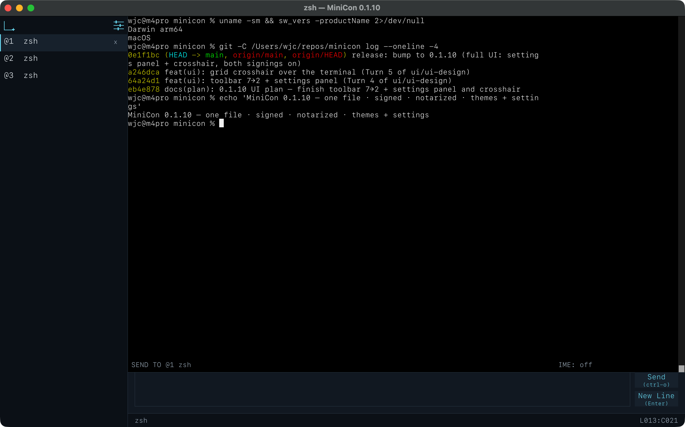

# MiniCon

**A terminal that is one file.** Choose a native executable for your platform,
or the experimental six-cell `minicon.com`; there is no installer or bundled
language runtime. It opens a real PTY,
renders a real terminal, and a script can drive and read every part of it on
Windows, Linux, and macOS.



| | |
| --- | --- |
| Executable | six-cell `strip=true` measurements are roughly Windows ~660 KB, macOS ~1.4 MB, and Linux ~5 MB. Exact measurements: Windows aarch64 677,376 bytes / x86_64 731,136; macOS aarch64 1,413,408 / x86_64 1,455,424; Linux aarch64 4,846,400 / x86_64 5,732,544. They are target-qualified evidence, not a universal product limit; see [Delivery](prd/PRD_02_27_con_delivery.md) for context. |
| Dependencies | operating-system libraries only |
| Supported | Windows, Linux, and macOS on x86_64 and aarch64; Windows reaches back to Server 2016 / Windows 10 1607 |
| Licence | MIT OR Apache-2.0 |

## Why it exists

Most small terminals are small by leaving things out. MiniCon is small by not
adding a runtime: it is Rust with platform-native rendering, one executable,
and nothing installed. Deleting the file removes it completely.

Three things it does that terminals this size usually do not:

**It runs where modern terminals cannot.** Windows gained a pseudoconsole in
build 17763 (version 1809), and terminals built on it stop there. Microsoft's
ConPTY redistributable does not lower that floor — it supports the same version
as the in-box API. MiniCon resolves the pseudoconsole at run time and falls
back to hosting the shell in a hidden console, so it runs on Windows Server
2016. See [docs/old-windows.html](docs/old-windows.html).

**Input has its own area.** Most terminals make you type into the same region a
running program is printing into, so a long command and a burst of output
interleave and you lose track of what you typed. MiniCon gives input its own
band — and once input has its own area it can do more: Up and Down recall lines
you already sent, and the label names the tab the text is going to.

**A script can see into it.** The control CLI drives the real UI and reads back
what the window is actually showing — text, screenshots, focus, tab state — so
automation can wait on a condition instead of guessing with a timer. See
[docs/control-cli.html](docs/control-cli.html).

## Install

Download the executable for your platform from
[Releases](https://github.com/partnernetsoftware/minicon/releases), and run it.
There is no separate installer or bundled language runtime. Linux uses the
normal desktop runtime libraries documented under [Build](#build); development
packages are not required. Each archive ships a SHA-256 beside it:

```bash
sha256sum -c minicon-0.1.5-linux-x86_64.tar.gz.sha256
```

The macOS build is a universal binary — the same file runs on Apple Silicon and
Intel. v0.1.5 also publishes raw `minicon.com` as an experimental, unsigned
one-file launcher containing all six OS/ISA payloads. The five native archives
remain the conventional fallback; every distributable has its own checksum.

## Code signing policy

MiniCon v0.1.5 published the native six-cell set and experimental `minicon.com`
unsigned; checksums and exact build/runtime receipts remain mandatory. SignPath
Foundation declined the open-source application, so the company publisher path
is now the only signing route: an Azure Artifact Signing Public Trust
certificate profile for PARTNERNET SOFTWARE PTY LTD exists and the release
signing workflow is wired to it, but no public release has been signed yet. The
committed `release-policy.json` selects whether the same
Candidate/Release workflows require signing; missing credentials never
silently turn it off. A test certificate, application or repository statement
never counts as a signed release. See the
[Code signing policy](CODE_SIGNING_POLICY.md) for publisher identity, privacy,
team roles, exact-build provenance and verification rules.

## Use

```
minicon                          # a terminal, with your default shell
minicon -e cmd.exe /k build.bat  # run one command instead of a shell
minicon --status                 # what this machine gave it
minicon --help                   # everything else
```

| Key | |
| --- | --- |
| `Ctrl+Shift+T` | new terminal |
| `Ctrl+Shift+N` | new terminal below the active tab |
| `Ctrl+Shift+W` | close the active terminal; children are promoted |
| `Ctrl+Shift+[` / `]` | switch tabs |
| `Ctrl+Shift+I` | focus the input area |
| `Enter` | in the input area, insert a soft newline without sending |
| `Ctrl+O` | send the complete input-area draft |
| `Up` / `Down` | in the input area, recall what you sent before |

The header's `?` opens the in-app shortcut and feature guide. Its size controls
shrink, reset, and grow terminal and interface text together; `中` / `En`
switch the interface language. Closing the final tab leaves a greeting page so
you can start another terminal; it does not quit the window.

### Reporting a problem

Run `minicon --status` and include its output. It reports the build, the PTY
backend this machine selected and why, the font face the system actually
resolved to with its measured cell width, and where MiniCon writes when
something fails. None of that can be answered by reading the source, because
all of it depends on the machine.

## Build

```bash
./scripts/build.sh release  # target/release/minicon; bounded local cache lifecycle
./scripts/build.sh test     # unit, GUI black-box, and gates
./scripts/six-cell-qualify.sh # one Mac: link all six cells, run available tests
```

### Which local artifact should I run?

Do not choose a binary by searching `target/` or comparing modification times:
Cargo dependency executables and an older six-cell snapshot can look newer than
the product you meant to test. Run the owning command, then use its canonical
output:

| What you want to test | Build command | Canonical output |
| --- | --- | --- |
| Fastest current-host development build | `./scripts/build.sh dev` | `target/debug/minicon` (`.exe` on Windows) |
| Optimized current-host build | `./scripts/build.sh release` | `target/release/minicon` (`.exe` on Windows) |
| All six ordinary OS/ISA binaries | `./scripts/six-cell-qualify.sh` | paths listed under `artifacts` in `target-six/receipt.json` |
| Experimental one-file six-cell launcher | `./research/minicon-com-loader/local-accelerated.sh` | `research/minicon-com-loader/dist/minicon.com`, its `.sha256`, and `build-receipt.json` |
| A published, user-facing build | no local build | archive and matching `.sha256` from GitHub Releases |

For an ordinary local UI check on macOS or Linux:

```bash
./scripts/build.sh dev
./target/debug/minicon --status
./target/debug/minicon
```

For the optimized local binary, replace both `debug` occurrences with
`release`. On Windows, run `target/debug/minicon.exe` or
`target/release/minicon.exe` after the corresponding command.
On Apple Silicon, `target/x86_64-apple-darwin/debug/minicon` is the separate
Rosetta court and may be an older build; it is never the default UI-development
artifact. Rebuild that target explicitly only when testing the Intel slice.

`target-six/receipt.json` is the index for a six-cell run: its `artifacts`
entries name the exact binaries and record byte sizes, formats, and SHA-256
digests. Treat that receipt—not similarly named files elsewhere under
`target-six/`—as the answer to “which six binaries belong together?” The
receipt also records a source-tree fingerprint. If the source has changed
since the run, rebuild instead of testing a mixed snapshot:

```bash
python3 scripts/source-fingerprint.py
jq '{source_tree_sha256, artifacts}' target-six/receipt.json
```

The `research/minicon-com-loader/dist/cells/` files are payload copies used to
assemble the adjacent `minicon.com`; they are not an additional release set.
`minicon.com` itself remains experimental, but v0.1.5 publishes its exact raw
bytes and checksum beside the native archives. Its receipt and checksum must
travel with it when testing it on another machine.
Directories such as `target/*/deps/`, old top-level `target-six/<cell>/`
folders, logs, and cache snapshots are implementation state, not handoff
artifacts.

The six-cell gate writes `target-six/receipt.json`. A missing runtime runner is
reported as `BLOCKED`; a successful cross-link is not mislabeled as a runtime
test pass. Linux desktop UTM runners own local qualification. The optional
`MINICON_ENABLE_LIMA_ACCELERATOR=1` path uses Debian/glibc Lima courts for
faster headless Linux feedback; `scripts/setup-linux-runners.sh` provisions
them, but ordinary qualification does not require them. A Windows UTM VM
with Guest Tools can use `scripts/windows-utm-runner.sh` as both Windows runner
variables; the gate transfers the exact PE/test tree before execution.

`scripts/cleanup-build-state.py` is dry-run by default. Build/package owners
invoke it with narrow scopes and protect current, receipt-owned and active
state. Below 64 GiB free space it enters disk-pressure mode, retaining the
protected roots plus the newest two snapshots while expiring other inactive
snapshots after one hour. On macOS, `scripts/install-macos-daily-cleanup.sh` installs a per-user
LaunchAgent for 03:17 daily maintenance. VM images and cloud bodies without an
explicit verified archive receipt are never automatically deleted.

Rust 1.97. The Linux build needs the ordinary desktop runtime libraries
`libxkbcommon.so.0` and `libwayland-client.so.0`; no `-dev` package is required.
The release binary embeds `libxkbcommon-x11.so.0` and its small XCB-XKB runtime
dependency, so a slim X11 desktop does not need separate
`libxkbcommon-x11-0` or `libxcb-xkb1` installations.

## Repository

| | |
| --- | --- |
| `src/` | the binary: terminal, chrome, control protocol |
| `crates/minicon-core/` | host-neutral logic — no platform, OS, or `cfg` on architecture |
| [`PRD.md`](PRD.md) | product tree, decision map, and links to owning module PRDs |
| `docs/` | the website at `minicon.agenterm.work` |
| `tests/` | black-box journeys and the gates below |

Two gates are worth knowing about, because each one exists where a claim
would otherwise be unchecked:

- **Platform dependencies** — all six artifacts are checked as target-native
  executables. On Windows, the shipped PE's import table must contain only
  operating-system modules; the exception list is empty, so a future VC++ or
  other redistributable dependency turns the gate red instead of silently
  widening what a user has to install.
- **Alignment** — the public CLI must match the machine-readable contract in
  `alignment-contract.json`, which is in turn pinned to the PRDs.

## Relationship to AgenTerm

[AgenTerm](https://github.com/partnernetsoftware/agenterm) is the Agent-era
workbench on the same platform layer (native rendering, dedicated input area).
MiniCon is the one-file **local terminal**. AgenTerm adds what MiniCon refuses:
a longer-lived server identity, Fleet, mux, persistence, and Agent permission
policy.

MiniCon automation is `--control`: an explicit Unix socket or named pipe bound
**inside that GUI process**. `minicon cli` is a short-lived client on that
socket. Close the window and the endpoint is gone. That is not AgenTerm's
server. Verb spellings may match; the wire and lifetime do not.

MiniCon began as AgenTerm's minimal console host and became its own product in
August 2026.

---

# MiniCon（中文）

**一个文件就是一个终端。** 每个平台一个可执行文件，免安装、免捆绑运行时，只依赖操作
系统库。它在 Windows、Linux 和 macOS 上开真正的 PTY、画真正的终端，而且每一部分都能
被脚本驱动和读取。

- 六格 `strip=true` 实测约为：Windows ~660 KB、macOS ~1.4 MB、Linux ~5 MB。精确值：Windows aarch64 677,376 bytes / x86_64 731,136；macOS aarch64 1,413,408 / x86_64 1,455,424；Linux aarch64 4,846,400 / x86_64 5,732,544。它们是按目标验证的证据，不是全产品统一上限；测量语境见[交付](prd/PRD_02_27_con_delivery.md)。
- 只依赖操作系统库
- 支持 Windows、Linux、macOS × x86_64、aarch64 六格；Windows 最低覆盖 Server 2016 / Windows 10 1607
- MIT 或 Apache-2.0

三件同体量终端通常做不到的事:

**能在现代终端跑不动的地方跑。** Windows 到 build 17763(1809)才有伪终端,建立在它
之上的终端就停在那里;微软的 ConPTY 可再发行包并不能往下兼容,它支持的版本和系统内建
的一样。MiniCon 在运行期解析伪终端,没有就退回到把 shell 放进隐藏控制台。

**输入有自己的区域。** 多数终端要你在"程序正在输出的同一块区域"里打字,一长串指令和
一波输出交错,你会弄不清自己打了什么。MiniCon 给输入一块自己的地方——而输入一旦有了
自己的区域,就能做更多:上下键回叫送出过的内容,标签上写着文字要送往哪个分页。

**脚本能看进去。** 控制 CLI 驱动真正的界面并把窗口实际显示读回来。`--control` 是这一窗
里的本机 Unix socket / 命名管道，不是守护进程；关窗即拆。需要 Fleet、mux、Agent 权限时
用 [AgenTerm](https://github.com/partnernetsoftware/agenterm)。

出问题时请运行 `minicon --status` 并附上输出:它报告构建版本、这台机器选了哪个 PTY
后端及原因、系统实际解析到哪个字体与实测字宽,以及失败写在哪个文件。这些都无法通过读
源码回答,因为它们取决于机器。

## Code signing policy / 代码签名政策

v0.1.5 发布的是未签名的六格原生包和实验性的未签名 `minicon.com`；五个原生归档仍是
常规回退选择。SignPath Foundation 已拒绝开源申请，公司发布者路线成为唯一签名路径：
PARTNERNET SOFTWARE PTY LTD 的 Azure Artifact Signing Public Trust 证书配置文件已建立，
发布签名工作流已接入，但尚未有任何公开版本完成签名。
同一套发布流程由 `release-policy.json` 选择签名开关，缺少凭据绝不会静默关闭签名。
测试证书、申请状态或仓库文字都不等于已签名版本。发布者身份、隐私、团队角色、
exact-build 来源和验证规则见 [Code signing policy](CODE_SIGNING_POLICY.md)。
