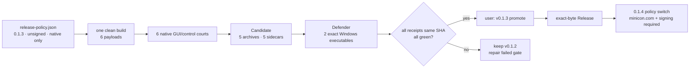

# v0.1.3 Candidate plan — five native archives cover six cells

Status: **released**. G1–G8 are green; Promotion run `33289364944` published
the exact sealed Candidate as `v0.1.3`. Do not modify or backfill v0.1.2.

## Product outcome

Publish one native MiniCon binary for every `{win,lnx,osx} ×
{x86_64,aarch64}` cell. Five archives cover the six cells because macOS is a
Universal binary. `minicon.com` and trusted signing move to v0.1.4.

`release-policy.json` is the machine-readable release switch:

```text
v0.1.3: assets.minicon_com=false · signing.mode=off
v0.1.4: assets.minicon_com=true  · signing.mode=required
```

Candidate and Release use the same workflow code in both modes. A missing
credential never silently disables signing; only the committed policy selects
the mode. Changing the policy changes the source identity and requires a new
one-build Candidate.

## Dependency tree

```text
exact clean main SHA
├── one minicon-com.yml build job
│   ├── six native payloads, version 0.1.3
│   ├── G3 lifecycle receipts
│   └── six native GUI/control execution receipts
├── Candidate (no compilation)
│   ├── package 5 archives + 5 SHA-256 sidecars
│   ├── execute all 6 native cells
│   └── seal manifest + policy + receipts + exact bytes
├── reputation
│   ├── extract both exact Windows minicon.exe files
│   ├── active Microsoft Defender scans both in one court
│   └── bind clean receipt to Candidate run and both SHAs
└── Promotion
    ├── requires exact successful Candidate + reputation run
    ├── requires user `v0.1.3 promote`
    └── publishes exact Candidate bytes without rebuild
```

## Gates

### G1 — one clean build

- `source_sha` is current `main`; `source_dirty=false`.
- One build emits all six payloads and the source-tree/toolchain receipt.
- Runtime matrix jobs compile nothing.

### G2 — six native GUI/control courts

Every native runner must perform version/status plus the public control
journey: readiness through `list-tabs`, send/wait/capture, structured UI
snapshot, clean close, zero extraction residue and unchanged configuration
baseline. Exactly six unique receipts must bind the same source, build and run.

### G3 — lifecycle and build-tool regressions

The one build receipt must bind green reaper, loader lifecycle, concurrent
extract and cosmocc installer rollback courts. Although v0.1.3 does not ship
the APE, these courts belong to the shared one-build owner and prevent a later
policy switch from discovering stale infrastructure.

### G4 — policy-selected size court

The 9 MiB `minicon.com` ceiling is **not a v0.1.3 release-asset gate** because
the policy excludes that asset. It remains stamped and enforced whenever
`assets.minicon_com=true`; neither Candidate nor Promotion may raise it.
Native archive sizes and compressed sizes are recorded, not silently omitted.

### G5 — exact five-archive Candidate

- Windows x86_64 ZIP
- Windows arm64 ZIP
- Linux x86_64 tar.gz
- Linux arm64 tar.gz
- macOS Universal tar.gz containing arm64 and x86_64 slices

Each archive has one sidecar. Candidate downloads the six payloads from the G1
run, packages without Cargo/cosmocc, rehashes, unpacks and executes all six
covered cells. The manifest embeds the release policy and its SHA-256.

### G6 — exact native Windows reputation

An active-Defender disposable Windows court scans both `minicon.exe` byte
sequences extracted from the sealed Candidate archives. The redacted receipt
must be clean, unchanged after scan, and bound to the Candidate run plus both
archive identities. Signing is not claimed. Raw evidence remains operator-held
and gitignored. A detection blocks Promotion and enters Microsoft's
false-positive channel; do not weaken product behavior or add exclusions.

### G7 — version identity

Cargo, policy, all six payloads, archive names and runtime output must say
`0.1.3`. Mixed or stale versions fail closed.

### G8 — human Promotion boundary

No agent may tag or publish until G1–G7 are green and the user replies with the
exact version and word `promote`: `v0.1.3 promote`. Promotion re-downloads and
publishes only the sealed Candidate bytes. It never rebuilds, re-signs or
silently adds `minicon.com`.

## Memory palace



## Current evidence

- [x] G1/G2/G3/G7: exact-source one-build/six-execute run `33286599671` at
  `39774ed` passed all six native GUI/control courts.
- [x] G5: Candidate `33286811086` packaged five archives without compilation,
  executed all six covered native cells, and sealed policy plus exact bytes.
- [x] G6: active Defender scanned the two sealed Windows executables clean and
  unchanged; qualification run `33287684429` binds that receipt to Candidate.
- [x] G4: policy excludes `minicon.com`, so the APE size court is not selected.
- [x] G8: explicit user release authority led Promotion run `33289364944` to
  publish the exact Candidate without rebuild; public Linux/Windows re-download
  and execution passed.
- Historical APE Candidate/Defender/signing research belongs to v0.1.4 and may
  not be promoted as v0.1.3.
