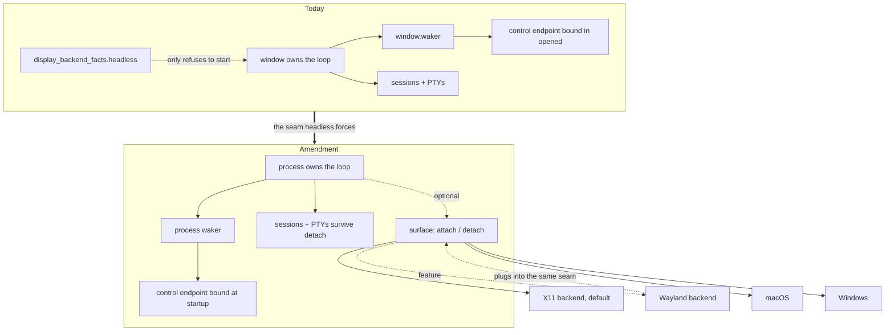

# 0.1.20 plan — a detachable GUI, and a seam the display backends can plug into

Two owner requests land here: a headless / attach-detach GUI, and Wayland as a
feature with X11 remaining the default. They are sequenced deliberately — see
"Why headless comes first".

## Product boundary: an amendment, stated explicitly

`AGENTS.md` currently says MiniCon's `--control` endpoint "lives only as long as
its GUI". Detaching the GUI contradicts that sentence, so the sentence changes
rather than being quietly worked around:

> The `--control` endpoint's lifetime is bound to the **process**, not to the
> window. A MiniCon process may hold terminal sessions with no window attached.

What is **not** admitted by that amendment, and stays excluded:

- no server, no daemon, no listening on a network interface;
- no persistent workspace — sessions die with the process, as today;
- no multi-client session sharing, no session discovery, no reconnect protocol;
- no background auto-start; a detached process is one the user started.

A detached MiniCon is the same single process it always was, minus its window.
That is the whole claim.

## Why headless comes first

The control endpoint *was* bound inside `ConApp::opened` using `window.waker()`,
so the wake path was structurally owned by the window (step 1 below has since
moved it; the rest of this section is why). `display_backend_facts()`
already reports `headless`, but only to **refuse** to start. Making the GUI
detachable forces that seam to become explicit: the event loop, the control
endpoint and the session store must stop assuming a surface exists.

That is the same seam a second display backend plugs into. Doing Wayland first
would mean building it against an implicit seam and then moving it.

## Tree

- [ ] The GUI can be detached and reattached without losing sessions
  - [~] **Process-owned control endpoint** — bind moved out of the window
    (sequencing step 1, shipped on `main`); the "during and after a detach"
    half waits on step 2, which needs a platform directive that tears the
    window down while the loop runs.
    - invariant: the endpoint answers before, during and after a window exists;
      a detach does not break an in-flight request
    - evidence: `--control` bound with `--headless`, `list-tabs` answers with no
      window ever created; a black-box test detaches mid-`capture-pane`
    - safe failure: if the endpoint cannot bind, exit non-zero as today — never
      fall back to a windowless process the caller cannot reach
    - dependency: a waker that does not come from a window
  - [ ] **Wake source independent of the window**
    - invariant: PTY output, control requests and timers still advance the loop
      with no surface; no busy-poll (idle CPU stays at today's level)
    - evidence: idle CPU sampled headless vs attached; PTY throughput cell
      unchanged
    - non-goal: a second event loop. One loop, one owner.
  - [x] **`detach-gui` / `attach-gui` control verbs + `--headless` start** —
    shipped on `main`. Verified end to end: a `--headless` process starts with
    no window, runs a shell, answers `send-text`/`capture-pane`, and grows a
    real window on `attach-gui` (1920×1200, 90×32) with its scrollback intact.
    - invariant: detach releases the surface and its GPU/bitmap memory; attach
      rebuilds a window whose contents match the session state exactly
    - evidence: `ui-snapshot` geometry identical before detach and after
      reattach at the same size/scale; `capture-pane` byte-identical across a
      detach/attach cycle; scrollback and cursor position preserved
    - safe failure: attach on a machine with no display fails as a typed error,
      leaving the process detached and healthy — never a half-built window
  - [x] **The memory claim, measured — and it does not hold on macOS.**

    Measured on the dev Mac, release-fast, one session on `/bin/sh`:

    | state | RSS |
    | --- | --- |
    | attached | 84,432 KB |
    | detached | 84,512 KB |
    | reattached | 84,880 KB |
    | detached again, settled 6s | 84,752 KB |

    A debug build agrees (86,400 → 86,528 KB). **Detaching frees nothing
    measurable**, so the memory motivation this plan opened with is withdrawn
    for macOS until a different measurement says otherwise.

    Why that is plausible rather than a bug: RSS counts shared framework pages
    that a released surface does not give back, and the allocator does not
    return freed pages to the OS just because a Rust `Drop` ran. Either could
    hide a real saving, which is exactly why this was written as "report, do not
    promise".

    Still open, and worth doing before the claim is made or dropped for good:
    measure footprint rather than RSS on macOS, and measure RSS on Linux and
    Windows where the surface is ours rather than the window server's.

    What survives regardless: a session that outlives its window, and a stable
    attach point for a future mobile client. Those were the other reasons, and
    they are now demonstrated rather than argued.
  - [ ] **No regression to the attached path**
    - evidence: the existing layout invariant net (`LAYOUT_SWEEP`) and the
      six-cell gate stay green; attach/detach adds cells, removes none

- [ ] Display backend becomes a selectable seam
  - [ ] **X11 stays the default, explicitly rather than by accident**
    - invariant: `--feature wayland` selects a native Wayland backend;
      absent it, X11 (native or through XWayland) is what runs
    - evidence: a backend-identity field in `ui-snapshot`, so a test can assert
      which backend served the window instead of inferring it
    - dependency: the headless seam above
  - [ ] **Wayland backend behind the feature** — *scope deliberately unsettled*
    - open: the owner has not yet named a symptom on the current XWayland path.
      Until one exists, the justification is "native support" alone, and the
      cost is four protocols (`xdg-shell`, `wl_seat`, `wl_data_device`,
      fractional-scale) plus a clipboard model that requires focus — the same
      clipboard surface that just produced a release-blocking bug.
    - decision needed before implementation: is this symptom-driven (then the
      symptom orders the work) or completeness-driven (then it is a slow burn
      behind a feature flag, and X11 stays the supported path)?

## Memory palace

## Sequencing

1. **Done.** Process-owned endpoint + window-independent waker: the server binds
   in `main` before any window and reaches the loop through a waker slot that
   `opened` fills. Two black-box tests pin the new lifetime, falsified by
   restoring the in-window bind. Two improvements fell out: a client racing
   startup finds a listener instead of a refused connection, and a bind failure
   is now a startup failure reported before a window appears. Still missing for
   step 2: `PixelWindowDirective` has only Continue, Wait, WaitUntil and Exit,
   so nothing can tear down the window while the loop keeps running.
2. `--headless`, `detach-gui`, `attach-gui`, with the state-preservation
   evidence above.
3. Measure and report memory honestly.
4. Backend identity in `ui-snapshot` + X11 made explicit.
5. Wayland — only after the open question above is answered.

Steps 1–3 are a coherent release. Step 5 is not committed to 0.1.20.

## Known risks

- **The waker is the whole problem.** Every platform's loop wakes differently;
  this is platform-crate work, and the Windows console-agent path has its own
  wake behaviour. Expect this to be where the time goes.
- **Attach must rebuild, not restore.** Rebuilding a window from session state
  is the correct model; trying to keep a surface alive "just detached" will rot
  differently on each platform.
- **A detached process is invisible.** With no window, the only way to find it
  is the endpoint the user named. That is acceptable for a user-started
  process, and is the reason no auto-start is admitted.
