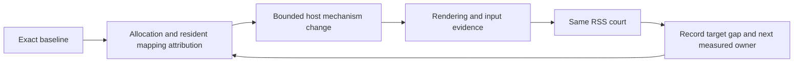
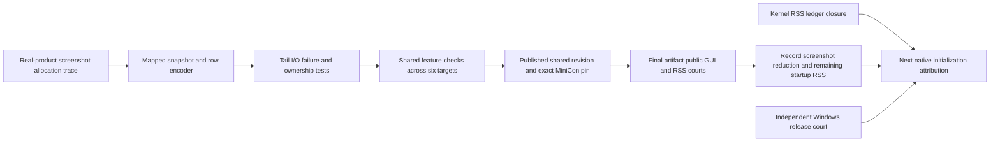

# Continue reducing MiniCon host RSS

```text
Idle one-tab host RSS reaches 10 MiB without sacrificing terminal behavior
├── Evidence owner: exact release/debug artifact, public RSS court, native diagnostics
│   ├── invariant: RSS remains the criterion; footprint is explanatory evidence
│   ├── failure: unmeasured targets remain BLOCKED / unqualified
│   └── non-goal: raise 384 MiB or call a macOS measurement six-cell evidence
├── Shared host owner: identify frame storage and OS initialization costs
│   ├── dependency: allocation stacks and controlled comparison before replacement
│   ├── invariant: retain displayed pixels, input, IME, resize and FFI containment
│   └── failure: reject an optimization when behavior or evidence regresses
└── Integration owner: pin reviewed mechanism, rerun RSS and owning black boxes
    └── non-goal: shrinking the PTY ring or changing the product memory metric
```



The previous font repair is complete; the product RSS target is not. macOS
currently uses `portable-pixel-window` (winit + softbuffer); the
`native-pixel-window` dependency is Windows-only. Any earlier statement that
this macOS host already used a native pixel adapter was incorrect.

## Accepted changes and current target

- Shared owned anonymous frame mappings:
  `8d8de88c9ab62709327a6358609e9a09e8c363fd`,
  [historical PR #117](https://github.com/partnernetsoftware/agenterm/pull/117).
  It was closed after the same patch landed on shared main as `a68b50d1`;
  it is not an open draft or an unmerged repair. The pinned backend matches
  that integrated backend.
  Based on shared main with the previous font fix integrated as `d384d2b5`;
  PR #116 was closed after that integration. The experimental intermediate
  frame commit `d1d29578` is superseded by the new pin.
- MiniCon no longer owns `RetainedXrgbFrame`. Transient host frames are fully
  rasterized directly, retained host frames retain their validity/partial
  contract. Screenshot/discard ordering stays intact. Empty redraws do not
  schedule an unconditional redraw loop. `host_copy_frames` stays in public
  receipts for compatibility and now stays zero.
- `assets/macos-info.plist` is embedded in the native Mach-O by the macOS
  target branch of `build.rs`; no app-bundle directory or runtime file is
  required. `UIDesignRequiresCompatibility` preserves standard window controls
  and reduces macOS 26 UI initialization. Apple documents it as temporary and
  ignored for SDK 27+ builds. It cannot be the long-term memory solution.

The product goal remains **10 MiB RSS**. It is **not achieved**. No budget was
raised, no PTY ring was reduced, and no GUI/input capability was disabled.
Windows and Linux have no new runtime claim from these macOS observations.

## Controlled measurements

macOS 26.5.1 aarch64, native release profile unless noted. All frame variants
keep the same 960×600 logical Retina window and 80×24 court arguments.

| Change | Controlled result |
|---|---|
| Original font-fixed frame allocator → mapped frames | 3 alternating runs: median 101.17 → 92.47 MiB |
| Remove duplicate MiniCon canvas | Independent probe 92.92 → 84.17 MiB; net −8.75 MiB |
| macOS 26 compatibility key | 3 alternating settled runs: median 84.05 → 78.67 MiB |
| Final source, named RSS court | early idle 86.89 MiB; load 85.08; extra tab 1.41; four-cycle growth 2.33 |

An earlier integrated court observed 77.75 MiB early idle. Repeated settled
samples are around 79 MiB. Short startup samples vary by roughly one frame's
size; neither favorable sampling nor footprint can close the RSS target.
Final idle vmmap has no `MALLOC_LARGE`; footprint 18.1 MiB is explanatory only.

Final release SHA-256:
`7d08627d494af396885843ec016d554c4b8d9b520c80bcf0757e7fa54e89c527`.
Development artifact before the MiniCon integration commit, not a release
promotion or six-cell receipt.

## Verification

- Shared `MappedPixels` size/zeroing and CoreGraphics retained-provider bytes:
  2 tests PASS. The standalone vendored crate tests run with
  `CARGO_TARGET_DIR=target/font-platform-fix/target cargo test --manifest-path target/font-platform-fix/third_party/softbuffer/Cargo.toml --lib mapped_pixel_tests`.
  Library Clippy and x86_64 macOS compile also PASS.
- MiniCon binary unit tests: 131 PASS; workspace/all-target Clippy PASS.
- `MINICON_TEST_BINARY=target/release/minicon MINICON_RSS_DIAGNOSTICS_DIR=target/memory-final cargo test --test minicon_control -- --nocapture --test-threads=1`:
  GUI multitab and named RSS courts PASS. Log: `target/memory-final-control.log`.
- `MINICON_TEST_BINARY=target/release/minicon cargo test --test minicon_throughput sustained_long_output_keeps_control_and_sibling_responsive -- --exact --ignored --nocapture`:
  PASS, 33,439,744 bytes at 21,178,307 bytes/s, zero host copies and present
  failures. Log: `target/memory-final-throughput.log`.
- Native diagnostics: `target/memory-final/idle-vmmap.txt`, `idle-heap.txt`.
  Controlled comparisons: `target/memory-probes/ab.json`, `compat-ab.json`.

## Rejected experiments

Do not add these without new evidence:

- Device RGB increased idle RSS to 127.66 MiB; sRGB to 119.09 MiB. Preserve the
  existing display color space. Matching NSWindow color space explicitly did
  not improve the mapped-frame result.
- Run-length compressed pixel provider did not reduce downstream residency
  (102.47 MiB); no compression code/dependency was retained.
- Lazy winit input-context lookup/caret invalidation preserved the proposed
  native-key ordering in source but produced no measurable RSS benefit:
  baseline 78.45–79.02 versus lazy 78.64–78.89 MiB across three alternating runs.
  It was removed before final validation; `Cargo.lock` uses registry winit.
  Research-only diff: `archive/research/minicon-memory/winit-lazy.patch`.
- Explicit CATransaction flush gave a 78.03 MiB single startup sample, within
  baseline variation. No repeatable gain established, so it was removed.

- Default-menu separator removal: the isolated Hello result did not transfer
  to MiniCon. Three alternating product samples had identical 78.75 MiB
  medians with and without separators. Prototype rejected and registry winit
  restored; commands/shortcuts were not removed from production.
- Autorelease-pool draining around native initialization changes only about
  0.03 MiB. Application class initialization is around 11 MiB; the shared
  instance reaches about 26.6 MiB. Component probes identify screen discovery,
  appearance and font setup as measurable triggers, with overlap still
  unresolved. Details and compact numeric receipts are in the two reports.

## Two research owners

- [Native GUI baseline](research-hello-memory.md): staged libc/Cocoa/AppKit,
  titlebar, text, menu and compatibility comparisons, with source retained in
  `archive/research/hello-memory/` and generated diagnostics in `target/hello-memory-track/`.
- [MiniCon increment](research-minicon-memory.md): exact-artifact tab/content
  changes and full allocation stacks, reproducible probe in
  `archive/research/minicon-memory/`.

The roughly 50 MiB label-only Hello omits editable-control/menu initialization:
editable control plus menu reaches 87.33 MiB on the same host. This explains
why assigning the whole remaining difference to terminal state was incorrect;
it does not make the 10 MiB target optional. Further progress must reduce native
UI initialization while preserving text input, first CJK keystrokes, menu
shortcuts and standard window controls, or replace that foundation with a
measured equivalent. No tested narrow change currently reaches 10 MiB.


## Closer native/shared/product capability comparison

[Pixel/input host comparison](research-pixel-host.md) now replaces the editable
text-field baseline for the next attribution step. Shared-host checkerboards
without terminal state reach about 79–80 MiB, versus MiniCon about 79 MiB;
a native pixel/input/default-menu probe is about 71 MiB with Regular policy.
These measurements direct the next investigation to shared-host initialization
and presentation. They do not prove an 8–9 MiB winit allocation or qualify a
native replacement. Periodic redraw alone did not cause an additional frame's
stable RSS. No product source, dependency or memory criterion changed.


Follow-up [mapping and allocation-stack evidence](research-pixel-host.md)
locates 8992 KiB of one shared/native checkerboard difference in frame
residency, while MiniCon's frame in the same comparison is already only
16 KiB resident. Both instrumented probes allocate the same 33 ColorSync TRC
tables. Native action-suppression variants do not reproduce the resident
frame difference; no production transaction change is accepted. Similar RSS
totals are not proof of the same allocation owners.


The [MiniCon increment report](research-minicon-memory.md) now records an
explicit Darwin allocator-relief experiment: a one-shot idle call reports
zero bytes released in three runs, with no matching downward RSS step.
The temporary hook is rejected; production source, pin and release SHA are
restored. Unused-page trimming through this API is not an accepted reduction.


## Active implementation owners

- RSS accounting: `hello_memory` owns `archive/research/rss-ledger/` and
  `plan/archive/research-rss-ledger.md`. Deliver kernel resident/internal/external/
  reusable/compressed measurements with a plain/loaded/active instrumentation
  control. RSS stays the product criterion; clean/external pages are not
  subtracted to declare success.
- Real MiniCon frame ownership: `minicon_memory` owns
  `archive/research/frame-lifetime/` and `plan/archive/research-frame-lifetime.md`. Trace
  allocation, provider/layer ownership, final release and page residency in
  an isolated real-product build, then test a concrete causal intervention.
- Windows: `grkwjcgm-minicon` owns `archive/research/windows-memory/` and
  `plan/archive/research-windows-memory.md`. Verify the existing exact-artifact court
  and identify GDI/native-host allocations independently of macOS numbers.
- Integration: the primary agent owns production patches, dependency changes,
  the owning Runtime host memory PRD and final black-box validation. macOS GUI
  measurement windows are serialized across researchers. A useful prototype
  must become a reviewed mechanism and pass product validation; a failed
  experiment alone does not close the memory work.


## Screenshot allocation intervention (integrated)

```text
Outcome: screenshot must not leave two full frames in malloc free caches
├─ Shared snapshot owner: bounded immutable anonymous mapping; Drop unmaps
├─ Portable PNG: convert/encode one clipped RGBA row; propagate final I/O errors
├─ MiniCon: queue owned snapshot, release it before completion; preserve atomic publish
└─ Evidence: paired baseline/fixed screenshot journey + same public GUI/RSS court
```

Dependency: the existing lazy font and mapped display-frame fixes. Safe failure:
invalid input, storage failure, full queue and encoding failure complete locally;
atomic publication must not expose an incomplete PNG. Non-goals: PTY sizing,
input/menu removal, metric substitution, or a claim that this fixes startup RSS.
The [frame lifetime report](research-frame-lifetime.md) owns the measured
pre-fix screenshot growth; [RSS ledger](research-rss-ledger.md) owns the separate
resident accounting. Large free malloc blocks are an actionable post-screenshot
increment even though they do not explain the initial roughly 79 MiB.




The prototype intervention is now reproduced twice: screenshot RSS increments
17.891/26.516 MiB on baseline versus 0.469/0.297 MiB on the fixed prototype.
Neither fixed process retains a `MALLOC_LARGE` region. PNG decoding, geometry,
CJK rendering and lifecycle remain valid. Final published-revision gates are
tracked below; prototype receipts are not substituted for them.


### Final screenshot repair integration

Shared main revision `745f52b2e169d5b41b51377a82cf8a93a9b00c8b` owns the
snapshot mapping and row encoder. MiniCon pins that published revision,
without a local path override. macOS aarch64 release SHA-256:
`8ce6e879898843f21a2d0a228a14e767e67025bd961a7448bbb909fe62a07480`.

Final gates: 132 MiniCon unit tests, both public control tests, sustained
output and Clippy pass. The public RSS court measures idle 86.39 MiB,
after-load 84.52 MiB, and four-cycle growth 10.14 MiB. Sustained output is
19.52 MB/s with zero host frame copies and zero present failures. Idle vmmap
has no `MALLOC_LARGE` or whole Color Emoji allocation; footprint 18.1 MiB
remains explanatory only. The existing 384 MiB ceiling remains unchanged;
**10 MiB idle host RSS remains unmet**. Shared screenshot/font feature checks
pass for all six target triples; this is compilation evidence, not six runtime
courts. Four injected PNG I/O edge cases and owned snapshot transfer pass.
Exact gate commands and compact receipt: `archive/research/screenshot-memory/final-gates.json`.
Raw logs and vmmap/heap: `target/screenshot-memory/`.


A final pinned-artifact replay also completes resize/restore, screenshot,
last-tab greeting and close normally: pre-screenshot 72.375 MiB, after 72.250
MiB, with no `MALLOC_LARGE` and a system-decoded 1920×1200 PNG. This same-process
absence validates the allocation repair; it is not an idle saving against the
86.39 MiB early public-court sample. Receipt:
`archive/research/screenshot-memory/final-journey.json`.


### Continuing startup attribution after the screenshot repair

The next active leaf queries process-local page dispositions and compares
external page counts against TASK_VM_INFO. The census remains explicitly
unclosed: after excluding reusable pages, the final MiniCon probe is short
24 host pages (0.375 MiB), with no ledger drift. Region/segment labels are
therefore candidates, not a complete framework allocation budget.

A same-native-process staged run measures external residency 6.75 MiB after
observer warmup, 21.00 after sharedApplication, 56.922 after the combined
window/input/pixel/launch/event stage, and 57.094 after installing the complete
menu. Repeated observer warmup adds no external pages in that run. This directs
the next experiment to splitting that combined window stage, including first
responder, input context and first pixel presentation separately. It does not
revive menu-separator removal or accept a production input regression.

The screenshot repair is committed. Startup attribution continues, and the
Windows owner is rerunning an independently identified release artifact after
isolating a hanging harness's process/log-handle wait. Native macOS probes do
not occupy the Windows UTM lease; neither track waits for another authorization.


### Writing Tools startup attribution and pending compatibility choice

The combined-stage follow-up now has a sampled call chain and a causal
negative control: `finishLaunching` customizes the main menu, probes
`NSTextView._supportsWritingTools`, and dlopens WritingToolsUI. Public menu
and custom-view opt-outs leave a 22.578 MiB external increment intact.
A research-only private return-NO control removes that load. On the actual
frozen MiniCon, both public GUI/RSS tests pass in both arms, with idle
78.141→60.500 MiB (one pair). This private method is not a supported contract;
it is not enabled in production. The user has been asked to choose whether a
guarded temporary private adaptation is acceptable. The outstanding choice
does not pause Windows allocation or sharedApplication initialization work.

Evidence owner: `plan/archive/research-external-residency-next.md`. A local upstream
reproduction draft is `archive/research/frame-lifetime/WRITING_TOOLS_REPRO.md`; it has
not been sent or published. The earlier global-class-list hypothesis is not
claimed as the measured mechanism. Even the private treatment misses 10 MiB.
