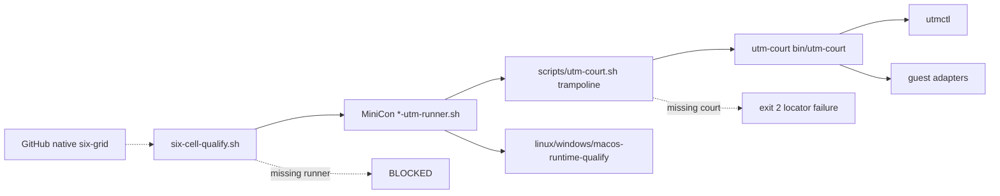

# Extract local UTM court from MiniCon

Status: **active — phases 1–3 landed; live Windows guests are reused**
Outcome: MiniCon calls a sibling `utm-court` CLI at test time and no longer
owns hypervisor lifecycle, image recipes, or guest adapters.

Owner after upsert: `prd/PRD_02_27_con_delivery.md`.
Implementation home: `~/repos/utm-court` → `partnernetsoftware/utm-court`
(private). Not a MiniCon submodule.

## 1. Product ruling

Local UTM is operator infrastructure on one Mac mini, not a MiniCon product
surface. MiniCon keeps six-cell qualification meaning: exact artifacts, runner
env vars, `BLOCKED` when a court is absent. The court owns `utmctl`, leases,
guest agents, and image shelves.

GitHub-native six-grid remains an independent lane. Lima stays in MiniCon
until a later sibling extract. OSX x86_64 remains host Rosetta, not a UTM VM.

### Governing invariants

- MiniCon never talks to `utmctl` after phase 1.
- Missing court is `BLOCKED` or a typed locator failure, never a skipped PASS.
- Court IDs stay `lnx-aarch64-desktop`, `lnx-x86_64-desktop`,
  `win-aarch64-desktop`, `win-x86_64-desktop`, `osx-aarch64-clean`.
- Guest Windows job root defaults to `C:\minicon-six\` via
  `UTM_COURT_WINDOWS_ROOT` / `utm-court windows-root` so live VMs keep
  working. MiniCon runners must not hardcode that path.
- No submodule of the private court into public MiniCon.

## 2. Markdown-tree DAG

```text
[UC] MiniCon calls utm-court; MiniCon does not contain UTM
├── [C0] court product — partnernetsoftware/utm-court
│   ├── invariant: lease/exec/push/pull/release/idle; exit 3 = BLOCKED
│   ├── evidence: tests/utm-court-selftest.sh (fake utmctl, no VM)
│   ├── safe failure: unknown court or missing utmctl is BLOCKED
│   ├── dependency: UTM.app utmctl on the operator Mac
│   └── non-goal: MiniCon cargo layout, qualify scripts, GitHub six-grid
├── [C1] five-row registry
│   ├── invariant: no osx-x86_64 VM row
│   ├── evidence: tests/registry-selftest.sh
│   └── non-goal: sealed release baseline (still local-unsealed)
├── [C2] guest adapters
│   ├── QGA Windows interactive agent + VirtioFS macOS agent
│   └── evidence: existing nonce/readiness contracts, relocated not rewritten
├── [C3] image shelf + prepare recipes
│   ├── evidence: tests/utm-image-source-selftest.sh
│   └── non-goal: redistributing Windows/.utm blobs
├── [M1] MiniCon locator
│   ├── invariant: UTM_COURT_HOME, PATH, sibling ~/repos/utm-court
│   ├── evidence: scripts/lib/utm-court.sh + trampoline scripts/utm-court.sh
│   └── non-goal: compiling or embedding the court
├── [M2] MiniCon product runners
│   ├── linux/windows/macos-utm-runner.sh pack MiniCon bytes and call court
│   ├── evidence: linux-utm-runner-selftest.sh (fake court, no VM)
│   └── non-goal: owning VM start/stop
└── [M3] six-cell qualify unchanged contract
    ├── MINICON_*_RUNNER env vars; absence is BLOCKED
    └── GitHub native lane independent
```

## 3. Memory palace



## 4. Phases

### Phase 1 — this increment

Move court implementation. MiniCon keeps product runners as the calling
scene.

- Create private `partnernetsoftware/utm-court` at `~/repos/utm-court`.
- Own: `bin/utm-court`, five-row registry, guest agents, image sources,
  Linux prepare recipes, court selftests.
- MiniCon: locator trampoline, runners resolve the real CLI, registry
  selftest no longer inspects court internals.
- Delete moved implementation files from MiniCon.

Evidence: `utm-court` `tests/run.sh` PASS; MiniCon
`linux-utm-runner-selftest.sh` and rewritten
`utm-runner-registry-selftest.sh` PASS without a VM.

### Phase 2 — landed

- `macos-utm-runner.sh prepare` copies agents from court `guest/`.
- Research APE/Defender helpers and six-cell smoke locate the court through
  the MiniCon trampoline; they do not probe `utmctl`.
- Image-source preflight reads court `courts/image-sources.json`.
- Lima remains MiniCon-owned.

Evidence: `utm-court-locator-selftest.sh` plus existing runner selftests.

### Phase 3 — landed, with two live-VM leftovers

- `utm-court windows-root` owns `UTM_COURT_WINDOWS_ROOT` (default
  `C:\minicon-six`). MiniCon Windows runner and research helpers consume it.
- Windows agent acquires `Local\UtmCourtAgentV2` and still holds
  `Local\MiniConUtmAgentV2` so an already-running login worker wins.
  Existing guests are reused. The next `interactive-ready` pushes the new
  agent into the same `C:\minicon-six` root; no OS reinstall. The legacy
  mutex name stays as a compatibility alias, not a reprovision gate.
- `utm-court prepare-macos` owns the VirtioFS bridge and bootstrap ISO.
- Optional Lima facade is `utm-court` `bin/lima-court`. MiniCon keeps a
  trampoline plus `setup-linux-runners.sh` (MiniCon-named instances).

## 5. Explicit non-goals

- Making MiniCon depend on AgenTerm evidence or product state.
- Publishing court images or credentials.
- Treating five UTM VMs or a GitHub PASS as six sealed local courts.
- Extracting Lima in phase 1 (later moved into the same operator repo).
- Reinstalling Windows guests to rename a mutex. Dual-acquire is the reuse
  contract; the old name is an alias, not a disk identity.
- Submodule or vendored copy of `utm-court` inside MiniCon.
