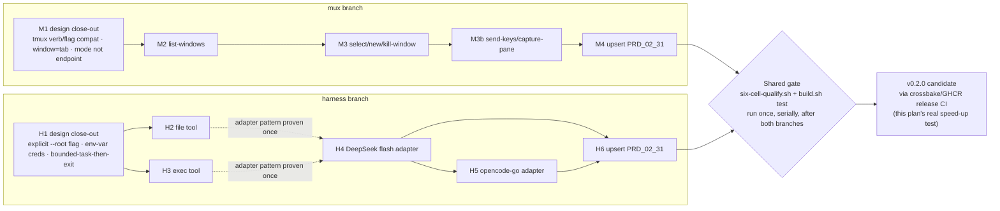

# Plan v0.2.0 — mux + harness

Owning PRD module: `prd/PRD_02_31_v0_2_horizon.md` (scope, non-goals, open
design questions — read it first; this file only sequences delivery and
resolves those questions into implementation decisions). Product boundary and
invariants: `prd/PRD_02_23_minicon.md`. This is the first plan doc to draw on
this repo's crossbake/GHCR pre-baked toolchain
(`scripts/crossbake.Dockerfile`, `.github/workflows/linux-crossbake-experiment.yml`)
as its release-CI path, once that experiment's six-cell claim is confirmed —
see "Delivery note" at the end.

## Tree DAG

```text
v0.2.0 — mux + harness (owner decision 2026-09-24, narrows AGENTS.md boundary)
├── M mux: tmux-CLI-compatible tab control {m}
│   ├── M1 design close-out ->m [v] (2026-09-25, PRD_02_31 "mux -- detail")
│   │   ├── verb surface: tmux verb/flag vocabulary, not MiniCon-native
│   │   │     names -- `list-windows`, `select-window`, `new-window`,
│   │   │     `kill-window`, `send-keys`, `capture-pane`
│   │   │     @method=tmux-verb-compat #decision -- owner-directed: the
│   │   │     concrete need is agent interop across minicon/tmux backends
│   │   ├── model mapping: the running instance IS the one session; tmux
│   │   │     window = MiniCon tab (`@ID` canonical, integer index accepted
│   │   │     as a tmux-numbering convenience); tmux pane = that tab's own
│   │   │     terminal area -- pane 0 always exists and IS the tab's PTY
│   │   │     view; `split-window` (a second pane per window) is not
│   │   │     implemented @method=window-is-tab #decision
│   │   └── surface shape: a mode of the existing --control CLI, not a new
│   │         binary subcommand or endpoint @method=mode-not-new-endpoint
│   │         #decision ->prd/PRD_02_26_con_control_cli.md
│   ├── M2 tab listing (`list-windows`) ->m1 [v]
│   │   ├── invariant: enumerates only tabs of the calling process's own
│   │   │     MiniCon instance; no cross-instance discovery
│   │   ├── invariant: `-F <format>` supports only the substitution
│   │   │     variables named in PRD_02_31's mapping table -- an
│   │   │     unrecognized substitution is a bounded error, never silently
│   │   │     rendered blank (tmux itself renders unknown ones blank; MiniCon
│   │   │     deliberately does not, to avoid a script silently getting
│   │   │     empty fields it thinks are real) #decision
│   │   ├── implemented: `src/mux.rs` `run_mux`/`run_list_windows` -- a thin
│   │   │     translation of `mux list-windows [-F FORMAT]` into `control::
│   │   │     run_cli`'s existing `list-tabs` wire call, parsed back with
│   │   │     `serde_json` (moved to a real, non-dev dependency for this) and
│   │   │     rendered through a `#{var}` substitution engine restricted to
│   │   │     `window_id`/`window_index`/`window_name`/`window_active`
│   │   ├── evidence: unit tests in `src/mux.rs` (`parse_tabs_reads_id_title_
│   │   │     active`, `render_format_default_marks_active_window`,
│   │   │     `unknown_substitution_is_bounded_error`) prove the translation
│   │   │     and format engine against a fixed `list-tabs` JSON fixture
│   │   ├── blackbox: `tests/minicon_mux.rs`
│   │   │     `mux_list_windows_renders_live_tabs_and_both_target_spellings_
│   │   │     hit_one_tab` -- against a live instance with two tabs, the
│   │   │     default format prints exactly one row per tab with `*` on the
│   │   │     tab the control CLI reports active, the marker follows a real
│   │   │     `select-tab`, `-F '#{window_index}|#{window_id}|#{window_
│   │   │     active}'` returns the host's own handles (`0|@1|`, `1|@2|*`),
│   │   │     and `capture-pane -t 1` and `-t @N` provably reach the same tab
│   │   │     while `-t 0` does not
│   │   ├── provable: inverting the `window_active` marker in `render_format`
│   │   │     (`src/mux.rs:423`) failed exactly that one test, 3 others still
│   │   │     passing; verified independently of the authoring session
│   │   ├── #decision display-server BLOCKED withdrawn 2026-09-25 -- the
│   │   │     earlier `control endpoint did not become ready` was a missing
│   │   │     display server; with `xvfb` installed this environment runs the
│   │   │     GUI suites (`minicon_blackbox` 28/28, `minicon_control` 12/12,
│   │   │     `minicon_mux` 4/4) under the same `xvfb-run -s "-screen 0
│   │   │     1280x900x24"` invocation `scripts/linux-runtime-qualify.sh`
│   │   │     uses in the CI gate
│   │   ├── run: `cargo build --bin minicon` FIRST -- `cargo test --test
│   │   │     minicon_mux` resolves the binary next to the test exe and does
│   │   │     not rebuild it, so a stale binary is otherwise what gets tested
│   ├── M3 window select/create/destroy (`select-window`, `new-window`,
│   │   │     `kill-window`) ->m1 [v]
│   │   ├── invariant: an invalid `@ID`/index, a nonzero pane, or a
│   │   │     session-name mismatch is a bounded CLI error (exit code +
│   │   │     message naming which tmux assumption is unsupported), never a
│   │   │     crash or a silently created tab
│   │   ├── implemented: `src/mux.rs` `run_select_window`/`run_new_window`/
│   │   │     `run_kill_window` over `select-tab`/`new-tab`/`close-tab`, with
│   │   │     `resolve_target` parsing `[session:]window[.pane]`; session is
│   │   │     `minicon` or `0`, pane must be 0 or absent, window is an `@ID`
│   │   │     (passed through so the server refuses a stale handle) or a tmux
│   │   │     index (resolved via `list-tabs`). `kill-window` with no `-t`
│   │   │     resolves the active tab, keeping tmux's default working
│   │   ├── evidence: unit tests in `src/mux.rs` --
│   │   │     `a_nonzero_pane_names_the_missing_split_window`,
│   │   │     `a_foreign_session_name_is_refused_not_ignored`,
│   │   │     `a_malformed_at_id_is_refused_before_any_connect`,
│   │   │     `a_window_that_is_neither_handle_nor_index_is_refused`,
│   │   │     `an_at_id_target_resolves_without_reaching_the_endpoint`,
│   │   │     `new_window_refuses_to_silently_drop_a_window_name`,
│   │   │     `an_unsupported_tmux_flag_names_the_implemented_subset`,
│   │   │     `select_window_requires_a_target`. Each target case runs against
│   │   │     a bogus endpoint on purpose: it proves the refusal happens on the
│   │   │     target, before any connect
│   │   ├── provable: removing the nonzero-pane refusal was confirmed to fail
│   │   │     `a_nonzero_pane_names_the_missing_split_window` before the guard
│   │   │     was restored
│   │   ├── blackbox: `tests/minicon_mux.rs`
│   │   │     `mux_window_verbs_switch_open_and_close_real_tabs` -- every
│   │   │     effect read back from `cli list-tabs`, never from mux's own
│   │   │     stdout: `new-window` raises the tab count 1->2, `select-window
│   │   │     -t 0` and `-t @N` each move the active tab, `kill-window -t @N`
│   │   │     drops exactly that handle, and a bare `kill-window` closes the
│   │   │     ACTIVE tab (deliberately the second one, so a wrong-tab
│   │   │     implementation fails here)
│   │   ├── blackbox: `mux_bounded_refusals_exit_nonzero_and_leave_the_
│   │   │     workspace_untouched` -- five refusals (nonzero pane, foreign
│   │   │     session, stale `@ID`, out-of-range index, `capture-pane -S`)
│   │   │     each exit non-zero with empty stdout and a `minicon mux:`
│   │   │     stderr, and afterwards the tab-id list and active tab are
│   │   │     byte-identical: no refusal opened, closed or refocused anything
│   │   ├── provable: `active_tab`'s `.find(|tab| tab.active)` inverted, and
│   │   │     `resolve_target`'s nonzero-pane check inverted, each failed
│   │   │     exactly one of these two tests and nothing else
│   │   ├── #divergence the stale-`@ID` refusal is the control server's own
│   │   │     (`terminal @2 does not exist`), not a tmux-assumption message:
│   │   │     `resolve_target` passes `@ID` through by design, so it is the
│   │   │     one bounded refusal that names no tmux assumption
│   │   ├── #divergence `new-window` ignores tmux's index placement and reads
│   │   │     `-t` as the PARENT tab (`new-tab --parent`); the new tab always
│   │   │     lands last and becomes active, so a tmux script using
│   │   │     `new-window -t 1` to insert at index 1 gets an appended child
│   │   │     instead. Owned by M4 to state in PRD_02_31
│   │   ├── #divergence the mutating verbs print the control protocol's JSON
│   │   │     (`{"closed": "@2"}`, `{"sent_keys": 1}`) where tmux is silent;
│   │   │     only `capture-pane -p` prints plain text. M4 to state it
│   │   ├── depends: M2 (must be able to enumerate a real handle to target)
│   │   └── non-goal: [-] cross-machine attach; [-] persistent session
│   │         outside the process; [-] multiple sessions (both already
│   │         excluded by PRD_02_31)
│   ├── M3b read/write (`send-keys`, `capture-pane`) ->m1 [v]
│   │   ├── invariant: `send-keys` resolves tmux key names (`Enter`, `C-c`,
│   │   │     ...) through the control CLI's existing key spec, not a second
│   │   │     key-name table; `-l` sends the argument literally with no
│   │   │     key-name resolution #correction the design said
│   │   │     `minicon_core::keymap`; that module is the composer's editing
│   │   │     chords, not terminal injection -- see PRD_02_31's corrected
│   │   │     dependency line
│   │   ├── invariant: `capture-pane -S`/`-E` (history range) is refused with
│   │   │     a bounded error citing carried-debt item C1 -- MiniCon's
│   │   │     scrollback semantics are undecided, so this flag is `BLOCKED`,
│   │   │     never approximated
│   │   ├── invariant #decision: an unknown key name is a bounded error, not
│   │   │     literal text. tmux types an unrecognized name as characters;
│   │   │     MiniCon refuses it, same reasoning as `-F`'s unknown
│   │   │     substitution -- a mistyped key name silently becoming keystrokes
│   │   │     is the failure a script cannot see
│   │   ├── implemented: `src/mux.rs` `tmux_key_to_spec`/`tmux_key_name`
│   │   │     translate `C-`/`M-`/`S-` prefixes and tmux's own spellings
│   │   │     (`BSpace`, `DC`, `IC`, `NPage`, `PPage`) into `ctrl+`/`alt+`/
│   │   │     `shift+` specs whose base name still must satisfy
│   │   │     `NamedKey::from_name`; the whole sequence is translated before
│   │   │     any of it is sent, so a bad name late in the sequence cannot
│   │   │     land after the earlier keys
│   │   ├── evidence: unit tests in `src/mux.rs` --
│   │   │     `tmux_modifier_prefixes_become_minicon_key_specs`,
│   │   │     `tmux_only_key_spellings_are_translated`,
│   │   │     `an_unknown_key_name_is_refused_rather_than_sent_as_text`,
│   │   │     `capture_pane_history_range_is_blocked_on_carried_debt_c1`
│   │   ├── provable: letting an unknown key name fall through as literal text
│   │   │     (tmux's own behavior) was confirmed to fail
│   │   │     `an_unknown_key_name_is_refused_rather_than_sent_as_text` before
│   │   │     the guard was restored
│   │   ├── blackbox: `tests/minicon_mux.rs`
│   │   │     `mux_send_keys_reach_the_child_and_capture_pane_returns_its_
│   │   │     output` -- `-l` types a command line (asserted not to itself
│   │   │     contain the expected output), the named key `Enter` makes the
│   │   │     real child run it, `cli wait-text` confirms the child produced
│   │   │     output, and `capture-pane -p` returns both the produced line and
│   │   │     the literal text `-l` typed
│   │   ├── provable: mapping `enter` to `Tab` in `tmux_key_name` failed
│   │   │     exactly that test (via the `wait-text` timeout) and no other
│   │   ├── owed: modifier keys against a live child (`C-c`, `M-x`, `S-Tab`)
│   │   │     stay unit-test-only; observing a real interrupt needs a
│   │   │     foreground-process assertion the suite does not have yet
│   │   └── depends: M3 (needs a real target to send/capture against)
│   └── M4 upsert into PRD_02_31 ->m [v]
│         └── flip mux's `[_]` lines to `[v]` only against the evidence named
│               in M2/M3/M3b, per AGENTS.md's "[v] requires named evidence"
│               rule
├── H harness: minimal two-tool agent loop {h}
│   ├── H1 design close-out ->h [v] (2026-09-25, PRD_02_31 "harness -- detail")
│   │   ├── invocation: `minicon harness --root <path> --task "<text>"
│   │   │     [--backend deepseek|opencode-go] [--allow-cmd <name>]...`;
│   │   │     `--root`/`--task` required, no implicit-cwd default
│   │   │     @method=explicit-flag-required #decision
│   │   ├── exec allow-shape: `--allow-cmd` repeatable, names permitted
│   │   │     executable basenames; zero given means the `exec` tool is
│   │   │     still advertised but every call is refused with a bounded
│   │   │     error -- a model must not be able to distinguish "not allowed
│   │   │     yet" from "tool absent" by probing #decision
│   │   ├── credential path: environment variable only for v0.2.0
│   │   │     (`MINICON_DEEPSEEK_API_KEY` / `MINICON_OPENCODE_API_KEY`); a
│   │   │     config-file credential store is deferred, not designed here,
│   │   │     to avoid MiniCon growing a general secrets feature
│   │   │     #decision @method=env-var-only
│   │   └── run shape: one invocation runs one bounded task to completion
│   │         (or a bounded turn/tool-call limit) and exits, printing to
│   │         stdout; no interactive loop inside a tab, no conversation
│   │         persisted across invocations (`--continue` is out of scope)
│   │         @method=bounded-task-then-exit #decision
│   ├── H2 file tool ->h1 [v] @method=first ->h1
│   │   ├── invariant: read/write confined to the `--root` bound; a path
│   │   │     that escapes it (symlink, `..`) is refused, not clamped
│   │   ├── evidence: black-box test attempts a `../` escape and an absolute
│   │   │     path outside root, asserts both refused; a same-root
│   │   │     read/write round-trip asserts success
│   │   ├── safe failure: refusal is a bounded CLI error, never a partial
│   │   │     write
│   │   ├── implemented: `src/harness.rs` `FileTool` (`new`, `resolve`,
│   │   │     `read`, `write`). The bound is enforced by construction, not by
│   │   │     resolve-then-compare-prefixes: a relative path of plain
│   │   │     components with no existing symlink component provably cannot
│   │   │     leave the canonical root, so `..`, `.`, absolute paths and
│   │   │     symlinks are refusals with nothing left to clamp. Reads bounded
│   │   │     at 256 KiB; writes go through `write_file_atomic` (a rewrite
│   │   │     must be allowed, so not the no-clobber variant)
│   │   ├── evidence: `harness::tests::file_tool_round_trips_inside_the_root`,
│   │   │     `..._refuses_parent_and_absolute_escapes_without_clamping`,
│   │   │     `..._refuses_a_symlink_at_the_leaf_and_at_an_intermediate_component`
│   │   ├── provable: clamping `..` instead of refusing it, and disabling the
│   │   │     symlink check, each failed exactly the matching test and no
│   │   │     other (re-verified 2026-09-25 by the integrating session)
│   │   ├── black-box evidence: `tests/minicon_harness.rs`, nine cases driving
│   │   │     the shipped binary's own `minicon harness` CLI. For H2 the bound
│   │   │     is observed as a refusal before any task runs:
│   │   │     `refuses_an_unresolvable_root_with_a_key_present`,
│   │   │     `refuses_a_root_that_is_not_a_directory`,
│   │   │     `requires_root_to_be_stated_explicitly`. The suite needs no
│   │   │     display server and no network — every case lands before a
│   │   │     transport opens — so it is not subject to the withdrawn
│   │   │     display-server assumption at all
│   │   ├── black-box evidence: the ordering invariant, which only an outside
│   │   │     caller can see: a missing credential is refused BEFORE the
│   │   │     file tool's bound is resolved, so no tool is constructed for a
│   │   │     task that could not have reached a model
│   │   │     (`refuses_a_missing_backend_key_before_resolving_the_root`,
│   │   │     which asserts stderr does NOT contain `cannot be resolved`)
│   │   ├── provable: five one-change breaks, each run against
│   │   │     `cargo test --test minicon_harness` with `src/harness.rs`
│   │   │     restored byte-exact afterwards. Resolving the root before the
│   │   │     credential check failed TWO tests, not one — both of the
│   │   │     ordering assertions, since each supplies an unresolvable root
│   │   │     with no key; recorded, not hidden. Accepting an empty key,
│   │   │     dropping the `is_dir` check, and defaulting `--root` to `.`
│   │   │     each failed exactly their own test and no other
│   │   └── DURING-task BLOCKER withdrawn 2026-09-26: H4's live evidence IS
│   │         this tool exercised during a real task, not a fixture --
│   │         `deepseek_backend_runs_a_real_bounded_task_and_writes_the_file`
│   │         drives a real DeepSeek call whose model turn calls `file`
│   │         write, and the test reads the real file the tool wrote under
│   │         the task root
│   ├── H3 exec tool ->h1 [v]
│   │   ├── invariant: exactly one command per call, no shell metacharacter
│   │   │     expansion (no `&&`, pipes, or subshell) — the command is
│   │   │     invoked directly (argv vector), not passed through `/bin/sh -c`
│   │   ├── evidence: black-box test passes a string containing `;` or `&&`
│   │   │     as a single argv token and asserts it is NOT interpreted as
│   │   │     two commands; a real single-command run asserts captured
│   │   │     stdout/exit code
│   │   ├── depends: H1 (needs the allow-shape decision to bound which
│   │   │     commands are runnable)
│   │   ├── implemented: `src/harness.rs` `ExecTool` (`new`, `admit`, `run`,
│   │   │     `spawn_contained`). `admit` takes a bare basename only — a path
│   │   │     spelling of an allowed basename (`/bin/echo`, `./echo`) is
│   │   │     refused, since a matching basename can name a different
│   │   │     executable. An empty allow-list gives its own dedicated refusal,
│   │   │     so probing cannot separate "not allowed yet" from "tool absent".
│   │   │     30s timeout with both pipes drained on threads so a full pipe
│   │   │     cannot deadlock the bound
│   │   ├── evidence:
│   │   │     `harness::tests::exec_tool_refuses_every_call_when_the_allow_list_is_empty`,
│   │   │     `..._refuses_an_unlisted_command_and_a_path_spelling_of_a_listed_one`,
│   │   │     `..._runs_one_command_and_never_interprets_shell_metacharacters`
│   │   ├── provable: disabling the basename-vs-path check failed exactly the
│   │   │     allow-list test and no other; disabling the empty-allow-list
│   │   │     refusal failed exactly its own test and no other. Both
│   │   │     re-verified independently 2026-09-25 by the integrating session.
│   │   │     #risk the empty-allow-list guard is the fragile one of the set:
│   │   │     with it gone the call still fails, just through the generic
│   │   │     `not in the allow-list ()` path, so the test holds only because
│   │   │     it asserts on the specific message. Re-check it whenever
│   │   │     `ExecTool::admit` changes
│   │   ├── carried debt: the spawn uses `std::process::Command`, not
│   │   │     `agenterm_platform::contained_process::ContainedHeadlessCommand`
│   │   │     as PRD_02_31 assumed — that module is gated behind the platform
│   │   │     crate's `contained-process-spawn` feature, which MiniCon's
│   │   │     dependency does not enable. The argv-vector/no-shell invariant
│   │   │     H3 states is fully met; resource containment is not. The swap is
│   │   │     one `Cargo.toml` feature plus one function body, and is deferred
│   │   │     to H4 so the feature change is verified by a MiniCon build and a
│   │   │     six-cell round that has a caller to exercise it
│   │   ├── black-box evidence: `tests/minicon_harness.rs` covers the CLI
│   │   │     surface that bounds this tool before it can run at all —
│   │   │     `refuses_an_unknown_backend_by_name` (an unknown `--backend`
│   │   │     must not fall back to the default and send the task to an
│   │   │     endpoint the caller did not choose) and `refuses_an_unknown_flag`
│   │   ├── provable: making an unknown `--backend` fall back to the default
│   │   │     failed exactly `refuses_an_unknown_backend_by_name` and no other
│   │   └── DURING-task BLOCKER withdrawn 2026-09-26: live evidence in
│   │         `tests/minicon_harness.rs`
│   │         `deepseek_backend_runs_a_real_bounded_task_through_the_exec_tool`
│   │         -- a real DeepSeek call is told to run `wc -c input.txt` via
│   │         `ExecTool::run` and write the byte count it reads back into a
│   │         file. The count is never shown to the model, so a written
│   │         answer matching the real byte count is only possible if `exec`
│   │         actually ran; provable by forcing the expected count to a wrong
│   │         value, which failed exactly this test and no other
│   ├── H4 DeepSeek flash backend ->h1 [v] @method=first
│   │   ├── also closes out, as the first non-test caller of H2/H3: the
│   │   │     `#[cfg_attr(not(test), allow(dead_code))]` on `FileTool`/
│   │   │     `ExecTool` (carried only because the tools are complete while
│   │   │     their adapter is not — faking a loop to make them reachable
│   │   │     would be worse), and H3's `contained-process-spawn` debt
│   │   ├── invariant: harness sends the two-tool loop over DeepSeek's own
│   │   │     wire format; no generic "OpenAI-compatible" claim is made from
│   │   │     this backend alone
│   │   ├── evidence: black-box test runs one real bounded task (temp root,
│   │   │     one file write commanded by the model) against DeepSeek flash,
│   │   │     asserts the file lands with model-specified content
│   │   ├── transport decided and built, BLOCKED on the pin: the owner chose
│   │   │     the house route -- add the capability to `agenterm-platform`
│   │   │     using the already-declared-but-dead `ureq` with
│   │   │     `PRD_02_20`'s target-specific TLS trees (Unix Rustls/WebPKI,
│   │   │     Windows NativeTls). That capability now exists as
│   │   │     `network-http` (contract + facade, no per-OS adapter because
│   │   │     `ureq` is portable and the only per-OS difference is the TLS
│   │   │     provider, expressed as Cargo features), verified in the narrow
│   │   │     graph: `cargo test -p agenterm-platform --no-default-features
│   │   │     --features network-http` 113 passed against a 92-test baseline,
│   │   │     clippy clean, and one guard broken independently of the
│   │   │     authoring session failed exactly
│   │   │     `rejects_a_body_on_a_method_that_cannot_carry_one`
│   │   ├── pin BLOCKER withdrawn 2026-09-25: the owner authorized attaching
│   │   │     agenterm with push access, the capability is published as
│   │   │     PR #119 (`fd0adcf`), and MiniCon's `Cargo.toml` pin moved to it
│   │   │     with `network-http` enabled. #decision
│   │   ├── `PlainHttp` DELETED, not kept beside the new transport: the
│   │   │     capability's `validate` accepts `http://` and `https://` alike,
│   │   │     so one `NetworkHttp` reaches both an https model API and the
│   │   │     loopback plain-HTTP case `PlainHttp` was justified by. Keeping
│   │   │     both would mean two clients for one job, one of them a private
│   │   │     response parser with its own framing bugs. Nothing in MiniCon
│   │   │     refuses `https://` any more. #decision
│   │   ├── #rejected shelling out to `curl`: an unbounded external command
│   │   │     inside the one feature whose point is bounded tools
│   │   ├── #rejected a MiniCon-local TLS crate: cross-platform mechanism
│   │   │     belongs in the shared platform crates, per AGENTS.md
│   │   ├── blackbox: `harness_wire`'s four transport tests --
│   │   │     `a_non_2xx_response_becomes_an_error_carrying_the_status_and_the_body`,
│   │   │     `a_truncated_2xx_body_is_refused_rather_than_parsed_as_complete`,
│   │   │     `the_transport_refuses_a_bad_url_before_opening_any_socket`,
│   │   │     `the_transport_round_trips_against_a_loopback_listener`
│   │   ├── provable: five one-line breaks, each failing exactly one test
│   │   │     (`if !response.is_success()` -> `if false`; `: {text}` dropped
│   │   │     from the non-2xx format string; the 2xx `if response.truncated`
│   │   │     -> `if false`; `network_http::validate` -> `Ok(())`;
│   │   │     `Authorization` -> `X-Not-Authorization`)
│   │   ├── #divergence the Authorization break INITIALLY FAILED TO FAIL --
│   │   │     the assertion matched `Authorization: Bearer secret` as a
│   │   │     substring, which `x-not-authorization: Bearer secret` contains.
│   │   │     The first version of that assertion was documentation, not
│   │   │     evidence; it now matches the whole folded header line
│   │   ├── credential BLOCKER withdrawn 2026-09-26: `MINICON_DEEPSEEK_API_KEY`
│   │   │     was reconfigured in this environment and is accepted by the real
│   │   │     DeepSeek endpoint. Live end-to-end evidence now exists:
│   │   │     `tests/minicon_harness.rs`
│   │   │     `deepseek_backend_runs_a_real_bounded_task_and_writes_the_file`
│   │   │     runs `minicon harness` against a fresh temp root with a real task
│   │   │     ("write OK-H4-LIVE into result.txt"), asserts exit code 0, and
│   │   │     reads the file the live model's tool call wrote under the root
│   │   ├── provable: forcing the written-content assertion to require a string
│   │   │     the live model never wrote failed exactly that one test, the other
│   │   │     nine in the suite still passing; reverted afterward
│   │   ├── the test is env-gated, not silently skipped when the key is absent:
│   │   │     it prints `BLOCKED: ... skipped -- MINICON_DEEPSEEK_API_KEY is not
│   │   │     set` to stderr and returns, so a run without the key stays visible
│   │   │     as a named gap rather than vanishing from the count. Test count
│   │   │     went from 9 to 10 in `./scripts/build.sh test`'s gate
│   │   └── #risk TLS itself is proven by NOTHING in either repository beyond
│   │         this live call: no test reaches a host but `127.0.0.1` and
│   │         `api.deepseek.com`, and the Windows/macOS native-tls arm is not
│   │         compiled in any evidence -- only Unix Rustls/WebPKI has run a real
│   │         handshake. The TLS provider selection on Windows/macOS is proved
│   │         only by the feature graph compiling
│   ├── H5 opencode-go-compatible backend ->h1 [v]
│   │   ├── invariant: a second, independently verified adapter — H1's
│   │   │     decision explicitly forbids assuming H4's adapter covers it.
│   │   │     Held: `harness_opencode` owns its request body, its reply
│   │   │     parsing and its own bounds, and shares only the `Transport`
│   │   │     seam. `run_harness` dispatches per backend; the DeepSeek codec
│   │   │     never serves this one
│   │   ├── blackbox: twelve tests in `src/harness_opencode.rs`, covering the
│   │   │     endpoint resolver (default, env, slash doubling, non-http and
│   │   │     hostless refusals), a real-socket round trip that asserts the
│   │   │     request line, bearer header, `stream:false`, both advertised
│   │   │     tools, the assistant `tool_calls` echo matched by
│   │   │     `tool_call_id`, and the model-commanded file landing under the
│   │   │     task root; plus a tool refusal carried back as a result, non-2xx
│   │   │     status, truncated JSON, the reply ceiling, named missing fields,
│   │   │     the turn bound and the tool-call bound
│   │   ├── provable: twelve one-line breaks, each failing exactly one test;
│   │   │     one break (`opencode_dispatch(...)?` instead of
│   │   │     `.unwrap_or_else(|refusal| refusal)`) failed TWO, because the
│   │   │     turn-bound fixture also scripts a failing read -- recorded, not
│   │   │     hidden
│   │   ├── #divergence the endpoint resolver genuinely had the scheme-order
│   │   │     bug the break table lists: `http://` alone resolved to
│   │   │     `http://http:/v1/chat/completions`. The test caught it on first
│   │   │     write; the fix carries a comment saying why the order matters
│   │   ├── #divergence the fixtures DEADLOCKED two full runs: a `Drop` that
│   │   │     joined a listener thread parked in blocking `accept()`, so any
│   │   │     test panicking before the scripted replies ran out -- and, with
│   │   │     client-side `validate`, any refusal test that never connects --
│   │   │     hung forever. Diagnosed from kernel wait states
│   │   │     (2x `inet_csk_accept` + `futex_do_wait`), deterministic, fixed
│   │   │     in the fixture with a non-blocking accept loop, a stop flag set
│   │   │     before the join and a read deadline. No `timeout` wrapper, no
│   │   │     `#[ignore]`, no test deleted
│   │   ├── provable: reverting `harness.rs`'s dispatch makes the whole
│   │   │     adapter dead code -- eight `never used` errors under the gate's
│   │   │     `dead_code` denial -- so the wiring is falsifiable, not claimed.
│   │   │     The module's `cfg_attr(not(test), allow(dead_code))` is gone
│   │   ├── BLOCKED credential withdrawn, 2026-09-26: independent web/API
│   │   │     research (WebSearch/WebFetch plus direct `curl` against the real
│   │   │     endpoint with the real `MINICON_OPENCODE_API_KEY`) established
│   │   │     that opencode-go is a **hosted subscription service**
│   │   │     (`https://opencode.ai/zen/go`), not the loopback local server
│   │   │     this module's header had assumed. Confirmed live: HTTPS-only;
│   │   │     bearer key accepted; a mandatory `x-opencode-session` header
│   │   │     (its absence gets `MissingSessionID`, even with a valid key --
│   │   │     a session id as a query parameter does not satisfy this); no
│   │   │     model literally named `"opencode"` (real catalog via
│   │   │     `GET /v1/models` includes `deepseek-flash`, `deepseek-v4-pro`,
│   │   │     `glm-5.3`, `grok-4.7`, `kimi-k3`, among others)
│   │   ├── #divergence design vs. reality, recorded rather than silently
│   │   │     patched: fixed by (1) widening `Transport::post_json` with an
│   │   │     `extra_headers: &[(&str, &str)]` parameter (new test in
│   │   │     `harness_wire.rs` proves a real loopback listener receives an
│   │   │     arbitrary extra header); (2) `opencode_chat_url_from` now accepts
│   │   │     `https://` too, correcting a doc comment that had claimed
│   │   │     "MiniCon has no TLS capability" -- stale since H4's transport
│   │   │     swap; (3) `OPENCODE_MODEL_VAR = MINICON_OPENCODE_MODEL`, mirroring
│   │   │     `OPENCODE_BASE_URL_VAR`, so a caller can name a real catalog
│   │   │     model instead of the placeholder; (4) a fixed
│   │   │     `OPENCODE_SESSION_ID = "minicon-harness"` sent unconditionally --
│   │   │     one CLI invocation is one bounded task, so no per-run session
│   │   │     store is needed
│   │   ├── live evidence: `opencode_backend_runs_a_real_bounded_task_and_
│   │   │     writes_the_file` in `tests/minicon_harness.rs`, gated on
│   │   │     `MINICON_OPENCODE_API_KEY` (BLOCKED, not silently skipped, when
│   │   │     absent), driving the shipped binary with `--backend opencode-go`
│   │   │     against the real `https://opencode.ai/zen/go` endpoint and model
│   │   │     `deepseek-flash`, asserting the model-commanded write lands under
│   │   │     the task root. Provability verified by deliberately requiring an
│   │   │     absent string in the write and confirming the test fails with the
│   │   │     real content on stderr, then reverting
│   │   ├── #risk this run proves Unix Rustls/WebPKI reaches this HTTPS
│   │   │     endpoint; it does not prove Windows/macOS native-tls does --
│   │   │     same caveat H4 already carries, not newly introduced here
│   │   ├── #risk the live test failed once with an upstream HTTP 400 on a
│   │   │     later turn, then passed unmodified on immediate retry -- the
│   │   │     real service's own transient behavior under a live model call,
│   │   │     not a code defect (re-ran the same request by hand via `curl`
│   │   │     and it succeeded). Recorded rather than papered over with a
│   │   │     retry loop this repo's tests do not otherwise carry
│   │   └── #risk this module duplicates `harness_wire`'s tool dispatch and
│   │         system prompt almost verbatim. Deliberate under H1; collapse it
│   │         only against live evidence from BOTH backends, never before
│   └── H6 upsert into PRD_02_31 ->h [v]
│         └── flip harness's `[_]` lines to `[v]` only against H2-H5's named
│               evidence
└── Shared gates
      ├── every new subcommand ships behind the two AGENTS.md invariants
      │     already governing this module: one file, no bundled runtime
      ├── `./scripts/six-cell-qualify.sh` and `./scripts/build.sh test` gate
      │     both mux and harness before any plan item is marked `[v]`
      └── final PRD_02_31 upsert (M4 + H6) happens once, after both branches
            close out — not per-item, to keep one coherent evidence pass
```

## Sequencing

1. **M1/H1 design close-outs first** — both are pure decisions (no code),
   and H2/H3/M2/M3 all depend on their own branch's close-out. Do these
   before writing any implementation. Both are resolved as of 2026-09-25 (see
   `prd/PRD_02_31_v0_2_horizon.md`'s "mux — detail" and "harness — detail");
   implementation (M2/M3/M3b, H2-H5) can now start.
2. **mux (M2 → M3) and harness's two tools (H2, H3 in parallel)** can proceed
   independently — mux only touches `PRD_02_26`'s existing control-CLI code
   path; harness's file/exec tools are new, isolated modules with no shared
   file ownership with mux. Work them in parallel per AGENTS.md's own
   "independent leaves, independent file ownership" rule.
3. **H4 before H5** — the adapter pattern must be proven against one real
   backend before a second is attempted (explicit dependency, not a
   convenience ordering).
4. **Integrate and gate serially**: once M3 and H3/H4(/H5) are done, run
   `six-cell-qualify.sh` and `build.sh test` once across the whole set before
   any PRD upsert.
5. **Upsert last** (M4, H6, then this plan gets archived to `plan/archive/`
   per AGENTS.md's ownership rule — PRD_02_31 becomes the durable record,
   this plan doc's job ends there).

## Mermaid flowchart memory palace

Relationships the tree above cannot show well: mux and harness share no
files but do share gates, and harness's two model backends share one adapter
pattern proven once and reused, not re-derived.



## Delivery note: this is the crossbake/GHCR methodology's real test

`plan/plan-ghcr-toolchain-prebake.md` and the live
`linux-crossbake-experiment.yml` dispatches are proving whether one
pre-baked Linux image can cross-build all six MiniCon cells plus
`minicon.com` from a single host, to move build workload off GitHub-hosted
macOS/Windows runners. v0.2.0 is deliberately the first version whose actual
release Candidate is built to test that pipeline for real speed-up, once the
crossbake experiment's six-cell artifact-type verification (PE32/ELF/Mach-O)
passes and the image is published to GHCR. Until that experiment is
confirmed, this plan's own release gate falls back to the existing
`six-cell-qualify.sh` / `six-grid-cloud-build.yml` native-per-cell path
unchanged — the crossbake path is additive, not a precondition for shipping
v0.2.0's mux/harness work itself.
