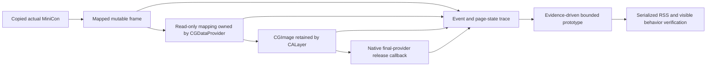

# Actual MiniCon frame lifetime and page residency

Research in progress; production owner remains Runtime host memory in
`prd/PRD_02_27_con_delivery.md`. Source baseline `ad991b0`, platform `8d8de88c`.

```text
Find avoidable actual MiniCon frame residency without changing terminal behavior
├── Trace owner
│   ├── invariant: retain provider until the native final-reader callback
│   ├── evidence: map/create/freeze/layer-submit/provider-release timeline plus mincore
│   ├── failure: diagnostics cannot free or write native-owned pixels
│   └── non-goal: infer saving from a checkerboard instead of the product
├── Controlled experiment owner
│   ├── dependency: exact copied product and shared softbuffer source
│   ├── evidence: serialized same-window RSS/vmmap and native ownership events
│   └── failure: instrumented RSS is not product qualification
└── Reduction owner
    ├── invariant: pixels, IME, menus and resize stay correct
    ├── dependency: causal allocation or redundant presentation evidence first
    └── non-goal: flush/actions/color/IME/allocator-relief retries or shrinking PTY
```



## Actual-product ownership receipts

2026-09-06, macOS 26.5.1 aarch64 release. The experiment copies MiniCon
`ad991b0` through `git archive`, keeps its platform pin `8d8de88c`, and patches
only an independent copy of softbuffer with lifecycle logging. The copied
softbuffer source was checked against that platform revision. Production,
`target/font-platform-fix`, and other research sources are untouched.

Each anonymous frame is registered on allocation. A native data-provider owner
logs its final release before unmapping. Presentation logs before freezing,
after image creation, after assigning layer contents, after transaction commit,
and after dropping the local image/provider references. A separate thread
queries `mincore` every 100 ms under the same registry lock used before unmap;
it never dereferences or reads pixel bytes. This introduces a thread, small
status-vector allocations, synchronization and log output. A second run turns
logging off on the **same artifact**, omitting that thread entirely.

The sequence uses the actual one-tab `/bin/cat` MiniCon window, public CLI and
`--no-activate`: idle, ASCII/CJK text, resize to 1100×700, restore 960×600,
screenshot, close the final tab, close the window. Both processes exit normally.
The generated 1920×1200 screenshot was visually inspected: text, Chinese
characters, tabs and composer are intact. This is diagnostic verification;
it does not independently qualify native first-key IME or absence of flicker.

The trace captures 46 frame allocations and 45 actual final-provider release
callbacks; the final greeting image is held through the last sample until
process exit. No post-exit callback is required for OS process reclamation.
At most **two frame mappings** are live simultaneously, corresponding to the
old displayed image and the new image being submitted. Released frame lifetime
has a 535.199 ms median, matching the approximately 530 ms cursor-blink cadence.
There is no growing queue of old layer/provider frames in this experiment.

A representative 9008 KiB page-rounded frame, ID 4:

| Event | Microseconds since trace origin | Pages reported in-core |
|---|---:|---:|
| Anonymous allocation | 427674 | 0 KiB |
| Raster complete / present begins | 430154 | 9008 KiB |
| Mapping frozen / provider ownership | 430393 | 9008 KiB |
| Image created | 430597 | 9008 KiB |
| Layer contents assigned | 430805 | 9008 KiB |
| Transaction commit returns | 431302 | 9008 KiB |
| Local image and provider references dropped | 431506 | 9008 KiB |
| Final provider release for this frame | 963693 | 9008 KiB |

At 431085 microseconds the previous frame's final-provider callback fires.
The two-frame overlap ends during submission; local Rust references do not
hold an additional third displayed frame.

**`mincore` in-core status is not this process's RSS.** It reports 9008 KiB
in-core throughout each sampled retained frame, with no PAGED_OUT bits in this
run, while same-window vmmap can report **16 KiB resident** for the exact
tracked mapping address. These two observations coexist; one cannot translate
the mincore status vector into per-process resident accounting. Only a release
callback proves this particular provider ownership has ended. Conversely, a
low vmmap resident count does not prove that the native reader released it.
No source-page reclaim or early provider free is justified by this experiment.

## Concrete excess memory: screenshot copies retained by malloc

The frame investigation found a separate, reproducible allocation cause in
real product use. The public screenshot command creates **two full-size heap
buffers**:

1. `src/main.rs` screenshot branch copies `frame.pixels_mut().to_vec()` for the
   asynchronous PNG job, giving it independent ownership of the exact frame.
2. Shared `adapters/unix/png.rs::write_xrgb_png` creates
   `Vec::with_capacity(output_pixels * 4)` and fills a complete RGBA image before
   calling `write_image_data`.

Each is 9,216,000 requested bytes at the measured dimensions, rounded to
9008 KiB. They are no longer live after encoding, but remain in the allocator's
large-block cache. The same-window diagnostics distinguish this from a leak:

| Trace disabled, same process | Before screenshot | After screenshot |
|---|---:|---:|
| RSS at phase sample, MiB | 75.328 | 101.875 |
| Live allocated heap, bytes | 17,955,280 | 17,957,600 |
| Empty large malloc regions | 0 | 2 |
| Their combined resident / dirty pages | 0 | 17.594 MiB |

RSS includes a changing frame/page-residency component, so the full 26.547 MiB
RSS jump is **not** claimed as the screenshot-copy allocation total. The
**17.594 MiB** attribution comes directly from the two empty large-region
receipts; live heap grows only 2320 bytes. The trace-enabled run independently
shows the same two 9008 KiB empty, resident, dirty regions after the screenshot.
Its phase RSS is 79.906 MiB before and 106.375 MiB after.

Later in the trace-disabled run, after closing the final tab, those *same two
empty regions* still exist but have only 10448 KiB resident and 7568 KiB swapped.
That is compression/page-state change, not a successful free or memory fix.
It explains why an arbitrary later RSS sample understates the persistent
allocation policy problem.

The primary agent is implementing the evidence-backed repair: stream PNG rows
instead of materializing a whole RGBA frame, and use an independently owned
screenshot pixel buffer whose large storage is returned when the worker ends.
Keep asynchronous screenshot, restore-active-tab, discard-frame and completion
ordering intact. This research track does not modify production or substitute
an allocator-pressure call for allocation ownership. Qualification must show
that the two empty large regions disappear after the same screenshot command,
alongside pixel correctness and the existing public screenshot/GUI courts.
Initial idle still requires separate work toward the 10 MiB RSS target.

## Reproduction and retained evidence

```sh
python3 archive/research/frame-lifetime/prepare.py
python3 archive/research/frame-lifetime/instrument.py
CARGO_TARGET_DIR=target/frame-lifetime/build cargo build --offline --release --manifest-path target/frame-lifetime/product/Cargo.toml
python3 archive/research/frame-lifetime/run.py
FRAME_TRACE_MODE=0 python3 archive/research/frame-lifetime/run.py
python3 archive/research/frame-lifetime/summarize.py
```

Run the GUI phases only in the assigned serial measurement window.
`prepare.py` copies the named source and local matching softbuffer; it changes
only `target/frame-lifetime`. `instrumentation.patch` and `frame_trace.rs` are
the diagnostic changes. Build and Python syntax checks passed. Compact exact
artifact identity, RSS phase samples and ownership receipts are retained in
`archive/research/frame-lifetime/results.json`. Full host logs, frame timeline,
vmmap/heap and the checked screenshot stay under ignored
`target/frame-lifetime/run-{trace,control}/`. No six-cell or 10 MiB PASS is claimed.

## Repair verification: full-frame screenshot malloc caches disappear

The primary agent supplied a frozen release prototype with shared row-streaming
PNG encoding and an independently owned screenshot buffer. This track then ran
the same public CLI workflow above against baseline and fixed artifacts,
alternating **two fresh processes each**, with diagnostic tracing disabled.
No root or shared source was changed by this verification.

Baseline SHA-256:
`7d08627d494af396885843ec016d554c4b8d9b520c80bcf0757e7fa54e89c527`.
Fixed pre-pin SHA-256:
`a41d51c1891a15dc3085b299311423a2da9b33bb2c5c80ab9000aa8e2585993a`.

| Round | Artifact | RSS before screenshot, MiB | RSS after, MiB | Increase, MiB | Screenshot-time empty large-region receipt |
|---|---|---:|---:|---:|---|
| 1 | Baseline | 67.984 | 85.875 | 17.891 | One 9008 KiB region, all resident/dirty |
| 1 | Fixed | 71.125 | 71.594 | 0.469 | No MALLOC_LARGE regions |
| 2 | Baseline | 73.891 | 100.406 | 26.516 | Two 9008 KiB regions; one resident/dirty, one zero resident |
| 2 | Fixed | 72.703 | 73.000 | 0.297 | No MALLOC_LARGE regions |

The exact resident size of baseline allocator caches changes with allocator
and OS page state: this series retained fewer resident pages at the diagnostic
instant than the original 17.594 MiB receipt. The records retain that difference
rather than implying a fixed 17.594 MiB RSS reduction on every run. In both fixed
processes, the large malloc regions are absent after screenshot and after
closing the last tab. Screenshot-induced RSS growth falls to **0.30–0.47 MiB**
in this series. This validates the allocation mechanism repair; the variable
67–80 MiB startup observations remain far above the 10 MiB product target and
are not attributed to the screenshot fix.

All four screenshots decode through the system image codec (`sips` converts
PNG to TIFF), with dimensions **1920×1200**. A fixed screenshot was visually
inspected and preserves terminal ASCII/CJK, tab chrome and composer. All four
processes complete the resize/restore/screenshot/greeting/close workflow with
exit code zero. Final pinned-artifact public GUI, screenshot semantics and
native input qualification remain the primary integration owner's gates.

Reproducer: `python3 archive/research/frame-lifetime/compare-screenshots.py`.
It selects `target/minicon-allocator-probe/baseline` and
`target/screenshot-memory/fixed-pre-pin`, invoking the same `run.py` with
`FRAME_TRACE_MODE=0`, `FRAME_BINARY` and a per-run `FRAME_OUT` directory.
Compact hashes, phase RSS, live-heap counts, raw large-region receipts and
PNG decode results: `archive/research/frame-lifetime/screenshot-results.json`.
Full same-window vmmap/heap/logs/images remain in
`target/frame-lifetime/screenshot-{baseline,fixed}-{0,1}/`.
