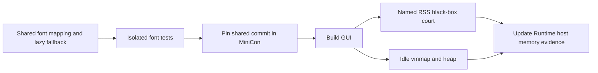

# Lazy font memory repair

```text
Idle MiniCon must not retain whole fallback font files on its dirty heap
├── Shared Unix raster owner: owned read-only mappings, borrowed font views
│   ├── invariant: no leaked font slices; fallback opens only after missing glyph
│   ├── evidence: isolated font tests, MiniCon GUI rendering and RSS court
│   ├── failure: unavailable/malformed candidate is cached and search continues
│   └── non-goal: new color-emoji renderer or PTY buffer reductions
└── MiniCon integration owner: pinned shared revision and named macOS evidence
    ├── dependency: reviewed shared commit, then rebuild exact GUI
    ├── evidence: host_process_rss_stays_within_named_budget + vmmap/heap
    ├── failure: record BLOCKED evidence and remaining 10 MiB gap honestly
    └── non-goal: raising 384 MiB ceiling or claiming other OS/ISA cells
```



Shared edit checkout: `target/font-platform-fix`, based on MiniCon's pinned
`649174e3`. Other product working trees remain untouched. MiniCon already has
uncommitted work from its two maintainers; this repair preserves that work.

## Completed repair and evidence

- Shared commit: `bb309e79bc351b314cec65ec24ba1bab0e74c1f4`, pushed to
  `partnernetsoftware/agenterm` branch `fix/lazy-font-mapping`. MiniCon git
  dependencies remain on one coherent revision (including unchanged UI core,
  vt100 and softbuffer packages from that source).
- Shared isolated `font` tests: 39 PASS; isolated check and Clippy PASS.
- `cargo build --bin minicon` PASS. Native osx-aarch64 debug GUI SHA-256:
  `254202e63f0758c18befa4f8684f30d8fda36a92fed1d1f6cad8f6319978dd3c`.
  Built from the existing dirty MiniCon working tree plus this repair; this is
  development evidence, not a release qualification receipt.
- `cargo test --test minicon_control host_process_rss_stays_within_named_budget -- --exact --nocapture`
  PASS. Log: `target/font-rss-court.log`.
- The same command with
  `MINICON_RSS_DIAGNOSTICS_DIR=target/font-memory-evidence` PASS. Diagnostics
  are sampled after idle RSS and before PTY load from the same owned GUI.
  Log: `target/font-rss-diagnostics-court.log`; native data:
  `target/font-memory-evidence/idle-vmmap.txt` and `idle-heap.txt`.
- `cargo test --test minicon_control gui_control_surface_isolated_multitab_black_box -- --exact --nocapture`
  PASS. Log: `target/font-gui-court.log`.

| osx-aarch64 debug observation | RSS-only run | With native diagnostics |
|---|---:|---:|
| Idle RSS | 99,123,200 bytes | 108,331,008 bytes |
| After 2000 lines | 114,999,296 bytes | 115,261,440 bytes |
| Maximum extra-tab delta | 1,785,856 bytes | 1,409,024 bytes |
| Four-cycle growth | 11,026,432 bytes | 11,649,024 bytes |

Diagnostic run: footprint 28.9 MiB; `MALLOC_LARGE` dirty 9024 KiB;
heap largest allocation 9008 KiB. No Apple Color Emoji file mapping;
Hiragino TTC is 22.4 MiB virtual / 224 KiB resident / zero dirty.
The 183 MiB emoji and 22 MiB CJK heap allocations are gone. RSS and physical
footprint are distinct measurements; the product criterion remains RSS.

The shared renderer still supports outline glyphs only; this fix does not add
bitmap color emoji support. Installed font files must not be modified or
truncated in place during their mapped lifetime. Primary metrics still read
and release the selected primary file transiently; that separate path never
leaked it and was not changed here.

Product status belongs to `prd/PRD_02_27_con_delivery.md`: 10 MiB remains
unmet, 384 MiB is unchanged, Linux UTM remains BLOCKED, and Windows's previous
22.47 MiB observation is not a retest of this revision.
