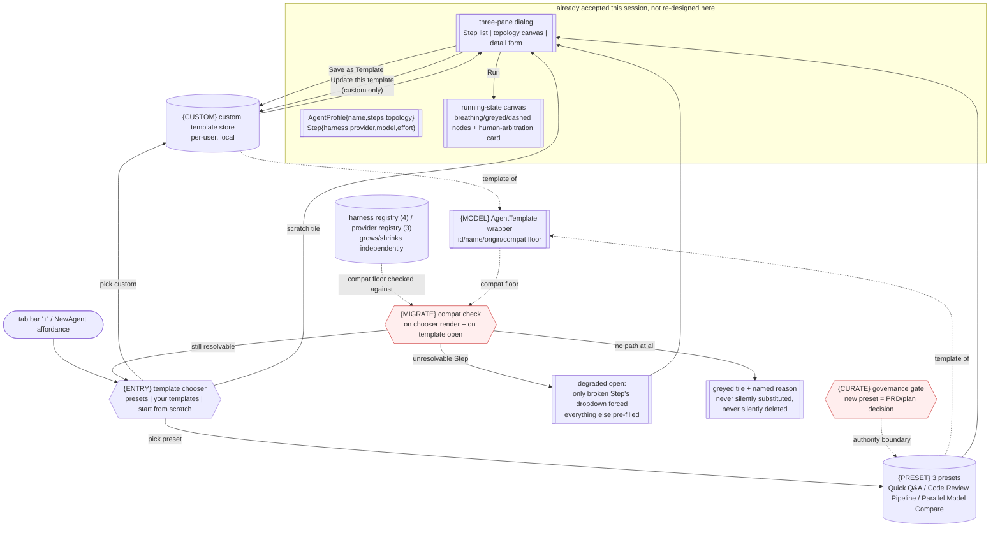

# plan-newagent-config

## Scope decision

Owner framing (2026-09-27, this session): 0.2.x's product direction is now
"minicon 是 agent 的入口" — every NewAgent design choice is judged against
that, not against feature completeness for its own sake. This plan covers
**template support for the NewAgent dialog** only: preset templates, custom
save-as-template, and the library entry-point interaction. It does not cover
the NewAgent dialog's own base three-pane layout or the running-state canvas,
which are already accepted (this session's earlier, un-filed alignment: an
`AgentProfile { name, steps: [Step], topology }` data model, `Step { harness,
provider, model, params:{effort} }`, four-way harness registry, three-way
provider registry, and the two published visual Artifacts — creation-state
`Main.dc.html`, running-state `Running.dc.html`). This plan's job is to
upsert that missing template layer without re-deriving the accepted parts.

Non-goal: any Rust implementation. This is a design-only plan; no
`src/` change, no build/test run. Non-goal: the harness/provider registry's
own extensibility mechanism (owned elsewhere, once it exists in code) — this
plan only records what a template must tolerate when that registry grows.
Non-goal: `{LOOP}`'s bounded decide-pick/decide-continue semantics — those
are `plan-harness-context-engineering.md`'s territory; NewAgent templates
configure *what* runs, not the turn-loop rules of *how* a single harness
invocation decides.

## Left-brain vs. right-brain convergence (method note)

Per this task's instruction, the design below is the *converged* (round 3)
result. The two earlier rounds are preserved as `#risk`/`#decision` markers
inline rather than as separate throwaway sections, so the tree DAG doubles as
the record of what was proposed, what broke it, and why the final shape
holds. The single most valuable reversal from round 2 is `{ENTRY}` below:
round 1 treated the template library as a feature *inside* the NewAgent
dialog (a fourth tab/section); round 2's red-team question — "is the
template library itself more front-and-center than NewAgent, under an
'agent 入口' positioning?" — flipped it to a **pre-dialog gate**: opening a
new tab's agent-creation entry point shows a template chooser first, and
"start from scratch" is one tile among the templates, not the default state
you have to notice a small link to escape from.

## Tree DAG

```text
NewAgent config: user reaches a running multi-step agent fastest by choosing
a known-good starting point, never by staring at an empty three-pane form
├── {MODEL} template data model                                  [_] @host=none
│      invariant: an `AgentTemplate` wraps one `AgentProfile` plus template-
│        only metadata: `{ id, name, description, origin: preset|custom,
│        source_profile_version, created_from (template id or null),
│        compat: { harness_registry_min, provider_registry_min } }`. A
│        template is never a bare `AgentProfile` re-typed — the wrapper is
│        what lets {MIGRATE} and {ENTRY} exist at all.
│      evidence needed: a fixture (design-doc) table showing every current
│        `AgentProfile`/`Step` field mapped 1:1 into an instantiated
│        template, with no template-only field leaking into the runtime
│        profile a running agent tab actually holds
│      safe failure: a template whose `compat` floor exceeds the running
│        binary's actual registry contents is refused at instantiation time
│        with a named-field error ("harness `codex-cli` not registered"),
│        never silently dropped to a default harness
│      dependency: ->PROFILE (accepted `AgentProfile`/`Step` shape, this
│        session, un-filed until this plan lands it — see Scope decision)
│      non-goal: versioning the harness/provider registry itself; {MODEL}
│        only records the floor a template was authored against
│      #decision (round 2->3) round 1 let a template be exactly an
│        `AgentProfile` with a name. Round 2's red-team question — "preset
│        and custom templates: what if fields aren't compatible?" — showed
│        that without a wrapper there is nowhere to record *what a template
│        assumed existed*, so a stale template silently mis-resolves to
│        whatever the string `"codex-cli"` means today instead of failing
│        loudly. The wrapper is the fix.
├── {PRESET} preset template catalog                              [_] @host=none
│      invariant: exactly three presets ship, each independently authored
│        against {MODEL}'s current shape (not against each other), each
│        provable as a real `AgentProfile` a person could have hand-built:
│        1. "Quick Q&A" — single Step, `harness: minicon`,
│           `provider: deepseek`, `effort: low`, `topology: sequential`
│           (trivially, one node). The zero-friction default for "just ask
│           something", closest to today's plain `minicon` chat.
│        2. "Code Review Pipeline" — three Steps in sequence
│           (`harness: minicon` diff-read -> `harness: claude-cli` review ->
│           `harness: minicon` summarize-and-post), `effort: med` throughout,
│           `topology: sequential`. Represents the "multi-step agent doing
│           real work" case the three-pane canvas exists for.
│        3. "Parallel Model Compare" — one fan-out fork into three Steps
│           (same prompt, `provider` set to `deepseek`/`opencode-go`/
│           `openrouter` respectively, same `harness: minicon`), rejoining
│           into a single decide-pick style summary Step, `topology:
│           parallel-then-sequential`. Represents the canvas's "fork" and
│           parallel-court coloring, exercised on day one rather than only
│           in a hand-built demo.
│      evidence needed: each preset renders in the round-trip Mermaid
│        palace (reuse of `render_palace`, see {ENTRY}) without a manual fix-
│        up, and each opens into the three-pane dialog with every field
│        pre-filled and every card/dropdown/slider in a valid, non-empty
│        state (no "select one" placeholder left over)
│      safe failure: a preset that references a harness/provider missing
│        from the running registry is greyed out in the chooser with an
│        inline reason, never silently substituted with the default harness
│      dependency: ->{MODEL}
│      non-goal: more than three presets at launch; a fourth ships only once
│        real usage data or an owner request names it — resist "just add a
│        few more, they're cheap," which is exactly how template sprawl
│        starts (see {CURATE} below)
├── {CUSTOM} save-as-template                                     [_] @host=none
│      invariant: from the fully-configured three-pane dialog (existing
│        accepted UI, not re-designed here), a "Save as Template" action next
│        to the existing run/create action serializes the *current*
│        in-progress `AgentProfile` into a new `AgentTemplate{ origin: custom
│        }`, prompting only for `name` (required) and `description`
│        (optional) — no separate wizard
│      evidence needed: a round-trip test (design-doc level: a table of
│        before/after field values) showing a saved-then-reopened custom
│        template reproduces every Step's harness/provider/model/effort and
│        the topology graph exactly, including a forked/parallel topology
│      safe failure: saving a template with zero Steps (an impossible state
│        in the accepted dialog, since Step 1 always exists) is a non-issue;
│        saving a template with a Step still in a "no model chosen yet"
│        partial state is *refused* with the same inline field-level
│        validation the dialog already uses to block Run, not silently saved
│        broken
│      dependency: ->{MODEL}, ->PROFILE (existing dialog's own field
│        validation, reused not reinvented)
│      non-goal: sharing/exporting a custom template to another user or
│        machine in this pass — local-only, single-account save. Team/shared
│        template libraries are an explicit future non-goal, not silently
│        implied by "custom template" naming.
│      #assumption custom templates are stored the same place/mechanism the
│        product already persists per-user local state (whatever that is —
│        this plan does not pick a storage backend, that is an
│        implementation decision for whoever files this into code)
├── {ENTRY} template library entry point                          [_] @host=none
│      invariant: opening a new "agent" tab (the "+" icon's NewAgent path)
│        shows a **template chooser first**, not the empty three-pane
│        dialog. The chooser is one screen: preset templates and custom
│        templates shown as two visually distinct groups (preset: a fixed
│        badge/icon marking "MiniCon default"; custom: grouped under "Your
│        templates", newest first), plus one always-present "Start from
│        scratch" tile that is visually a template-like card, not a
│        de-emphasized link — clicking any tile (preset, custom, or
│        scratch) opens the same three-pane dialog, pre-filled or empty
│        accordingly
│      evidence needed: the chooser screen is provably reachable in exactly
│        one click from the tab bar's "+"/NewAgent affordance, and every
│        path out of it (preset pick, custom pick, scratch) lands in the
│        identical three-pane dialog component — no second, template-only
│        variant of the dialog exists
│      safe failure: zero custom templates yet -> the "Your templates" group
│        renders as an empty-state hint ("save your first config as a
│        template"), never a hidden/collapsed section a first-time user
│        can't find
│      dependency: ->{PRESET}, ->{CUSTOM} (needs both groups to have
│        something to show, though {CUSTOM} can legitimately start empty)
│      non-goal: any new top-level navigation item outside the existing
│        tab-bar "+" affordance; the chooser is a screen *within* that
│        existing entry point, not a competing one
│      #decision (round 2->3, the reversal) round 1 put "choose a template"
│        as a tab or expandable section *inside* the three-pane dialog
│        (e.g. a fourth left-rail item above the Step list). Round 2's
│        red-team question was direct: "under an 'agent 入口' positioning,
│        should the template library be more front-and-center than
│        NewAgent itself — i.e. should opening a new tab ask 'start from a
│        template?' before showing an empty three-pane dialog, instead of
│        after?" Round 3 agrees: an entry point whose first honest job is
│        "get a working agent running fast" should not force every user
│        through an empty configuration surface before they even see that
│        pre-built options exist. The chooser-first flow is one extra click
│        for the scratch case and saves the common case (pick a preset) from
│        ever seeing the empty dialog at all.
│      #risk this makes NewAgent a *two-screen* flow where round 1 had one.
│        Round 3's mitigation: the chooser is not modal-inside-modal — it is
│        the *first state* of the same dialog surface (same window chrome,
│        immediate cross-fade into the three-pane view on pick), so it reads
│        as "the dialog opened already scoped" rather than "an extra step
│        before the real dialog." This must be validated with an actual
│        interaction prototype before being called closed, not just argued
│        here.
├── {DERIVE} template edit/derive semantics                       [_] @host=none
│      invariant: opening any template (preset or custom) into the
│        three-pane dialog and changing anything before running/saving never
│        mutates the original template silently. Preset templates are
│        strictly read-only as templates (no "Save" overwrite target
│        exists for them at all — only "Save as Template" creating a new
│        custom one, i.e. always a fork). Custom templates get one more
│        choice on open: "Update this template" (overwrite) vs. "Save as
│        new template" (fork) vs. "Just run once, don't save" — surfaced as
│        three buttons, not a hidden default
│      evidence needed: a design-doc table of the three custom-template
│        actions x their effect on {MODEL}'s stored records, confirming
│        "just run once" never writes to the template store at all (the
│        common case for a lightly-tweaked preset run should not silently
│        accumulate junk custom templates)
│      safe failure: attempting to overwrite a preset template is not a
│        button that exists, not a button that exists-then-errors — presets
│        are removed from the action set entirely for that dialog instance
│      dependency: ->{CUSTOM}, ->{MODEL}
│      non-goal: template diffing/version history UI; "Update this
│        template" is a full overwrite, no per-field diff view
├── {MIGRATE} registry-growth compatibility                        [_] @host=none
│      invariant: when the harness or provider registry gains an entry (the
│        registries are explicitly "registered, not hardcoded enum" per this
│        session's accepted design), every existing stored template — preset
│        or custom — must still open without crashing, because {MODEL}'s
│        `compat` floor is a *minimum*, not a pinned exact version; a
│        template referencing only harnesses/providers that still exist
│        keeps working unmodified through any registry growth
│      invariant (the harder case): when the registry *shrinks* or *renames*
│        an entry a stored template referenced, {ENTRY}'s chooser greys that
│        template out with the named-missing-field reason from {MODEL},
│        and {DERIVE} lets the user open it anyway in a degraded mode where
│        only the broken Step's harness/provider dropdown is forced open for
│        re-selection, everything else pre-filled as before
│      evidence needed: a design-doc walk-through of one concrete scenario
│        — "codex-cli" removed from the registry — showing the Quick Q&A
│        preset (doesn't use it) stays green, the Code Review Pipeline
│        preset (does use it, hypothetically) greys out with a named reason,
│        and a custom template referencing it opens in degraded mode rather
│        than refusing outright
│      safe failure: an unresolvable template (no other harness fits and
│        the user has no way to fix the missing Step) is a clearly-labeled
│        broken state in the chooser, never silently deleted from "Your
│        templates" — deletion is only ever a user-initiated action
│      dependency: ->{MODEL} (the `compat` floor is what makes this
│        checkable at all)
│      non-goal: automatic migration/rewriting of a template's Steps when
│        the registry changes; this plan only guarantees *detection and a
│        recoverable path*, never silent auto-substitution of one
│        harness/provider for another — that is exactly the kind of
│        black-box behavior the "让用户随时能插手" running-state design
│        principle already rejects for execution, and template resolution
│        should not reintroduce it at config time
│      #risk (round 2, unresolved into a hard promise) this is the leaf most
│        likely to be under-built relative to its description if this ever
│        becomes code — "degraded mode, forced re-selection" is a real UI
│        state that must exist in the three-pane form's own logic, not just
│        in the chooser. Flagging here so whoever implements {DERIVE} does
│        not treat {MIGRATE} as chooser-only.
└── {CURATE} preset catalog governance                            [_] @host=none
       invariant: the preset list is not user-extensible by definition —
         "preset" means "MiniCon ships it," and a preset only changes
         through this repo's own PRD/plan process (an owning PRD upsert, per
         AGENTS.md's "one owner per fact"), never through in-app curation UI
       evidence needed: none required to close (this is a governance rule,
         not a feature) — closes by existing, and is exercised the first
         time someone proposes preset #4
       safe failure: n/a (process rule)
       dependency: none
       non-goal: an in-app "suggest this as a preset" or admin approval
         flow; that is over-building for a three-preset catalog
       #decision (round 2->3) round 1 didn't address catalog growth at all.
         Round 2 asked "will the chooser get cluttered as presets grow?"
         The answer chosen here is a hard cap by policy, not by UI: adding a
         fourth preset requires a PRD/plan decision (this document or its
         successor), the same bar as any other product-boundary change —
         deliberately friction-heavy, because the chooser's whole value is
         that "preset" reliably means "small, curated, load-bearing," and
         that guarantee dies the moment presets accumulate the way ad hoc
         custom templates are allowed to.
```

## Memory palace



`MIGRATE`'s two outcomes (`DEGRADED` vs. `GREYOUT`) are the kill-path /
decision-gate this tree alone can't show well: the same compat check feeds
two different UI states depending on whether *any* Step is salvageable, and
both states are terminal for that render pass — the user must act (fix the
Step, or delete/ignore the template) before the same template resolves
differently. `CURATE` is drawn as its own authority boundary because it is
the one control in this design with no runtime evidence at all — it only
exists in the PRD/plan process, guarding `PRESETS` from the kind of silent
growth `{CUSTOM}` is deliberately allowed to have.

## Round-by-round record (why the shape is what it is)

**Round 1 (left brain, initial proposal).** Extend `AgentProfile` with a
`is_template: bool` flag and a `template_name`; add a fourth item in the
three-pane dialog's left rail ("Templates") listing presets and saved
customs inline with the Step list; three presets as scoped above; "Save as
Template" as a menu item under the existing Save button.

**Round 2 (right brain, red-team findings).**
1. A bare `is_template` flag on `AgentProfile` has nowhere to record what a
   template assumed about the registry at authoring time — first
   compatibility break is silent (fixed by `{MODEL}`'s wrapper).
2. Templates-as-a-left-rail-item makes an already-three-pane dialog a
   four-pane one in spirit; worse, it buries the fastest path to a working
   agent (pick a preset) one click deeper than the slowest path (build from
   scratch, which is what you see by default) — backwards for an "agent
   入口" positioning (fixed by `{ENTRY}`'s chooser-first flip).
3. No answer for registry growth/shrinkage — what happens to a stored
   template when `codex-cli` stops existing, or a fifth harness appears
   (fixed by `{MIGRATE}`).
4. No distinction between "tweak a preset and run once" vs. "tweak and keep
   it" — round 1's inline "Save as Template" menu item conflates them, risking
   either constant unwanted template accumulation or accidental preset-like
   overwrite confusion (fixed by `{DERIVE}`'s three explicit actions).
5. Nothing stops preset sprawl once "just add a template" looks cheap
   (fixed by `{CURATE}`'s process gate).

**Round 3 (convergence).** All five findings map onto new or corrected
leaves above; no round-1 leaf survives unchanged except the three preset
*contents* themselves (Quick Q&A / Code Review Pipeline / Parallel Model
Compare), which round 2 did not challenge on substance — only on where they
live and how they're reached.

## Non-goals across the whole plan

- No Rust implementation, no `src/` change, no build/test run (explicit task
  constraint).
- No shared/team template library, no export/import of a custom template to
  another machine or account.
- No template versioning UI (diff view, rollback) beyond `{DERIVE}`'s
  overwrite-vs-fork choice.
- No automatic harness/provider substitution on registry change — detection
  and a recoverable manual path only (`{MIGRATE}`).
- No admin/approval workflow for proposing new presets — the PRD/plan
  process itself is the gate (`{CURATE}`).
- Not a redesign of the accepted three-pane dialog or running-state canvas;
  this plan only adds the layer that decides *what pre-fills* that dialog.
