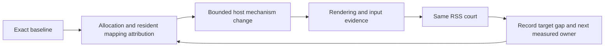

# Continue reducing MiniCon host RSS

```text
Idle one-tab host RSS reaches 10 MiB without sacrificing terminal behavior
├── Evidence owner: exact release/debug artifact, public RSS court, native diagnostics
│   ├── invariant: RSS remains the criterion; footprint is explanatory evidence
│   ├── failure: unmeasured targets remain BLOCKED / unqualified
│   └── non-goal: raise 384 MiB or call a macOS measurement six-cell evidence
├── Shared host owner: identify frame storage and OS initialization costs
│   ├── dependency: allocation stacks and controlled comparison before replacement
│   ├── invariant: retain displayed pixels, input, IME, resize and FFI containment
│   └── failure: reject an optimization when behavior or evidence regresses
└── Integration owner: pin reviewed mechanism, rerun RSS and owning black boxes
    └── non-goal: shrinking the PTY ring or changing the product memory metric
```



The previous font repair is complete; the product RSS target is not. macOS
currently uses `portable-pixel-window` (winit + softbuffer); the
`native-pixel-window` dependency is Windows-only. Any earlier statement that
this macOS host already used a native pixel adapter was incorrect.

## Accepted changes and current target

- Shared owned anonymous frame mappings:
  `8d8de88c9ab62709327a6358609e9a09e8c363fd`,
  [draft PR #117](https://github.com/partnernetsoftware/agenterm/pull/117).
  Based on shared main with the previous font fix integrated as `d384d2b5`;
  PR #116 was closed after that integration. The experimental intermediate
  frame commit `d1d29578` is superseded by the new pin.
- MiniCon no longer owns `RetainedXrgbFrame`. Transient host frames are fully
  rasterized directly, retained host frames retain their validity/partial
  contract. Screenshot/discard ordering stays intact. Empty redraws do not
  schedule an unconditional redraw loop. `host_copy_frames` stays in public
  receipts for compatibility and now stays zero.
- `assets/macos-info.plist` is embedded in the native Mach-O by the macOS
  target branch of `build.rs`; no app-bundle directory or runtime file is
  required. `UIDesignRequiresCompatibility` preserves standard window controls
  and reduces macOS 26 UI initialization. Apple documents it as temporary and
  ignored for SDK 27+ builds. It cannot be the long-term memory solution.

The product goal remains **10 MiB RSS**. It is **not achieved**. No budget was
raised, no PTY ring was reduced, and no GUI/input capability was disabled.
Windows and Linux have no new runtime claim from these macOS observations.

## Controlled measurements

macOS 26.5.1 aarch64, native release profile unless noted. All frame variants
keep the same 960×600 logical Retina window and 80×24 court arguments.

| Change | Controlled result |
|---|---|
| Original font-fixed frame allocator → mapped frames | 3 alternating runs: median 101.17 → 92.47 MiB |
| Remove duplicate MiniCon canvas | Independent probe 92.92 → 84.17 MiB; net −8.75 MiB |
| macOS 26 compatibility key | 3 alternating settled runs: median 84.05 → 78.67 MiB |
| Final source, named RSS court | early idle 86.89 MiB; load 85.08; extra tab 1.41; four-cycle growth 2.33 |

An earlier integrated court observed 77.75 MiB early idle. Repeated settled
samples are around 79 MiB. Short startup samples vary by roughly one frame's
size; neither favorable sampling nor footprint can close the RSS target.
Final idle vmmap has no `MALLOC_LARGE`; footprint 18.1 MiB is explanatory only.

Final release SHA-256:
`7d08627d494af396885843ec016d554c4b8d9b520c80bcf0757e7fa54e89c527`.
Development artifact before the MiniCon integration commit, not a release
promotion or six-cell receipt.

## Verification

- Shared `MappedPixels` size/zeroing and CoreGraphics retained-provider bytes:
  2 tests PASS. The standalone vendored crate tests run with
  `CARGO_TARGET_DIR=target/font-platform-fix/target cargo test --manifest-path target/font-platform-fix/third_party/softbuffer/Cargo.toml --lib mapped_pixel_tests`.
  Library Clippy and x86_64 macOS compile also PASS.
- MiniCon binary unit tests: 131 PASS; workspace/all-target Clippy PASS.
- `MINICON_TEST_BINARY=target/release/minicon MINICON_RSS_DIAGNOSTICS_DIR=target/memory-final cargo test --test minicon_control -- --nocapture --test-threads=1`:
  GUI multitab and named RSS courts PASS. Log: `target/memory-final-control.log`.
- `MINICON_TEST_BINARY=target/release/minicon cargo test --test minicon_throughput sustained_long_output_keeps_control_and_sibling_responsive -- --exact --ignored --nocapture`:
  PASS, 33,439,744 bytes at 21,178,307 bytes/s, zero host copies and present
  failures. Log: `target/memory-final-throughput.log`.
- Native diagnostics: `target/memory-final/idle-vmmap.txt`, `idle-heap.txt`.
  Controlled comparisons: `target/memory-probes/ab.json`, `compat-ab.json`.

## Rejected experiments

Do not add these without new evidence:

- Device RGB increased idle RSS to 127.66 MiB; sRGB to 119.09 MiB. Preserve the
  existing display color space. Matching NSWindow color space explicitly did
  not improve the mapped-frame result.
- Run-length compressed pixel provider did not reduce downstream residency
  (102.47 MiB); no compression code/dependency was retained.
- Lazy winit input-context lookup/caret invalidation preserved the proposed
  native-key ordering in source but produced no measurable RSS benefit:
  baseline 78.45–79.02 versus lazy 78.64–78.89 MiB across three alternating runs.
  It was removed before final validation; `Cargo.lock` uses registry winit.
  Research-only diff: `research/minicon-memory/winit-lazy.patch`.
- Explicit CATransaction flush gave a 78.03 MiB single startup sample, within
  baseline variation. No repeatable gain established, so it was removed.

- Default-menu separator removal: the isolated Hello result did not transfer
  to MiniCon. Three alternating product samples had identical 78.75 MiB
  medians with and without separators. Prototype rejected and registry winit
  restored; commands/shortcuts were not removed from production.
- Autorelease-pool draining around native initialization changes only about
  0.03 MiB. Application class initialization is around 11 MiB; the shared
  instance reaches about 26.6 MiB. Component probes identify screen discovery,
  appearance and font setup as measurable triggers, with overlap still
  unresolved. Details and compact numeric receipts are in the two reports.

## Two research owners

- [Native GUI baseline](research-hello-memory.md): staged libc/Cocoa/AppKit,
  titlebar, text, menu and compatibility comparisons, with source retained in
  `research/hello-memory/` and generated diagnostics in `target/hello-memory-track/`.
- [MiniCon increment](research-minicon-memory.md): exact-artifact tab/content
  changes and full allocation stacks, reproducible probe in
  `research/minicon-memory/`.

The roughly 50 MiB label-only Hello omits editable-control/menu initialization:
editable control plus menu reaches 87.33 MiB on the same host. This explains
why assigning the whole remaining difference to terminal state was incorrect;
it does not make the 10 MiB target optional. Further progress must reduce native
UI initialization while preserving text input, first CJK keystrokes, menu
shortcuts and standard window controls, or replace that foundation with a
measured equivalent. No tested narrow change currently reaches 10 MiB.
