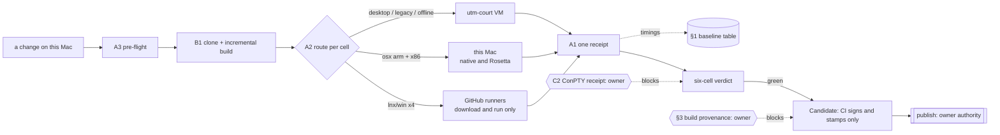

# v0.1.23 — fold the cycle, then pay the debt

Owner's brief (2026-09-22/23): trial and error only pays when a round is short,
so compress every stage. The CI release chain shrinks to signing and stamping;
testing runs locally, or on GitHub runners that only *run* what this Mac built.
Do not release for the sake of releasing: 0.1.23 ships when the debt below has
become something a user can notice.

## 0. Plan tree

```text
[v0.1.23] a round costs seconds, and the old debt gets paid
├── A. One round, one command — the release's spine
│   ├── [ ] A1 `scripts/round.sh <cells>`: build → route → run → one receipt
│   │        invariant: one receipt per round, naming every cell and its host
│   │        evidence: the receipt; failure: BLOCKED cell, never a silent skip
│   ├── [ ] A2 routing table (§2) as data, one backend per cell
│   ├── [ ] A3 pre-flight (15 s): free disk, Rosetta probe, court nonce
│   │        why: a broken Rosetta cost 20 min on 2026-09-22
│   └── [ ] A4 per-stage timings in every receipt, so §1 updates itself
├── B. Incremental local qualification            (depends on A1)
│   ├── [ ] B1 seed a new fingerprint dir by APFS clone, then build incrementally
│   │        caveat: host-run integration tests bake CARGO_BIN_EXE paths
│   ├── [ ] B2 select cells from what changed; the receipt names what was skipped
│   ├── [ ] B3 a stage runs every suite; no stop at the first failure
│   │        why: minicon_blackbox has never run in the Windows court
│   └── [ ] B4 push only binaries whose digest changed (utm-court ledger)
├── C. Windows court gaps, found by 0.1.22's first full run   (needs A1)
│   ├── [x] C1 throughput: ConPTY forwards viewport changes, not bytes (§4)
│   ├── [ ] C2 Windows throughput receipt: ordered marker + sustained rate
│   ├── [x] C3 unspawnable `-e`: platform-shaped, test now asserts per platform
│   ├── [x] C4 a tab that cannot start: same, plus the stub must really vanish
│   └── [ ] C5 **product gap, not a test bug**: with ConPTY the host keeps no
│             scrollback, so the wheel delivers 0 notches (§6)
├── D. Carried product debt — what a user would actually notice
│   ├── [ ] D1 `capture-pane --scrollback N`: decide semantics, then implement
│   │        (cross-screen stitching, viewport restore; from 0.1.18 P1)
│   ├── [ ] D2 black-box test: paste and Enter arrive in two `read()`s (0.1.18)
│   ├── [ ] D3 box-drawing glyphs from cell geometry: Consolas 1 px gap at 12 px
│   ├── [ ] D4 idle one-tab host RSS toward 10 MiB (paused since 2026-09-06)
│   └── [ ] D5 the interactive court presents no frames, so real pointer events
│             and pixel comparison stay out of reach (0.1.18 P2)
└── E. Shared seam with AgenTerm — plan-cross-project-reuse.md
    ├── [x] E1 scrollbar geometry: one implementation, pinned by parity tests
    ├── [x] E2 consumer feature matrix gated on both sides
    ├── [ ] E3 click streak D1–D4: four behaviour divergences      (OWNERS)
    └── [ ] E4 composer rules: survey before anything moves
```

`[x]` landed in 0.1.22 and stays for the trail. `(OWNER)` waits on a decision,
not on work. Non-goals for 0.1.23: no new product surface, no server, no
rebuild-to-promote, no change to what a Candidate means.

## 0b. Memory palace



## 1. Baseline (measured 2026-09-22/23)

| stage | before | now | lever |
| --- | --- | --- | --- |
| Windows court `test` stage | 227 s | 72 s | HTTP fetch instead of QGA copy (utm-court `b87196c`) |
| transfer in, 4 MB exe | 19 s | 2 s | same |
| rebuild for the court after a one-line change | full build | 4 s | APFS clone + incremental `cargo xwin` |
| court start to desktop ready | ~150 s, flaky | ~100 s cold, **5–9 s** from an in-memory pause | `fb1e3a8`, `cd56700`, `17c08c1`, `77e79ed` |
| one Windows diagnostic round | not achievable | **20–26 s** | all of the above |
| five non-macOS cells in parallel on GitHub | never tried | **13 s** from dispatch | `local-artifact-probe.yml` |
| local six-cell, full | ~20 min | unchanged | B1, B2 |
| CI release chain | ~45 min per round | unchanged | §3 |

## 2. Where each cell runs (measured 2026-09-23)

| cell | host | measured |
| --- | --- | --- |
| lnx-x86_64, lnx-aarch64 | GitHub `ubuntu-24.04`, `ubuntu-24.04-arm` | 5 s per job (queue 4–5 s, download 2 s) |
| win-x86_64, win-aarch64 | GitHub `windows-2025`, `windows-11-arm` | 9–10 s per job (download 5 s) |
| osx-aarch64 | this Mac, natively | under 1 s (GitHub `macos-15`: 3 s) |
| osx-x86_64 | this Mac, under Rosetta | 2 s. GitHub `macos-13` was still queued after 7 minutes; keep it out of the loop |
| a legacy OS, offline work, many iterations, the Defender scan | utm-court (local fallback) | 20–26 s per round |

**A hosted Windows runner has a real desktop** (measured 2026-09-23:
`runneradmin`, session 2, Active, virtual screen 1024x768), and MiniCon's GUI
suites run there: `minicon_control` 9/9 in 8.5 s, `minicon_blackbox` 29
passed / 1 failed (the pre-existing zoom blank) / 1 ignored in 164 s. The
local court is the fallback, not the only way to run a GUI journey, so a
routine round no longer heats the Mac.

Two GitHub facts the bundle transport has to respect: a **draft** release is
not reachable from a job ("release not found"), so the bundle goes through a
tagged prerelease that is deleted afterwards; and the tags endpoint can
answer with an empty asset list while the release's own assets endpoint has
the file, so a job fetches by release id.

Cross-compile here, upload the test executables to a **tagged prerelease** (a
draft is not reachable by tag from a job: "release not found"), let the runners
download and run them, then delete the prerelease. No checkout, no toolchain,
no build in CI. Public repositories pay nothing for standard runners. Probe:
`.github/workflows/local-artifact-probe.yml`.

## 3. CI keeps building the release; it just stops being the debugger

Decided 2026-09-23, after the owner asked the obvious question: the release
chain already builds from source in CI and signs there, which is exactly what
it should do. That build is the artifacts' provenance — if CI signed bytes
built on this Mac instead, nothing would tie them to the commit, and the whole
question of "how do locally built bytes earn trust" only exists because of a
change that buys nothing: a release runs the chain once, not once per
iteration.

So the release chain is unchanged. What changes is habit: no round of
debugging goes through it. Daily verification runs on this Mac and on GitHub
runners that only execute what was built here (§2), in seconds; CI runs once,
at release time.

## 4. What C1 found

The payload reaches the screen, and the drained count does not scale with it:
1 MiB gave 6,628 bytes, 32 MiB gave 7,014. ConPTY renders the console itself
and forwards only viewport changes, so on Windows a PTY byte count can never
cover what a program wrote. The assertion's premise holds for Unix PTYs only.
**Decided (C2):** Unix keeps the byte-count assertion, because a Unix PTY
forwards the bytes. Windows asserts instead that `THROUGHPUT_DONE_32M` appears
only after the payload (ordering proves the data went through) and that the
sustained rate holds. That is not a relaxed gate: both still fail on a real
regression, and the byte count was unprovable on ConPTY by construction.

## 6. C5: no scrollback under ConPTY (found 2026-09-23)

`gui_control_surface_isolated_multitab_black_box` sends 1,200 lines into a
Windows tab, waits for the last one to appear, then scrolls one notch. The
receipt is `{"route":"scrollback","delivered_notches":0,"changed":false}`:
MiniCon's own scrollback is empty although every line arrived. Same root as
§4 -- ConPTY renders the console itself and forwards viewport changes, so the
history lives in the Windows console host and never reaches MiniCon's parser.

For a user on Windows that means the wheel cannot scroll back through plain
shell output. The test stays as it is and keeps failing until the product
answers, because the assertion is right: a terminal must be able to scroll
its own history. Options to measure, in order: whether the classic console
path (`--feature no-conpty`) does keep scrollback; whether ConPTY can be asked
for its history; whether MiniCon should accumulate rows as they scroll out of
the viewport. This is the first C item that is a product change rather than a
platform-shaped expectation.

## 5. Rules that stay

- Cross-compile here, run it in a real environment, only then cut a Candidate.
- A missing or unready environment is BLOCKED, never a skipped pass.
- Transport bounds may be tuned; product assertions never are.
- A warm or paused court belongs to one exclusive sequence; release it after.
- Every speed change is measured before and after, N runs, same machine.
