# MiniCon v0.1.5 delivery plan

Status: **planned — no version bump, Candidate, tag or Release yet**  
Outcome: publish the existing native six-cell set plus one **unsigned**
`minicon.com`, all produced from one exact source identity and promoted without
rebuilding. v0.1.4 remains immutable.

## 1. Product ruling

The user problem is distribution friction: a user or another agent should be
able to download one `minicon.com` and exercise MiniCon across the supported
OS/ISA cells without first choosing a platform archive. Native archives remain
the transparent, conventional fallback and the authoritative per-cell payloads.

The v0.1.5 policy target is:

```json
{
  "version": "0.1.5",
  "assets": {
    "native_archives": true,
    "minicon_com": true
  },
  "signing": {
    "mode": "off"
  }
}
```

This block states intent, not the current contents of `release-policy.json`.
The implementation increment changes that machine policy together with the
version bump. SignPath approval does not mutate an in-flight Candidate: trusted
signing is a later explicit version/policy decision with its own final-byte
qualification.

### Governing invariants

- v0.1.4's tag, assets, manifests and receipts are never edited or backfilled.
- One clean build emits six native payloads and one APE; test runners compile
  nothing.
- `minicon.com` dispatches the same six payload identities that form the native
  archives; it is not a second implementation.
- Candidate packages and seals exact bytes. Promotion only downloads, verifies
  and republishes those bytes.
- Unsigned means exactly `signing.mode=off`; documentation and receipts must not
  imply a trusted publisher, timestamp or reduced warning rate.
- Every Windows-facing final executable is independently reputation-qualified:
  `minicon.com`, native Windows x86_64, and native Windows arm64.
- A failed, missing or stale court blocks v0.1.5. v0.1.4 remains the safe public
  fallback.

## 2. Markdown-tree DAG

Bracketed IDs are stable capability/evidence nodes. `↳ [ID]` is a dependency
edge to an already-defined node, so the tree remains a DAG rather than
duplicating ownership.

```text
[V15] v0.1.5 — unsigned APE + native six-cell delivery
├── [S0] scope and source identity
│   ├── version = 0.1.5 in Cargo, policy, payloads and runtime output
│   ├── release-policy: native_archives=true · minicon_com=true · signing=off
│   ├── clean current-main exact SHA; source_dirty=false
│   └── v0.1.4 is immutable and remains the rollback release
├── [B1] one build owner
│   ├── six Rust payloads: {win,lnx,osx} × {x86_64,aarch64}
│   ├── one Cosmopolitan loader containing exactly those six payload identities
│   ├── pinned Rust/Zig/xwin/cosmocc tools + source/build receipt
│   └── size report: every raw payload, compressed cell, loader and final APE
├── [L2] loader lifecycle and integrity
│   ├── unique mode-0700 extraction directory + owned marker
│   ├── atomic payload publication; concurrent invocation has no collision
│   ├── normal, nonzero, signalled and interrupted-child exit propagation
│   ├── safe stale reaper; no symlink/foreign/active-process deletion
│   └── installer lock, verified tool archives and failure-atomic rollback
├── [R3] six execute-only APE courts
│   ├── win × x86_64 / arm64
│   ├── lnx × x86_64 / arm64
│   ├── osx × x86_64 / arm64
│   ├── version + status + unknown-argument exit contract
│   └── public GUI/control journey + clean close + zero extraction residue
├── [N4] native release parity
│   ├── ↳ [B1] same six payload identities
│   ├── 5 archives: win/lnx × {x86_64,arm64} + macOS Universal
│   ├── Linux runtime-only X11 courts prove no `-dev` package on both ISAs
│   └── native archive unpack/hash/execute evidence for all six cells
├── [C5] exact Candidate, no compilation
│   ├── ↳ [S0] policy and exact source
│   ├── ↳ [B1] build receipt and payload identities
│   ├── ↳ [L2] loader safety receipts
│   ├── ↳ [R3] six APE runtime receipts
│   ├── ↳ [N4] native package receipts
│   ├── 6 distributables: 5 native archives + raw minicon.com
│   ├── 6 SHA-256 sidecars; manifest binds size and digest of every asset
│   └── fail if final minicon.com exceeds stamped 9 MiB ceiling
├── [D6] exact-byte reputation court
│   ├── ↳ [C5] only sealed Candidate bytes enter the court
│   ├── active Defender scans minicon.com + 2 native Windows executables
│   ├── pre/post SHA equality + engine/signature/time metadata
│   └── any detection → no Promotion; official false-positive route, no evasion
├── [P7] no-rebuild Promotion
│   ├── ↳ [C5] exact successful Candidate run
│   ├── ↳ [D6] exact successful reputation qualification
│   ├── explicit human authority: version 0.1.5 + publish-v0.1.5
│   ├── create immutable tag v0.1.5 and publish only sealed assets/receipts
│   └── public re-download, sidecar verification and native/APE execution
├── [E8] observable success evidence
│   ├── Release is public, neither draft nor pre-release
│   ├── tag points to Candidate SHA; 6 assets + 6 sidecars are present
│   ├── minicon.com --version reports exactly minicon 0.1.5 on six cells
│   ├── all public archive sidecars verify; macOS file has both slices
│   └── redacted ledger records run IDs, SHA, sizes and court verdicts
└── [-] explicit non-goals
    ├── no trusted-signature claim, SignPath simulation or self-signed substitute
    ├── no qjswasm/TinyVM migration, feature expansion or UI redesign
    ├── no modification of v0.1.4 and no rebuild during Promotion
    ├── no antivirus exclusions, byte randomization, packer or heuristic evasion
    └── no weakening native archives because the APE exists
```

## 3. Gate ledger

| Gate | Owner | Pass evidence | Safe failure |
|---|---|---|---|
| G0 policy/version | `release-policy.json`, Cargo identity | all identities say 0.1.5; unsigned APE selected explicitly | stop before build |
| G1 one build | `minicon-com.yml` build job | clean exact SHA; six payload digests + APE digest + pinned tools | discard build run |
| G2 lifecycle | loader/installer regression suites | reaper, concurrent extraction, exit and rollback courts green | retain v0.1.4; repair loader |
| G3 APE six-grid | execute-only native runners | exactly six unique same-digest GUI/control receipts | Candidate forbidden |
| G4 native parity | package/runtime courts | five archives cover six cells; Linux minimal-X11 proof | Candidate forbidden |
| G5 size/manifest | Candidate sealer | raw APE ≤ 9 MiB; six assets + sidecars bound exactly | do not raise ceiling in Candidate |
| G6 reputation | disposable active-Defender court | three final Windows-facing byte objects clean and unchanged | official vendor review; no exclusions |
| G7 Promotion | release workflow + human | exact run IDs and `publish-v0.1.5`; no rebuild | no tag/Release mutation |
| G8 public audit | post-publish jobs | download, hash and execute public bytes | mark release incident; never overwrite |

### Required implementation deltas before G0

1. Change Candidate/reputation schema from the current mutually exclusive
   reputation set to an explicit ordered set containing `minicon.com`,
   `windows-x86_64`, and `windows-arm64` when both asset families ship.
2. Require a `.sha256` sidecar for raw `minicon.com`, just like every archive.
3. Make Candidate and Promotion assert exactly six distributables and six
   sidecars under this policy; an extra or missing asset fails closed.
4. Keep the SignPath workflow dormant. A missing provider variable must never
   downgrade `required` to `off`, and an approval arriving mid-run must not
   alter this unsigned Candidate.
5. Update human-facing release notes to label `minicon.com` experimental and
   unsigned, while keeping native archives the conventional fallback.

## 4. Mermaid flowchart memory palace

The rooms mirror the tree IDs. Read left to right: policy enters the Forge,
crosses two independent Courts, is sealed in the Vault, passes Reputation, and
only human authority opens the Release door. Failure edges return safely to
v0.1.4.

```mermaid
flowchart LR
    V14["Stable room · v0.1.4<br/>immutable native six-cell"]
    S0["Policy desk [S0]<br/>v0.1.5 · native + APE<br/>unsigned explicitly"]

    subgraph F["Forge — build once"]
        B1["[B1] six native payloads<br/>+ one minicon.com"]
        L2["[L2] loader lifecycle<br/>reaper · atomic extract · rollback"]
    end

    subgraph X["Execute-only courts"]
        R3["[R3] APE six-grid<br/>GUI + control + cleanup"]
        N4["[N4] native parity<br/>5 archives · 6 cells<br/>Linux minimal X11"]
    end

    subgraph Q["Candidate vault"]
        C5["[C5] seal exact bytes<br/>6 assets + 6 sidecars<br/>APE ≤ 9 MiB"]
        ID{"same source · payloads<br/>policy · receipts?"}
    end

    subgraph A["Reputation court"]
        D6["[D6] active Defender<br/>APE + Win x86 + Win arm"]
        CLEAN{"all 3 clean<br/>pre/post SHA equal?"}
    end

    subgraph P["Human release boundary"]
        H["explicit authority<br/>0.1.5 + publish-v0.1.5"]
        P7["[P7] no-rebuild Promotion"]
        E8["[E8] public audit<br/>download · hash · execute"]
        V15["Public v0.1.5<br/>native six-cell + unsigned APE"]
    end

    SP["Later SignPath approval"]
    SV["Later signed version<br/>new policy + final-byte courts"]
    FIX["repair failed owner<br/>no tag · keep v0.1.4"]

    V14 --> S0 --> B1
    B1 --> L2
    B1 --> R3 & N4
    L2 & R3 & N4 --> C5 --> ID
    ID -->|yes| D6 --> CLEAN
    ID -->|no| FIX --> V14
    CLEAN -->|yes| H --> P7 --> E8 --> V15
    CLEAN -->|no| FIX
    V15 -. future baseline .-> SV
    SP --> SV
```



## 5. Sequencing and integration boundaries

1. **Policy/schema increment:** update policy parsing, Candidate manifest,
   reputation set and their self-tests together. This is the shared prerequisite.
2. **Asset increment:** add the raw APE sidecar and exact asset-count assertions;
   keep archive packaging unchanged.
3. **Court increment:** extend Defender transport/qualifier to three objects and
   ensure six APE GUI/control receipts are required, not status-only evidence.
4. **Documentation increment:** update PRD frontier and release notes only after
   the executable gates describe real behavior.
5. **Serial release path:** clean exact source → G1–G5 Candidate → G6 reputation
   → report immutable identities → wait for explicit G7 human authority →
   Promotion → G8 public audit.

Shared hot files (`release-policy.json`, Candidate/reputation scripts and
release workflows) are edited serially. Runtime-court work may proceed in
parallel only when it owns disjoint files and uses separate artifact paths.

## 6. Completion checklist

- [x] G0: v0.1.5 policy/version committed on a clean exact SHA
- [x] G1: one build emits the six payloads and unsigned APE
- [x] G2: lifecycle/tool installer regressions green
- [x] G3: six APE GUI/control execution receipts green
- [x] G4: native six-cell and both Linux runtime-only X11 courts green
- [x] G5: Candidate seals six distributables + six sidecars under 9 MiB APE cap
- [x] G6: exact three-object Defender qualification green
- [x] G7: explicit human `publish-v0.1.5` authority received and promoted
- [x] G8: public re-download/hash/execute audit green; PRD ledger archived

Released from exact source `1a0e3dc4e4628dc76e9f1c55432043e209e39445`.
Evidence ledger: `prd/archive/v0.1.5-release-history.md`.
