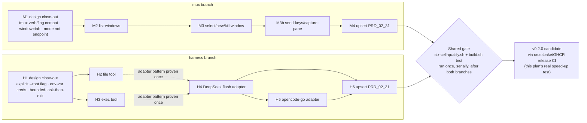

# Plan v0.2.0 — mux + harness

Owning PRD module: `prd/PRD_02_31_v0_2_horizon.md` (scope, non-goals, open
design questions — read it first; this file only sequences delivery and
resolves those questions into implementation decisions). Product boundary and
invariants: `prd/PRD_02_23_minicon.md`. This is the first plan doc to draw on
this repo's crossbake/GHCR pre-baked toolchain
(`scripts/crossbake.Dockerfile`, `.github/workflows/linux-crossbake-experiment.yml`)
as its release-CI path, once that experiment's six-cell claim is confirmed —
see "Delivery note" at the end.

## Tree DAG

```text
v0.2.0 — mux + harness (owner decision 2026-09-24, narrows AGENTS.md boundary)
├── M mux: tmux-CLI-compatible tab control {m}
│   ├── M1 design close-out ->m [x] (2026-09-25, PRD_02_31 "mux -- detail")
│   │   ├── verb surface: tmux verb/flag vocabulary, not MiniCon-native
│   │   │     names -- `list-windows`, `select-window`, `new-window`,
│   │   │     `kill-window`, `send-keys`, `capture-pane`
│   │   │     @method=tmux-verb-compat #decision -- owner-directed: the
│   │   │     concrete need is agent interop across minicon/tmux backends
│   │   ├── model mapping: the running instance IS the one session; tmux
│   │   │     window = MiniCon tab (`@ID` canonical, integer index accepted
│   │   │     as a tmux-numbering convenience); tmux pane = that tab's own
│   │   │     terminal area -- pane 0 always exists and IS the tab's PTY
│   │   │     view; `split-window` (a second pane per window) is not
│   │   │     implemented @method=window-is-tab #decision
│   │   └── surface shape: a mode of the existing --control CLI, not a new
│   │         binary subcommand or endpoint @method=mode-not-new-endpoint
│   │         #decision ->prd/PRD_02_26_con_control_cli.md
│   ├── M2 tab listing (`list-windows`) ->m1 [~]
│   │   ├── invariant: enumerates only tabs of the calling process's own
│   │   │     MiniCon instance; no cross-instance discovery
│   │   ├── invariant: `-F <format>` supports only the substitution
│   │   │     variables named in PRD_02_31's mapping table -- an
│   │   │     unrecognized substitution is a bounded error, never silently
│   │   │     rendered blank (tmux itself renders unknown ones blank; MiniCon
│   │   │     deliberately does not, to avoid a script silently getting
│   │   │     empty fields it thinks are real) #decision
│   │   ├── implemented: `src/mux.rs` `run_mux`/`run_list_windows` -- a thin
│   │   │     translation of `mux list-windows [-F FORMAT]` into `control::
│   │   │     run_cli`'s existing `list-tabs` wire call, parsed back with
│   │   │     `serde_json` (moved to a real, non-dev dependency for this) and
│   │   │     rendered through a `#{var}` substitution engine restricted to
│   │   │     `window_id`/`window_index`/`window_name`/`window_active`
│   │   ├── evidence: unit tests in `src/mux.rs` (`parse_tabs_reads_id_title_
│   │   │     active`, `render_format_default_marks_active_window`,
│   │   │     `unknown_substitution_is_bounded_error`) prove the translation
│   │   │     and format engine against a fixed `list-tabs` JSON fixture
│   │   ├── BLOCKED (evidence gap, not a design gap): the invariant's own
│   │   │     black-box evidence -- a live MiniCon instance's real `list-tabs`
│   │   │     response round-tripped through `mux list-windows` -- has not
│   │   │     run, because this development environment has no window/display
│   │   │     server and every existing `--control` black-box test
│   │   │     (`tests/minicon_blackbox.rs`, `minicon_control.rs`) fails the
│   │   │     same way here (`control endpoint did not become ready`) with no
│   │   │     mux-specific code involved -- confirmed by running an existing,
│   │   │     unmodified blackbox test before adding any mux code. Run the
│   │   │     black-box suite in an environment with a real display (or a
│   │   │     future headless-GUI mode) before moving this line to `[x]`
│   │   ├── safe failure: zero tabs returns an empty list, not an error
│   │   └── non-goal: [-] multi-pane enumeration (`split-window` not
│   │         implemented; each tab always lists exactly one pane, index 0)
│   ├── M3 window select/create/destroy (`select-window`, `new-window`,
│   │   │     `kill-window`) ->m1 [~]
│   │   ├── invariant: an invalid `@ID`/index, a nonzero pane, or a
│   │   │     session-name mismatch is a bounded CLI error (exit code +
│   │   │     message naming which tmux assumption is unsupported), never a
│   │   │     crash or a silently created tab
│   │   ├── implemented: `src/mux.rs` `run_select_window`/`run_new_window`/
│   │   │     `run_kill_window` over `select-tab`/`new-tab`/`close-tab`, with
│   │   │     `resolve_target` parsing `[session:]window[.pane]`; session is
│   │   │     `minicon` or `0`, pane must be 0 or absent, window is an `@ID`
│   │   │     (passed through so the server refuses a stale handle) or a tmux
│   │   │     index (resolved via `list-tabs`). `kill-window` with no `-t`
│   │   │     resolves the active tab, keeping tmux's default working
│   │   ├── evidence: unit tests in `src/mux.rs` --
│   │   │     `a_nonzero_pane_names_the_missing_split_window`,
│   │   │     `a_foreign_session_name_is_refused_not_ignored`,
│   │   │     `a_malformed_at_id_is_refused_before_any_connect`,
│   │   │     `a_window_that_is_neither_handle_nor_index_is_refused`,
│   │   │     `an_at_id_target_resolves_without_reaching_the_endpoint`,
│   │   │     `new_window_refuses_to_silently_drop_a_window_name`,
│   │   │     `an_unsupported_tmux_flag_names_the_implemented_subset`,
│   │   │     `select_window_requires_a_target`. Each target case runs against
│   │   │     a bogus endpoint on purpose: it proves the refusal happens on the
│   │   │     target, before any connect
│   │   ├── provable: removing the nonzero-pane refusal was confirmed to fail
│   │   │     `a_nonzero_pane_names_the_missing_split_window` before the guard
│   │   │     was restored
│   │   ├── BLOCKED (evidence gap, same cause as M2): the "real target, real
│   │   │     effect" half -- a tab actually switching/opening/closing -- needs
│   │   │     the GUI black-box suite, which cannot run in an environment with
│   │   │     no display server. Not a design gap; run before `[x]`
│   │   ├── depends: M2 (must be able to enumerate a real handle to target)
│   │   └── non-goal: [-] cross-machine attach; [-] persistent session
│   │         outside the process; [-] multiple sessions (both already
│   │         excluded by PRD_02_31)
│   ├── M3b read/write (`send-keys`, `capture-pane`) ->m1 [~]
│   │   ├── invariant: `send-keys` resolves tmux key names (`Enter`, `C-c`,
│   │   │     ...) through the control CLI's existing key spec, not a second
│   │   │     key-name table; `-l` sends the argument literally with no
│   │   │     key-name resolution #correction the design said
│   │   │     `minicon_core::keymap`; that module is the composer's editing
│   │   │     chords, not terminal injection -- see PRD_02_31's corrected
│   │   │     dependency line
│   │   ├── invariant: `capture-pane -S`/`-E` (history range) is refused with
│   │   │     a bounded error citing carried-debt item C1 -- MiniCon's
│   │   │     scrollback semantics are undecided, so this flag is `BLOCKED`,
│   │   │     never approximated
│   │   ├── invariant #decision: an unknown key name is a bounded error, not
│   │   │     literal text. tmux types an unrecognized name as characters;
│   │   │     MiniCon refuses it, same reasoning as `-F`'s unknown
│   │   │     substitution -- a mistyped key name silently becoming keystrokes
│   │   │     is the failure a script cannot see
│   │   ├── implemented: `src/mux.rs` `tmux_key_to_spec`/`tmux_key_name`
│   │   │     translate `C-`/`M-`/`S-` prefixes and tmux's own spellings
│   │   │     (`BSpace`, `DC`, `IC`, `NPage`, `PPage`) into `ctrl+`/`alt+`/
│   │   │     `shift+` specs whose base name still must satisfy
│   │   │     `NamedKey::from_name`; the whole sequence is translated before
│   │   │     any of it is sent, so a bad name late in the sequence cannot
│   │   │     land after the earlier keys
│   │   ├── evidence: unit tests in `src/mux.rs` --
│   │   │     `tmux_modifier_prefixes_become_minicon_key_specs`,
│   │   │     `tmux_only_key_spellings_are_translated`,
│   │   │     `an_unknown_key_name_is_refused_rather_than_sent_as_text`,
│   │   │     `capture_pane_history_range_is_blocked_on_carried_debt_c1`
│   │   ├── provable: letting an unknown key name fall through as literal text
│   │   │     (tmux's own behavior) was confirmed to fail
│   │   │     `an_unknown_key_name_is_refused_rather_than_sent_as_text` before
│   │   │     the guard was restored
│   │   ├── BLOCKED (evidence gap, same cause as M2): the round-trip half --
│   │   │     keys reaching a real child process, `capture-pane -p` returning
│   │   │     known output -- needs the GUI black-box suite and a display
│   │   └── depends: M3 (needs a real target to send/capture against)
│   └── M4 upsert into PRD_02_31 ->m [ ]
│         └── flip mux's `[ ]` lines to `[x]` only against the evidence named
│               in M2/M3/M3b, per AGENTS.md's "[x] requires named evidence"
│               rule
├── H harness: minimal two-tool agent loop {h}
│   ├── H1 design close-out ->h [x] (2026-09-25, PRD_02_31 "harness -- detail")
│   │   ├── invocation: `minicon harness --root <path> --task "<text>"
│   │   │     [--backend deepseek|opencode-go] [--allow-cmd <name>]...`;
│   │   │     `--root`/`--task` required, no implicit-cwd default
│   │   │     @method=explicit-flag-required #decision
│   │   ├── exec allow-shape: `--allow-cmd` repeatable, names permitted
│   │   │     executable basenames; zero given means the `exec` tool is
│   │   │     still advertised but every call is refused with a bounded
│   │   │     error -- a model must not be able to distinguish "not allowed
│   │   │     yet" from "tool absent" by probing #decision
│   │   ├── credential path: environment variable only for v0.2.0
│   │   │     (`MINICON_DEEPSEEK_API_KEY` / `MINICON_OPENCODE_API_KEY`); a
│   │   │     config-file credential store is deferred, not designed here,
│   │   │     to avoid MiniCon growing a general secrets feature
│   │   │     #decision @method=env-var-only
│   │   └── run shape: one invocation runs one bounded task to completion
│   │         (or a bounded turn/tool-call limit) and exits, printing to
│   │         stdout; no interactive loop inside a tab, no conversation
│   │         persisted across invocations (`--continue` is out of scope)
│   │         @method=bounded-task-then-exit #decision
│   ├── H2 file tool ->h1 [~] @method=first ->h1
│   │   ├── invariant: read/write confined to the `--root` bound; a path
│   │   │     that escapes it (symlink, `..`) is refused, not clamped
│   │   ├── evidence: black-box test attempts a `../` escape and an absolute
│   │   │     path outside root, asserts both refused; a same-root
│   │   │     read/write round-trip asserts success
│   │   ├── safe failure: refusal is a bounded CLI error, never a partial
│   │   │     write
│   │   ├── implemented: `src/harness.rs` `FileTool` (`new`, `resolve`,
│   │   │     `read`, `write`). The bound is enforced by construction, not by
│   │   │     resolve-then-compare-prefixes: a relative path of plain
│   │   │     components with no existing symlink component provably cannot
│   │   │     leave the canonical root, so `..`, `.`, absolute paths and
│   │   │     symlinks are refusals with nothing left to clamp. Reads bounded
│   │   │     at 256 KiB; writes go through `write_file_atomic` (a rewrite
│   │   │     must be allowed, so not the no-clobber variant)
│   │   ├── evidence: `harness::tests::file_tool_round_trips_inside_the_root`,
│   │   │     `..._refuses_parent_and_absolute_escapes_without_clamping`,
│   │   │     `..._refuses_a_symlink_at_the_leaf_and_at_an_intermediate_component`
│   │   ├── provable: clamping `..` instead of refusing it, and disabling the
│   │   │     symlink check, each failed exactly the matching test and no
│   │   │     other (re-verified 2026-09-25 by the integrating session)
│   │   └── BLOCKED: no GUI/black-box CLI evidence yet — this container has no
│   │         display server, so every `tests/minicon_blackbox.rs` case fails
│   │         on `control endpoint did not become ready` against unmodified
│   │         code too. `[x]` waits on a display-capable host
│   ├── H3 exec tool ->h1 [~]
│   │   ├── invariant: exactly one command per call, no shell metacharacter
│   │   │     expansion (no `&&`, pipes, or subshell) — the command is
│   │   │     invoked directly (argv vector), not passed through `/bin/sh -c`
│   │   ├── evidence: black-box test passes a string containing `;` or `&&`
│   │   │     as a single argv token and asserts it is NOT interpreted as
│   │   │     two commands; a real single-command run asserts captured
│   │   │     stdout/exit code
│   │   ├── depends: H1 (needs the allow-shape decision to bound which
│   │   │     commands are runnable)
│   │   ├── implemented: `src/harness.rs` `ExecTool` (`new`, `admit`, `run`,
│   │   │     `spawn_contained`). `admit` takes a bare basename only — a path
│   │   │     spelling of an allowed basename (`/bin/echo`, `./echo`) is
│   │   │     refused, since a matching basename can name a different
│   │   │     executable. An empty allow-list gives its own dedicated refusal,
│   │   │     so probing cannot separate "not allowed yet" from "tool absent".
│   │   │     30s timeout with both pipes drained on threads so a full pipe
│   │   │     cannot deadlock the bound
│   │   ├── evidence:
│   │   │     `harness::tests::exec_tool_refuses_every_call_when_the_allow_list_is_empty`,
│   │   │     `..._refuses_an_unlisted_command_and_a_path_spelling_of_a_listed_one`,
│   │   │     `..._runs_one_command_and_never_interprets_shell_metacharacters`
│   │   ├── provable: disabling the basename-vs-path check failed exactly the
│   │   │     allow-list test and no other; disabling the empty-allow-list
│   │   │     refusal failed exactly its own test and no other. Both
│   │   │     re-verified independently 2026-09-25 by the integrating session.
│   │   │     #risk the empty-allow-list guard is the fragile one of the set:
│   │   │     with it gone the call still fails, just through the generic
│   │   │     `not in the allow-list ()` path, so the test holds only because
│   │   │     it asserts on the specific message. Re-check it whenever
│   │   │     `ExecTool::admit` changes
│   │   ├── carried debt: the spawn uses `std::process::Command`, not
│   │   │     `agenterm_platform::contained_process::ContainedHeadlessCommand`
│   │   │     as PRD_02_31 assumed — that module is gated behind the platform
│   │   │     crate's `contained-process-spawn` feature, which MiniCon's
│   │   │     dependency does not enable. The argv-vector/no-shell invariant
│   │   │     H3 states is fully met; resource containment is not. The swap is
│   │   │     one `Cargo.toml` feature plus one function body, and is deferred
│   │   │     to H4 so the feature change is verified by a MiniCon build and a
│   │   │     six-cell round that has a caller to exercise it
│   │   └── BLOCKED: same missing display server as H2 — no black-box CLI
│   │         evidence yet
│   ├── H4 DeepSeek flash backend ->h1 [ ] @method=first
│   │   ├── also closes out, as the first non-test caller of H2/H3: the
│   │   │     `#[cfg_attr(not(test), allow(dead_code))]` on `FileTool`/
│   │   │     `ExecTool` (carried only because the tools are complete while
│   │   │     their adapter is not — faking a loop to make them reachable
│   │   │     would be worse), and H3's `contained-process-spawn` debt
│   │   ├── invariant: harness sends the two-tool loop over DeepSeek's own
│   │   │     wire format; no generic "OpenAI-compatible" claim is made from
│   │   │     this backend alone
│   │   ├── evidence: black-box test runs one real bounded task (temp root,
│   │   │     one file write commanded by the model) against DeepSeek flash,
│   │   │     asserts the file lands with model-specified content
│   │   ├── BLOCKED on transport, not on credentials: MiniCon cannot make an
│   │   │     HTTPS request at all. Neither it nor `agenterm-platform` has an
│   │   │     HTTP client or TLS (that crate's network features are
│   │   │     `network-dns`, `network-interfaces`, `network-routes` and
│   │   │     nothing more), and the official DeepSeek API is HTTPS-only. The
│   │   │     three ways out, and why each is the owner's call not the
│   │   │     implementer's, are written up in `prd/PRD_02_31_v0_2_horizon.md`
│   │   │     ("Open, and the owner's to decide"). Shelling out to `curl` is
│   │   │     rejected: an unbounded external command inside the one feature
│   │   │     whose point is bounded tools
│   │   ├── BLOCKED on credentials too, separately: the key this environment
│   │   │     carries is rejected by the API (`Authentication Fails ... is
│   │   │     invalid`), so even over a working transport the live end-to-end
│   │   │     assertion cannot run here
│   │   └── #risk both blockers are recorded, neither is skipped, per AGENTS.md.
│   │         The transport-independent half — wire codec, tool dispatch,
│   │         bounded turn loop — does NOT wait on either and is being built
│   │         behind `harness_wire`'s `Transport` seam, provable against a
│   │         scripted fake transport with no network
│   ├── H5 opencode-go-compatible backend ->h1 [ ]
│   │   ├── invariant: a second, independently verified adapter — H1's
│   │   │     decision explicitly forbids assuming H4's adapter covers it
│   │   ├── evidence: same shape as H4's, against the opencode-go endpoint
│   │   ├── depends: H4 (adapter pattern proven once before a second is built)
│   │   └── #risk same live-credential dependency as H4; `BLOCKED` if absent
│   └── H6 upsert into PRD_02_31 ->h [ ]
│         └── flip harness's `[ ]` lines to `[x]` only against H2-H5's named
│               evidence
└── Shared gates
      ├── every new subcommand ships behind the two AGENTS.md invariants
      │     already governing this module: one file, no bundled runtime
      ├── `./scripts/six-cell-qualify.sh` and `./scripts/build.sh test` gate
      │     both mux and harness before any plan item is marked `[x]`
      └── final PRD_02_31 upsert (M4 + H6) happens once, after both branches
            close out — not per-item, to keep one coherent evidence pass
```

## Sequencing

1. **M1/H1 design close-outs first** — both are pure decisions (no code),
   and H2/H3/M2/M3 all depend on their own branch's close-out. Do these
   before writing any implementation. Both are resolved as of 2026-09-25 (see
   `prd/PRD_02_31_v0_2_horizon.md`'s "mux — detail" and "harness — detail");
   implementation (M2/M3/M3b, H2-H5) can now start.
2. **mux (M2 → M3) and harness's two tools (H2, H3 in parallel)** can proceed
   independently — mux only touches `PRD_02_26`'s existing control-CLI code
   path; harness's file/exec tools are new, isolated modules with no shared
   file ownership with mux. Work them in parallel per AGENTS.md's own
   "independent leaves, independent file ownership" rule.
3. **H4 before H5** — the adapter pattern must be proven against one real
   backend before a second is attempted (explicit dependency, not a
   convenience ordering).
4. **Integrate and gate serially**: once M3 and H3/H4(/H5) are done, run
   `six-cell-qualify.sh` and `build.sh test` once across the whole set before
   any PRD upsert.
5. **Upsert last** (M4, H6, then this plan gets archived to `plan/archive/`
   per AGENTS.md's ownership rule — PRD_02_31 becomes the durable record,
   this plan doc's job ends there).

## Mermaid flowchart memory palace

Relationships the tree above cannot show well: mux and harness share no
files but do share gates, and harness's two model backends share one adapter
pattern proven once and reused, not re-derived.



## Delivery note: this is the crossbake/GHCR methodology's real test

`plan/plan-ghcr-toolchain-prebake.md` and the live
`linux-crossbake-experiment.yml` dispatches are proving whether one
pre-baked Linux image can cross-build all six MiniCon cells plus
`minicon.com` from a single host, to move build workload off GitHub-hosted
macOS/Windows runners. v0.2.0 is deliberately the first version whose actual
release Candidate is built to test that pipeline for real speed-up, once the
crossbake experiment's six-cell artifact-type verification (PE32/ELF/Mach-O)
passes and the image is published to GHCR. Until that experiment is
confirmed, this plan's own release gate falls back to the existing
`six-cell-qualify.sh` / `six-grid-cloud-build.yml` native-per-cell path
unchanged — the crossbake path is additive, not a precondition for shipping
v0.2.0's mux/harness work itself.
