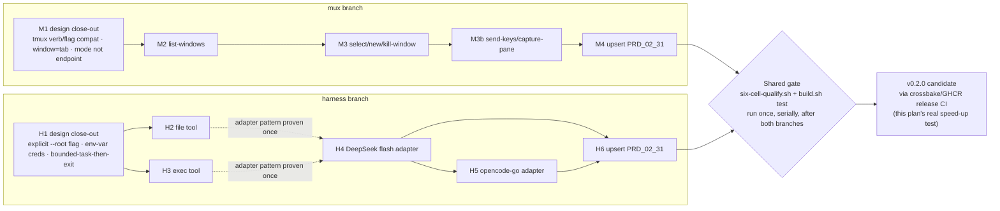

# Plan v0.2.0 — mux + harness

Owning PRD module: `prd/PRD_02_31_v0_2_horizon.md` (scope, non-goals, open
design questions — read it first; this file only sequences delivery and
resolves those questions into implementation decisions). Product boundary and
invariants: `prd/PRD_02_23_minicon.md`. This is the first plan doc to draw on
this repo's crossbake/GHCR pre-baked toolchain
(`scripts/crossbake.Dockerfile`, `.github/workflows/linux-crossbake-experiment.yml`)
as its release-CI path, once that experiment's six-cell claim is confirmed —
see "Delivery note" at the end.

## Tree DAG

```text
v0.2.0 — mux + harness (owner decision 2026-09-24, narrows AGENTS.md boundary)
├── M mux: tmux-CLI-compatible tab control {m}
│   ├── M1 design close-out ->m [x] (2026-09-25, PRD_02_31 "mux -- detail")
│   │   ├── verb surface: tmux verb/flag vocabulary, not MiniCon-native
│   │   │     names -- `list-windows`, `select-window`, `new-window`,
│   │   │     `kill-window`, `send-keys`, `capture-pane`
│   │   │     @method=tmux-verb-compat #decision -- owner-directed: the
│   │   │     concrete need is agent interop across minicon/tmux backends
│   │   ├── model mapping: the running instance IS the one session; tmux
│   │   │     window = MiniCon tab (`@ID` canonical, integer index accepted
│   │   │     as a tmux-numbering convenience); tmux pane = that tab's own
│   │   │     terminal area -- pane 0 always exists and IS the tab's PTY
│   │   │     view; `split-window` (a second pane per window) is not
│   │   │     implemented @method=window-is-tab #decision
│   │   └── surface shape: a mode of the existing --control CLI, not a new
│   │         binary subcommand or endpoint @method=mode-not-new-endpoint
│   │         #decision ->PRD_02_26_con_control_cli.md
│   ├── M2 tab listing (`list-windows`) ->m1 [ ]
│   │   ├── invariant: enumerates only tabs of the calling process's own
│   │   │     MiniCon instance; no cross-instance discovery
│   │   ├── invariant: `-F <format>` supports only the substitution
│   │   │     variables named in PRD_02_31's mapping table -- an
│   │   │     unrecognized substitution is a bounded error, never silently
│   │   │     rendered blank (tmux itself renders unknown ones blank; MiniCon
│   │   │     deliberately does not, to avoid a script silently getting
│   │   │     empty fields it thinks are real) #decision
│   │   ├── evidence: black-box CLI test asserts listed handles match the
│   │   │     tabs opened by the test harness, in a fresh MiniCon instance,
│   │   │     for both `@ID` and integer-index addressing
│   │   ├── safe failure: zero tabs returns an empty list, not an error
│   │   └── non-goal: [-] multi-pane enumeration (`split-window` not
│   │         implemented; each tab always lists exactly one pane, index 0)
│   ├── M3 window select/create/destroy (`select-window`, `new-window`,
│   │   │     `kill-window`) ->m1 [ ]
│   │   ├── invariant: an invalid `@ID`/index, a nonzero pane, or a
│   │   │     session-name mismatch is a bounded CLI error (exit code +
│   │   │     message naming which tmux assumption is unsupported), never a
│   │   │     crash or a silently created tab
│   │   ├── evidence: black-box test drives each verb against a bogus target
│   │   │     (bad handle, `pane=1`, wrong session name) and asserts the
│   │   │     matching bounded-error exit code, then repeats each against a
│   │   │     real target and asserts the real effect (tab switches/opens/
│   │   │     closes)
│   │   ├── depends: M2 (must be able to enumerate a real handle to target)
│   │   └── non-goal: [-] cross-machine attach; [-] persistent session
│   │         outside the process; [-] multiple sessions (both already
│   │         excluded by PRD_02_31)
│   ├── M3b read/write (`send-keys`, `capture-pane`) ->m1 [ ]
│   │   ├── invariant: `send-keys` resolves tmux key names (`Enter`, `C-c`,
│   │   │     ...) through `minicon_core::keymap`'s existing encoder, not a
│   │   │     second key-name table; `-l` sends the argument literally with
│   │   │     no key-name resolution
│   │   ├── invariant: `capture-pane -S`/`-E` (history range) is refused with
│   │   │     a bounded error citing carried-debt item C1 -- MiniCon's
│   │   │     scrollback semantics are undecided, so this flag is `BLOCKED`,
│   │   │     never approximated
│   │   ├── evidence: black-box test round-trips `send-keys -l <text>` and a
│   │   │     named key (e.g. `Enter`) into a real tab and asserts the
│   │   │     child process received them distinctly; `capture-pane -p`
│   │   │     round-trips known output; `-S`/`-E` asserts the bounded refusal
│   │   └── depends: M3 (needs a real target to send/capture against)
│   └── M4 upsert into PRD_02_31 ->m [ ]
│         └── flip mux's `[ ]` lines to `[x]` only against the evidence named
│               in M2/M3/M3b, per AGENTS.md's "[x] requires named evidence"
│               rule
├── H harness: minimal two-tool agent loop {h}
│   ├── H1 design close-out ->h [x] (2026-09-25, PRD_02_31 "harness -- detail")
│   │   ├── invocation: `minicon harness --root <path> --task "<text>"
│   │   │     [--backend deepseek|opencode-go] [--allow-cmd <name>]...`;
│   │   │     `--root`/`--task` required, no implicit-cwd default
│   │   │     @method=explicit-flag-required #decision
│   │   ├── exec allow-shape: `--allow-cmd` repeatable, names permitted
│   │   │     executable basenames; zero given means the `exec` tool is
│   │   │     still advertised but every call is refused with a bounded
│   │   │     error -- a model must not be able to distinguish "not allowed
│   │   │     yet" from "tool absent" by probing #decision
│   │   ├── credential path: environment variable only for v0.2.0
│   │   │     (`MINICON_DEEPSEEK_API_KEY` / `MINICON_OPENCODE_API_KEY`); a
│   │   │     config-file credential store is deferred, not designed here,
│   │   │     to avoid MiniCon growing a general secrets feature
│   │   │     #decision @method=env-var-only
│   │   └── run shape: one invocation runs one bounded task to completion
│   │         (or a bounded turn/tool-call limit) and exits, printing to
│   │         stdout; no interactive loop inside a tab, no conversation
│   │         persisted across invocations (`--continue` is out of scope)
│   │         @method=bounded-task-then-exit #decision
│   ├── H2 file tool ->h1 [ ] @method=first ->h1
│   │   ├── invariant: read/write confined to the `--root` bound; a path
│   │   │     that escapes it (symlink, `..`) is refused, not clamped
│   │   ├── evidence: black-box test attempts a `../` escape and an absolute
│   │   │     path outside root, asserts both refused; a same-root
│   │   │     read/write round-trip asserts success
│   │   └── safe failure: refusal is a bounded CLI error, never a partial
│   │         write
│   ├── H3 exec tool ->h1 [ ]
│   │   ├── invariant: exactly one command per call, no shell metacharacter
│   │   │     expansion (no `&&`, pipes, or subshell) — the command is
│   │   │     invoked directly (argv vector), not passed through `/bin/sh -c`
│   │   ├── evidence: black-box test passes a string containing `;` or `&&`
│   │   │     as a single argv token and asserts it is NOT interpreted as
│   │   │     two commands; a real single-command run asserts captured
│   │   │     stdout/exit code
│   │   └── depends: H1 (needs the allow-shape decision to bound which
│   │         commands are runnable)
│   ├── H4 DeepSeek flash backend ->h1 [ ] @method=first
│   │   ├── invariant: harness sends the two-tool loop over DeepSeek's own
│   │   │     wire format; no generic "OpenAI-compatible" claim is made from
│   │   │     this backend alone
│   │   ├── evidence: black-box test runs one real bounded task (temp root,
│   │   │     one file write commanded by the model) against DeepSeek flash,
│   │   │     asserts the file lands with model-specified content
│   │   └── #risk requires a live API key in CI; if none is provisioned this
│   │         evidence is `BLOCKED`, not silently skipped, per AGENTS.md
│   ├── H5 opencode-go-compatible backend ->h1 [ ]
│   │   ├── invariant: a second, independently verified adapter — H1's
│   │   │     decision explicitly forbids assuming H4's adapter covers it
│   │   ├── evidence: same shape as H4's, against the opencode-go endpoint
│   │   ├── depends: H4 (adapter pattern proven once before a second is built)
│   │   └── #risk same live-credential dependency as H4; `BLOCKED` if absent
│   └── H6 upsert into PRD_02_31 ->h [ ]
│         └── flip harness's `[ ]` lines to `[x]` only against H2-H5's named
│               evidence
└── Shared gates
      ├── every new subcommand ships behind the two AGENTS.md invariants
      │     already governing this module: one file, no bundled runtime
      ├── `./scripts/six-cell-qualify.sh` and `./scripts/build.sh test` gate
      │     both mux and harness before any plan item is marked `[x]`
      └── final PRD_02_31 upsert (M4 + H6) happens once, after both branches
            close out — not per-item, to keep one coherent evidence pass
```

## Sequencing

1. **M1/H1 design close-outs first** — both are pure decisions (no code),
   and H2/H3/M2/M3 all depend on their own branch's close-out. Do these
   before writing any implementation. Both are resolved as of 2026-09-25 (see
   `PRD_02_31_v0_2_horizon.md`'s "mux — detail" and "harness — detail");
   implementation (M2/M3/M3b, H2-H5) can now start.
2. **mux (M2 → M3) and harness's two tools (H2, H3 in parallel)** can proceed
   independently — mux only touches `PRD_02_26`'s existing control-CLI code
   path; harness's file/exec tools are new, isolated modules with no shared
   file ownership with mux. Work them in parallel per AGENTS.md's own
   "independent leaves, independent file ownership" rule.
3. **H4 before H5** — the adapter pattern must be proven against one real
   backend before a second is attempted (explicit dependency, not a
   convenience ordering).
4. **Integrate and gate serially**: once M3 and H3/H4(/H5) are done, run
   `six-cell-qualify.sh` and `build.sh test` once across the whole set before
   any PRD upsert.
5. **Upsert last** (M4, H6, then this plan gets archived to `plan/archive/`
   per AGENTS.md's ownership rule — PRD_02_31 becomes the durable record,
   this plan doc's job ends there).

## Mermaid flowchart memory palace

Relationships the tree above cannot show well: mux and harness share no
files but do share gates, and harness's two model backends share one adapter
pattern proven once and reused, not re-derived.



## Delivery note: this is the crossbake/GHCR methodology's real test

`plan/plan-ghcr-toolchain-prebake.md` and the live
`linux-crossbake-experiment.yml` dispatches are proving whether one
pre-baked Linux image can cross-build all six MiniCon cells plus
`minicon.com` from a single host, to move build workload off GitHub-hosted
macOS/Windows runners. v0.2.0 is deliberately the first version whose actual
release Candidate is built to test that pipeline for real speed-up, once the
crossbake experiment's six-cell artifact-type verification (PE32/ELF/Mach-O)
passes and the image is published to GHCR. Until that experiment is
confirmed, this plan's own release gate falls back to the existing
`six-cell-qualify.sh` / `six-grid-cloud-build.yml` native-per-cell path
unchanged — the crossbake path is additive, not a precondition for shipping
v0.2.0's mux/harness work itself.
