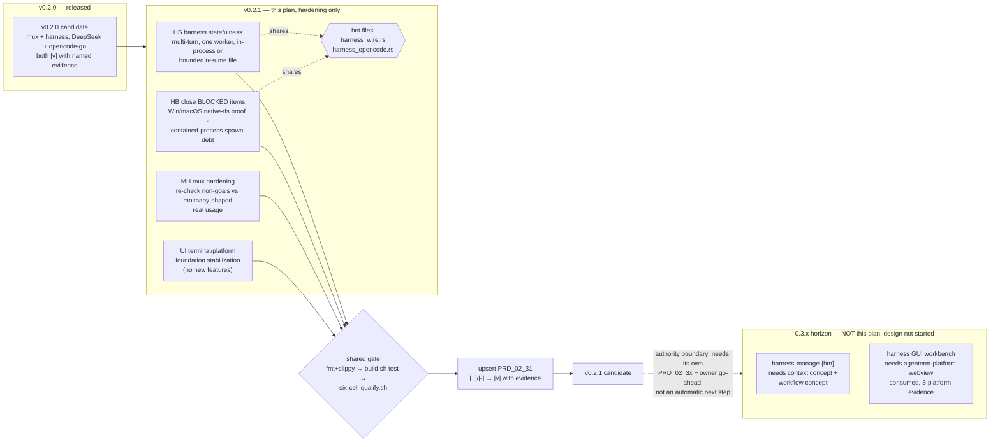

# Plan v0.2.1 — mux + harness hardening, no new-role features

Owning PRD module: `prd/PRD_02_31_v0_2_horizon.md` (scope, non-goals, the
2026-09-26 `harness`/`harness-manage` role split, the 0.3.x GUI/manager
deferral — read it first; this file only sequences delivery). Product
boundary: `prd/PRD_02_23_minicon.md`. v0.2.0 is already released
(`plan/archive/plan-v0.2.0.md`); this plan is the next code-bearing round on
the same two subcommands, not a new capability.

## Why this plan exists, and what it deliberately does not contain

The 2026-09-26 discussion (mux's moltbaby-evidenced tmux-verb-compat
rationale, the `harness`/`harness-manage` worker/manager split, the GUI
workbench renderer decision) produced real scope decisions, but **none of
them add work to 0.2.x** — they were mostly about *excluding* things:
`harness-manage` and the GUI workbench were both placed in an unassigned,
likely-0.3.x horizon, explicitly `BLOCKED` on design work
(context/workflow concepts, three-platform WebView evidence) that has not
started. So 0.2.1's own content does not need adjusting because of that
discussion — it needed the exclusion **recorded**, which is done in
`prd/PRD_02_31_v0_2_horizon.md` as of commits `cfcf0d0`/prior. What 0.2.1 picks
up is the hardening debt v0.2.0 itself already named as owed.

## Tree DAG

```text
v0.2.1 — harden mux + harness; no new role (owner decision 2026-09-26)
├── HS harness statefulness {hs} [_] not started
│   ├── outcome: a bounded multi-turn session, replacing "one task, exit" --
│   │     `--continue`-style resumed conversation, scoped only to a single
│   │     `harness` worker (not `harness-manage` orchestration)
│   ├── #decision this is the harness {h} node's own worker capability, not
│   │     the `harness-manage` {hm} question -- a worker that remembers its
│   │     last turn is not a manager that dispatches across tabs
│   ├── dependency: PRD_02_31 "Run shape" (the thing being replaced) and
│   │     the existing DeepSeek/opencode-go wire codecs (the state must
│   │     round-trip through both, not just one)
│   ├── design questions, unresolved
│   │   ├── where does session state live -- in-process only (process still
│   │   │     dies with the session, per "MiniCon does not turn into a
│   │   │     server") or a bounded on-disk resume file under `--root`
│   │   ├── turn/tool-call bound: still a hard cap per invocation, or a cap
│   │   │     per resumed session as a whole
│   │   └── streaming output: stdout today is print-once-at-exit; a
│   │         multi-turn workbench (0.3.x, later) will want streaming, so
│   │         decide now whether 0.2.1 lays that groundwork or explicitly
│   │         defers it too @method=TBD #risk
│   └── safe failure: a resume request against a session that does not
│         exist, or is corrupt, is a bounded CLI error, never a silent fresh
│         start (that would look like continuity while quietly losing it)
├── HB harness — close the BLOCKED items v0.2.0 already named {hb} [-]
│   ├── Windows/macOS `native-tls` arm: compiled and proven in at least one
│   │     court each, not just the feature graph compiling (PRD_02_31
│   │     "Owed, and BLOCKED rather than skipped", item 1) ->hs (shares the
│   │     wire transport being touched for statefulness -- do both in one
│   │     pass over `harness_wire.rs`/`harness_opencode.rs`, not two)
│   │     `BLOCKED` 2026-09-26: this cloud container is Linux-only and
│   │     `scripts/six-cell-qualify.sh` itself requires an Apple Silicon
│   │     macOS host for the cross-compile+runtime proof -- cannot be closed
│   │     from here; needs a macOS/Windows court, not silently skipped
│   ├── [v] closed 2026-09-26 contained-process spawn debt: `exec` now
│   │     spawns via `agenterm_platform::contained_process::
│   │     ContainedHeadlessCommand` with hard `ContainedProcessLimits`
│   │     (memory/file-size/open-files/active-processes/cpu-seconds), not
│   │     `std::process::Command`; `terminate_and_wait` on timeout reaps the
│   │     whole native containment group. See PRD_02_31's harness dependency
│   │     line for full evidence and the one honest gap (no test yet proves
│   │     descendant-reaping under load)
│   └── #decision these are debt closure, not new scope; each gets its own
│         named evidence the same way H4/H5 did, per AGENTS.md's "every test
│         must be provable" rule
├── MH mux — close what M's own non-goals left open {mh} [_]
│   ├── re-check the five non-goals in PRD_02_31's mux section against real
│   │     usage friction now that a concrete external consumer (moltbaby)
│   │     is on record -- e.g. does `-F`'s substitution-variable subset
│   │     still cover what a `dfleet`-style prober actually needs, or is a
│   │     gap now visible that wasn't at design time
│   ├── #decision this is verification/hardening against the moltbaby
│   │     evidence node, not a scope change -- if a real gap surfaces it
│   │     becomes its own named decision, not folded in silently
│   └── dependency: `prd/PRD_02_26_con_control_cli.md` (protocol surface)
├── UI continued UI/UX and platform-foundation stabilization {ui} [_]
│   ├── outcome: no new features -- close existing rough edges in
│   │     `terminal.rs`/`theme.rs`/`host_ui.rs`/`host_paint.rs`/
│   │     `raster_surface.rs` and the consumed `agenterm-platform`/
│   │     `agenterm-ui-core` pins, per the 2026-09-26 "0.2.x stays
│   │     hardening" decision
│   └── #decision scope for this leaf is picked from whatever open bugs/
│         rough edges exist when this plan starts implementation, not
│         pre-enumerated here -- keeps this plan from going stale before
│         work begins
└── GATE {g} shared release gate, run once after all leaves above close
    ├── `cargo fmt` + `cargo clippy --all-targets -- -D warnings` (AGENTS.md:
    │     six-cell gates on these, `cargo test` does not)
    ├── `./scripts/build.sh test` (denies dead_code/unused_variables/
    │     unused_must_use -- not bare `cargo test`)
    ├── `./scripts/six-cell-qualify.sh` before pushing, not after CI fails
    └── PRD upsert (this plan's leaves' `[_]`/`[-]` become `[v]` with named
          evidence in `prd/PRD_02_31_v0_2_horizon.md`), then this plan archives
          to `plan/archive/`, same discipline as `plan/archive/plan-v0.2.0.md`

Explicitly NOT in this plan (parked in PRD_02_31, unassigned horizon,
BLOCKED on design):
├── harness-manage {hm} -- manager/orchestration role; needs a context
│     concept and a workflow concept designed first (owner's own caveat)
└── harness GUI workbench -- needs agenterm-platform's webview adapter to
      actually be consumed, which is 0.3.x-or-later work in AgenTerm's own
      three-platform WebView evidence, not MiniCon's to build first
```

## Mermaid flowchart memory palace

What the tree above cannot show well: the statefulness leaf (`HS`) and the
BLOCKED-item closure leaf (`HB`) both touch the same two files
(`harness_wire.rs`, `harness_opencode.rs`), so they share a hot-file
constraint even though they're separate leaves; and the whole plan sits
between a released v0.2.0 and a not-yet-started, not-yet-scoped 0.3.x
horizon that this plan must not reach into.



## Decision: 0.2.1 vs. jumping to 0.2.2 planning

**Ship this plan as v0.2.1; do not skip to 0.2.2 planning yet.** Reasoning:

1. v0.2.0 named real BLOCKED/owed debt (TLS proof, contained-process
   spawn) that has not been paid down. Deferring it to a hypothetical 0.2.2
   without doing it in 0.2.1 would mean two versions in a row shipping with
   the same recorded gaps, which is what `PRD_02_31`'s "Owed, and BLOCKED
   rather than skipped" discipline exists to prevent.
2. Today's harness statefulness need (real, owner-stated, needed even
   before any manager/GUI work) has no home yet. It belongs with the other
   harness hardening in the same release, not spread across two.
3. Planning a 0.2.2 now, before 0.2.1's own scope is even implemented,
   would be planning against a moving baseline — AGENTS.md's own planning
   method says identify shared prerequisites and hot files *before*
   parallel work, not stack a second plan on top of an unstarted one.
4. `harness-manage` and the GUI workbench do not belong in 0.2.2 either --
   they are parked in an unassigned 0.3.x horizon pending design work this
   plan does not do. There is currently no reason to expect a 0.2.2 at all;
   if 0.2.1 closes its own `[_]`/`[-]` items cleanly, the next real horizon
   is 0.3.x's `harness-manage` + GUI design, not a 0.2.2 patch.

**Next action:** implement this plan's four leaves (`HS`, `HB`, `MH`, `UI`),
upsert `prd/PRD_02_31_v0_2_horizon.md`, archive this file, then open the design
work for `harness-manage`/GUI as a new `PRD_02_3x` module -- not a 0.2.2 plan.
