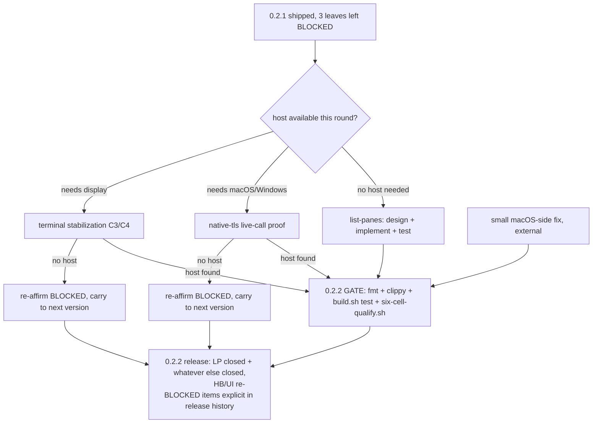

# plan-v0.2.2

## Scope decision

Owner (2026-09-26): "0.2.1已经发布了，所以没做的就尝试在0.2.2解决，到时不行就继续顺推到0.2.4" —
0.2.1 already shipped; whatever it left undone should be attempted in 0.2.2,
and if still blocked then, roll forward again rather than let it block a
release. This closes the fork `plan/plan-v0.2.1.md` itself left open ("if
0.2.1 closes its own leaves cleanly, the next horizon is 0.3.x; if not, the
next real horizon is a 0.2.2 patch") in favor of the patch path.

0.2.2 is **not** a 0.3.x design start. `harness-manage`/GUI workbench stay
scoped to 0.3.x per the owner's 2026-09-26 decision already recorded in
`prd/PRD_02_31_v0_2_horizon.md`; 0.2.2 only carries `plan-v0.2.1.md`'s own
three leftover leaves forward, plus one small macOS-side fix already
submitted independently of this plan.

Non-goal: renegotiating what these three leaves mean. Their design is
settled in `prd/PRD_02_31_v0_2_horizon.md`; what's missing is host-bound
runtime evidence for two of them, not decisions.

## Tree DAG

```text
0.2.2: close 0.2.1's BLOCKED leftovers, or re-BLOCK and roll forward
├── {LP} mux list-panes gap                                    [v] @host=none-needed
│      invariant: `mux list-panes` returns pane_id/width/height/active/dead
│        for every pane in a target's current layout, matching tmux's own
│        `list-panes -F` field semantics closely enough for moltbaby's
│        `super-query` to consume directly
│      closed 2026-09-26: the assumed per-tab round-trip was unnecessary —
│        `list-tabs`'s handler already iterates each tab's live `ConTerminal`
│        in-process, so serving its existing `cols`/`rows` cost nothing extra.
│        New `mux list-panes` verb in `src/mux.rs` with its own
│        `KNOWN_PANE_FORMAT_VARS`, mirroring `list-windows`; default format is
│        moltbaby's own `super-query` string verbatim.
│      evidence: `src/mux.rs` unit tests (`parse_tabs_reads_id_title_active`,
│        `render_pane_format_default_matches_tmux_field_order`,
│        `list_panes_format_rejects_window_vars`) and black-box
│        `mux_list_panes_renders_pane_geometry_and_active_dead_flags` in
│        `tests/minicon_mux.rs`; full `./scripts/build.sh test` gate green.
│        See `prd/PRD_02_31_v0_2_horizon.md`'s "mux hardening against
│        moltbaby-shaped real usage" for the closure note.
│      dependency: none — pure design+implementation, closeable from this
│        Linux cloud session
│      non-goal: any tmux verb beyond list-panes; no new mux subcommand
├── {HB} native-tls live-call proof                             [-] @host=macOS/Windows #risk
│      invariant: the native-tls arm of network-http actually makes a live
│        HTTPS call on Windows and/or macOS, not just compiles/links
│      evidence: six-cell-qualify.sh's native-tls cell moves BLOCKED→PASS on
│        a real Windows or macOS runner/court
│      safe failure: BLOCKED (as in 0.2.1) if no such host becomes available
│        during 0.2.2 — never claim closed on cross-compile evidence alone
│      dependency: a Windows or macOS host/court this session does not have
│      non-goal: touching the proven Unix Rustls/WebPKI arm
├── {UI} terminal/platform-foundation stabilization              [-] @host=display #risk
│      invariant: C3 (box-drawing glyph gap, Consolas 1px at 12px) and C4
│        (idle one-tab host RSS toward 10 MiB) close with observable evidence
│      evidence: C3 — rendered glyph inspection on a real display; C4 —
│        measured idle RSS under the 10 MiB target
│      safe failure: BLOCKED (as in 0.2.1, see `plan/plan-carried-debt.md`) if no
│        display-capable host becomes available — do not fake with headless
│        rendering claims
│      dependency: a display-capable host this session does not have
│      non-goal: any new UI feature; this is stabilization only
└── {OSX} small macOS-side fix (already submitted independently)  [~] ->verify
       not yet visible on origin/main as of this plan's drafting; pull in
       via the normal fetch+rebase flow when it lands, verify alignment
       tests + fmt, and note its content here once seen — do not guess its
       shape in advance

Decision, mirrored from plan-v0.2.1.md's own scope reasoning:
if HB/UI are still BLOCKED at 0.2.2's close (no capable host materialized),
that is not a planning failure — re-affirm BLOCKED, carry both forward to
the next version (owner named 0.2.4 as illustrative "keep pushing until it
works", not a commitment that 0.2.3 has distinct scope), and ship 0.2.2 on
whatever LP/OSX evidence closed. A release is not held hostage by leaves
this environment structurally cannot prove.
```

## Memory palace



## Deferred (raised during pre-0.2.2 review, not yet owner-confirmed for this plan)

Not included above because the owner's scoping answer only named "resolve
what 0.2.1 left undone." Flagging so they aren't silently lost, not folding
them in without confirmation:

- workflow gh-download/verify/extract duplication across release-related
  `.yml` files — candidate for a composite action.
- `src/main.rs` size (4564 lines) — candidate for its own hardening leaf
  with a dedicated scoping pass, not a drive-by refactor inside 0.2.2.
- `scripts/release.sh` vs. the `run-reputation-and-release` skill's top-level
  page drift risk — needs a cross-reference note or an alignment-test
  extension.
- `.github/workflows/ci-minicon.yml.disabled` — indefinite parked status
  needs a formal enable/archive decision.

If the owner wants any of these in 0.2.2, add them as siblings of `{LP}`
before implementation starts; otherwise they wait for a future round.
