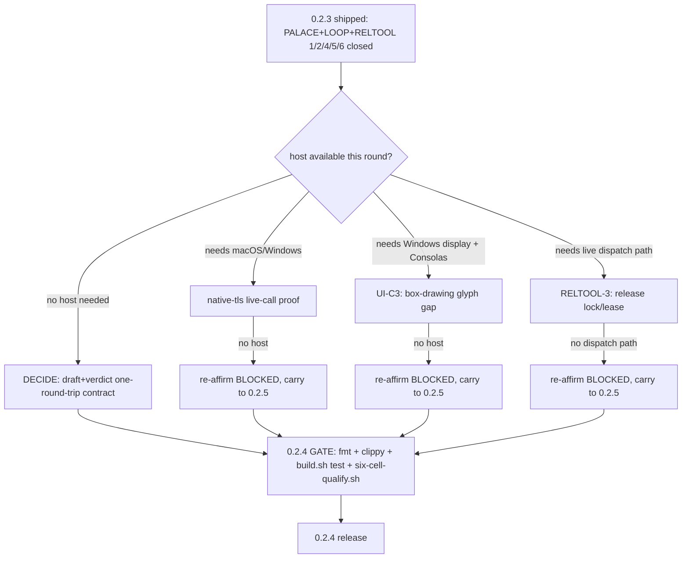

# plan-v0.2.4

## Scope decision

Owner (2026-09-27 pre-scope, filled in 2026-10-04 now that 0.2.3 shipped):
0.2.3 closed on `{PALACE}`+`{LOOP}`+`{RELTOOL}`#1/#2/#4/#5/#6
(`prd/archive/v0.2.3-release-history.md`). Per `plan-v0.2.3.md`'s own
close-out rule, 0.2.4 pulls forward every leaf 0.2.3 could not close for a
structural (not design) reason, plus one new leaf: a concrete decision-
contract design for `{LOOP}`'s decide-states, raised by the owner directly
(not carried-debt) while reviewing the harness's context-engineering shape.

Non-goal: 0.3.x's `harness-manage`/GUI workbench — still out of scope per
`prd/PRD_02_31_v0_2_horizon.md`.

## Tree DAG

```text
0.2.4: carry HB/UI-C3/RELTOOL#3 forward + new {DECIDE} contract leaf
├── {HB} native-tls live-call proof                              [-] @host=macOS/Windows #risk
│      carried unchanged from 0.2.3 (itself carried from 0.2.1/0.2.2).
│      invariant: the native-tls arm of `network-http` makes a live HTTPS
│        call on Windows and/or macOS, not just compiles/links
│      safe failure: BLOCKED if no such host materializes this version
│        either — never claim closed on cross-compile evidence alone
│      dependency: a Windows or macOS host/court this session does not have
├── {UI-C3} box-drawing glyph gap (Consolas, 1px at 12px)         [-] @host=Windows-display #risk
│      carried unchanged from 0.2.3/plan-carried-debt.md's C3. invariant:
│        the rendered glyph closes the 1px gap on a real Windows display
│        with Consolas installed
│      safe failure: BLOCKED here specifically — no Consolas, no screen a
│        human can inspect even with Xvfb
│      dependency: a Windows display host with Consolas this session does
│        not have
├── {RELTOOL-3} release-in-progress lock/lease                    [-] @host=none #risk
│      carried from 0.2.3's `{RELTOOL}`, the one sub-item of six not closed
│        there. invariant: a lightweight marker (checked-in
│        `release-lock.json` with holder/source_sha/expiry, or a draft
│        GitHub Deployment) that dispatch scripts check before pushing to
│        `main` and clear on completion/timeout, replacing the verbal
│        mux-chat coordination that was violated twice during v0.2.2 and
│        once during v0.2.3's own SHIP
│      safe failure: BLOCKED if this session again has no live GitHub
│        Actions dispatch path to exercise a real lock check against —
│        do not land an unverified lock a second time
│      dependency: a round with real dispatch access (same gap 0.2.3 hit)
├── {DECIDE} decision-contract for {LOOP}'s decide-states           [ ] @host=none
│      owner-raised 2026-10-04 while reviewing harness context-engineering
│        shape (tree+palace, decision-model/work-model split loop).
│        invariant: decide-pick/decide-continue stay governed by bounded,
│        cheap rules — never a second free-form model round-trip — but gain
│        a path for genuine semantic judgement (is this draft actually
│        good?) that a string/counter match cannot express
│      #decision (2026-10-04): do NOT add a separate "decision model" API
│        call. `run_loop`'s decide-states are currently zero-cost (pure
│        code: stop-phrase/counter checks in `src/harness.rs`) — that is
│        strictly better than a cheap-model call, not a gap to fill.
│        Instead, have the SAME work-model turn that produces a draft also
│        emit a small structured self-verdict field in its one response
│        (draft + verdict, one round-trip); decide-pick reads that field
│        through the existing bounded-rule path, and only escalates to a
│        genuinely separate adjudicator call when the self-verdict is
│        low-confidence/ambiguous (expected rare). Precedent: this very
│        session's own Stop-hook contract (`output-form-gate.py` forcing a
│        `const 决策 = {...}` JS block) is a real, working example of "one
│        model turn, two output modes, no extra round-trip" already in
│        daily use
│      evidence needed: `TreeNode`/`log_transition` schema extended with an
│        optional verdict field (append-only, no in-place mutation of past
│        nodes — confirmed 2026-10-04 that today's tree writes are already
│        append-only, so this preserves cache-hit-friendly
│        `compose_resumed_task` ordering), a fixture test where a
│        low-confidence verdict triggers the escalation path and a
│        high-confidence one does not, full harness unit suite green
│      non-goal: touching the already-closed `{PALACE}`/`{LOOP}` evidence
│        or their existing passing tests; this is new scope layered on top,
│        not a reopening
│      dependency: none — pure `src/harness.rs` design work, no host needed
└── (pull from plan/plan-carried-debt.md at pickup time if the owner wants
       a specific item folded in as a sibling leaf — not pre-selected here)

## 0.2.4 GATE status

Not yet met. `{DECIDE}` is the only leaf with no host blocker — start there.
`{HB}`/`{UI-C3}`/`{RELTOOL-3}` re-affirm `BLOCKED` exactly as in 0.2.3 unless
a capable host/dispatch-path becomes available this round.

## Memory palace


