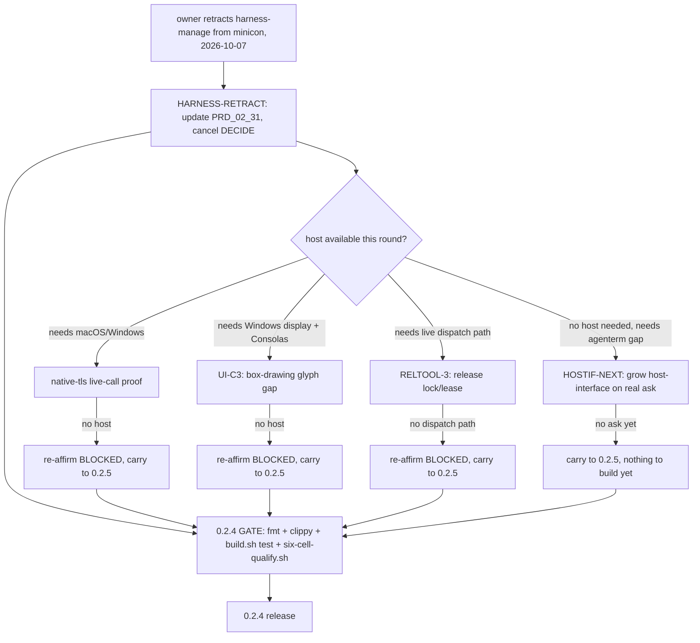

# plan-v0.2.4

## Scope decision

Owner (2026-10-07): **retracts minicon's harness/agent-management ambition.**
Following the agenterm-as-plugin-market direction already agreed with
cc-agenterm (`{HOSTIF}`, closed below), the owner now draws the product
boundary explicitly: **agenterm owns downloading/installing/updating minicon
and the plugin & app market built on top of it; minicon owns the underlying
service and the interface agenterm/plugins consume.** Multi-agent
orchestration, workflow management, and any GUI "harness workbench" are
agenterm's territory, not minicon's, full stop — not "not yet," which is how
`harness-manage` {hm} was carried in `prd/PRD_02_31_v0_2_horizon.md` until
now.

Consequences, decided this round:

1. **`{DECIDE}`, the decision-contract leaf added 2026-10-04, is cancelled.**
   It was design work on `{LOOP}`'s decide-states — a step toward exactly the
   agent-orchestration sophistication now explicitly out of scope. No code
   was written for it; nothing to revert.
2. **`harness-manage` {hm}** in `prd/PRD_02_31_v0_2_horizon.md` moves from
   "not started, horizon not assigned" to **retracted from minicon
   permanently** — it is agenterm's to build, consuming `{HOSTIF}`, not a
   future minicon version's scope.
3. **The already-shipped `harness` {h} worker** (`minicon harness`, two
   tools, DeepSeek/opencode backends, closed in 0.1.x/0.2.2/0.2.3 — see
   `prd/PRD_02_31_v0_2_horizon.md`'s "harness — detail") is **not touched
   this round.** It already satisfies the narrower framing ("a WORKER... one
   bounded task, two tools, no orchestration, ever" — that line was written
   2026-09-26 and already forbade exactly the growth direction now
   retracted). Whether it eventually migrates out of minicon entirely is a
   separate, larger decision this plan does not make — flagged as an open
   question below, not acted on.
4. 0.2.4's real work becomes: carry the three structurally `BLOCKED` leaves
   forward (unchanged from the pre-retraction draft), and use the freed
   scope to look for concrete next steps on `{HOSTIF}` now that it has
   landed — the actual "focus on underlying service + interface" work.

## Tree DAG

```text
0.2.4: retract harness-manage, carry HB/UI-C3/RELTOOL-3, grow {HOSTIF}
├── {HARNESS-RETRACT} scope boundary decision                        [v] @host=none
│      owner-decided 2026-10-07: minicon = underlying service + interface;
│        agenterm = download/install/update + plugin & app market + agent
│        management, built on minicon. `{DECIDE}` (2026-10-04 leaf)
│        cancelled unstarted. `harness-manage` {hm} in
│        `prd/PRD_02_31_v0_2_horizon.md` retracted from minicon's own
│        horizon entirely, not merely deferred past 0.2.x.
│      invariant: no further minicon-side work grows `harness` {h} toward
│        orchestration, workflow management, or a GUI workbench — that
│        line was already drawn 2026-09-26 ("a WORKER... no orchestration,
│        ever") and is now reaffirmed as permanent, not reviewed per-version
│      evidence: this plan file + `prd/PRD_02_31_v0_2_horizon.md`'s
│        `harness-manage` {hm} node updated to read "retracted 2026-10-07,
│        owned by agenterm" instead of "not started, horizon not assigned"
│      open question (not decided here): whether the already-shipped
│        `harness` {h} worker subcommand should eventually migrate out of
│        minicon into agenterm too, now that agenterm is the agent-facing
│        product. Leaving it in place for now — it is small, bounded, and
│        already non-orchestrating, so it does not conflict with "minicon =
│        thin service" today. Revisit only if it starts asking for
│        maintenance minicon's own scope would otherwise refuse
│      non-goal: deleting or restructuring any shipped `harness.rs` code
│        this round; that is a separate, larger decision
├── {HOSTIF-NEXT} host-interface growth, now the primary 0.2.x direction  [ ] @host=none
│      with harness-manage off minicon's plate, `{HOSTIF}` (closed
│        2026-10-04, `src/cli.rs`'s `--version --json`/`--hostif-handshake`)
│        is the actual shape of "minicon as underlying service" — this leaf
│        is where to grow it, not yet scoped in detail
│      candidates to evaluate with cc-agenterm before committing code:
│        (a) a capability beyond `exec`/`mux`/`pty` the launcher's first
│        real plugin needs and `--hostif-handshake` does not yet list; (b)
│        whether `candidate-manifest.json` needs an update-check-friendly
│        companion (e.g. a stable "latest" redirect) now that agenterm.com
│        is a real consumer, not a hypothetical one; (c) anything
│        `{RELTOOL-3}`'s release-lock would also protect agenterm's
│        automated minicon-fetch from (a concurrent in-flight release)
│      evidence needed: a concrete ask from cc-agenterm's own
│        implementation (not speculative minicon-side design) before
│        writing code — same discipline `{HOSTIF}` v1/v2 already followed
│      dependency: cc-agenterm actually starting agenterm 0.2.0.0's
│        launcher implementation and hitting a real gap
│      non-goal: inventing host-interface surface agenterm has not asked for
├── {HB} native-tls live-call proof                              [-] @host=macOS/Windows #risk
│      carried unchanged from 0.2.3 (itself carried from 0.2.1/0.2.2).
│      invariant: the native-tls arm of `network-http` makes a live HTTPS
│        call on Windows and/or macOS, not just compiles/links
│      safe failure: BLOCKED if no such host materializes this version
│        either — never claim closed on cross-compile evidence alone
│      dependency: a Windows or macOS host/court this session does not have
├── {UI-C3} box-drawing glyph gap (Consolas, 1px at 12px)         [-] @host=Windows-display #risk
│      carried unchanged from 0.2.3 and `plan/plan-carried-debt.md`'s C3. invariant:
│        the rendered glyph closes the 1px gap on a real Windows display
│        with Consolas installed
│      safe failure: BLOCKED here specifically — no Consolas, no screen a
│        human can inspect even with Xvfb
│      dependency: a Windows display host with Consolas this session does
│        not have
└── {RELTOOL-3} release-in-progress lock/lease                    [-] @host=none #risk
       carried from 0.2.3's `{RELTOOL}`, the one sub-item of six not closed
         there. invariant: a lightweight marker (checked-in
         `release-lock.json` with holder/source_sha/expiry, or a draft
         GitHub Deployment) that dispatch scripts check before pushing to
         `main` and clear on completion/timeout, replacing the verbal
         mux-chat coordination that was violated twice during v0.2.2 and
         once during v0.2.3's own SHIP
       safe failure: BLOCKED if this session again has no live GitHub
         Actions dispatch path to exercise a real lock check against —
         do not land an unverified lock a second time
       dependency: a round with real dispatch access (same gap 0.2.3 hit)

{HOSTIF} itself (minicon --version --json / --hostif-handshake /
candidate-manifest.json contract) is already closed, landed and pushed
2026-10-04 (`fb40827`) — not re-listed here as a leaf; `{HOSTIF-NEXT}`
above is strictly its sequel.

## 0.2.4 GATE status

Not yet met. `{HARNESS-RETRACT}` is a documentation-only decision, closeable
immediately. `{HOSTIF-NEXT}` is blocked on cc-agenterm's own implementation
reaching a real gap, not on this session. `{HB}`/`{UI-C3}`/`{RELTOOL-3}`
re-affirm `BLOCKED` exactly as in 0.2.3 unless a capable host/dispatch-path
becomes available this round.

## Memory palace


