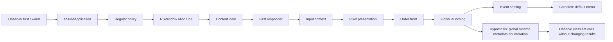

# External residency: initialization and metadata pages

2026-09-06, macOS 26.5.1 aarch64. Product acceptance remains host RSS and
10 MiB remains unmet. This diagnostic continues the kernel-ledger work in
`research-rss-ledger.md`; it does not relabel external residency as free memory.

```text
Locate an avoidable external-page initialization trigger
├── Page census owner
│   ├── invariant: query only our own process; do not read mapped pixel/header data
│   ├── evidence: per-page dispositions plus before/after TASK_VM_INFO
│   ├── failure: keep residual and failed closure; do not force a file ledger
│   └── non-goal: sum vmmap shared resident columns or alter process memory policy
├── Initialization owner
│   ├── dependency: same-process stage checkpoints and warm-observer control
│   ├── evidence: exact external ledger deltas and newly present page sets
│   ├── invariant: standard controls, full menu, input and presentation remain
│   └── non-goal: revive separator, animation, allocator relief or lazy-IME experiments
└── Intervention owner
    ├── dependency: identify the triggering API/caller before changing initialization
    ├── evidence: bounded call trace followed by product RSS and GUI gates
    └── failure: do not remove finishLaunching or required native functionality
```



## Census mechanism and its present limit

`research/frame-lifetime/external-pages.c` reads its own task. Temporarily
selecting the process-local `vm.self_region_footprint` mode changes the page
query interpretation; it is restored before return. Published XNU
[`task.c`](https://github.com/apple-oss-distributions/xnu/blob/f6217f891ac0bb64f3d375211650a4c1ff8ca1ea/osfmk/kern/task.c)
implements this flag on `current_task`, not as a system-wide setting.
[`vm_map.c`](https://github.com/apple-oss-distributions/xnu/blob/f6217f891ac0bb64f3d375211650a4c1ff8ca1ea/osfmk/vm/vm_map.c)
uses a pmap query in that mode; its ordinary object/shadow query can instead
report pages resident in the object without a corresponding process mapping.
The published source is not asserted to exactly match this installed kernel.

The census walks Mach submaps, asks `mach_vm_page_range_query` for page flags,
and records unique virtual page runs with PRESENT and EXTERNAL, excluding
REUSABLE. The last exclusion matters: the examined pmap path can flag a
reusable page EXTERNAL as well. The first diagnostic version overcounted
reusable pages; its failed receipts are retained under
`target/frame-lifetime/external/` and are not accepted as attribution.

No Mach-O image headers are read by the probe: reading all headers would itself
fault metadata pages. A **later same-process** vmmap provides address labels
for offline joins; its resident totals are never inputs to the census.
The stage experiment obtains vmmap only after all stages, avoiding intermediate
vmmap observations as initialization triggers. Pages crossing framework or
segment boundaries stay explicitly ambiguous.

The corrected census still does **not** close:

| Corrected process | TASK_VM_INFO external | Census | Unattributed difference |
|---|---:|---:|---:|
| libc control | 688 KiB | 640 KiB | 48 KiB / 3 pages |
| Final MiniCon | 60.671875 MiB | 60.296875 MiB | 384 KiB / 24 pages |

Both kernel ledger calls succeed; external does not drift during either scan;
all page queries succeed, unique-page counts match the footer, and the local
mode is restored. The gate remains false, with no increased tolerance. The
examined page-query path includes special no-footprint and alternate-accounting
cases; this is a reason not to assume it is a full ledger export, **not proof
that these cases explain the remaining 24 pages**. No per-framework total is
claimed as an exact decomposition of RSS. The residual remains open.

The gate additionally requires successful before/after `task_info`, no ERROR
(including restore failure), no page-query errors, unique pages matching the
census total, and both drift and closure error within two native pages.

Final MiniCon tested SHA-256:
`8ce6e879898843f21a2d0a228a14e767e67025bd961a7448bbb909fe62a07480`.
The candidate page labels are dominated by **20.484 MiB `__AUTH_CONST` and
13.922 MiB `__DATA_CONST`**, versus only 1.375 MiB `__TEXT`. Thus “60 MiB of
framework machine code” is not supported. Much of the candidate set is clean
runtime/image data and metadata; the labels do not establish whether each byte
is logically required by the application. About 13.125 MiB crosses individual
framework/segment boundaries and is not apportioned among owners.

Large named candidates include CoreGlyphs assets 3.969 MiB, CoreFoundation
3.281 MiB, AppKit 2.469 MiB, the per-user LaunchServices database 2.438 MiB and
libobjc 1.938 MiB. These are candidate query pages, subject to the failed
closure and later-label limitations. Their presence is not permission to
unmap an OS-owned resource.

## Same-process causal initialization experiment

The native probe reuses the already inspected custom input view, mapped pixel
presentation and full default-menu functions from
`research/hello-memory/pixel-host.m`. It retains Regular activation policy,
960×600 logical / 1920×1200 physical dimensions, the same embedded compatibility
plist, native standard controls, and no explicit activation call. Unlike the
original capability comparison, it intentionally installs the explicit menu
**last**, to distinguish initialization overlap within one process. This
ordering difference is recorded rather than treated as an otherwise identical
production startup.

Two census calls before `sharedApplication` measure observer warm-up. Both
report external 6.75 MiB, with no newly present page addresses on the second
call. This bounds repeat-census interference for that pre-AppKit state; it is
not a universal correction to subtract from product memory.

A first coarse process isolates sharedApplication, the complete window/input/
pixel startup, and menu installation. External is 6.750 → 21.000 → 56.922 →
57.094 MiB. A second process separates window creation, presentation and
finishLaunching. A third separates first responder and input context too:

| Third process checkpoint | External MiB | Increase from prior stage, MiB |
|---|---:|---:|
| Warm observer before sharedApplication | 6.750 | — |
| sharedApplication | 21.016 | 14.266 |
| Regular policy | 21.078 | 0.063 |
| NSWindow alloc/init | 25.844 | 4.766 |
| Title/content view configuration | 26.109 | 0.266 |
| makeFirstResponder | 26.109 | 0 |
| Explicit view.inputContext | 28.469 | 2.359 |
| Mapped pixel presentation | 28.469 | 0 |
| orderFront | 28.578 | 0.109 |
| finishLaunching | **51.172** | **22.594** |
| One second event processing | 56.938 | 5.766 |
| Complete default menu and event processing | 57.109 | 0.172 |

Every number in that table is a direct kernel external-ledger receipt, not a
sum of image labels. The census residual is five pages through orderFront,
then 24 pages after finishLaunching. That changing residual is retained.
The two detailed processes independently repeat the **22.59375 MiB**
finishLaunching step. The source/pixel operations remain observational: no
production initialization is disabled or delayed.

New page candidates at finishLaunching include 9.547 MiB `__AUTH_CONST`,
4.656 MiB `__DATA_CONST`, 4.641 MiB `__DATA`, 1.234 MiB `__DATA_DIRTY`,
1.094 MiB `__OBJC_RW` and 0.875 MiB `__AUTH`. The newly labelled framework
pages are widely distributed: NewsCore 0.500 MiB, PhotoLibraryServices
0.328 MiB, PassKitCore 0.313 MiB, SwiftUI and VectorKit 0.266 MiB each,
and MapKit/IMSharedUtilities 0.219 MiB each. Another 6.438 MiB is in ambiguous
shared page boundaries. These candidate labels suggest broad runtime metadata
traversal, rather than a local terminal pixel allocation.

The later event-settle step adds mainly mapped resources (5.25 MiB of newly
queried pages), while explicit complete-menu installation then adds only
0.172 MiB. This overlap explains why a separate menu-stage startup difference
cannot be reapplied as a product saving and why deleting separators yielded
nothing in MiniCon.

## Actual caller trace: Writing Tools soft loading

The initial global Objective-C class enumeration hypothesis was tested, not
accepted as attribution. The two public API interposers were calibrated with
real `objc_getClassList` / `objc_copyClassList` calls and preserved original
return values. Neither intercepted a call in the native launch experiment,
while finishLaunching still added 22.531 MiB external. This rejects those
observed interposable imports as the explanation; shared-cache direct binding
and other internal paths remain outside that test. Loading the interposer
itself added about 1 MiB before sharedApplication, so its ledger is not an
uninstrumented baseline.

LLDB resolved both public implementation breakpoints, but launch remained
stopped without reaching a native checkpoint for the bounded attempt. No
explicit permissions error was returned. The exact owned native, debugserver
and LLDB processes were killed and reaped; no security settings changed.
This failed launch supplies no negative breakpoint evidence.

A lighter native handshake immediately before finishLaunching let `sample`
attach first and then release the call. Both processes exited zero. The actual
stack in `target/frame-lifetime/sample-class-list/sample.txt` names:

```text
-[NSApplication finishLaunching]
  -[NSApplication(NSMenuUpdating) _customizeMainMenu]
    -[NSApplication(NSMenuUpdating) _addTextInputMenuItems:]
      +[NSTextView(NSTextView_WritingTools) _supportsWritingTools]
        WritingToolsUILibraryCore
          _sl_dlopen
            dyld4::APIs::dlopen_from
```

AppKit image UUID is `CF57A4FC-4BE3-3D95-B543-D744E8718B26`, image base
`0x18e4b7000`; finishLaunching PC is `0x18e4e34dc`, Writing Tools support PC
`0x18ef65450`. Of 287 samples in finishLaunching, 286 include the Writing Tools
soft-load path. Most descend into a synchronous dyld debugger notification
wait: sampling perturbs timing, so sample counts are **not** normal launch
latency or byte attribution. The stack establishes a concrete launch owner;
it does not prove every page in the 22.594 MiB ledger delta belongs to one
framework. Dyld load callbacks also show Objective-C image/category attachment,
which is distinct from the earlier public class-list hypothesis.

## Public Writing Tools opt-outs: measured ineffective for this load

A bounded native matrix installed the identical complete main/application/
Services menus **before** finishLaunching in every arm. All window, custom
NSTextInputClient, inputContext, pixel, activation-policy and event-loop steps
were otherwise identical. The public context-menu option was applied to all
three NSMenu instances before assigning them to NSApplication. The third arm
also declared NSTextInputTraits and returned NSWritingToolsBehaviorNone from
its custom view. No IME method changed.

| Native arm | External before finish (MiB) | After finish (MiB) | Final RSS (MiB) | WritingToolsUI mapped |
|---|---:|---:|---:|---|
| Default complete menu | 32.641 | 55.219 | 70.672 | Yes |
| All three menus automaticallyInsertsWritingToolsItems=NO | 32.641 | 55.219 | 70.094 | Yes |
| Same flag plus custom view writingToolsBehavior=None | 32.641 | 55.219 | 70.688 | Yes |

Every arm has the exact same **22.578125 MiB** external rise. The small final
RSS difference is internal residency variation, not avoided Writing Tools
loading. Therefore neither public local opt-out is a demonstrated memory fix.
The context-menu flag must not be presented as an application-wide switch.
No production code was changed. These are single native runs used to reject
this proposed mechanism, not qualified MiniCon savings or proof that the
10 MiB product objective is impossible.

The next useful owner is AppKit's launch-time Writing Tools capability check
and its dependency loading; a supported way to avoid the irrelevant startup
work still needs evidence. Do not suppress finishLaunching, replace a private
capability method, or remove text/menu functionality to manufacture a win.

## Reproduction and artifacts

Sources are under the existing exclusive `research/frame-lifetime/` directory:
`external-pages.c`, `attribute-external.py`, `run-external.py`,
`prepare-external-stages.py`, and `run-external-stages.py`.

```sh
clang -dynamiclib -O2 -Wall -Wextra -Werror research/frame-lifetime/external-pages.c -o target/frame-lifetime/external-pages.dylib
EXTERNAL_RUN_OUT=target/frame-lifetime/external-second python3 research/frame-lifetime/run-external.py
EXTERNAL_STAGE_DETAIL=1 python3 research/frame-lifetime/prepare-external-stages.py
clang -O2 -fobjc-arc -framework Cocoa -framework QuartzCore -framework CoreGraphics -Wl,-sectcreate,__TEXT,__info_plist,research/hello-memory/compat.plist research/frame-lifetime/external-pages.c target/frame-lifetime/external-stages.m -o target/frame-lifetime/external-stages
EXTERNAL_STAGE_DETAIL=1 EXTERNAL_STAGE_RUN_OUT=target/frame-lifetime/external-stages-input-split python3 research/frame-lifetime/run-external-stages.py
```

Use a coordinated GUI measurement window. All launched processes were reaped.
The copied native probe terminates after receipts; it is not a replacement
terminal host. Compact redacted results and exact hashes are in
`research/frame-lifetime/external-results.json`; raw page-address runs, labels,
logs and failed receipts remain under `target/frame-lifetime/external*`.
C compilation with strict warnings and Python parsing checks passed. Kernel
ledger deltas and failed-closure candidate attribution are diagnostic evidence,
not a new product memory or six-cell PASS.

Additional reproducible probes (run only in a coordinated GUI window):

```sh
python3 research/frame-lifetime/prepare-sample-finish.py
python3 research/frame-lifetime/sample-finish.py
python3 research/frame-lifetime/writing-tools-menu.py
WRITING_TOOLS_TRAITS=1 WRITING_TOOLS_OUT=target/frame-lifetime/writing-tools-traits python3 research/frame-lifetime/writing-tools-menu.py
```

The menu matrix raw receipts, SHA identities and vmmap files are in
`target/frame-lifetime/writing-tools-menu/` and
`target/frame-lifetime/writing-tools-traits/`. The successful sampled run is
in `target/frame-lifetime/sample-class-list/`; unsuccessful LLDB launch logs
remain in `target/frame-lifetime/lldb-class-list/`. All owned GUI/debugging
processes are reaped. The unique-page census closure limitation above remains;
this later causal trace does not relax its gate.

## Unsupported private-method negative control: causal confirmation

A separate research executable verifies `NSTextView +_supportsWritingTools`
exists, has two runtime arguments (self/selector), and returns the exact local
`@encode(BOOL)` before any intervention. Both arms perform that same check.
Only the treatment replaces its IMP with a function returning NO. This is an
**unsupported private API intervention, not a proposed production patch**.
The complete menu, first responder, input context, pixel presentation,
finishLaunching and normal event processing all still execute.

| Native arm | External before finish | After finish | Final external | Final RSS | WritingToolsUI mapped |
|---|---:|---:|---:|---:|---|
| Default method | 32.641 MiB | 55.219 MiB | 57.109 MiB | 70.922 MiB | Yes |
| Private method forced NO | 32.641 MiB | 32.797 MiB | 34.609 MiB | 47.328 MiB | No |

The treatment removes **22.422 MiB from the finishLaunching external-ledger
increment**; final external is 22.500 MiB lower and final RSS 23.594 MiB lower.
Combined with the actual caller stack, this confirms that the Writing Tools
capability check causes the large launch-time dependency residency in this
native probe. It does not establish that all this cost is one image, or that
an unsupported replacement is behavior-compatible across macOS versions.
Both arms report `INPUT responder=1 context=1`, reach READY, and are reaped;
those initialization flags are not full IME/menu interaction qualification.

Reproducer: `python3 research/frame-lifetime/writing-tools-private.py`.
Raw receipts, exact artifact hash, lifecycle logs and vmmap files are retained
in `target/frame-lifetime/writing-tools-private/`; compact results are included
in `research/frame-lifetime/external-results.json`. This one-pair causal
negative control establishes a concrete upstream reproduction. A supported
app-wide way to avoid the launch work is still unproven; the public local
opt-outs above did not avoid it. Nothing here is shipped in MiniCon.

## Same frozen MiniCon: public black-box comparison, private research only

The causal intervention was then applied to the actual frozen product
`target/screenshot-memory/final-minicon`, SHA-256
`8ce6e879898843f21a2d0a228a14e767e67025bd961a7448bbb909fe62a07480`.
No source, Cargo pin or artifact bytes changed. A research-only dynamic-library
constructor verifies the exact executable name and GUI arguments, then checks
the method exists, has exactly self/selector arguments (`@`, `:`), and returns
local BOOL (`B`). Both arms load this same libobjc-only observer and perform
these checks; only the treatment replaces the method. This controls the
constructor/library perturbation. It is still an unsupported private API
experiment and must not be installed in production.

The existing compiled `minicon_control` harness runs through a research
`MINICON_TEST_BINARY` exec wrapper. Only GUI exec receives the dynamic-library
environment; CLI exec does not. The constructor removes that environment
before the host spawns PTY shells. The actual final-minicon executable receives
unchanged arguments. Its public tests create separate fresh GUI processes:
`gui_control_surface_isolated_multitab_black_box` and
`host_process_rss_stays_within_named_budget`. Both tests pass in both arms.

| Actual MiniCon arm | Idle RSS | After 2000-line load | Four-cycle growth | WritingToolsUI at idle |
|---|---:|---:|---:|---|
| Default, observer checks only | 78.141 MiB | 85.094 MiB | 5.797 MiB | Mapped |
| Private method forced NO | 60.500 MiB | 67.891 MiB | 1.297 MiB | Absent |

The observed product idle difference is **17.641 MiB** in this one paired run;
it is not the native probe's 23.594 MiB difference transplanted onto MiniCon.
Both black-box tests retain their existing lifecycle/control checks and the
384 MiB regression ceiling. Passing those tests does not qualify a private API
as supported or prove untested native IME/menu interactions. The product's
10 MiB RSS objective remains unmet even in the unsupported treatment.

The existing RSS hook collected idle vmmap and heap from the same tested GUI
after its idle RSS sample. Raw full logs, same-window diagnostics, two guard
records per arm, observer/harness hashes and structured public RSS receipts
are under `target/frame-lifetime/writing-tools-product/`. Redacted summary is
in `research/frame-lifetime/external-results.json`. Reproduce only in a
coordinated research window with
`python3 research/frame-lifetime/writing-tools-product.py`; all four GUI
processes exited through the existing public tests and were reaped.
