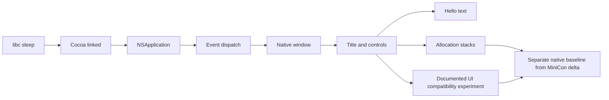

# Native Hello World memory attribution

Research on 2026-09-06, macOS 26.5.1 ARM64, SDK 26.5, clang `-O2`.
The product criterion remains host RSS, with the 10 MiB intent unchanged.
This is one host's controlled experiment, not a universal GUI lower bound.

```text
Explain the native GUI baseline before attributing MiniCon's increment
├── Initialization ladder
│   ├── invariant: separate processes, same host, no terminal or Rust
│   ├── evidence: three ps RSS samples per variant, resident vmmap
│   ├── safe failure: retain unexplained cost; never equate virtual size with RSS
│   └── dependency: native Cocoa toolchain; non-goal: product edits
├── Window style comparison
│   ├── invariant: controlled style/launch changes only
│   ├── evidence: title-only, close, resize, borderless and compatibility variants
│   ├── safe failure: do not ship missing window controls as an optimization
│   └── dependency: initialization ladder; non-goal: changing OS preferences
└── Allocation cause
    ├── invariant: stack logging is a separate, instrumented run
    ├── evidence: native ColorSync allocation stacks
    ├── safe failure: requested allocation bytes are not claimed as resident bytes
    └── dependency: stable Hello probe; non-goal: full terminal qualification
```



## Measurements

Each row is three fresh processes, sampled with `ps -o rss= -p PID` two
seconds after READY. Values are medians in MiB (RSS KiB × 1024 / 1048576).
The first repetition also has `vmmap -resident`. All GUI runs use accessory
activation policy, `orderFront:` without activation, and dispatch events.
Each child is terminated and reaped in a `finally` block. No focus calls,
global preferences, purge commands or product files are involved.

| Probe | RSS MiB | What it isolates |
|---|---:|---|
| libc executable, sleep | 1.375 | Process/runtime baseline |
| Cocoa linked, no Objective-C initialization in main | 8.141 | Framework/link/runtime initialization |
| Foundation date object | 8.141 | This tiny Foundation use adds no measurable RSS |
| NSApplication + accessory policy, sleep | 26.719 | AppKit application initialization adds 18.578 |
| Application event loop, no explicit finishLaunching | 31.016 | Event dispatch adds 4.297 |
| Application event loop + finishLaunching | 31.344 | Explicit launch completion adds 0.328 |
| Blank borderless window, 320×200 points | 37.000 | Basic window adds 5.656 |
| Borderless + resize style | 37.047 | Resize bit alone adds little |
| Title only, no close control | 46.188 | Title construction adds about 9.19 |
| Title + close | 49.344 | Standard close control adds about 3.16 |
| Title + close + resize, blank | 49.203 | Standard usable window baseline |
| Same window hidden | 49.063 | Cost is triggered before visible presentation |
| Standard window + Hello label | 49.531 | Actual label adds only 0.328 |
| Hello, shadow disabled | 49.438 | No meaningful reduction |
| Hello, omit explicit finishLaunching | 49.375 | No meaningful reduction; not a proposed lifecycle shortcut |
| Borderless Hello | 38.547 | Lower-cost diagnostic, lacks standard title/close controls |

The initial independent probe in `target/memory-probes/native-results.json`
found approximately 49.55 MiB for a standard Hello window; this staged probe
reproduces that result. The user's text is not allocating 50 MiB: most growth
precedes the label. Neither Rust, winit, a PTY nor MiniCon exists in this
executable.

## Identified mechanisms and a concrete reduction

The title-and-close window newly maps SwiftUI and TextAnimationSupport
compared with borderless. Title-only does not map SwiftUI; adding close does.
Separate `malloc_history -allBySize` tracing shows standard close-widget
construction enters the current OS UI stack, while titlebar material setup
also reaches image lookup, CoreUI assets and LaunchServices type databases.
These are call-path attributions; mapped-file sizes are not RSS savings.

Native Hello also requests eleven 1,081,344-byte ColorSync TRC heap tables
(11,894,784 bytes; about 11.34 MiB) in instrumented runs, including Core
Animation glyph rendering, backdrop layers and window gamut setup. Borderless
Hello requests six such tables (6,488,064 bytes). This independently matches
the kind of ColorSync allocations seen in MiniCon: they belong substantially
to the native GUI baseline, not uniquely to terminal functionality. These
are requested allocation bytes under instrumentation, not an assertion that
all requested pages are resident or live dirty pages in the uninstrumented
sample. The Hello vmmap footprint is only 15.2 MiB; allocator VM reservation,
residency and stack-logging accounting must remain separate.

Apple documents `UIDesignRequiresCompatibility` as a temporary old-design
compatibility mode. Two otherwise identical standalone executables, with an
embedded `__TEXT,__info_plist` setting it false versus true, measured:

| Standard title/close/resize + Hello | RSS median MiB | First-run footprint MiB |
|---|---:|---:|
| Modern design, explicit false | 49.859 | 15.4 |
| Compatibility design, explicit true | 42.906 | 13.1 |

This is a **6.953 MiB RSS reduction with standard window controls retained**.
The compatibility probe no longer maps SwiftUI. It is the lowest measured
standard-control Hello variant here; it is not a proven lower bound or a
full GUI behavior qualification. The approximately 38.55 MiB borderless
Hello is a diagnostic with missing native controls, not an acceptable drop-in
MiniCon host. Neither result meets 10 MiB.

The compatibility key is a bounded integration experiment worth measuring on
MiniCon's exact artifact. It is not a durable architectural solution: Apple
says it is temporary and ignored when building against SDK 27 or later.
Do not ship by silently dropping close/resize, opting out of dark mode,
omitting event lifecycle, or changing global accessibility preferences.

Sources: [Apple compatibility-key documentation](https://developer.apple.com/documentation/bundleresources/information-property-list/uidesignrequirescompatibility),
[Apple Liquid Glass adoption guidance](https://developer.apple.com/documentation/TechnologyOverviews/adopting-liquid-glass).

## Input and menu initialization changes the fair comparison

A second matched four-way experiment uses the same standard Hello window,
then adds an editable `NSTextField` as first responder and requests the field
and field editor's input contexts, and/or installs a minimal main `NSMenu`
containing a separator. No activation/focus-stealing call is made.

| Native variant | Three-run RSS median MiB | First-run footprint MiB |
|---|---:|---:|
| Label-only Hello | 49.578 | 15.3 |
| Editable Hello + first responder + input contexts | 83.391 | 18.5 |
| Label + minimal main menu | 76.453 | 15.9 |
| Editable/input-context Hello + menu | 87.328 | 18.8 |

Input setup adds **33.813 MiB RSS** and menu setup adds **26.875 MiB**
in isolation, but their costs overlap: together they add **37.750 MiB**,
not 60.688 MiB. This is native Objective-C, still with no terminal parser,
Rust, PTY, softbuffer or product logic. A label-only 50 MiB baseline therefore
omits text input and menu initialization relevant to a terminal host. The
remaining comparison must match those capabilities before assigning a
roughly 50 MiB difference to MiniCon-owned state.

A follow-up separates editable-control construction from explicit responder
and input-context calls: editable control alone is **83.219 MiB**, adding
`makeFirstResponder:` is **83.234 MiB**, and also requesting input contexts
is **83.141 MiB** (three-run medians). The large increment is already triggered
by editable-control initialization/display, not demonstrably by an explicit
IME call. The full input probe confirms first-responder acceptance, an
`NSTextView` field editor, and a non-null input context. This narrows the cause
to the native editing/control initialization path; it does not establish
which required subset a custom terminal input client must retain.

This does not prove that every terminal must use an 87 MiB native host:
`NSTextField`'s field editor can initialize richer editing functionality
than a custom terminal input client needs. Nor has active CJK composition
been qualified here. These measurements identify initialization to inspect
and minimize, not a new accepted budget. The small footprint increments
alongside the large RSS increments indicate the difference is not an
additional 34 MiB of dirty text buffers; detailed mapping accounting remains
necessary for an exact page attribution.

## Accounting limits

`ps` RSS is the product metric. Footprint, dirty pages and file mappings
explain it without replacing it. Apple's
[memory profiling explanation](https://developer.apple.com/videos/play/wwdc2022/10106/)
distinguishes resident clean executables/mapped files from footprint.
Do not sum vmmap region residency into ps RSS: here vmmap's app-init TOTAL
is 346.4 MiB even though ps reports 26.72 MiB, because its region view includes
shared-cache mapping residency under different accounting. Likewise large
SwiftUI/CoreUI/LaunchServices VM reservations do not prove equally large
process RSS. The [vmmap documentation](https://developer.apple.com/library/archive/documentation/Performance/Conceptual/ManagingMemory/Articles/VMPages.html)
describes region-level sharing and residency.

This experiment has a warm system cache, one display/session configuration,
short idle sampling, accessory policy and no interactive focus/IME/menu
qualification. It establishes causes and useful comparisons on this host;
it does not establish an irreducible OS cost or satisfy MiniCon's RSS court.
Further native-host design must preserve close, resize, focus, IME, clipboard,
window-server integration and accessibility before treating a replacement
as a product solution.

## Reproduction and evidence

Local generated code and evidence are under ignored
`target/hello-memory-track/`; existing parent probes remain untouched.

```sh
sh research/hello-memory/build.sh
python3 research/hello-memory/run.py
python3 research/hello-memory/run-styles.py
python3 research/hello-memory/run-compat.py
python3 research/hello-memory/collect-stacks.py
python3 research/hello-memory/run-input.py
python3 research/hello-memory/run-input-stages.py
```

`probe.m`, `libc.c`, `modern.plist` and `compat.plist` are the source inputs.
`results.json`, `style-results.json`, `compat-results.json`,
`input-results.json`, `input-stages-results.json`, each
`*-vmmap.txt`, `hello-stacks.txt`, `borderless-hello-stacks.txt`, and
`colorsync-stack-summary.json` retain raw samples and causal evidence.
Expanded home paths were redacted from saved diagnostic output. No product
code or Cargo dependency was changed by this research track.

Probe source and compact numeric results are retained in `research/hello-memory/`;
generated binaries and detailed native dumps remain in `target/hello-memory-track/`.

## Follow-up: separate class, instance and component initialization

After integration `80d3964`, research-only probes narrowed the first 18 MiB
increase. Each value below is a three-process median on the same macOS host.
The staged process pauses on stdin while the parent samples RSS two seconds
later; it creates no windows. The comparison either retains initialization
objects in an outer autorelease pool or drains a nested pool after each stage.

| Completed stage | Retain pool, MiB | Drain each stage, MiB |
|---|---:|---:|
| Foundation autorelease pool | 8.188 | 8.188 |
| `NSApplication.sharedApplication` | 26.609 | 26.578 |
| Accessory activation policy | 26.688 | 26.609 |
| `finishLaunching` | 27.266 | 27.234 |
| Dispatch events | 31.234 | 31.219 |
| Drain outer pool | 31.234 | 31.219 |

Explicit pool draining does not recover the large increment. Accessory policy
is also not the principal trigger. First-run shared-application diagnostics
show about 1.15 MiB of live malloc allocations and 6.08 MiB footprint; neither
supports calling the roughly 18 MiB RSS increment a heap leak.

Fresh-process class/locale probes further separate Objective-C `+initialize`
from application instance creation. Sending the inherited public
`instancesRespondToSelector:` message to `NSApplication` triggers class
initialization without requesting a shared application instance.

| Probe | RSS MiB |
|---|---:|
| Cocoa linked | 8.172 |
| Fixed `en_US_POSIX` locale | 8.797 |
| Current locale | 10.031 |
| `NSApplication` class initialization only | 11.000 |
| Shared application plus accessory policy | 26.688 |

An instrumented `malloc_history -allBySize` run identifies locale prewarming
under `+[NSApplication initialize]`, including an ICU file mapping, and system
appearance registration under `-[NSApplication init]`, including CoreUI asset
mappings. These are triggers, not RSS-sized allocations: in particular, the
35,454,976-byte ICU `mmap` is virtual mapping length and must not be reported
as a 34 MiB resident leak. Locale-only measurements rule out charging the
whole application increment to locale prewarming.

Independent component probes start with the same application class
initialization, then call one public API, without creating an application
instance or window:

| Component after class initialization | RSS MiB |
|---|---:|
| Class initialization baseline | 11.031 |
| Named Dark Aqua appearance | 13.375 |
| Screen enumeration | 16.422 |
| Workspace singleton | 10.984 |
| General pasteboard | 10.984 |
| System font, 12 pt | 14.047 |
| Full shared application plus accessory policy | 26.625 |

Screen discovery is a reproducible roughly 5.4 MiB isolated increment;
appearance roughly 2.3 MiB and font setup roughly 3.0 MiB. These may overlap
and must not be summed into an exact account of the application instance.
The existing user's appearance is not changed; the appearance probe requests
a named object only. No production shortcut, private API, lifecycle override,
menu removal or text-input change is accepted from these measurements.

Reproduce from the repository root:

```sh
python3 research/hello-memory/run-init-stages.py
python3 research/hello-memory/run-locale.py
INIT_COMPONENTS=1 python3 research/hello-memory/run-locale.py
```

Compact samples: `research/hello-memory/init-results.json`,
`locale-results.json`, `component-results.json`. Detailed local diagnostics:
`target/hello-memory-init/`, including `app-init-stacks.txt`; component logs:
`target/hello-memory-components.log`. The product binary and pin are unchanged.

### Menu construction is more specific than installing an empty menu

A further three-run comparison keeps the standard Hello window and varies
only menu setup (modern-design probe, no compatibility plist):

| Menu setup | RSS MiB |
|---|---:|
| No menu | 49.828 |
| Install empty `NSMenu` | 49.797 |
| Empty menu plus `NSMenuItem` class initialization | 49.750 |
| Menu with ordinary Quit text item and Cmd+Q equivalent | 72.609 |
| Menu with separator item | 76.344 |

The large trigger is item construction, not merely setting the main menu or
initializing the menu-item class. A separator adds more in this isolated
probe than an ordinary text item. This motivates a MiniCon comparison that
removes only separator items while retaining all commands and shortcuts;
it does not justify removing the native menu or claiming the 3.7 MiB
standalone difference is an additive product saving.

Reproduce: `INIT_MENUS=1 python3 research/hello-memory/run-locale.py`.
Compact samples: `research/hello-memory/menu-stage-results.json`.
