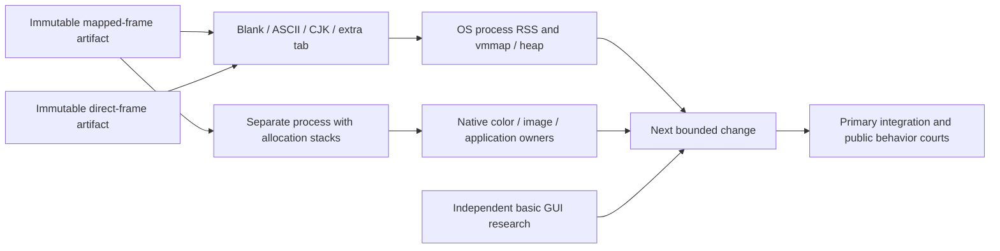

# MiniCon memory above a basic GUI: macOS aarch64 research

Owner: MiniCon incremental-memory research. This is diagnostic evidence, not
10 MiB acceptance or six-cell qualification. Product truth remains in
`prd/PRD_02_27_con_delivery.md`, Runtime host memory.

```text
Explain and reduce memory required above a basic GUI
├── Controlled content and tab experiment
│   ├── invariant: same artifact, geometry, public CLI, host RSS only
│   ├── evidence: target/minicon-memory-track/{content-results.json,direct/results.json}
│   ├── safe failure: retain raw evidence; do not infer fresh zero-tab cost after close
│   └── non-goal: shrinking the PTY ring or removing terminal features
├── Allocation attribution
│   ├── dependency: full malloc_history stacks, separate instrumented process
│   ├── evidence: target/minicon-memory-track/all-by-size.txt
│   ├── invariant: mapping virtual size and footprint are not RSS
│   └── safe failure: unresolved Rust symbols remain unresolved
└── Implementation integration (primary agent)
    ├── evidence: same public RSS and rendering courts
    └── non-goal: accepting diagnostic savings as product qualification
```



## Controlled measurements

2026-09-06, macOS 26.5.1, aarch64, release. Public launch:
`--no-activate --cols 80 --rows 24 --control ENDPOINT -e /bin/cat`.
The normal window is 960 × 600 logical pixels, 1920 × 1200 physical pixels.
Private IPC parent is a new mode-0700 directory directly under `/private/tmp`.
Each phase settles two seconds; `ps -o rss=` is sampled three times, then
`vmmap -resident`, `heap -s`, `list-tabs`, and `ui-snapshot` are captured.
All three immediate RSS samples agreed per phase. These are controlled probes,
not substitutes for the named public regression court.

| State | Mapped-frame artifact RSS MiB | Direct-frame artifact RSS MiB |
| --- | ---: | ---: |
| One tab, blank `/bin/cat` | 92.922 | 84.172 |
| ASCII text | 93.062 | 84.312 |
| Add four CJK characters | 93.234 | 84.469 |
| Add second tab | 94.578 | 85.781 |
| Close both tabs, greeting | 94.531 | 85.688 |

Mapped artifact: `target/memory-probes/minicon-mapped-frames`, SHA-256
`5574a54f8d95c41d265b1241ddfdc1f97394fe7c1d41db3a1682b834f057f45c`.
Direct artifact: `target/memory-probes/minicon-direct`, SHA-256
`d737ff008a638622d545d27bc918c22f160d28f0b28059fbcdb78d77460b6c91`.

Removing the product's retained full canvas independently saves **8.750 MiB**
in this pair, matching a 1920 × 1200 × 4-byte canvas (8.789 MiB). The direct
process has no `MALLOC_LARGE` entries in vmmap and 18,766,744 allocated heap
bytes. Its footprint is 20.4 MiB; its RSS is still 84.172 MiB.

An extra tab adds **1.31–1.34 MiB**. ASCII plus CJK add about **0.3 MiB**.
Closing tabs does not reset allocator and OS caches, so the greeting sample
cannot establish the cost of a fresh process that has never created a tab.
The blank terminal still renders product chrome: its Hiragino mapping already
has 224 KiB resident, zero dirty; the CJK phase increases resident font pages.
Neither the blank nor CJK sample maps `Apple Color Emoji.ttc`.

## What the remaining allocations actually belong to

A separate mapped-artifact process used `MallocStackLogging=1`. Its RSS is
excluded from the table because instrumentation adds memory. Full
`malloc_history PID -allBySize` stacks, not inferred heap type names, attribute
**11,953,920 bytes (11.400 MiB)** to ColorSync tone-response tables:

| Trigger in the allocation stack | Allocated MiB |
| --- | ---: |
| QuartzCore native glyph drawing | 3.109 |
| QuartzCore layer color conversion | 2.073 |
| Native backdrop layer color conversion | 2.073 |
| NSWindow gamut initialization | 1.036 |
| QuartzCore image rendering color conversion | 2.073 |
| QuartzCore image gamma matching | 1.036 |

The last two paths total **3.109 MiB**, and concern the image presentation path.
Independent basic-GUI research also found eleven large TRC allocations in
native Hello (`target/hello-memory-track/hello-stacks.txt`), matching this
process's eleven large tables. Its 11,894,784-byte total counts the large
allocations; the 11,953,920-byte total above also includes small companion
allocations. These tables therefore belong substantially to the native GUI
baseline, not an incremental MiniCon-only burden. Most of these tables are
native decoration and compositor costs, not terminal text rasterization. For example, native glyph drawing calls
`CACGContextEvaluator::update_with_color_components` and then
`CGColorSyncTransformCacheGetRetained`; image preparation calls
`CA::Render::copy_image`, then `CARequiresColorMatching` or
`create_image_by_rendering`. All end in `CMMParaCurveTag::MakeTRC` or
`MakeInvertedTRC` allocations. This explains why merely changing the source
image's color space need not remove all ColorSync allocations.

A full startup stack also identifies `NSMenuItem separatorItem` → `NSImage`
system symbol catalog → CoreGlyphs `Assets.car` mmap. That mapping is 152.8 MiB
virtual but only 4064 KiB resident and zero dirty in this process. It is neither
another whole-font heap leak nor 152.8 MiB of process RSS. Application menu
construction is a concrete future ablation candidate in an isolated probe;
removing expected application menu functionality is not authorized by this
research result.

Product code audit bounds other owners:

- Each terminal owns one bounded PTY output pipe and a VT parser; observed tab
  deltas are consistent with its 1 MiB handoff plus screen and thread state.
- Glyph cache reserves 4096 entry slots and grows bitmap content on use. The
  controlled text deltas provide no evidence of a second tens-of-MiB cache.
- Control replay has an 8 MiB maximum, not an upfront 8 MiB allocation. The
  measured idle snapshot has zero pending waits, screenshots, and accessibility
  actions, with empty composer and IME preedit. No screenshot command was issued.
- Full stripped-release Rust stacks contain unresolved addresses. Older
  `heap -s` labels containing `gimli` name shared generic allocation helpers;
  they do not prove a Rust debug-information allocation owner.

## Next evidence needed

The primary agent owns the now-measured two-frame reductions and integration.
Independent basic-GUI research owns the native baseline. A raw subtraction of
the approximately 49 MiB native Hello sample from the approximately 84 MiB
MiniCon direct sample does **not** make the remainder terminal requirements:
window/menu/input initialization and presentation paths differ.

The next useful isolated comparison should add the same pixel presentation,
application menu, and input initialization to the native control, one at a
time. The already measured ColorSync image paths and menu symbol-catalog
startup stack identify precise triggers. Preserve IME, native decorations,
terminal behavior and RSS acceptance when deciding a product change. A
measurement that removes such behavior can diagnose an owner but cannot itself
be accepted as a fix.

Reproducer retained locally: `target/minicon-memory-track/probe.py`.
Set `TRACK_BINARY` and `TRACK_OUT` to choose an immutable artifact and isolated
output directory. `TRACK_STACKS=1` runs the separate instrumented phase and
holds it briefly for `malloc_history`; do not compare its RSS to normal runs.
No production source or shared checkout was changed by this research track.

The reproducible probe is retained as `research/minicon-memory/probe.py`
(defaults to `target/release/minicon`; set `TRACK_BINARY` for an exact comparison).
The rejected lazy-input-context prototype is preserved as a research-only patch.
It is not included in production dependencies.

## Follow-up: default-menu separators do not explain remaining RSS

The native Hello menu-stage probe found a separator-only menu at 76.34 MiB,
versus an ordinary Quit item at 72.61 MiB. A product experiment therefore
removed only the two separator items from registry winit 0.30.13's default
menu, retaining About, Services, Hide, Hide Others, Show All, Quit and their
selectors/modifiers. It used an ignored local copy and a command-line Cargo
patch; no production dependency or source override remains.

Three alternating fresh-process release runs, the same `--no-activate`
80×24 `/bin/cat` startup and a sample three seconds after public `ui-snapshot`:

| Artifact | Three RSS samples, MiB | Median MiB |
|---|---|---:|
| Integrated `80d3964` baseline | 79.656, 78.750, 78.750 | 78.750 |
| Default menu without separator items | 78.656, 78.750, 78.891 | 78.750 |

There is **no reproducible product saving**. The isolated native menu
comparison cannot be added to the actual terminal's savings; initialization
costs overlap. The experiment is rejected, so no native menu behavior change
or new winit fork is introduced. No keyboard/IME qualification is claimed for
the rejected artifact. The baseline source, Cargo lock and release artifact
are restored; the product target remains 10 MiB RSS.

Retained reproduction inputs: `research/minicon-memory/no-separators.patch`
(applies to winit 0.30.13), `menu-comparison.py`, and `menu-results.json` with
both artifact SHA-256 values. To repeat, freeze the integrated release as
`target/minicon-menu-probe/baseline`, build an isolated patched winit artifact
as `target/minicon-menu-probe/no-separators`, then run
`python3 research/minicon-memory/menu-comparison.py`. Detailed logs remain in
`target/minicon-menu-probe/`. Never leave the experimental Cargo patch or
artifact in the production build after measurement.

A closer native custom-input/pixel, shared-host checkerboard and MiniCon
comparison follows in [the pixel-host report](research-pixel-host.md), including
application-policy controls and repeated RSS time series.
