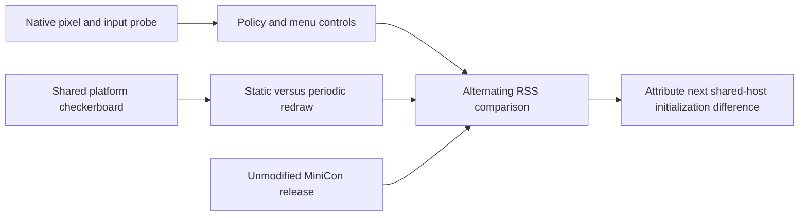

# Native pixel/input host versus shared host versus MiniCon

Research on macOS 26.5.1 aarch64, after `fb492c3`. The production pin remains
`8d8de88c9ab62709327a6358609e9a09e8c363fd`; production source and binary are
unchanged. This is host attribution, not a product qualification or release.

```text
Explain the remaining RSS with closer capability matches
├── Native Objective-C owner
│   ├── invariant: standard controls, 960×600 points, real mapped pixel presentation
│   ├── evidence: screenshot, layer geometry, input-context and responder receipts
│   ├── failure: incomplete input/resize behavior is not a replacement host
│   └── non-goal: NSTextField field editor or terminal emulation
├── Shared-host owner
│   ├── dependency: production platform/softbuffer pin and dependency versions
│   ├── invariant: same checkerboard and input cursor, standard default menu
│   ├── evidence: static and 500 ms redraw variants, repeated RSS series
│   └── failure: startup/compression variation cannot become a fixed allocation claim
└── Comparison owner
    ├── invariant: RSS, same display, native release, separate sequential processes
    ├── evidence: three rounds, exact hashes, same-window heap/vmmap
    └── non-goal: replacing RSS with footprint or claiming 10 MiB success
```



## Native capability ladder

`research/hello-memory/pixel-host.m` creates a standard titled, closable,
resizable window at 960×600 logical points. Its custom `NSTextInputClient`
implements marked-text storage, insertion callbacks and candidate geometry
without using an `NSTextField` or field editor. It becomes first responder
without activating the application. Input variants explicitly request the
input context; receipts confirm responder acceptance and a non-null context.

Pixel variants fill a 1920×1200 XRGB anonymous mapping (9,216,000 bytes), make
it read-only and transfer ownership to a CoreGraphics data-provider callback.
The image uses the display color space and a Core Animation sublayer, matching
the shared presentation mechanism. The sublayer uses explicit view bounds;
logging confirms view/root/pixel geometry is 960×600 and image contents exist.
An OS screenshot of this probe window was visually inspected: the checkerboard
fills the content area beneath standard controls. Generated visual evidence:
`target/hello-pixel-host/visual.png` and `visual.log`.

Menu variants install About, Services, Hide, Hide Others, Show All and Quit,
including the default modifiers and separators. No native command is removed.

Three fresh processes per stage, sampled two seconds after READY:

| Native stage | Modern design, MiB | Compatibility design, MiB |
|---|---:|---:|
| Custom view | 49.688 | 42.641 |
| Custom view + input context | 49.719 | 42.719 |
| Pixel layer | 49.734 | 42.625 |
| Pixel layer + input context | 49.719 | 42.703 |
| Pixel layer + complete default menu | 76.609 | 69.719 |
| Pixel layer + input context + default menu | 76.531 | 69.813 |

The initial exploratory single sample around 57 MiB was not stable; it is not
used as the native baseline or a promised saving. Geometry was made explicit
and the full ladder rerun before retaining these results. Pixel virtual byte
length does not imply that all pages remain in host RSS after presentation;
for example the later native vmmap shows only 16 KiB resident in its 9008 KiB
mapping. A displayed frame is not proof of a permanently resident host copy.

## Alternating product comparison

A standalone Rust checkerboard calls the same `run_pixel_window` facade as
MiniCon, with IME enabled and the same caret geometry. It has no terminal
parser, PTY, font raster calls or product canvas. The standalone Cargo lock was
seeded from MiniCon's lock: every dependency package/version/source is shared
with MiniCon; only the probe package itself is additional. Its release profile
matches MiniCon and it embeds the same design-compatibility setting.

Three sequential rounds alternate native, shared, shared with 500 ms redraw,
and MiniCon. Each starts a new process. After READY (or MiniCon's public
`ui-snapshot`), wait three seconds, then take five RSS samples one second
apart. Below, each process contributes its five-sample median; the final
column is the median across the three processes.

| Program | Per-process medians, MiB | Overall median, MiB |
|---|---|---:|
| Native pixels + input + default menu, accessory policy | 69.813, 69.984, 69.828 | 69.828 |
| Shared host, static checkerboard | 80.219, 80.359, 80.188 | 80.219 |
| Shared host, redraw every 500 ms | 79.484, 79.484, 79.625 | 79.484 |
| Unmodified MiniCon, one `/bin/cat` tab | 78.922, 78.719, 79.109 | 78.922 |

The shared checkerboard can already reach MiniCon's RSS with no terminal
state. This rejects assigning the supposed extra 50 MiB to terminal features.
Periodic redraw does not add another stable 9 MiB in this test; the static
probe is slightly higher. The difference is not a negative terminal cost:
these programs touch different initialization and allocation paths, and RSS
is not a linear feature ledger.

An earlier three-sample exploratory run varied much more (shared first sample
69.33 MiB, another 80.06 MiB), and one same-window vmmap reported 8272 KiB swapped
inside frame-related VM_ALLOCATE regions. The longer series is retained along
with this uncertainty; neither an outlier nor summed vmmap residency owns the
conclusion. Footprint remains explanatory only.

## Activation-policy control

The native probe originally used accessory policy. The shared Unix adapter
only sets winit's activation behavior, not its application policy; winit's
unbundled default selects Regular. This is a real comparison difference.
A separate three-round native A/B changes only the policy, makes no explicit
activation call, and retains all pixel/input/menu setup:

| Native policy | Three RSS samples, MiB | Median, MiB |
|---|---|---:|
| Accessory | 69.719, 69.859, 69.766 | 69.766 |
| Regular | 71.078, 71.031, 71.047 | 71.047 |

Regular policy accounts for about 1.28 MiB here; it does not explain the entire
native/shared difference. The remaining roughly 8–9 MiB comparison gap is a
bounded next investigation into shared-host initialization and presentation,
not a proven allocation owned by winit and not a projected product saving.
Replacing winit with this incomplete native probe would not reach 10 MiB.

## Limits and reproduction

These probes do not qualify first CJK composition, visible preedit, selection,
clipboard, accessibility, monitor changes or resize backing updates. The Rust
probe is terminated by the runner; its close event is not a product lifecycle
implementation. The native prototype is not ready to replace the shared host.
No product patch follows solely from the memory comparison.

```sh
python3 research/hello-memory/run-pixel-host.py
PIXEL_POLICY_ONLY=1 python3 research/hello-memory/run-pixel-host.py
CARGO_TARGET_DIR=target cargo build --offline --locked --release --manifest-path research/pixel-platform/Cargo.toml
python3 research/pixel-platform/compare.py
```

Native compact samples: `research/hello-memory/pixel-host-results.json` and
`pixel-policy-results.json`. Shared/product time series and exact artifact
hashes: `research/pixel-platform/results.json`. Generated binaries, window logs
and native dumps stay in `target/hello-pixel-host/` and
`target/pixel-platform-comparison/`. Compilation, Python/JSON parsing and the
actual automated runs validate these research tools; no new product test PASS
or cross-platform claim is made. **The 10 MiB RSS target remains unmet.**
