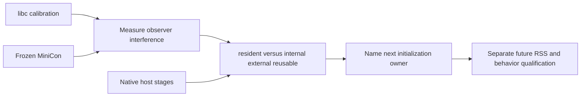

# macOS host RSS ledger attribution

Research on macOS aarch64 after MiniCon `ad991b0`. Product RSS remains the
acceptance criterion; footprint and compression only explain its components.

```text
Account for the remaining host RSS without changing the metric
├── Self-observation owner
│   ├── invariant: TASK_VM_INFO reads only the process we launched
│   ├── evidence: kernel return/count, matching PID, ps RSS time series
│   ├── safe failure: absent injection or unsupported fields fail the run
│   └── non-goal: production code, dependency or OS preference changes
├── Diagnostic interference owner
│   ├── dependency: same frozen executable and host
│   ├── invariant: plain / library-only / active runs alternate sequentially
│   ├── evidence: native libc calibration and product repetitions
│   └── safe failure: do not subtract a guessed fixed observer cost
└── Initialization owner
    ├── dependency: successful ledger closure
    ├── invariant: anonymous/file-backed classifications keep their kernel meaning
    ├── evidence: matched native host capability stages and MiniCon
    └── non-goal: relabeling shared mapping totals or repeating rejected fixes
```



## Mechanism

`research/rss-ledger/ledger.c` is a research-only dynamic library. It matches
the requested executable name before doing anything; its constructor removes
`DYLD_INSERT_LIBRARIES` from that child's environment so future spawned
programs do not inherit injection. Active mode starts one detached pthread
with a 64 KiB stack. Once per second it reads its own `TASK_VM_INFO`, writes
one bounded JSON line to a mode-0600 exclusive file, and stops after 20 samples.
There is no Mach remote-task permission request, allocator relief, memory
purge, timer added to the GUI event loop, or product/shared-source edit.

The loaded-only control maps the same library without a diagnostic thread or
file. A plain control has no injection. The runner freezes the canonical
MiniCon release into `target/rss-ledger/minicon`, retaining its SHA-256;
public `ui-snapshot` supplies readiness. CLI helper invocations are never
injected. Five external `ps -o rss=` samples start three seconds after
readiness, one second apart. Each active sample retains the latest kernel
receipt and its time offset; all children close or terminate and are reaped.
GUI comparisons run in a coordinated exclusive measurement window.

## Accounting interpretation

Apple's [XNU task implementation](https://github.com/apple-oss-distributions/xnu/blob/f6217f891ac0bb64f3d375211650a4c1ff8ca1ea/osfmk/kern/task.c)
reads `resident_size` from the `phys_mem` ledger and independently reads
`internal`, `external`, `reusable`, and `internal_compressed`. Its task-ledger
comment identifies internal memory as anonymous memory and says compressed
pages are no longer resident in that process's pmap.
The [ARM pmap implementation](https://github.com/apple-oss-distributions/xnu/blob/f6217f891ac0bb64f3d375211650a4c1ff8ca1ea/osfmk/arm/pmap/pmap.c)
credits resident pages to internal, external or reusable according to mapping
flags. We test that measured resident closes against their sum, rather than
assuming all RSS minus footprint is a single clean-file category.

These classifications are not a malloc ownership report: internal can contain
copy-on-write pages and non-malloc mappings; reusable is separately accounted.
Compressed is a logical page count in bytes charged to compression, not the
physical byte size of the compressor's encoded data. Footprint includes other
ledger adjustments and remains separate from the product RSS criterion.
The published source explains the API accounting; it is not claimed to be
an exact source checkout of the installed kernel build.

## Measured ledger closure

The frozen MiniCon release SHA-256 is
`7d08627d494af396885843ec016d554c4b8d9b520c80bcf0757e7fa54e89c527`.
The standard-control native Regular-policy pixel/input/default-menu probe is
`6f955871bb4614fbb11982f5b982a12c8d3cadc51e45826c449eac2035563ae0`.
Seventeen GUI processes ran sequentially in the allocated measurement window:
nine MiniCon controls, four matched native controls, four native stages.

Two exact MiniCon receipts illustrate why both resident and compression must
be recorded. Values are MiB; no component is deducted from product RSS.

| Kernel receipt | resident | internal | external | reusable | compressed | footprint |
|---|---:|---:|---:|---:|---:|---:|
| Active run 0, sample 3 | 79.265625 | 18.046875 | 60.718750 | 0.500000 | 0 | 18.7665 |
| Active run 2, sample 3 | 78.953125 | 18.234375 | 60.718750 | 0 | 0 | 18.9383 |

**Every recorded kernel receipt closes exactly:**
`resident = internal + external + reusable`, with zero byte residual across
all active product/native/stage samples. This establishes roughly **18 MiB
anonymous/internal residency and 60.72 MiB external-object residency** in an
uncompressed approximately 79 MiB host. The 60.72 MiB still counts toward the
10 MiB RSS requirement. Even eliminating every external page in the second
receipt would leave more than 18 MiB internal residency, before preserving
functional code/data dependencies; this is a diagnostic counterfactual, not
a feasible intervention or revised budget.

External is not synonymous with “ordinary clean file”, “shared with another
app” or “safe to discard now”. The kernel credits pages according to whether
the VM object is internal/default-pager backed; its
[VM object definition](https://github.com/apple-oss-distributions/xnu/blob/f6217f891ac0bb64f3d375211650a4c1ff8ca1ea/osfmk/vm/vm_object_xnu.h)
and [fault path](https://github.com/apple-oss-distributions/xnu/blob/f6217f891ac0bb64f3d375211650a4c1ff8ca1ea/osfmk/vm/vm_fault.c)
do not give this ledger a per-file or sharing guarantee. File-backed code,
fonts and resource mappings are supporting owners in existing vmmap evidence,
but this API alone cannot certify what fraction of 60.72 MiB is an ordinary
file versus another external-pager object. Nor is internal restricted to
malloc: it includes anonymous mappings and private copy-on-write pages.

`device = 0` is not proof that device-related memory is absent: the examined
XNU TASK_VM_INFO path explicitly initializes that field to zero. Likewise
TASK_VM_INFO's zero volatile-pmap fields do not constitute a complete
purgeable-memory inventory; the separate PURGEABLE flavor performs that query.
No diagnosis relies on interpreting these zeros as the absence of resources.

## A spontaneous 11 MiB RSS drop is compression, not a fix

In active MiniCon run 1, the same process crosses these states:

| Sample index | RSS MiB | internal MiB | external MiB | compressed MiB |
|---|---:|---:|---:|---:|
| 3 | 79.156 | 17.516 | 60.719 | 0 |
| 4 | 79.156 | 17.516 | 60.719 | 0 |
| 5 | 68.016 | 7.297 | 60.719 | 10.672 |
| 6 | 68.219 | 7.516 | 60.703 | 10.000 |

Reusable accounts for the remainder in each exact receipt. External stays
nearly constant while internal pages move into compression. There was no
optimization call, purge or relief operation. Other plain/library-only runs
also fall by 9–11 MiB during sampling. This is evidence against interpreting
a low isolated sample, or a fresh-process A/B difference, as reclaimed live
allocations. The machine's compression behavior must be reported when judging
small future changes.

## Observer interference

The libc probe measures the loaded-library and active-observer costs without
GUI initialization. Its uncompressed repetition 1 is 1.375 MiB plain, 1.4375 MiB
loaded only, and 1.46875 MiB active: **64 KiB for mapping/constructor paths,
and another 32 KiB for the active reader**. All three calibration repetitions are retained
in `calibrate-results.json`. Even libc is subject to compression: repetition 0
active has 0.797 MiB RSS and 0.672 MiB compressed, while repetition 2 active
returns to 1.469 MiB with zero compressed. Therefore the 96 KiB is the observed
uncompressed control cost, not a guaranteed correction under arbitrary memory
pressure. The diagnostic is small, not free.

Product five-sample RSS medians, by alternating repetition:

| Repetition | Plain MiB | Library-only MiB | Active MiB |
|---|---:|---:|---:|
| 0 | 79.250 | 67.859 | 79.266 |
| 1 | 69.766 | 70.391 | 68.219 |
| 2 | 79.016 | 78.828 | 78.953 |

Matched native plain/active controls are 71.094/70.328 MiB and
71.047/61.906 MiB. The second active native run also compresses about
8.53 MiB. Consequently these GUI comparisons **do not provide a stable fixed
observer correction**; none is subtracted. No multi-megabyte observer allocation is identified, but GUI initialization
and residency can still be perturbed. Subtraction across differing
compression states is invalid. All measured RSS remains the process's actual
RSS including the observer.

## Native initialization and next owner

An uncompressed matched native active receipt has resident **70.328125 MiB**,
internal **13.203125 MiB**, external **57.125 MiB**, reusable/compressed zero.
The MiniCon receipt's difference is approximately 4.844 MiB internal,
3.594 MiB external and 0.5 MiB reusable. A native implementation with pixels,
input client, default menu and standard controls already owns most of the
external residency, so 60 MiB cannot be labeled incremental terminal state.

The one-process-per-stage follow-up uses **Regular** policy throughout;
it must not be combined with earlier Accessory-policy stages as if only the
menu changed. Kernel medians are diagnostic, not repeated optimization claims:

| Native stage | internal MiB | external MiB | compressed MiB |
|---|---:|---:|---:|
| Custom input context, no explicit menu/pixels | 12.891 | 53.094 | 0 |
| Pixel presentation + custom input, no explicit menu | 13.016 | 53.094 | 0 |
| Pixels + input + complete default menu | 13.313 | 57.125 | 0 |

In this closer comparison, complete menu initialization adds about **4.031 MiB
external** and 0.297 MiB internal; pixels do not add another external tranche.
This narrows the next OS initialization owner to the native application/menu
resource path, while about 3.594 MiB external remains between full native and
product. It does **not** approve deleting or delaying functional menus, nor
revive the rejected separator-only change: product initialization overlaps,
and that earlier A/B found no product saving. Any next attempt must identify
and avoid a redundant initialization path while retaining the same visible
commands, input, activation and accessibility behavior. A matched focused
window comparison is also required before relying on no-activate startup.
No new product memory saving is claimed by this ledger experiment.

The view-only Regular stage is retained but excluded from the incremental
table: it entered a different external state (56.859 MiB) and compressed
6.328 MiB. An apparent non-monotonic stage must not be forced into an additive
allocation ledger. The exact menu and product difference still needs a
per-initialization or per-pmap-page attribution; vmmap shared-cache region
residency cannot simply be summed to supply it.

## Timing validation and reproduction

All GUI kernel calls succeeded and returned count 93 with 16 KiB pages.
The first runner used Python `time.monotonic_ns()` for external timestamps
and C `CLOCK_MONOTONIC` internally. On this macOS/Python combination their
bases differ by about **81.953726 seconds**. Therefore raw GUI
`sample_age_ms` values are invalid and are not used as evidence of timing
precision. The mismatch affects timestamps, not RSS or the fields within a
single kernel receipt. Raw records are retained; a ten-sample clock-base
calibration is saved in `timebase-calibration.json`. The runner now explicitly
uses CLOCK_MONOTONIC for both sides. Repeated libc calibration validates the
corrected timestamp path without requiring another GUI run.

The external ps readings and latest kernel sample are separate observations;
maximum observed difference is about 0.516 MiB across all GUI stages during
changing residency, and below 0.016 MiB in the stable product runs. Exact
closure is tested only within one kernel receipt. Component medians are never
silently assumed to close after independent statistical aggregation.

```sh
sh research/rss-ledger/build.sh
python3 research/rss-ledger/run.py --group calibrate
# Obtain the coordinated GUI window before the following three commands.
python3 research/rss-ledger/run.py --group product
python3 research/rss-ledger/run.py --group native --repeats 2
python3 research/rss-ledger/run.py --group stages --repeats 1
python3 research/rss-ledger/summarize.py
```

Research inputs, compact receipts and source reference are under
`research/rss-ledger/`. Generated frozen executables, JSONL time series and
process logs are under ignored `target/rss-ledger/`. Code compiles with
`-Wall -Wextra -Werror`; Python parsing and actual subprocess runs verify the
research mechanism. No production file, Cargo pin, shared checkout, global
preference, published artifact or regression ceiling changed.
**The 10 MiB RSS target remains unmet.**
