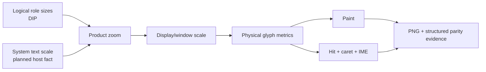

# `minicon` workspace and input

Parent: [MiniCon product requirements](../PRD.md)

This module owns the standalone host's tab tree, local chrome, external composer
input, scrollbar and divider interaction, selection and clipboard behavior, and
focus ownership. Shared physical VT selection mechanism may remain upstream;
this module owns MiniCon's interaction meaning and evidence.

Legend: `[x]` shipped, `[~]` partial, `[ ]` planned.

## Tab and window naming

- [x] a tab is named by what distinguishes it, not by what it runs. `cmd.exe`
  reports its own full path as its window title, so taking a child's title
  literally made every tab in the tree read the shell's own full path: long,
  truncated in a narrow column, and identical across every tab, which
  defeats the tab tree this product is built around.
- [x] a title that only repeats the program is treated as absent. It tells the
  user nothing they did not already know from opening it, so the short program
  name is used instead: `cmd`. A title the child genuinely sets — `title
  deploy`, or any shell's prompt escape — is information and wins.
- [x] the window title is `<title> — MiniCon`. Context first, product last: a
  title is read left to right and the part that changes belongs in front.
- [x] it carries no tab id. That is a machine identifier and it is already in
  the tab column and in `list-tabs`; a taskbar entry is read by a person.
- [x] it carries no font name either. The resolved face was in the window
  title as a development diagnostic, in the one piece of chrome a user always
  sees; `--status` reports it now, which is where someone diagnosing a font
  actually looks.
- [x] one function builds it. The OSC path and the activation path formatted it
  independently and drifted, so the same window read differently depending on
  which had written it last.

## Tab tree authority

- [x] `Workspace` is the sole authority for tree order, parentage and stable tab
  identity. Closing a parent promotes its direct children instead of terminating
  them; a parent cycle is rejected.
- [x] local creation is capped at 256 live tabs. Capacity or stable-id
  exhaustion rejects the new tab before mutating tree order, parentage or active
  selection, and the release-build session store rejects duplicate ids rather
  than silently splitting tree and PTY ownership.
- [x] session ownership is a product-specific compact store rather than a
  general-purpose ordered map: it performs linear id routing over the small
  interactive tab set and may swap entries on removal because its physical order
  is unobservable.
- [x] tree depth is a `Workspace`-owned derived cache aligned with node order.
  Root and child creation append their known depth in O(1); close and direct
  child promotion rebuild through the shared UI-core typed algorithm, which
  remains the sole authority for missing parents, duplicate ids, cycles and
  complete topology resolution. Chrome paint borrows the immutable depth slice
  instead of sorting, allocating and resolving every parent chain per frame.
- [x] geometry, iterative typed tree-depth resolution, tree viewport bounds and
  hit results are pure deterministic contracts covered independently of
  Win32/PTY state. An out-of-range hit or scroll safely becomes background or a
  bounded no-op, and a hit beyond the last row clamps rather than selecting or
  closing an unrelated terminal.
- [x] chrome geometry treats NaN pointer/sidebar values as the minimum safe
  bound and saturates extreme DPI padding and row-coordinate arithmetic.
  Untrusted/extreme dimensions cannot wrap a close target onto another row,
  overflow layout construction, or collapse the sidebar through an unordered
  floating-point comparison.
- [x] accessibility bounds use the same non-wrapping geometry policy: positive
  native coordinates and dimensions above `i32::MAX` saturate instead of
  collapsing to zero and making published controls disappear.
- [x] terminal selection endpoints are normalized once per raster pass rather
  than once per visible cell, and wide-cell/decoration geometry saturates at
  native numeric limits so malformed resize state cannot panic painting.
- [x] shared iterative tree-depth resolution sorts `(id,index)` pairs and uses
  binary lookup, preserving typed duplicate/missing/cycle failures and the
  20,000-node non-recursive test without randomized hashing. Its index replaces
  generic `slice::sort_unstable` with a shared no-allocation iterative heapsort
  that stays deterministic O(n log n) and preserves second-input duplicate
  diagnostics.

## Local chrome

- [x] the local chrome owns a vertically scrollable left tree with row-level
  close targets and one aligned top icon strip: new root terminal, Chinese,
  English, zoom out, reset and zoom in. A distinct bottom composer owns input,
  Send and Newline.
- [x] the tree header names the product, not a category. It reads `MiniCon`,
  which is the trademark and reads the same in every language, rather than a
  translatable noun.
- [x] the header row carries a visible new-root action after `MiniCon`, then a
  language switch left of the size controls. Two entries rather than one toggle: a toggle
  labelled with the language you are leaving is unreadable to exactly the
  person who needs it. Each is written in the language it selects, and the
  active one is drawn in the accent colour, so the control reports state as
  well as offering a change.
- [~] the size controls are compact icon actions: shrink, restore
  the configured launch size, and grow. The same zoom source sizes terminal
  content and every chrome label, including tabs, header tools, composer text,
  IME status, and Send/Newline buttons; hit-testing uses the matching metrics.
  **Reopened from direct macOS use:** although the zoom path is wired, the
  default non-content roles remain much too small to read. The next UI increment
  must increase the nominal tab/header/composer-button type roles, and prove
  that `z`/`0`/`Z` visibly resize them rather than only terminal content.
- [ ] larger chrome text must not make the toolbars wasteful. Reduce internal
  button padding, sibling gaps, and outer header/composer margins to the minimum
  that preserves disjoint hit targets and glyph bounds. Success is paired PNG +
  structured geometry on macOS first, then Win/Lnx parity: larger legible text,
  no clipping/overlap, and no increase in total header/composer height unless
  the old height cannot contain the larger glyph bounds. Merely enlarging the
  terminal cell font, or enlarging empty padding with the label, fails.
- [x] all three are muted and use the same size, because they are **actions**. The accent
  colour means "current state" for the language entries beside them, and one
  visual language must not carry two meanings in a single row — the old `Z` was
  accented merely for being the larger one.
- [x] **only chrome is translated.** Everything a child process prints is
  passed through untouched, and that line does not move: a terminal that
  rewrote program output would be lying about what ran. Chrome strings live in
  a struct rather than a keyed lookup, so a missing translation is a compile
  error and not a blank label found by a user.
- [x] the language is reported by `ui-snapshot` as a stable tag, so automation
  can read and assert it without matching a display label.
- [x] the six header tools stay ordered and disjoint across window widths and
  DPI scales. An overlap would make one of them unreachable, which is a defect
  no rendering test would notice.
- [~] **cross-platform sizing follows a logical-unit contract, not shared raw
  pixels.** Layout, hit targets, and nominal type roles are expressed in DIPs;
  the host window supplies a possibly fractional display scale, and raster
  glyphs are produced at `logical size × product zoom × display scale`.
  macOS points/backing pixels, Windows DIPs/per-monitor DPI, and Linux widget
  units/surface scale are platform spellings of this same boundary. The Retina
  defect where terminal glyphs used backing scale but chrome glyphs did not is
  a regression class, not a platform-specific tuning preference.
- [x] current chrome and composer painting, caret measurement, IME placement,
  and pointer-to-text mapping consume the same scaled glyph metrics. A clamp is
  expressed in logical units and scaled afterward, so a 2× display does not
  silently halve the perceived maximum.
- [ ] separate **display scale** from **system accessibility text scale** in
  the public window metrics, following Chromium's distinct device/UI/text
  scale model. Until every host adapter can report text scale truthfully,
  MiniCon product zoom remains the explicit user override; no adapter may
  invent a constant and call accessibility honored.
- [ ] qualify the same chrome roles at display scales 1.0, 1.25, 1.5, 2.0 and
  product zoom minimum/default/maximum on Win/OSX/Lnx. Evidence pairs a PNG
  with structured geometry and asserts readable glyph bounds, no clipping,
  matching caret/hit coordinates, and relayout after a cross-monitor scale
  change. System UI fonts are preferred for future chrome only when all three
  hosts can preserve these metric and screenshot contracts; terminal content
  remains monospace.

Reference models: Chromium keeps display bounds in DIP alongside physical
pixel size and distinguishes window, raster, UI, and text scales; Apple treats
backing scale as a conversion between window points and backing pixels;
Microsoft defines UI layout in density-independent effective pixels and
requires per-monitor DPI relayout/reraster; GTK similarly separates widget
units from a possibly fractional surface scale. GNOME additionally recommends
relative/system text styles rather than hard-coded physical font sizes. These
are comparison contracts, not dependencies:

- <https://chromium.googlesource.com/chromium/src/+/HEAD/ui/display/display.h>
- <https://chromium.googlesource.com/chromium/src/+/refs/tags/135.0.7040.0/ui/platform_window/platform_window_delegate.h>
- <https://developer.apple.com/documentation/appkit/nswindow/backingscalefactor>
- <https://learn.microsoft.com/windows/apps/design/layout/screen-sizes-and-breakpoints-for-responsive-design>
- <https://learn.microsoft.com/windows/win32/hidpi/setting-the-default-dpi-awareness-for-a-process>
- <https://docs.gtk.org/gtk4/coordinates.html>
- <https://developer.gnome.org/hig/guidelines/typography.html>
- [x] Linux `minicon` publishes that chrome as a real AT-SPI child tree
  (`Tabs`, `Session`, `Command`, `SEND`, plus Session child `OffscreenField`)
  so `cu tree --window` is not the one-node X11 title frame. winit/softbuffer
  has no atk-bridge; the process registers itself. Inner
  `cu focus`/`click --name Command` (or `SEND`) uses
  `addressing=accessibility-tree`. Windows/macOS publishers are not claimed.
  The `lnx-x86_64` con CI cell owns a real Xvfb + session-D-Bus journey that
  discovers the named children through AT-SPI, writes `Command`, activates
  `SEND`, proves terminal output through the public con CLI, and reaps the host.
  Run `31692109556` at `007f36498502747a645e9ca5d44ddcd32870a314`
  supplies that native runtime evidence.
- [x] Linux publish implements AT-SPI `Component.ScrollTo(TopEdge)` on the
  named inner `OffscreenField` (and on `Session` as the scrollable pane that
  moves that child). Independent `Component.GetExtents(Screen)`
  (`cu get-extents --name OffscreenField`) is the proof (`|Δy|>=20`,
  `via=scroll-to`). Layout snapshots keep the unscrolled bounds; the
  publisher applies a persistent y offset. Never Action `scroll*`, XTest
  wheel, `--coords`, or screenshot.
- [x] Linux publish implements AT-SPI `Text.SetSelection` /
  `GetNSelections` / `GetSelection` on the named composer `Command`
  field. Independent `cu get-selection --name Command` after
  `cu select --name Command --start N --end M` reports that range
  (`n=1`). Tree snapshots keep replacing node text; the publisher
  stores the range separately. Never XTest, mouse-drag, `--coords`,
  or screenshot. The `select` reply is not proof.
- [x] Linux publish implements AT-SPI `Text.SetCaretOffset` /
  `CaretOffset` (`GetCaretOffset`) on the named composer `Command`
  field. Independent `cu get-caret --name Command` after
  `cu set-caret --name Command --offset N` reports that offset.
  Tree snapshots keep replacing node text; the publisher stores the
  caret separately. Never XTest, `--coords`, or screenshot. The
  `set-caret` reply is not proof.
- [x] AT-SPI actions cross into the GUI through a 64-entry FIFO and a 32-action
  per-turn drain budget, with a 64 KiB per-action and 256 KiB aggregate payload
  ceiling. Saturation drops only new actions, records a monotonic counter,
  coalesces producer wakes on the empty-to-nonempty transition, and self-wakes
  while backlog remains; `ui-snapshot` exposes pending item/byte and dropped
  counts so an accessibility flood cannot hide unbounded GUI work.
- [x] publisher actions commit their AT-SPI text/focus mirror only after the
  product queue accepts ownership. Queue saturation returns `false` to the
  caller and leaves the mirror unchanged, preventing accessibility state from
  claiming an edit the composer never received.
- [x] the default 15 logical-pixel terminal font corresponds to roughly 11.25 pt
  at 96 DPI and is no smaller than the tree labels.
- [x] the host chrome defaults to high-contrast black/white/gray and the
  terminal default foreground is near-white on black; explicit ANSI application
  colors remain intact.
- [x] chrome repaint allocates no joined strings for tree labels, composer
  destination, committed input, IME preedit and cursor. One product-local text
  raster pass consumes borrowed segments and stack-formatted tab digits under a
  shared clip limit, with a CJK/non-cell-aligned pixel oracle proving exact
  parity.
- Visual styling may intentionally differ from the workbench, while validated
  terminal, interaction and robustness mechanisms are promoted to shared typed
  layers instead of copying server, Fleet or script policy into this binary.

## External composer input

The input area is a deliberate feature, not a leftover. Most terminals make you
type into the same region a running program is printing into, so a long command
and a burst of output interleave on screen and you lose track of what you have
actually typed. A separate area removes that collision entirely, which is why
`agenterm` uses the same design, and why this band keeps its permanent share of
the window rather than being hidden to save pixels.

- [x] a sent line survives being sent. Up and Down walk previously submitted
  lines, so resending or amending one does not mean retyping it — this is what
  a dedicated area can do that a terminal region cannot, and without it the
  area is a box that forgets.
- [x] entering recall keeps whatever was half-typed, and stepping forward past
  the newest entry puts it back exactly. Losing an in-progress line to a
  stray arrow key would make the feature a trap.
- [x] recall stops at the oldest entry rather than wrapping. Wrapping lands on
  the newest and reads as an entry that vanished.
- [x] a recalled line arrives with the caret at its end and no selection: it is
  a starting point to extend, and a leftover select-all would delete it on the
  next keystroke.
- [x] adjacent duplicates are not stored, so sending the same command twice
  does not cost two presses to step past. History is bounded at 64 entries and
  drops the oldest first, because recall reaches backwards from the present.
- [x] sending ends the recall, so the next Up starts from the newest entry
  rather than resuming wherever the last browse stopped.
- [x] a line is remembered before delivery is attempted: one that failed to
  send is exactly the one worth recalling.
- [x] the label names the target tab rather than only numbering it —
  `SEND TO  cmd`. Saying where text is going is the reason the band earns its
  space, and `` is only an answer to someone who already knows what `` is.

- [x] the composer has a caret, as a byte offset into its text. Typing inserts
  there, Backspace deletes before it and Delete at it, Left/Right move by
  characters and Home/End to the ends, and a pointer click places it. Before
  this the widget had no caret at all — editing appended and deleted at the end,
  so text that scrolled out of view was not merely hidden but unreachable, there
  being nothing to move.
- [x] a click resolves the pointer column against the **same window the painter
  drew**. For a scrolled line an offset into the full buffer is a different
  character than the one under the pointer. Clicking the right half of a
  double-width character puts the caret after it, which is where the pointer
  visually is.
- [x] the painted window follows the caret, not the end of the line. Anchoring
  to the end was correct only while the caret could not move; a caret moved left
  must bring the view with it. A leading marker states that content is hidden,
  rather than letting the line appear to begin where it does not.
- [x] the caret is drawn as a rule, not as a `|` character. A character occupies
  a cell and pushes everything after it sideways, which would make the column a
  click lands on disagree with the column the text is painted at.
- [x] every caret invariant exists because the offset is a byte index into
  UTF-8: it is clamped onto a character boundary, and the clamp is *stored*, so
  an edge case that returns early cannot leave a stale mid-character offset for
  the next slice to panic on. The caret can outlive the text it pointed into,
  because the accessibility bus can replace the contents underneath it.
- [x] the composer stays a single line on purpose. Its content is submitted to a
  shell, where a newline means "run", so wrapping would misrepresent what Enter
  does; pasted newlines are folded to spaces.
- [x] while focused, the composer owns Space and all keyboard events instead of
  leaking ignored keys into the PTY. `Ctrl+A/C/V/X` provide select-all, copy,
  bounded single-line paste and cut semantics. Every keyboard, IME, paste and
  accessibility insertion shares a 64 KiB total-buffer ceiling and truncates
  only at UTF-8 boundaries. Its explicit send action is the only path that
  writes composed text to the active terminal.
- [x] composer focus isolation is owned by a Windows black-box journey: it
  obtains the current input bounds from `ui-snapshot`, performs a native client
  click, routes Space and `Ctrl+A/C/X/V` through `send-ui-keys`, proves the
  terminal is unchanged before Enter, then proves the composed command reaches
  the PTY.
- [x] `send-ui-ime` follows the current focus owner through the same product
  `ImeEvent` path as the native host. Its bounded public journey proves terminal
  preedit visibility, CJK commit delivery to the PTY, composer-only
  preedit/commit, and an explicit exited-child failure that preserves the
  uncommitted preedit. This owns deterministic product routing; the separate
  native Microsoft Pinyin journey below owns the Windows message/input-method
  boundary and does not substitute synthetic `ImeEvent` delivery for it.
- [x] composer submission is transactional: it clears text and snaps the live
  viewport only after the active PTY accepts the complete text plus Enter. An
  exited child or write failure restores the exact bounded text without the
  transport `\r`, keeps focus for retry, exposes the typed error in
  `ui-snapshot`, and paints the input/send affordance with a high-contrast error
  accent. The public multi-tab journey proves `RETRY` survives submission to a
  retained exited tab instead of disappearing.
- [x] a physical composer click does not call native focus from inside its
  pointer callback: Win32 has already activated the receiving top-level window,
  and the redundant `SetForegroundWindow`/`SetFocus` chain could reenter dispatch
  and disturb presentation. A synchronous native-click plus character probe kept
  the HWND alive and visible and localized 5,921 of 6,049 changed pixels to the
  composer band.

## Scrollbar and divider

- [x] a high-contrast vertical scrollbar stays visible at the right edge of
  every terminal viewport. Its column is excluded from PTY grid sizing; the
  thumb maps bottom to the live view and upward to older history. Track clicks
  move one visible page, thumb drags retain their grab offset, and capture loss
  cancels the drag without emitting terminal mouse input. Structured snapshots
  expose both current and maximum scrollback.
- [x] the tab-tree divider exposes a horizontal-resize cursor on hover and a
  bounded capture-safe drag that retains the terminal's minimum usable width.
- [x] divider drag stays visually responsive without synchronously resizing the
  PTY for every pointer event: chrome follows the pointer immediately while the
  latest PTY/VT grid geometry is applied through the shared trailing-edge resize
  path.

## Selection and clipboard

- The auto-copy rule itself — a completed non-empty selection copies normalized
  text, while a rangeless click, application-owned gesture, scrollbar drag or
  divider resize must not mutate the clipboard — is shared and owned by
  the selected platform terminal runtime.
- [x] Windows selection auto-copy counts UTF-16 units, performs one checked
  movable `GlobalAlloc`, and encodes directly into the locked system allocation
  instead of first collecting a Rust vector and copying it. The caller frees
  every allocation before a successful `SetClipboardData`; only that call
  transfers ownership, and the final UTF-16 NUL is explicit.
- [x] `send-paste` reaches the same bracketed-paste-aware path as clipboard
  input, so scripted and human paste share one contract.
- [x] terminal clipboard reads never block the GUI thread. One bounded platform
  worker owns the native read and wakes the event loop on every completion;
  frontend delivery requires the original stable tab to remain active and the
  composer to remain unfocused. Tab/window close safely drops pending ownership,
  while typed failure remains visible in chrome and `ui-snapshot`. The Windows
  public journey drives `send-ui-keys Ctrl+Shift+V` against the real clipboard
  and proves PTY delivery plus final idle state.

## Configuration

- [x] the user configuration root is selected through the platform runtime
  facade: Windows calls `SHGetFolderPathW(CSIDL_APPDATA)` into caller-owned
  UTF-16 storage, avoiding both environment-path policy in the product and the
  COM allocation required by `SHGetKnownFolderPath`; Linux/macOS retain the
  documented `~/.config` location.
- [x] configuration input does not construct the output-side `JsonValue` DOM.
  One bounded single-pass scanner validates every unknown value, escape,
  surrogate pair, duplicate key and nesting budget while decoding only
  `font_size`, `cols` and `rows`; escaped spellings of known keys retain their
  JSON meaning.

## Native adoption gate

- [x] the feature-gated native Win32 pixel host proved the platform boundary can
  remove winit/softbuffer from the linked con path without changing product
  state, and is now the Windows default while Linux/macOS select the portable
  host. Native IME preedit/commit from IMM32, candidate anchoring in documented
  client coordinates, matched pointer capture/loss cancellation, and DPI
  suggested rectangles are wired. The shared platform capability truthfully
  reports this native mechanism as available only on a displayed Windows host.
- [x] `native_microsoft_pinyin_preedit_and_commit_reach_the_real_window` is the
  explicit interactive-desktop acceptance gate. It activates the real con HWND,
  requests installed Simplified Chinese layout `00000804`, opens native
  conversion, injects physical `VK_N/I/H/A/O` events through `SendInput`, then
  requires non-empty OS preedit, committed `你好` in the PTY-backed screen, an
  empty final preedit and a non-empty native PNG. It never uses Unicode injection
  or synthetic `WM_IME_*`; ordinary no-activate CI leaves this test ignored, and
  a Windows qualification desktop runs it explicitly with
  `$env:RUSTC_BOOTSTRAP='1'; cargo test -Z
  build-std=std,panic_unwind,compiler_builtins -Z
  build-std-features=panic-unwind,backtrace-trace-only --locked --profile
  con-release-fast --target x86_64-pc-windows-msvc -p minicon --test
  minicon_blackbox
  native_microsoft_pinyin_preedit_and_commit_reach_the_real_window -- --ignored
  --exact`.
- [x] con caches the focused surface's platform `ImeStatus` on open,
  focus/keyboard/IME events and explicit snapshot observation. The external
  input header renders its bounded label (`off`, input-method name plus
  native/latin and full-width mode, or unknown), while `ui-snapshot` publishes
  fixed typed `known/name/available/open/native_mode/full_shape/label` fields.
  Status changes invalidate only composer chrome rather than polling IMM32 on
  every render.
