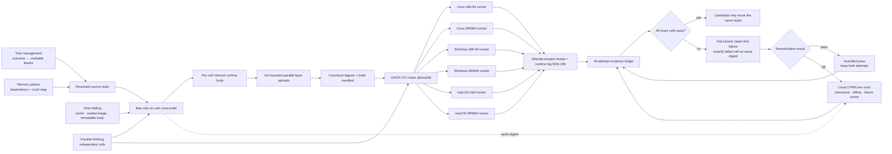
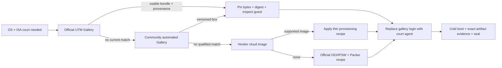

# `minicon` package, budget and delivery

Parent: [MiniCon product requirements](../PRD.md)

This module owns the standalone host's package identity, unwind profiles,
artifact budget, dependency-graph bans, independent CI ownership, and its
measured artifact-size history. Historical cross-product release context stays
with AgenTerm; this repository's workflows and machine-readable contracts are
authoritative for MiniCon delivery.

Legend: `[x]` shipped, `[~]` partial, `[ ]` planned.

## Package identity

- [x] `minicon` is an independently owned workspace package
  (`crates/minicon`) with its own dependency graph, not a bin target of the
  workbench crate.
- [x] its resolved dependency graph contains no winit, softbuffer, Rhai,
  HTTP/TLS or script-engine dependency. `serde_json`, `hashbrown`/`RandomState`,
  ab_glyph and ttf_parser are absent from the Windows production graph and
  survive only as dev-only oracles where noted.
- [x] the platform `pty` feature declares its own `Win32_Security` dependency
  rather than relying on con's unrelated `ipc` feature to make `CreateProcessW`,
  pipes and Job APIs visible, so both the minimal capability graph and the full
  con graph are compile-owned.
- [x] the binary source lives under `src`, and all four
  public/alignment/throughput tests live under `tests`.
  The package has no `../../` source or test path back into the workbench tree,
  so Cargo ownership and physical ownership now agree.
- [x] official staging removes the obsolete experimental
  `minicon-native.exe` alias both before and after publication, alongside
  earlier retired executable names. `dist/minicon.exe` is the sole Windows
  con artifact users can accidentally select after a successful build.

## Load-time portability

The oldest Windows this product claims is **Windows Server 2016 / Windows 10
version 1607 (build 14393)**. That claim is a delivery property, not a runtime
one: the PE loader resolves every static import before `main`, so a single
import the target lacks refuses the whole program with a dialog naming a symbol
the user cannot act on. No panic hook, log or diagnostic sink can observe it,
and no other gate in this repository can see it either, because they all run on
machines new enough to satisfy the import.

- [x] no static import locks the product out of a supported Windows. ConPTY's
  three entry points (build 17763) and `SetThreadDescription` are resolved at
  run time instead.
- [x] a documented minimum version is treated as evidence, not proof.
  `SetThreadDescription` is documented as available in 1607 — which *is* Server
  2016 — and is still absent there, because 1607 implements it only in
  `KernelBase.dll` and the `kernel32` forwarder arrived in 1703. SDK header
  guards do not catch this. Only the target machine settles it.
- [x] **no Visual C++ redistributable.** The VC runtime is linked statically and
  every remaining module is a Windows component; the Universal CRT is an
  operating-system component, not a redistributable. `panic = "unwind"` is
  preserved — panic containment is not traded away for the dependency.
- [x] a custom PE entry (`/ENTRY`) obliges the program to run the CRT
  initialization the MSVC startup object would have. `__vcrt_initialize` is
  required and is not reachable through the `.CRT$XI*` table this product walks;
  omitting it links cleanly and then dies on the first panic at
  `STATUS_STACK_BUFFER_OVERRUN`, which reads as stack corruption and is a
  missing constructor. `__security_init_cookie` is *not* required — measured,
  not assumed: the cookie is already random without it.
- [x] a gate parses the shipped executable's import table with a pure-Rust
  parser (no `dumpbin` on PATH) and fails on any blocker symbol, or on any
  module that is neither a Server 2016 OS component nor a recorded exception.
  The exception list is empty, which is what makes a future redistributable
  dependency turn it red instead of quietly widening what a user must install.
  The gate was negative-controlled — adding an actually-imported symbol to the
  blocker list turns it red — so it is not a vacuous assertion.
- [x] `scripts/probe-imports.ps1` answers the whole question from the target
  machine in one pass, because the loader names only one missing symbol at a
  time and iterating costs a round trip per symbol, paid by whoever owns that
  machine. It parses the PE itself (the target has no Visual Studio) and
  self-tests that a nonexistent export fails to resolve and a universal one
  succeeds before printing an all-clear — an all-clear being also what a broken
  probe prints.

Verified on a user's Windows Server 2016 on 2026-08-23: all named imports
resolve, the program starts, and `--status` reports the fallback backend and a
correct half/full-width font measurement.

## 迁出后的交付差异（2026-08-23）

本子树随代码从 agenterm 迁入独立仓 `partnernetsoftware/minicon`。以下三条是**迁出时确实
发生变化**的事实，先记下来，不冒充仍然成立：

- [x] **unwind profile 的机制变了，要求没变。** `con-dev` / `con-release` / `con-release-fast`
  存在的唯一理由是 agenterm 的 workspace profile 是 `panic = "abort"`，必须逃出去。独立仓
  没有要逃的 aborting workspace，Cargo 默认就是 unwind，所以本仓改为直接在
  `[profile.release]` 里显式写 `panic = "unwind"`，不再要那层间接。下方 `con-*` 条目描述的
  是 agenterm 时期的实现。
- [ ] ~~**体积门已在本仓重建。**~~ **已撤除（2026-08-25）。** 该门自始至终只是
  **Windows 承诺**：`tests/minicon_load_portability.rs` 整个文件是 `#![cfg(windows)]`，
  其 `shipped_binary()` 硬编码 `minicon.exe`，所以它从未在 Linux 或 macOS 上运行过一次，
  而 README 把「1 MiB 上限由测试强制」与「支持 Windows、Linux、macOS」并列，
  读起来像是可执行文件的固有属性。
  单宿主六格实测（`strip=true`）：Windows arm64 677,376 / x64 731,136、
  macOS 1,413,408 / 1,455,424、**Linux 4,846,400 / 5,732,544**——
  Linux 是上限的 5 倍以上，且已确认是代码而非符号。
  一个在三个平台里两个必红的门会挡住即将开始的瘦身工作，却量不出新东西，
  所以撤门、改为在 README 直接写各平台实测字节数。
  上限若要回来，必须先明确它约束哪几个平台。
  它刻意不是警告阈值：这个数字是产品承诺，构建就应该在它上面失败。
- [~] **独立 CI 已移植，但停放中。** `ci-agenterm-con.yml` 已从 agenterm 移到本仓
  `.github/workflows/ci-minicon.yml.disabled`，`.disabled` 后缀期间不触发，一条
  `git mv` 即可启用。两处适配：`--profile con-release-fast` → `--profile release-fast`、
  去掉 `-p agenterm-con`（本仓单包）。**它从未在本仓跑过**，`build-std` 那几格尤其未验证。

## Unwind profiles and panic containment

- [x] con owns `con-dev`, `con-release-fast` and `con-release` unwind dependency
  graphs; only the resulting executable is merged into the ordinary staging
  directory, and the workbench profiles remain aborting. Staged source, merged
  profile and `dist` bytes are identical.
- [x] this exists because native callbacks must not unwind across FFI while
  panics must still be contained: an earlier aborting artifact could not satisfy
  the claimed containment contract, since Cargo test used unwind while every
  delivery profile inherited `panic = "abort"`. A release-profile synthetic
  panic-containment test is part of the ordinary gate.
- [x] the official build pins `rust-src` and uses an explicit target plus a
  subprocess-scoped Rust 1.97 build-std boundary with `backtrace-trace-only`.
- [x] Windows startup enters through a con-owned loader boundary instead of
  `mainCRTStartup`. Rust executes XI/XC constructors, calls rustc's generated
  `main` through a one-instruction architecture trampoline, then executes XP/XT
  terminators; the PE loader remains the sole XL/TLS callback authority, so
  `lang_start`, panic containment, process command-line access and Rust cleanup
  stay intact. A test-only XCU constructor proves execution before Rust test
  main. ARM64 reaches final link with its `b main` trampoline; exact ARM64 link
  remains CI/native-toolchain evidence because the development workstation lacks
  ARM64 `vcruntime.lib`.

## Artifact budget

- [x] the Windows resource retains the existing icon's 16/32/64 PNG frames while
  removing redundant mip sizes: `.rsrc` fell from 90,112 to 8,704 bytes, the
  source ICO is capped at 16 KiB by the build script, and Windows shell icon
  extraction still succeeds.
- [ ] ~~Every released `minicon` artifact must be strictly below 1 MiB
  (`release_budget_bytes = 1,048,575`)~~ — **the ceiling was withdrawn on
  2026-08-25**; see the entry above. What survives it is the second half of the
  sentence, which was never platform-specific and still binds: a size statement
  is not an observed development number, and every size statement must name its
  profile **and its target**. The omission of the target is what let a Windows
  measurement stand as the product's size. At the icon reduction the LTO
  `con-release` PE measured 8,704 bytes below the historical 512 KiB target,
  while the no-LTO `con-release-fast` PE was separately 543,744 bytes and is not
  release-size evidence. After the product ceiling changed to a strict 1 MiB,
  the official custom-std unwind/trace-only `con-release` PE measured 561,152
  bytes, 487,424 bytes below that current ceiling. This recovered budget does
  not permit reverting to abort or trading away backpressure, durability or
  clean shutdown.
- [x] size claims require linked-symbol, disassembly or target-specific cold
  build evidence. An incremental 484,352-byte artifact that did not reproduce
  from the same HEAD after an explicit Windows-target package clean is recorded
  as non-evidence, and future assembly or native FFI work must start from the
  same standard rather than from mechanism preference.

## Delivery ownership

- [x] **Runner guests are test targets, not build machines.** The Mac host owns
  compilation, linking, source identity, and artifact selection. Each guest
  receives only the exact already-linked artifact tree plus the bounded test
  harness needed for its runtime court; it does not require a compiler, Cargo,
  a source checkout, or a resident development environment. This keeps runtime
  evidence distinct from build evidence and makes guests cheap to discard and
  reproduce. A guest-side rebuild is excluded because it would test different
  bytes and duplicate host work.

- [~] **Cloud six-grid runtime is the hosted execution court, not a second build
  farm.** The Mac mini links all six targets once with native Cargo,
  `cargo-xwin`, and `cargo-zigbuild`. `scripts/package-six-grid-runtime.py`
  then selects only each cell's product, uniquely named owning Rust harnesses,
  target-side runtime driver, bounded alignment inputs, and per-leaf SHA-256
  manifest; Cargo caches, rlibs, metadata, source history, and unrelated test
  binaries are excluded. `scripts/publish-six-grid-runtime.sh` publishes six
  cell bodies plus a top-level index to GitHub Container Registry and dispatches
  `.github/workflows/six-grid-runtime.yml` with an immutable `@sha256:` index
  reference. Mutable tags are upload conveniences only and never test identity.

  The workflow maps exactly to GitHub's native runners: Ubuntu x86-64 and
  ARM64, Windows x86-64 and ARM64, and macOS Intel and ARM64. It performs no
  source checkout, Rust setup, Cargo command, linking, or packaging policy. A
  runner authenticates only for package read, validates the top-level digest,
  source SHA, source-tree digest, cell reference, archive hash, and every
  manifest leaf and the runner's actual `RUNNER_OS` / `RUNNER_ARCH` before
  invoking the fixed OS runtime driver. The default
  `test` suite runs status plus functional/GUI black boxes; `status` is the
  cheapest diagnostic and `full` explicitly adds sustained throughput. Each
  cell has a 20-minute deadline, the matrix is manual/candidate-triggered,
  and failure may be rerun per cell rather than rebuilding all targets. This
  repository is public, so GitHub's standard six runner classes are currently
  free and unlimited; the bounds remain product hygiene and protect the same
  design if visibility or runner policy changes later.

  GHCR is the non-code artifact authority because Actions artifacts belong to
  an already-running workflow and product Release assets would mix test
  candidates with public delivery. Private-package access requires a normal
  GitHub Packages grant; credentials are never extracted from Git transport or
  printed. A dirty source tree may produce local diagnostic receipts but must
  not publish an authoritative cloud bundle. Local UTM and Lima courts remain
  valuable for interactive debugging, offline work and failure reproduction;
  they are no longer the only possible release runtime authority and never
  justify keeping six heavyweight guests resident.

  The first real six-runner `status` dispatch proved all runner labels but
  failed before execution. Command-line GHCR publication had not linked the new
  package to its source repository, so each otherwise-valid workflow token saw
  the digest as `not found`; the Windows ARM64 setup action also lacked an ORAS
  ARM64 release. Publication now adds the standard
  `org.opencontainers.image.source` annotation to every manifest. Windows ARM64
  downloads the pinned official x64 ORAS archive, verifies its SHA-256, and
  relies on Windows compatibility execution. Runtime receipts also bind the
  workflow SHA, separating test-body identity from orchestration identity.

  The operator path, from repository root, is:

  ```bash
  ./scripts/six-cell-qualify.sh
  ./scripts/publish-six-grid-runtime.sh ghcr.io/<OWNER>/minicon-six-grid test
  ```

  The publisher refuses a dirty or stale build receipt, missing/ambiguous
  harness, incomplete six-cell body, mutable runtime input, or overwrite by
  implication: every runner receives the resolved OCI digest, not its upload
  tag. Cell archives normalize tar ownership, modes and timestamps plus gzip
  `mtime=0`; `--force` must reproduce the same bytes. A fully revalidated
  manifest is reused without another compression pass. `status` and `full` may
  replace `test` only by explicit invocation.

  The first upload attempt exposed a rejected packaging mistake: Linux debug
  products and libtest harnesses each carried roughly 130–170 MiB of DWARF,
  making a compressed cell about 181 MiB even though the release-fast product
  is only 6.7–7.4 MiB. Cloud Linux bodies now select the already-linked
  release-fast product and harnesses; no semantic test is omitted. A hard 64
  MiB per-cell archive ceiling fails packaging if debug symbols or unrelated
  Cargo output leak back in. This is a test-body budget, not a new product-size
  promise.

  The persistent development goal is now this PRD branch rather than a
  conversation-only task. Four methods govern it: tree management splits one
  outcome into behavior, evidence, delivery and explicit non-goal leaves;
  Mermaid is the spatial memory palace for dependencies and court roles; time
  folding reuses incremental Cargo output, sealed guest images and immutable
  OCI bodies; parallel thinking runs independent cells concurrently and joins
  them only at reviewed manifests and receipts. A session goal points at the
  next unchecked or regressed leaf here and must upsert new evidence before it
  is considered durable.

  The runtime system is deliberately a **twin court**. GitHub's native runners
  are elastic, consume no Mac mini RAM while idle, and give routine real-OS/ISA
  regression verdicts. Local UTM/Lima courts retain interactive UI inspection,
  offline execution, breakpoints and a reusable failure scene. They are not
  competing authorities: both must consume the same content-addressed test body
  and report into one evidence ledger. A GitHub failure should become a local
  reproducible journey; a local fix returns to GitHub for the six-grid verdict.

  Measured 2026-08-28, packaging reports both uncompressed payload bytes and
  compressed archive bytes per cell. The exact six-cell body totals about 151
  MB before compression and 54,973,329 bytes after gzip; individual archive
  ratios are 30.65%–42.05%. Publishing the six independent layers serially took
  207–290 seconds. The publisher now runs six bounded, independently owned ORAS
  workers, records one digest per cell, and lets only the primary process build
  the canonical index and publish its top-level seal after every worker passes.
  An isolated fake-registry test proves actual overlap, rejects concurrency
  outside 1–6, and proves one failed layer prevents both the top-level push and
  workflow dispatch. Two real measurements reduced the layer phase to 116 and
  60 seconds; the warm result is 71%–79% below the serial baseline. The final
  measured body reports 150,839,308 payload bytes and 54,984,196 gzip bytes,
  while the complete package/publish/dispatch path took 79 seconds. The first
  complete remote `test` iterations exposed and fixed build-host paths embedded by
  `CARGO_BIN_EXE_minicon` and a relative Windows product path. Run
  `33142937582` then tested the same immutable body on all six native runners.
  Explicitly installing `at-spi2-core` closed the reproducible Linux x86-64
  desktop-service gap; both Linux cells passed the identical accessibility
  journey without weakening its 20-second deadline. The first attempt also
  exposed one Windows x86-64 host/agent cleanup timing failure and one macOS
  x86-64 screenshot/active-tab race; both passed a bounded failed-job rerun,
  after which the aggregate exact-body receipt was **six-grid PASS**. A later
  exact-body run reproduced the macOS Intel screenshot/active-tab failure and
  exposed the measurement defect: the black box started its 10-second GUI
  response deadline before the newly spawned CLI process had registered a
  request with the GUI. It now observes ownership through public
  `ui-snapshot`, then races tab selection and starts the unchanged response
  deadline. Five repeated local journeys passed, and run `33144329432` passed
  all six native cells plus the aggregate receipt on its first attempt. This
  is evidence of timing sensitivity, not permission to hide it with blanket
  retries.

  Runtime evidence is now attempt-aware. Each cell uploads an attempt-scoped
  receipt plus the complete runtime log; the receipt binds run ID, attempt,
  status, log byte count and log SHA-256. The exact aggregator is itself pinned
  inside the OCI index, verified before use, groups all cell histories by
  attempt, writes a `FAIL` aggregate even when the gate fails, and distinguishes
  ordinary `pass`, latest failure and `reverified-pass`. A diagnostic workflow
  input can inject one post-test exit on attempt one only, explicitly classified
  as `intentional-probe`; it is not an automatic retry or a way to turn product
  failure green. Run `33145060107` proved the first half of this contract in the
  hosted court: its aggregate `FAIL` artifact preserved three attempt-one logs
  and classified the selected macOS Intel failure as intentional while two
  independently exposed harness failures remained `runtime-or-environment`.
  Those failures produced two further corrections: a screenshot that completes
  before pending state can be observed is fast success rather than failure, and
  the Windows console cleanup journey now tracks the exact PIDs introduced by
  its session instead of comparing a volatile machine-wide process count. The
  final same-run failed-job rerun and `reverified-pass` aggregate remain open
  until concurrent documentation work lands and the repository again has one
  stable clean source identity; authoritative publication from a drifting or
  dirty tree remains correctly forbidden.



- [x] `scripts/six-cell-qualify.sh` is the local Mac qualification owner. It
  gives every cell an isolated Cargo target directory, links all Cargo targets
  through native Cargo, cargo-xwin, or cargo-zigbuild, and fans the six
  dependency-independent build cells out concurrently. Measurement rejected
  six fully independent workers because two fresh `cargo-xwin` processes race
  while creating their shared host `clang-cl` shim. The proven graph therefore
  uses five concurrent groups—macOS ×2, Linux ×2, and one ordered Windows ×2
  group—with two Cargo jobs per group on the 24 GiB Mac mini;
  `MINICON_BUILD_JOBS` and `MINICON_CARGO_JOBS_PER_CELL` are explicit tuning
  controls. Results land in per-group shards and are merged in canonical order,
  so concurrent writes cannot corrupt the receipt. Runtime VM leases remain a
  later, bounded phase and are not accidentally parallelized with compilation.
  Cargo output lives in one stable ignored `target-six/builds/current` cache;
  a PRD or harness edit therefore gets ordinary incremental recompilation
  instead of allocating another source-digest-sized build tree. The clean
  receipt binds the current source fingerprint and hashes every selected
  artifact, so cache reuse does not weaken exact-byte authority.
  The owner runs the complete native
  macOS arm64 suite plus sustained-throughput gate, and uses Rosetta for the
  same macOS x86_64 runtime evidence when installed. Linux runtime evidence is
  deliberately split from cross-linking: `scripts/linux-runtime-qualify.sh`
  executes the already-linked GNU artifact in a matching Debian/glibc Lima
  court, with Xvfb + a session D-Bus for GUI and AT-SPI journeys. The ARM64
  court passes 124 host units, 38 shared-core units, alignment, the isolated
  control journey, all 22 GUI/PTY black boxes, the Linux AT-SPI journey, and
  the ignored sustained-throughput gate (33,439,744 bytes at 40,257,030 B/s in
  the recorded 2026-08-26 integrated run, with zero present failures).
  Alpine/gcompat is
  explicitly not evidence for `*-unknown-linux-gnu`: the GNU artifact requires
  glibc loader semantics that compatibility shims did not supply.

  The x86_64 GNU artifact has two complementary local courts. Apple Rosetta for
  Linux in the ARM64 VZ guest, backed by Debian amd64 multiarch libraries, runs
  the complete functional suite and sustained-output gate (33,439,744 bytes at
  20,722,500 B/s in the recorded 2026-08-26 integrated run, with zero present
  failures). A
  QEMU Debian x86_64 guest separately supplies true x86_64-kernel startup and
  logic evidence. Its full control journey currently misses the unchanged
  10-second concurrent-screenshot response criterion under TCG, so it is not
  used to weaken that product deadline or masquerade as full runtime evidence.

  The owner writes `target-six/receipt.json`; a missing runtime is `BLOCKED`,
  never omitted or promoted from link evidence to a test pass. The exact-byte
  first integrated 2026-08-26 run recorded `PASS 38 / FAIL 0 / BLOCKED 0`.
  The current-source run again passes all 38 six-cell owning stages with no
  failure and proves source stability, while the newly mandatory clean-macOS
  status/test/throughput leaves are all explicitly `BLOCKED` until protocol-v2
  is installed in that guest. The receipt itself, rather than a duplicated
  count here, is the current verdict. A Windows 11 Pro
  ARM64 UTM guest installed from Microsoft-origin media, updated to build
  26200, and equipped with UTM Guest Tools runs both the native ARM64 and
  Prism-translated x86_64 courts. Both pass status, 125 host units, 38
  shared-core units, the two-test PE load-portability gate, all seven forced
  console-agent journeys, isolated control, GUI/PTY black boxes, and sustained
  throughput. The integrated receipt's exact-source `release-fast` probes drain
  33,439,744 measured bytes at 17,729,601 B/s native ARM64 and 13,579,003 B/s
  under Prism with zero present failures.

  A receipt binds more than `HEAD`: `scripts/source-fingerprint.py` hashes the
  path, executable bit, and bytes of every tracked or unignored untracked file.
  The gate captures that fingerprint before any build and recomputes it after
  all tests; a changed worktree is an explicit `source-stability` failure. This
  makes dirty-tree local qualification identifiable without pretending it is an
  exact committed SHA.

  Functional, unit and black-box evidence uses the ordinary debug profile;
  sustained-throughput evidence uses the same tree's `release-fast` product and
  harness. The latter is an optimized delivery-performance court, not a debug
  instrumentation benchmark. Cross cells record a separate `throughput-link`
  stage so an optimized runtime pass cannot be inferred from the debug link.

  Each source-tree fingerprint owns a separate directory below
  `target-six/builds/`. Cargo may retain several hashed test executables in one
  target directory, and cross-VM copy time is not a trustworthy proxy for
  current-source identity. Fingerprint isolation prevents a stale harness from
  entering any runtime court while retaining incremental reuse for an identical
  tree. Target-side PowerShell also converts every caught test failure to an
  explicit nonzero process result; a failure log with an ambient zero exit code
  is never accepted as a passing stage.

  Sustained-output timing begins only after both producer and sibling shells
  complete explicit public `send-text`/`wait-text` readiness rendezvous. Initial
  process launch and first-seen antivirus scanning may take longer on a cold
  Windows image and are not throughput. Each marker is assembled from separate
  fragments by the child shell after one buffered send within the startup
  budget; terminal echo of the input command therefore cannot counterfeit
  readiness, while repeated probes cannot create a shell-input backlog. The
  measured sibling marker uses the same split-output rule. A bounded 1 MiB
  output warm-up drains before perf counters and the sustained-output clock are
  reset, keeping cold process/font/renderer/antivirus startup out of a steady-
  state metric. On Windows, PowerShell also constructs the fixed byte array and
  proves `PAYLOAD_READY` before timing; managed allocation under Prism is not
  PTY/render throughput. The final marker may wait longer to preserve
  diagnostics, but the verdict still requires the sibling to respond within
  five seconds while 32 MiB is flowing, full drain within 30 seconds, at least
  2 MiB/s, responsive control observation, and zero present failures.

- [x] `scripts/setup-linux-runners.sh` owns reproducible local Linux court
  provisioning: Debian/glibc, isolated ARM64 VZ + Rosetta and x86_64 QEMU
  instances, repo-root discovery rather than a recorded host path, Xvfb/D-Bus/
  AT-SPI dependencies, and amd64 multiarch libraries for translated x86_64
  execution. Proxy selection remains caller/machine configuration rather than
  repository policy.

### Reproducible runner-image boundary

#### Agent-facing VM court lifecycle

- [~] UTM automation is a reusable test-infrastructure capability, not a set of
  MiniCon-specific VM shell fragments. `scripts/utm-courts.json` is the first
  machine-readable registry for the six logical `{os, isa}` courts, their UTM
  VM identity, automation adapter, translation caveat, idle policy, and template
  state. `scripts/utm-court.sh` is the initial uniform facade: agents can
  discover and inspect courts, validate registration, start or resume them,
  wait for automation readiness, execute commands, transfer exact files, apply
  idle policy, and clone a stopped baseline without learning UTM command syntax.
  `resources`, `lease`, and `release` make host memory part of that interface:
  a lease first stops every distinct peer UTM VM, admits the requested court,
  and release requires a final `stopped` state instead of treating suspension
  as resource reclamation. Registry schema 2 also assigns a logical image tag
  to every court. `image` emits its cold-image contract and deterministic
  contract digest without pretending that an unsealed mutable disk already has
  a content digest.
  An undeployed native-x86_64 desktop or an adapter without a generic operation
  exits as `BLOCKED` (code 3); it is never reported as a skipped success.

- [~] Initial usability is reached only when all three guest adapters implement
  the same black-box operation contract: `status`, `start`, `wait-ready`,
  `exec`, `push`, `pull`, and `idle`. QEMU Guest Agent owns Windows and QEMU
  Linux. The macOS VirtioFS login agent now implements product-neutral command
  and file jobs beside its compatible fixed MiniCon qualification queue: every
  operation is manifest-verified in Guest-local scratch space and publishes an
  atomic exit/result directory. Its unique-file readiness ACK carries protocol
  version `2`, so a still-running fixed-mode v1 agent cannot masquerade as the
  reusable adapter. The host facade implements the same readiness,
  argv-preserving `exec`, and exact-file transfer verbs over that adapter. Its
  updated LaunchAgent still needs installation and a real round-trip receipt;
  source presence alone is not shipped evidence. An isolated host-side bridge
  has nevertheless exercised the exact guest script and public facade through
  readiness, argv-preserving execution, and host→agent→host byte-identical
  push/pull, separating protocol correctness from pending VM deployment.
  MiniCon's six-cell owner must then call the facade rather than directly
  invoking UTM or owning per-OS lifecycle policy.

  Windows is the first migrated product caller: its runner now delegates Guest
  Agent readiness plus every artifact, generated job, result and log transfer
  to the court CLI while retaining only MiniCon's interactive-dispatch and test
  semantics. A real ARM64 Windows status court completed through that path, in
  addition to the facade's independent exact-byte and stdin/stdout round trips.
  The Windows runner has now crossed the lifecycle boundary: both routine disposable
  admission and final stop call `lease`/`release`; it contains no direct VM
  start/stop branch. A real ARM64 public `status` journey passed through the
  migrated runner and returned the VM to `stopped`. The underlying service
  black box separately proved image inspection, disposable admission, Guest
  Agent readiness, release, removal of active state, and publication of an
  immutable receipt whose outcome is `released` and final state is `stopped`.
  A later stopped→lease cold boot independently proved automatic `minicon`
  console login and a visible Windows desktop. OS inventory reports an ARM
  64-bit processor; the x64 Guest Agent process reports AMD64/X64 under Prism,
  preserving the distinction between guest ISA and translated tool process.

  The macOS clean runner now uses the same UTM `lease`, version-2
  `wait-ready`, and `release` operations; its remaining code owns only bootstrap
  media and MiniCon payload/job publication. This source boundary now has real
  runtime evidence: a stopped baseline cold-started directly into the `minicon`
  desktop, the version-2 agent acknowledged readiness without human login,
  generic bridge execution returned `arm64` and uid 501, and `sysadminctl`
  independently reported `minicon` as the automatic-login user. The disk
  remains `local-unsealed` until an immutable baseline digest and archive
  receipt exist. `scripts/linux-utm-runner.sh` supplies the matching
  ARM64/x86_64 desktop contract: it packages the exact product and owning test
  executables for the requested mode, never Cargo rlibs, metadata, incremental
  state or unrelated binaries. The earlier whole-profile implementation tried
  to send a 466 MiB compressed archive for `status`; a bounded live transfer
  proved that design unsuitable for the QGA bridge and was cancelled. The
  narrowed payload verifies its archive SHA-256 inside the guest and invokes
  the existing Linux runtime owner without Cargo or a source checkout. ARM64
  now passes a real stopped→lease→Guest-Agent-ready cold start, automatic
  `minicon` GNOME login,
  root CLI execution, and key-only SSH recovery. Its one-time bootstrap ISO is
  detached; the local disk remains explicitly `local-unsealed` until the older
  fixed credential-bearing seed is removed and the stopped baseline is sealed.
  x86_64 now has the separately recorded visible-desktop and exact-artifact
  runtime PASS; its stopped template remains local-unsealed.
  `scripts/linux-utm-runner-selftest.sh` builds a synthetic Cargo-output tree
  and intercepts the court bridge before any VM starts. It proves that
  `status` contains only the product executable, `test` contains exactly its
  eight owning harness prefixes, and similarly named throughput/unowned
  executables cannot leak through the main-crate `minicon-<hash>` selector.
  `scripts/utm-runner-registry-selftest.sh` independently requires both Linux
  and Windows runners to name the four canonical `*-desktop` court IDs present
  in `scripts/utm-courts.json`; stale pre-registry aliases fail before a VM is
  leased.

  Lima fast courts now expose the parallel `scripts/lima-court.sh` service and
  `scripts/lima-courts.json` image registry. The service owns `image`, `status`,
  `lease`, `exec`, `release`, and `reap`, with the same atomic active-state and
  immutable receipt outcomes. Six-cell Linux stages call this facade rather
  than `limactl shell` directly. A real ARM64 VZ lease executed Linux/aarch64,
  exposed and then repaired an initial missing-receipt terminal-state bug, and
  subsequently proved both abandoned `reap` and ordinary `released` receipts;
  the instance returned to `Stopped` after each court.

- [ ] A reusable image has two distinct identities. The immutable template
  records upstream media digest, provisioning-recipe digest, UTM configuration,
  guest OS build, installed automation-adapter version, and a content/config
  digest; it contains no seed disk, plaintext credential, product artifact,
  source checkout, result, or user document. A routine test clones or starts a
  disposable instance, transfers an exact payload, runs a bounded command,
  pulls a manifest-bound result, and discards all guest mutations. Sealing is
  allowed only from a stopped, readiness-proven maintenance instance. Recovery
  archives store the stopped sealed template plus its manifest; live UTM disks
  and overlays never execute from cloud storage.

- [~] The 24 GiB Mac mini is a single-heavy-court scheduler, not a VM farm.
  Sealed templates and sparse disks may remain cold, but no UTM or Lima guest
  may reserve RAM merely because it could be useful later. A product runner
  obtains a bounded lease just before runtime evidence, starts at most one
  distinct heavyweight VM, and releases it immediately after results are
  copied out. Two logical cells backed by one physical VM share one lease.
  Memory pressure or an unreclaimable peer returns typed `BLOCKED` before a new
  VM starts; overcommit and swap thrashing are not acceptable fallbacks.

  Normal release first requests guest shutdown and waits a bounded interval.
  If the guest does not cooperate, UTM's virtual power-off event is the allowed
  fallback: it releases memory without killing UTM or deleting any disk. VM
  suspension is a deliberate short debug escape, not the service default,
  because saved execution state does not prove host RAM was reclaimed. Lima
  follows the same cold-on-demand/stopped-after-court invariant. Compilation
  remains on the host; guest startup cost buys clean, reusable runtime evidence.

  The service persists one atomic `active.json` under ignored runtime output.
  Repeated calls for the same live physical VM are idempotent, so several
  product stages can share one bounded lease without multiplying RAM. Release
  moves that state into a timestamped receipt; `reap` performs the same stopped
  transition for an abandoned lease. A filesystem lifecycle lock serializes
  competing admission and release operations. These records are local runtime
  evidence, never source-controlled image metadata. The product-neutral
  `scripts/utm-court-selftest.sh` fake backend proves same-VM lease reuse,
  cross-VM recovery, ordinary release, abandoned-lease reap, final stopped
  states, and the three corresponding receipt outcomes without starting a VM.
  Peer reclaim is restricted to `automation_state=ready`: a planned/provisioning
  VM may contain an interactive installer at an EULA or partitioning boundary
  and is never a disposable runtime peer. The fake backend keeps such a running
  VM untouched while admitting and releasing ready courts.

- [ ] CLI lifecycle receipts must make reuse auditable across products. Every
  run identifies `court`, requested and effective ISA, native/translated
  execution, template digest/version, instance identity, adapter/version,
  payload digest, command deadline, exit status, evidence paths, and final idle
  state. Destructive instance removal remains an explicit caller-authority
  boundary; the initial facade intentionally exposes clone/disposable start but
  not an implicit delete command.

- [x] A portable runner is identified by an upstream image/ISO digest, the
  UTM/firmware/device configuration, a declarative provisioning-recipe digest,
  and the resulting guest OS build identity. A downloaded third-party guest
  disk without those inputs is convenience media, not qualification evidence.
- [x] Linux runners should start from the distribution's signed cloud image
  for the matching architecture and apply the repository-owned cloud-init or
  setup recipe. Debian/Ubuntu glibc images own MiniCon's GNU and GUI/AT-SPI
  courts; a small Alpine/musl appliance cannot substitute for that ABI.
- [x] Windows runners start from Microsoft installation media and a future
  repository-owned `Autounattend`/provisioning recipe. The locally installed
  guest disk may be sealed and reused on this machine, but must not be
  redistributed from the repository. Community preinstalled Windows `.utm` or
  QCOW2 files are rejected as the evidence baseline because their license,
  patch state, account state, provenance, and component removals are not under
  this product's control.

  [UTM's Windows Guest Tools](https://docs.getutm.app/guest-support/windows/)
  are not merely a keyboard/video/mouse convenience.
  The official bundle installs VirtIO/SPICE drivers and agents for networking,
  display, pointer, clipboard and WebDAV integration, plus QEMU Guest Agent for
  host-side readiness, command execution and file transport. Basic emulated
  keyboard/VGA can work without it, but a reusable automated court cannot.
  UTM documents automatic installation when the tools ISO is present as the
  second optical drive during Windows Setup; an already installed guest mounts
  `Install Windows Guest Tools…` and runs the versioned
  `utm-guest-tools-*.exe`/`spice-guest-tools-*.exe`. The upstream
  [NSIS source](https://github.com/utmapp/spice-nsis)
  installs QEMU GA through MSI and supports x86_64, i386 and ARM64 payloads.
  Windows 11 24H2+ may black-screen with some VirtIO GPU combinations, so the
  baseline must retain a bootable firmware display fallback until the first
  post-tools reboot is visibly proven. Network presence, dynamic resolution or
  mouse integration alone does not substitute for a successful QGA
  exec/push/pull receipt.
- [~] After guest tools and qualification prerequisites are installed, shut
  down the clean Windows ARM64 guest, record its OS build and configuration
  identity, and preserve it as the local sealed baseline. Routine runs must use
  UTM disposable mode or an equivalent throwaway overlay so tests cannot mutate
  the next run's starting state.
- [x] VM capacity follows its runtime-only role. Keep a sealed guest at a
  low-power baseline (normally 2–4 virtual CPUs and 4–6 GiB RAM), shut down
  when no court owns it. Raise CPU/RAM only for an identified GUI,
  throughput, or Prism-x64 test and record any configuration that affects the
  evidence. Disk capacity is a sparse ceiling rather than resident usage.
  Suspension is not release. Background compilation, permanent high-core
  allocation, and an always-on VM
  are explicit non-goals.

  The integrated owner mutually schedules runtime guests: both Lima targets are
  stopped while macOS builds and Windows UTM courts own host CPU/RAM, then
  started only for their Linux courts and returned to stopped state afterward.
  The shared Windows VM also discards and cold-starts a new snapshot between
  x86_64-Prism and ARM64-native cells, then shuts down after qualification.
  Simultaneously reserving memory for unrelated guests or inheriting process
  state across architecture cells is not valid evidence.

  The local Windows ARM64 target uses 4 virtual CPUs and 6 GiB RAM and returns
  to stopped state after qualification. Both ARM64-native and Prism-x64
  `release-fast` throughput probes pass at that capacity (about 17.73 MB/s and
  13.58 MB/s respectively), so it is the proven default test-target baseline;
  raising it is an evidence-specific exception.

- [~] Add a clean ARM64 macOS guest as a release/permission court, not as a
  seventh architecture cell. Host-native ARM64 and host Rosetta x86_64 remain
  the fast feedback courts. The Apple-Virtualization guest owns clean-user,
  first-launch, TCC, font/default-setting and packaging behavior; its Rosetta
  execution can exercise the x86_64 artifact but cannot claim an Intel kernel
  or Intel silicon. Keep that distinction visible in receipts.

  The local VM definition uses an Apple-origin IPSW with Apple Virtualization,
  4 virtual CPUs, 6 GiB RAM, and a 64 GiB sparse disk ceiling. The installed
  clean user and login-session agent now answer the host runner without a guest
  compiler or network listener. `scripts/macos-utm-runner.sh`
  prepares and starts the host bridge, while `scripts/macos-utm-agent.sh` runs
  as a low-priority LaunchAgent in the interactive Guest login session.
  `scripts/setup-macos-utm-runner.sh` installs that agent without a compiler,
  source checkout, SSH credential, or always-on network service. The bridge
  uses UTM's `share` VirtioFS device, copies each payload into Guest-local cache,
  validates every file through `MANIFEST.sha256`, and publishes a unique log
  plus atomic exit result. `scripts/macos-runtime-qualify.sh` then executes only
  the already-linked product and exact Rust harnesses selected by the host.
  The bridge uses unique request/acknowledgement filenames instead of replacing
  one long-lived mailbox inode: Apple VirtIOFS may otherwise leave the guest
  reading the pre-replacement inode while the host sees the new file. Runtime
  harnesses that inspect repository-owned contracts receive a bounded source
  evidence bundle and an explicit runtime root; they never follow a host path
  embedded by `CARGO_MANIFEST_DIR`. Unix sustained-output generation uses base
  system `yes`, `head`, and `printf`, so a clean macOS court does not summon the
  Xcode command-line-tools installer merely to obtain Python.

  `scripts/macos-utm-runner.sh ... prepare` also emits a tiny read-only
  `target-six/macos-utm-bootstrap.iso`. Its single `.command` file mounts the
  already-configured VirtioFS share and invokes the same setup owner. This
  removes keyboard-layout-dependent command entry from clean-Guest
  provisioning without turning the guest into a build machine or embedding
  credentials, source, or product artifacts in the bootstrap medium.

  Apple Virtualization presents the configured UTM directory at
  `/Volumes/My Shared Files`; the login agent and bootstrap command consume
  that system automount first. It accepts either the bridge itself or UTM's
  parent-share layout containing `macos-utm-bridge/`. `mount_virtiofs share` remains only a fallback
  for a backend that does not publish the automount. Treating a successful
  manual mount of the wrong tag as the bridge is invalid evidence: the agent
  additionally requires the shared `bootstrap/` directory before advertising
  readiness.

  The integrated owner now records this court beside the ordinary ARM64 cell
  as `clean-runtime-status`, `clean-test`, and `clean-throughput`, then records
  `macos-clean-idle` after returning the guest to an idle state. When
  `MINICON_MACOS_AARCH64_RUNNER` is absent, all three court leaves are
  explicitly `BLOCKED`; host-native ARM64 success cannot silently stand in for
  clean-user release and TCC evidence. Idle defaults to UTM suspension so the
  authenticated interactive session survives between unattended qualification
  runs; an explicit stop remains available for baseline sealing or maintenance.

- [~] Add a stable glibc Linux desktop UTM release court in addition to the
  existing headless Lima function courts. The selected primary target is Ubuntu
  24.04 ARM64 Server plus `ubuntu-desktop-minimal`. The canonical ARM64 desktop
  target is a Linux guest with ARM64 ISA on QEMU+HVF, named
  `minicon-lnx-arm-64`; it owns native ARM64 checks across Wayland and an
  explicit Xorg session, real desktop launch, fonts, clipboard, IME,
  accessibility/AT-SPI, GUI interaction and packaging. Its baseline is 4 vCPU,
  6 GiB RAM and a 32 GiB sparse disk, reducible to 2 vCPU/4 GiB for static work.
  The earlier Apple-Virtualization Linux experiment is historical migration
  state, not a seventh canonical identity. After the QEMU guest proves data
  migration and cold-boot automation, archive or remove the old VZ instance
  and give the accepted QEMU guest the canonical name. `QEMU` and `VZ` are
  registry backend metadata, not suffixes in the six public VM identities.
  A low-frequency Ubuntu 24.04 Server plus Xubuntu Minimal desktop x86_64 QEMU
  court (2 vCPU, 4 GiB, 24–32 GiB sparse), named
  `minicon-lnx-x86-64`, owns true x86 kernel
  desktop startup, screenshot, input and
  AT-SPI samples; it does not own performance or the full high-frequency GUI
  suite. Existing Lima courts remain the fast function and kernel-logic owners.

  The desktop infrastructure outcome is six independent stopped guest
  baselines: `{minicon}-{lnx,osx,win}-{arm,x86}-64`. Every identity owns its
  own guest OS/ISA installation, automatic test-user login, agent bootstrap,
  exact-artifact transport, cold-start readiness and release receipt. Rosetta
  and Prism remain useful supplemental translation courts, but a translated
  process inside an ARM64 guest cannot satisfy the corresponding x86-64 guest
  leaf. Backend choice and translation mode remain machine-readable registry
  fields; neither changes the canonical guest name.

  `minicon-osx-x86-64` remains a real Intel-ISA guest requirement. On an Apple
  Silicon host, UTM's supported Apple Virtualization macOS path is ARM64-only;
  therefore the local discovery branch is explicitly a time-boxed QEMU/TCG +
  OpenCore experiment, not an assumed deliverable. It advances only if it can
  prove an Apple-origin installer, an Intel kernel, unattended cold boot,
  automatic test-user login, exact-artifact transport, and a repeatable GUI
  launch receipt. Failure to reach the installer or deterministic disk boot
  inside the experiment box kills that local branch and assigns the formal
  cell to a real Intel Mac runner. Host Rosetta and Rosetta inside the ARM64
  macOS guest remain fast compatibility evidence only and never close this
  leaf. The safe failure is an explicit `runner-unavailable` receipt with the
  rejected local route recorded; the non-goal is maintaining an open-ended,
  update-fragile Hackintosh as production infrastructure.

  Its preparation owner is `scripts/prepare-linux-x86_64-utm.sh`: it accepts
  only the pinned official Ubuntu 24.04.4 Server AMD64 release ISO with
  SHA-256 `e907d92eeec9df64163a7e454cbc8d7755e8ddc7ed42f99dbc80c40f1a138433`
  and emits an identity-free recipe receipt. The declared UTM baseline is QEMU
  TCG with `q35`, 2 vCPU, 4 GiB RAM, a 32 GiB sparse disk, software display,
  shared networking and QEMU Guest Agent. Because this is cross-ISA emulation,
  it owns true-x86 kernel/desktop correctness only; throughput evidence remains
  on real x86_64 hardware or an explicitly labelled translation court.
  The earlier 2,885,177,344-byte Xubuntu Minimal ISO completed full-file digest
  verification, but a real installation powered off with an empty EFI
  partition and an incomplete rootfs missing the kernel, dpkg tables and dpkg
  state. Manual EFI publication succeeded but could not turn that partial
  filesystem into a reusable court. That route is rejected evidence, not
  `media-verified` delivery. Ubuntu Server uses the authoritative Subiquity
  autoinstall path, so the preparation owner renders
  `scripts/linux-x86_64-autoinstall.yaml` into a NoCloud seed using
  the same hidden, twice-entered SHA-512 password-hash handoff as the ARM64
  court. The reusable recipe contains only a placeholder; the ignored seed is
  credential-bearing, attaches as QEMU CD/DVD for provisioning, and must be
  removed before the stopped template is sealed or archived. Autoinstall
  powers off after installing the Xubuntu Minimal desktop, QEMU Guest Agent,
  passwordless guest-local test automation, fallback EFI loader and the bounded
  GUI/AT-SPI prerequisites. A live provisioning run has accepted the NoCloud
  identity, direct-storage model, package set and string-only late-command
  list and completed through its own poweroff. With both credential-bearing
  seed and installer ISO detached, a disk-only cold boot proved `x86_64`, an
  active QEMU Guest Agent and LightDM, and automatic `minicon` login on
  `tty7/:0`. Xorg also reports a connected 1280×800 `Virtual-1`, while XFCE's
  panel, desktop, window manager and test xterm appear in the X window tree.
  A later disk-only cold boot recovered the guest journal and rendered the full
  XFCE desktop through UTM SPICE, invalidating the earlier persistent-display
  blocker hypothesis. QGA reports `running`, `graphical.target`, active
  LightDM/QEMU Guest Agent, real `x86_64`, automatic `minicon` login on
  `tty7/:0`, and a visible desktop. The exact repo-built x86_64 ELF crossed the
  QGA bridge with matching SHA-256. Its first real launch correctly failed on a
  missing `libxkbcommon-x11.so`, proving that desktop readiness is not product
  readiness; after the Ubuntu `libxkbcommon-x11-0` runtime package was installed,
  the unchanged artifact returned help with exit 0, launched on `:0`, exposed
  its public control socket, returned `ui-snapshot`, captured
  `MINICON_X86_GUEST_OK`, emitted a 960×600 pane PNG, and closed with exit 0
  followed by process disappearance. The cell is now runtime-PASS and
  `local-unsealed`. Remaining leaves are an immutable stopped-template digest,
  disposable-clone rerun, AT-SPI/IME evidence, and a packaging-owned runtime
  dependency declaration/check; performance remains an explicit non-goal.

  `scripts/prepare-linux-desktop-utm.sh` verifies the pinned Canonical Noble
  ARM64 cloud-image digest before copying it into the ignored local court and
  emits a `cidata` NoCloud seed from
  `scripts/linux-desktop-cloud-init.yaml`. The seed installs the minimal GNOME,
  AT-SPI, CJK font, X11 and guest-integration prerequisites without placing a
  plaintext password, SSH key or host identity in the repository. Its password
  hash is caller-supplied or collected twice through the hidden interactive
  prompt exposed by `scripts/prepare-linux-desktop-utm.command`; the plaintext
  exists only in that process long enough to derive the SHA-512 crypt hash. The
  hash remains inside the ignored local seed and is called out in the
  preparation receipt so that seed is never uploaded as a reusable public
  template. Non-interactive automation must supply only the hash. The sealed
  post-provisioning baseline must discard that seed before archival.

  Canonical publishes the pinned `.img` as QCOW2. The preparation owner verifies
  that immutable input first, then derives a 32 GiB QCOW2 execution disk for
  UTM QEMU+HVF and a 32 GiB raw compatibility disk for Apple Virtualization.
  Its receipt records the primary backend, both formats, seed attachment type,
  and virtual byte size. UTM's imported root drive must be writable; a
  read-only import prevents a valid first boot. The original QCOW2 and its
  upstream digest remain the provenance root, while both derived disks and the
  credential seed stay ignored local execution state.

  Apple Virtualization is rejected as the provisioning backend for this court.
  A raw root selected by its initial import wizard becomes an external
  removable USB drive: suspend/resume detached it long enough for Linux to
  report buffer I/O failures, abort the ext4 journal, and remount root
  read-only. Moving the root to a fixed virtio device removed that corruption,
  but the VZ removable-USB `cidata` device was not discovered by cloud-init:
  the untouched image reached the locked default `ubuntu` login, retained the
  default hostname, and never acquired a new guest lease. Rebuilding a valid
  `CIDATA` ISO with a fresh instance id produced the same result. This is a
  device-topology failure, not a password failure.

  The accepted provisioning topology is UTM QEMU with HVF, a fixed writable
  virtio QCOW2 root, and the seed attached as a read-only CD/DVD. The same-ISA
  CPU remains hardware accelerated; QEMU is chosen here for stable block-device
  and NoCloud semantics, not to emulate ARM64. Before first boot, verify root
  `removable = false` and `read-only = false`, and verify that the seed is a
  read-only `CD/DVD (ISO)` device. A removable optical slot is preferred; a
  fixed SCSI optical device is accepted for provisioning only when the host
  removes that credential-bearing drive before sealing the baseline. A future
  VZ path may return only after an automated first-boot probe observes the
  requested hostname, DHCP presence, and poweroff on a fresh upstream-derived
  disk.

  Provisioning also installs and enables `qemu-guest-agent`. After the sealed
  baseline starts, host automation uses UTM's public Guest Agent operations for
  address discovery, file transfer and command execution; it does not require
  an SSH password, embedded key, guest compiler, or source checkout. The first
  successful `utmctl ip-address` plus a non-mutating `utmctl exec` probe is the
  automation-ready boundary. A hostname and an open SSH port prove networking,
  but do not substitute for that Guest Agent evidence.

  First-boot provisioning powers the guest off after enabling GDM rather than
  requesting an in-guest reboot. The host observes that stopped state, ejects
  the credential-bearing seed, starts the fixed-disk baseline, and proves a
  graphical login. This avoids guest-reboot ambiguity and makes seed removal
  an explicit credential-lifecycle boundary.

- [x] Preserve expensive, reproducible test assets under `~/googleDrive/` once
  that independently managed mount is ready. Archive signed upstream media,
  immutable checksums, provisioning recipes, UTM configuration manifests and
  sealed reusable baselines. Exclude passwords, tokens, user documents, live
  mutable overlays, runtime logs, crash dumps and transient Cargo/build output.
  The cloud copy is recovery storage, not an execution dependency: qualification
  first verifies a local copy and its digest, then runs disposable overlays.

  The mounted recovery store has passed an actual write/read probe. The first
  archived input is Canonical's 618,370,560-byte Noble ARM64 cloud disk; both
  local and archived copies match SHA-256
  `4a281a921b8d7db952895ab619736f10efe9f63e111fa5b5779ed18f023818aa`.
  The archive also holds Canonical's checksum catalog, the credential-free
  cloud-init template, preparation script, and an identity-free receipt. Slow
  NFS metadata makes this a cold recovery store, never a live UTM disk or test
  dependency.

  The rejected Xubuntu 24.04.4 Minimal AMD64 input, credential-free
  autoinstall template, preparation owner and identity-free upstream receipt
  are archived as historical recovery evidence, not an accepted VM baseline.
  The 2,885,177,344-byte cloud copy was read back in full and independently
  matched SHA-256
  `21cb21d6b98def5dfa6af34fd2a4105c0f41724d691185f7b05a88117814db0b`;
  rsync completion alone was not accepted as recovery evidence.

- [ ] Make runner acquisition image-first rather than installer-first. Before
  creating a VM interactively, the provisioning owner must query, in order:
  UTM's official Gallery, a reviewed/versioned community UTM or Vagrant box,
  an OS-vendor cloud image, and only then official installation media. An
  imported image is acceptable only when its guest ISA, OS edition/version,
  upstream provenance, immutable digest, publication age, login/bootstrap
  state and redistribution terms are recorded. Guest credentials supplied by
  a gallery are immediately rotated or replaced by the credential-free agent
  bootstrap before sealing; an opaque image never becomes a release court.

  This rule follows measured acquisition cost, not aesthetic preference. UTM's
  official Gallery documents directly opening extracted `.utm` bundles and
  explicitly points to the community Gallery. The community catalog publishes
  Packer-built, versioned images and currently exposes one-click ARM64 Ubuntu
  24.04 and Windows 11 Pro boxes, but not the required x86_64 variants. Those
  images could shorten future ARM baseline recovery, while the present true-x86
  Windows court still requires its official-media installation. The same
  search found no trustworthy modern Intel macOS appliance; that cell keeps
  its bounded OpenCore experiment and real-Intel-runner fallback. The remaining
  product gap is a repository-owned discovery/import command that emits a
  typed `prebuilt-selected`, `recipe-selected`, or `no-qualified-image` receipt
  before provisioning begins.

### UTM image shelves (observed 2026-08-28)

This is a discovery memory, not an allowlist or a claim that every image is
release-qualified. Catalog contents and download targets are mutable; an agent
must refresh the source page, resolve the concrete artifact, record its digest
and inspect the guest before importing it. A listed default password is a
bootstrap liability, never a credential to preserve in a sealed court.



**Official shelf.** Source: [UTM Gallery](https://mac.getutm.app/gallery/).
The gallery says an `Open in UTM` item can be imported directly; otherwise the
archive is extracted and its `.utm` bundle opened. It recommends native ARM64
images on Apple Silicon and permits x64 under slower emulation. Project source
and product introduction: [utmapp/UTM](https://github.com/utmapp/UTM), an
Apache-2.0 QEMU/Apple-Virtualization frontend for macOS and iOS. The current
gallery landing page exposes this inventory:

| Image | Guest ISA shown by catalog | MiniCon relevance |
|---|---|---|
| ArchLinux ARM | ARM64 | lightweight Linux ARM candidate |
| Debian 10.4, custom i3 | ARM64 | old desktop recovery/reference |
| Debian 11, LXDE | ARM64 | lightweight desktop candidate |
| Debian 11, Xfce | ARM64 | lightweight desktop candidate |
| Debian 12, Rosetta | ARM64 | Linux ARM + translated x64 supplement |
| Debian 12 | ARM64 | current-enough Linux ARM candidate |
| Fedora 38 | ARM64 | Linux ARM compatibility diversity |
| Kali Linux | ARM64 | non-primary specialist distribution |
| ReactOS 0.4.14 | x64 | Windows-API compatibility reference, not Windows qualification |
| Sun Solaris 9 | SPARC | unrelated ISA/reference only |
| Ubuntu 14.04 | x64 | true-x64 but obsolete for release qualification |
| Ubuntu 22.04 | ARM64 | prebuilt Linux ARM desktop candidate |
| Windows 10 | ARM64 / x64 | legacy Windows compatibility candidate |
| Windows 11 | ARM64 / x64 | configuration/guide entry; artifact availability must be rechecked |
| Windows 7 | x64 | legacy compatibility only |
| Windows XP | x86 | legacy 32-bit compatibility only |

The Windows 11 detail page currently describes ARM64/x64, 8 GiB RAM, a 20 GiB
disk, VGA and installed SPICE tools, but exposes a guide rather than a stable
downloadable artifact. It is therefore discovery evidence, not a pinned
prebuilt source.

**Community automated shelf.** Catalog:
[UTM VM Gallery](https://naveenrajm7.github.io/utm-gallery/); introduction:
[About](https://naveenrajm7.github.io/utm-gallery/about); build model:
[How it works](https://naveenrajm7.github.io/utm-gallery/how_it_works); recipe
repository: [naveenrajm7/utm-box](https://github.com/naveenrajm7/utm-box).
The project converts Packer-built HCP Vagrant boxes into directly importable UTM
VMs. Its ISO builders produce larger GUI images where possible; cloud builders
start from small QCOW2 terminal images. Boxes are versioned and multi-ISA is a
declared goal, but provenance and digest still require repository-side pinning.

| Image | Type / guest | ISA | Download size | Display |
|---|---|---|---:|---|
| `alpine-ce` | Alpine cloud | ARM64 | 93.34 MB | serial only |
| `bookworm` | Debian 12 generic cloud | ARM64, AMD64 | 516.52 MB | serial only |
| `debian-12` | Debian 12 GNOME | ARM64 | 1,839.63 MB | GPU accelerated |
| `debian11` | Debian 11 Xfce, imported from official gallery | ARM64 | 928.42 MB | catalog reports none/serial |
| `fedora-41` | Fedora 41 Server + GNOME | ARM64 | 1,872.39 MB | GPU accelerated |
| `fedora41-ce` | Fedora 41 cloud | ARM64 | 468.35 MB | serial only |
| `noble` | Ubuntu 24.04 cloud | ARM64 | 539.19 MB | serial only |
| `openbsd-7.6` | OpenBSD default install | ARM64 | 589.60 MB | serial only |
| `ubuntu-24.04` | Ubuntu 24.04 Server ISO install | ARM64 | 2,648.77 MB | serial only |
| `windows-11` | Windows 11 Pro | ARM64 | 5,726.27 MB | GPU accelerated |

All community entries declare a 40 GiB virtual disk and 4 GiB RAM. The catalog
publishes a generic bootstrap account, so direct reuse without credential and
agent replacement is forbidden. The most useful newly discovered path is the
`bookworm` AMD64 cloud box: it can seed a true-x86_64 low-frequency Linux court
far faster than an ISO, after which a deterministic XFCE/QGA recipe can add the
desktop. It does not invalidate the already proven Ubuntu/Xubuntu court, but it
must be evaluated as the preferred rebuild/recovery source before another
interactive Linux x86 installation.

- [x] `scripts/windows-runtime-qualify.ps1` owns the target-side Windows test
  sequence over already-linked PE artifacts. `scripts/six-cell-qualify.sh`
  accepts executable machine wrappers through `MINICON_WIN_X86_64_RUNNER` and
  `MINICON_WIN_AARCH64_RUNNER`; those wrappers must copy/mount the exact target
  tree and launch GUI journeys in an interactive desktop session. The local
  Windows ARM64 VM, guest agent, interactive dispatcher, and both runtime
  courts are qualified in the zero-blocked integrated receipt.
  Both target-side harnesses select the newest runnable hashed test executable;
  persistent Cargo target directories may retain older hashes, which must not
  silently become current-source evidence.

- [x] `scripts/windows-utm-runner.sh` owns the local UTM bridge. It
  selects a VM per Windows cell, replaces only that cell's dedicated guest
  staging directory, pushes the exact linked product plus hashed test PE files
  through UTM's QEMU guest agent, and invokes the target-side PowerShell owner.
  The host emits a source-fingerprint-bearing manifest that names exactly one
  hashed executable for every target-side harness. The guest may retain older
  files in its fixed staging directory—UTM's guest-agent file API does not
  create arbitrary directory trees—but PowerShell executes only manifest-named
  bytes. Every guest-side product and test filename is additionally prefixed by
  the full source-tree SHA: Cargo's test hash need not change for every source
  edit, and UTM's same-name overwrite result is not accepted as byte identity.
  A different tree therefore cannot reuse or compete with an older guest file.
  The target harness exports that manifest-selected product through
  `MINICON_TEST_BINARY`; integration tests use it ahead of their ordinary
  Cargo-adjacent fallback, so the harness cannot silently exercise a stale
  unprefixed GUI executable. Console-agent lifecycle evidence counts processes
  by that exact executable path when present rather than assuming the staged
  filename is literally `minicon.exe`.
  A stopped baseline is cold-started hidden and disposable by default; an
  explicit `MINICON_WINDOWS_UTM_DISPOSABLE=0` is the provisioning/debug escape
  hatch. A suspended target is resumed without requesting a second snapshot.
  An interactive desktop job agent atomically claims each request, runs its
  PowerShell court, and publishes a unique UTF-8 log plus exit-code file.
  Windows Guest Tools and an interactive logged-in desktop are prerequisites;
  guest-agent process execution alone is never treated as GUI evidence.
  The runner waits up to 120 seconds for a nonce-preserving guest-agent
  push/pull round trip after cold boot, because networking and the desktop can
  precede that service. `utmctl` can emit an OSStatus transfer error while
  returning zero, so process exit status alone is explicitly insufficient.
  The logged-in test account starts `windows-utm-agent.cmd` from Startup; its
  PowerShell worker uses a named mutex for idempotence and never kills unrelated
  PowerShell processes. Both an ordinary cold stop/start and the default hidden
  disposable cold start have completed a Windows status court without manual
  guest action.

- [x] **Cross-build target policy uses Cargo target identity, never build-script
  host cfg.** Build scripts and build dependencies compile for the build host;
  guarding Windows resource or linker policy with `#[cfg(windows)]` or a
  target-scoped build-dependency silently removes it from macOS/Linux
  cross-builds. `build.rs` therefore gates on `CARGO_CFG_TARGET_OS`, and
  `winresource` is an unconditional build dependency. The Windows load court
  must continue to reject `VCRUNTIME140.dll`; this rule was proven when both
  cross-built PEs accidentally depended on that redistributable until the host
  cfg defect was fixed.

- [~] **Antivirus reputation is a release evidence concern, not a reason to
  amputate terminal capabilities.** A user-observed 360 detection currently
  lacks the exact detection name and artifact SHA, so it is tracked as a
  suspected false positive rather than declared resolved. Candidate artifacts
  now carry icon plus standard ProductName, FileDescription, OriginalFilename,
  InternalName and Cargo-owned file/product versions. Release completion still
  requires stable Authenticode publisher identity and timestamp, published
  SHA-256/provenance, and clean Defender/360 snapshots at the exact SHA. A hit
  blocks that artifact and enters the vendor false-positive channel; PTY,
  named-pipe, Job and control behavior remains product functionality rather
  than something to hide or remove.

- [x] `.github/workflows/ci-minicon.yml` is the ordinary feedback owner for
  this product, independent from `.github/workflows/ci-agenterm.yml`. Both may
  reuse platform/UI-core mechanisms, but neither product can acquire a green
  status from the other's tests.
- [x] Candidate preflight requires a successful run of both workflows at the
  exact source SHA before integrated qualification and six-platform sealing. The
  rule itself is owned by
  this repository's release workflow.
- [x] Windows x86_64 runs the matching custom-std `con-release-fast` Clippy,
  unit, public GUI black-box, panic-containment and artifact build path;
  `{x86_64,aarch64} x {win,lnx,osx}` compile cells prove the product and its
  selected platform adapters remain portable.

## Machine-readable alignment

- [x] `alignment-contract.json` maps each gated con
  capability to its owning PRD, public command set and registered black-box
  evidence. `evidence-registry.json` owns those Cargo test
  identities independently from workbench qualification.
- [x] con capabilities must not be registered in
  [`alignment-contract.json`](../alignment-contract.json). That contract's
  evidence identifiers must exactly match the evidence emitted by the workbench
  qualification suites in `scripts/qualification-gates.json` and
  `scripts/host-native-evidence-gates.json`, and its command catalog comes from
  `dist/agenterm cli list-commands`. Registering con there would make con's
  shipped claims depend on workbench evidence and on a CLI con does not own,
  which contradicts the independence rule above.
- [x] `minicon_alignment` rejects duplicate or orphan capabilities,
  commands and evidence, missing PRD owners or registered test functions, and
  any difference between the contract command set and the running
  `minicon cli list-commands` catalog. `ci-minicon.yml` runs that gate
  explicitly under the exact unwind profile before the complete con test suite.

## Measured artifact history

Unless an entry states otherwise, each increment reports the official
Windows x86_64 `con-release-fast` PE and was accepted with the then-current
suite green: the con unit tests (73 → 90 over this history), 16 → 18 public GUI
black-box journeys, the isolated multitab control journey, Windows x64 Clippy,
and Windows aarch64 plus Linux x64 consumer compilation. Entries below record
only what each step changed.

| 步骤 | 字节 | 说明 |
|------|------|------|
| portable → native Win32 pixel host | 1,046,528 → 585,216 | release PE; removes winit/softbuffer from the linked path |
| unwind-site consolidation | 622,080 → 621,568 | aborting profile; contract invalid, superseded |
| `con-*` unwind profiles | → 849,920 | unwind restored; size cost accepted for containment |
| custom-std + `backtrace-trace-only` | → 790,016 | new baseline |
| GDI+ screenshot codec | 790,016 → 790,528 | +512 alignment block; 0.06% accepted for one shared contract |
| native `ConsoleGuard` key delivery | 790,528 → 791,552 | +1,024 retained for behavior, not a size claim |
| `rmux-pty` removal | 791,552 → 761,856 | −29,696 |
| bounded JSON codec + `ATC1` + reply queue | 733,184 → 714,752 | |
| named-thread trampoline | 714,752 → 698,880 | |
| direct `CreateThread` FFI | 698,880 → 688,128 | |
| child-waiter completion bit | 688,128 → 667,648 | |
| compact session store | 667,648 → 653,824 | isolated PE 652.0 → 638.5 KiB |
| in-binary no-script boundary | 653,824 → 623,616 | isolated PE 638.5 → 609.0 KiB |
| allocation-free wait leaf | 623,616 | robustness only; earlier 7.0 KiB top-symbol report was folded-code attribution |
| resume-thread handle ownership | 623,616 | per-session kernel-resource reduction only |
| non-generic JSON object constructor | 623,616 → 620,544 | |
| shared command lookup/validation | 620,544 → 620,032 | |
| enum-owned mouse wire tags | 620,032 | size-neutral; protocol-drift prevention |
| shared ASCII decimal parser | 620,032 → 619,520 | |
| borrowing CLI cursor | 619,520 → 616,448 | |
| typed optional tab-id formatter | 616,448 → 615,936 | |
| finite decimal boundary (`f64` removal) | 615,936 → 580,096 | |
| `IpcEndpoint::from_native_address` | 580,096 → 573,440 | `core::net::parser` region becomes zero bytes |
| runtime-directory facade | 573,440 → 572,928 | `std::env::temp_dir` becomes a zero-byte owner |
| sorted-vector glyph cache | → 570,880 | `hashbrown`/`RandomState` become zero-byte owners |
| iterative heapsort tree index | → 566,784 | |
| atomic publication path split | → 563,200 | unstripped `.text` 448.5 → 425.0 KiB, attributed std text 155.8 → 131.7 KiB |
| native PATHEXT leaf comparison | 563,200 → 562,176 | |
| native PATHEXT enumeration | 562,176 → 560,128 | |
| sorted-vector environment block | 560,128 → 552,448 | platform text 91.6 → 84.6 KiB, total text 409.5 → 403.5 KiB |
| owned-writer destination freeze | 552,448 → 551,936 | total text 403.5 → 403.0 KiB |
| direct-encode selection auto-copy | 551,936 → 551,424 | |
| shared one-field reply constructor | 551,424 → 549,888 | |
| direct ConPTY environment inheritance | 551,424 → 550,400 | measured against the same source state after the long-path publication fix |
| single-pass configuration scanner | 550,400 → 548,864 | |
| platform rounding leaf | 548,864 → 548,352 | four CRT math imports removed |
| con-owned loader boundary | 548,352 → 543,232 | five startup-only UCRT DLL families collapse to `VCRUNTIME140` + `ucrt-heap/free` |
| typed process-argument contract | 543,232 → 541,184 | at the cost of one existing-OS `shell32.dll` edge |
| configuration-root facade | 541,184 → 540,672 | |
| shared environment lookup | 540,672 → 540,160 | x86_64 allocation-free inline-assembly leaf; aarch64 bounded Rust |
| persistent native glyph faces | 540,160 → 542,208 | +2,048 accepted for smoother first/new-glyph rendering |
| `wait-text` containment kernel | 542,208 → 537,600 | does not claim complete generic-pattern family removal |
| single ISA dispatch authority | 538,112 → 537,600 → 536,064 | bloat `.text` 348.5 → 346.5 KiB; no `std_detect::detect_features` owner |
| platform-owned key aliases | 536,064 | size-neutral; shares mechanism without merging policy |
| borrowed static JSON keys | 536,064 → 534,528 | `.text` 346.5 → 345.5 KiB |
| typed numeric response values | 534,528 → 532,480 | |
| typed stable tab IDs | 532,480 → 531,456 | |
| allocation-free chrome repaint | 531,456 | size-neutral; three per-repaint heap constructions removed |
| workspace-owned depth cache | → 531,968 | +512 accepted to remove topology work from repaint |
| split blend/pack ISA selectors | 531,968 | net text reduction below one alignment step |
| saturated PTY-timeout diagnostic | 533,504 → 531,968 | the `u128` formatter retained by `Duration::as_millis()` disappears (1,043 bytes); timeout behavior unchanged |
| bounded `filesystem-read` configuration | 531,968 → 529,920 | `std::fs::read` and `default_read_to_end` drop to zero; 4 MiB parser limit, partial-`ReadFile` loop and RAII handle closure retained, malformed/oversized input still fails safely to defaults |
| offline parent-console output | 529,920 | `GetConsoleMode` selects UTF-16 `WriteConsoleW` for consoles and UTF-8 partial-write `WriteFile` loops for pipes/files; borrowed handles never closed, `CONOUT$` RAII-owned. Accepted for Unicode and handle ownership, not as a size gain |
| resize/close automation | 529,920 → 532,480 | +2,560 accepted for real window-size drive, native surface evidence and clean resource exit; this historical 512 KiB overage predates the 2026-08-12 strict sub-1-MiB ceiling. Evidence: 89 units, 21 GUI black-box, Windows x64 Clippy, independent custom-std build |
| strict sub-1-MiB policy | 560,128 | Official `con-release` custom-std unwind/trace-only artifact on 2026-08-12; 488,447 bytes below the machine ceiling of 1,048,575 bytes |
| Win32 live-resize retained-DIB fast path | 532,480 → 533,504 | +1,024 accepted for the large 16-step raster/full-frame reduction, not reported as a size gain; 9,216 over budget. The shared event contract also compiles on Linux x64 and Windows ARM64 |
| supplementary-plane outline glyphs | 560,128 → 561,152 | official `con-release` custom-std unwind/trace-only PE; +1,024 accepted for bounded format-12 UCS-4 mapping on the selected native GDI face, still 487,424 bytes below the strict 1 MiB ceiling |
