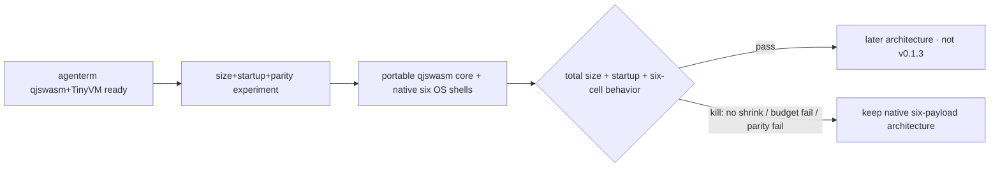
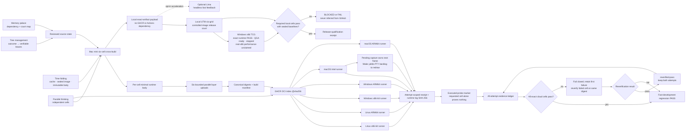
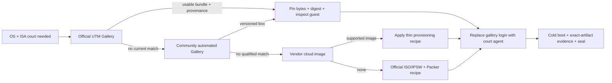

# `minicon` package, budget and delivery

Parent: [MiniCon product requirements](../PRD.md)

This module owns the standalone host's package identity, unwind profiles,
artifact budget, runtime host-memory budget, dependency-graph bans, independent
CI ownership, and its measured artifact-size history. Historical cross-product
release context stays
with AgenTerm; this repository's workflows and machine-readable contracts are
authoritative for MiniCon delivery.

Legend: `[x]` shipped, `[~]` partial, `[ ]` planned.

## Current release evolution

- [x] **v0.1.2 is the stable release baseline.** Tag `v0.1.2` resolves to
  source commit `e2ba35d05b1797cf770e954f35f757de327b3152`. The release owns a
  Windows x86_64 ZIP, Linux x86_64 tarball and macOS Universal tarball, each
  with a SHA-256 sidecar. Its formal workflow built all three packages, checked
  their aggregate completeness, and made a separate native Windows job
  download, hash, unpack and execute the exact packaged PE before publication.
  The repository-pinned Rust 1.97 toolchain is load-bearing evidence: release
  builders must not silently inherit a later rolling `stable` toolchain.
  This is only **4/6 cell coverage**: macOS Universal contains arm64+x86_64,
  while Windows arm64 and Linux arm64 have no v0.1.2 archive. Never backfill
  that historical Release.
- [x] **v0.1.3 released: five unsigned native archives cover all six cells.**
  Windows/Linux each publish x86_64+arm64; macOS Universal
  contains both slices. Every archive has a SHA-256 sidecar. The machine policy
  `release-policy.json` says `signing.mode=off` and `minicon_com=false`.
  Candidate consumes one clean six-payload run, executes all six native cells,
  seals exact bytes, and requires active Defender over both embedded Windows
  executables before human `v0.1.3 promote`.

  G1–G7 are green at exact source `39774ed`: one-build/six-execute run
  `33286599671`, five-archive Candidate `33286811086`, and bound reputation
  qualification `33287684429`. Defender engine `1.1.26080.3` with signatures
  `1.457.375.0` scanned both sealed Windows executables clean; their bytes were
  unchanged after scanning. The archives are 401,853-byte Windows x86_64,
  386,448-byte Windows arm64, 2,258,012-byte Linux x86_64, 2,232,167-byte
  Linux arm64, and 1,538,254-byte macOS Universal. Promotion run `33289364944`
  consumed that exact Candidate without rebuilding, published tag `v0.1.3` at
  source `39774ed`, and passed public-download hash plus native Linux/Windows
  execution. The Release is neither draft nor pre-release; `minicon.com` and
  signing remain excluded by policy.
- [x] **v0.1.4 shipped unsigned native six-cell archives through the same
  workflows.** It also proves Linux x86_64 and arm64 start in a minimal X11
  court with `libxkbcommon-x11-0` and without the `-dev` package. SignPath
  approval and release Environment variables were unavailable, so the
  committed policy remained `signing.mode=off` and `minicon_com=false`.
  Candidate selected the unsigned six-payload upstream; no missing credential
  silently chose a mode. Exact evidence is in
  `archive/v0.1.4-release-history.md`.
- [x] **v0.1.5 released raw unsigned `minicon.com` beside the five native
  archives.** One exact build supplied both representations;
  six execute-only APE GUI/control courts, native parity, a three-object
  Defender court (`minicon.com` plus both native Windows PEs), and no-rebuild
  Promotion governed the release. SignPath remained outside this release.
  Candidate run `33303093810` correctly rejected the first Linux bundle: the
  X11 bridge still needed absent `libxcb-xkb.so.1`. The repaired boundary embeds
  and stages both SONAMEs and requires the minimal-image court to prove that
  neither host package is installed.
  Exact source, runs, sizes and hashes are in
  `archive/v0.1.5-release-history.md`.

  Superseded signed-APE rehearsals, rejected Candidates and the final exact run
  ledger are preserved in `archive/v0.1.3-release-history.md`; they are not
  repeated in this living contract.


- [x] **v0.1.6 released.** Exact source `a000565`, unsigned native six-cell
  plus `minicon.com`, multiline paste fix. Ledger:
  `archive/v0.1.6-release-history.md`.

- [x] **v0.1.7 released — last unsigned line.** Aligned toolbar, greeting page
  after the final tab, explicit Linux X11 runtime boundary, screenshot-priority
  under sustained output, and replay-safe Windows control across named-pipe
  disconnects. Still unsigned (predates the signing switch-on). Ledger:
  `archive/v0.1.7-release-history.md`.

- [x] **v0.1.9 released — first dual-signed release.** The Windows executables
  and `minicon.com` are Authenticode-signed via Azure Artifact Signing, and the
  macOS build is Developer ID-signed and Apple-notarized — all as PARTNERNET
  SOFTWARE PTY LTD, with an RFC 3161 timestamp. `release-policy.json` sets both
  the Windows and macOS signing switches to `required`; missing credentials
  block the release rather than falling back to unsigned. Shipped the first UI
  wave (A+B+C+D): switchable locale, per-row close, theme engine + three themes,
  bottom status bar. Ledger: `archive/v0.1.9-release-history.md`.

- [x] **v0.1.10 released — complete UI, dual-signed.** Both signing switches
  remain `required`, and a signed, notarized, stapled macOS `.dmg` joins the
  archives. Completes the UI: two-tool header + settings panel (interface
  language, font size, theme swatches, shortcut list; `Ctrl+Shift+,`), the
  discoverable three-theme picker (`Ctrl+Shift+P`), and the grid crosshair
  (`Ctrl+Shift+G`) reading into the status bar. Ledger:
  `archive/v0.1.10-release-history.md`.

- [x] **v0.1.11 released — per-theme terminal colors, dual-signed.** Both
  signing switches stay `required`. Each theme now recolors the terminal body
  (default background/foreground, cursor, 16 ANSI colors), not just the chrome;
  the 6x6x6 cube and grayscale stay standard and explicit program colors are
  untouched. Also fixed the clipped settings-panel shortcut lines. Ledger:
  `archive/v0.1.11-release-history.md`. The stale `.github/release-notes.md`
  template was rewritten so future auto-notes state the signed, current product.

- [x] **v0.1.12 released — finish & polish, dual-signed.** Both signing switches
  stay `required`. No new surface: composer Shift+Arrow text selection, a
  theme-consistent crosshair/scrollbar, the complete/correct settings shortcut
  list, tab-title ellipsis, close-button hover + non-zero-exit coloring, header
  hover, a live zoom % readout, Escape-to-close, and the macOS/Linux
  paste-review multiline fix. From the post-0.1.11 review
  (`plan/archive/plan-0.1.12-review.md`). Ledger: `archive/v0.1.12-release-history.md`.

- [x] **v0.1.13 released — legacy-Windows CJK console fix, dual-signed.** Both
  signing switches stay `required`. Fixes garbled Chinese rendering on Windows
  without ConPTY (build < 17763, e.g. Server 2016 / 14393): the pre-ConPTY
  console agent in `agenterm-platform` keyed a double-width glyph's trailing cell
  only on the console's `COMMON_LVB_TRAILING_BYTE`, unreliable on those hosts, so
  it emitted a stray space/ASCII between CJK characters and drifted mixed
  CJK+ASCII lines. The fix derives wide-char continuation from the character's
  display width (`unicode_width`, the same oracle the vt100 parser advances on),
  keeping the LVB bit only as a secondary signal; the `agenterm-platform` pin was
  bumped to carry it. Diagnosed against a real build-14393 host and a UTM Win7
  test bed. Ledger: `archive/v0.1.13-release-history.md`.

- [x] **non-Mac macOS cross-compile from a Linux CI/cloud host, SDK-15.5 probe
  succeeded end to end.** Evidence: run
  [36024044608](https://github.com/partnernetsoftware/minicon/actions/runs/36024044608)
  (source `5c5541c`, `ubuntu-24.04`, `aarch64-apple-darwin`), every step green:
  SDK fetch, `osxcross` toolchain build (10m51s), Rust target install,
  `cargo build --release -p minicon` via the osxcross `clang` wrapper, and
  "Verify the produced binary is a real macOS Mach-O" all passed. This answers
  the question this line named: a Linux runner alone, no macOS runner at all,
  can produce a genuine macOS Mach-O for MiniCon. The SDK-15.5 switch (below)
  was the fix — the same recipe against SDK 11.3 failed on a missing symbol.
  Scope of what is proven: one target (`aarch64-apple-darwin`), one crate
  (`minicon` itself, not yet the full six-cell test/package pipeline this
  file's evidence discipline requires for a release Candidate), from
  `.github/workflows/osxcross-experiment.yml`, which is still explicitly
  experimental/manual-dispatch-only, not wired into `six-grid-cloud-build.yml`
  or any Candidate. `x86_64-apple-darwin` has not yet been run against SDK
  15.5 — do that before claiming both osx cells. Not yet started: the
  container pre-baking follow-on below, and wiring this path into
  `scripts/round.sh` or a release workflow.
  History that led here (kept for the next agent, not still open):
  Owner: this section; no dedicated skill or script yet. Motivation: reduce
  reliance on "this Mac" as the only host that can produce osx-aarch64/osx-x86_64
  bytes, so a Linux CI runner could build all six cells and a Mac stays optional.
  Explored 2026-09-24 from a Linux sandbox session (evidence trail in that
  session's transcript, not yet a script in this repo):
  - `cargo check --target aarch64-apple-darwin` type-checks clean — the crate
    graph (winit/objc2/core-foundation and MiniCon's own code) has no
    Linux-side compile blocker.
  - Real linking fails on stock Linux `cc`: `-framework`/`-arch`/
    `-mmacosx-version-min` are Apple `ld64`-only flags.
  - `cargo-zigbuild` (zig's `ld64` reimplementation) accepts those flags but
    rejects minicon's `-Wl,-sectcreate,__TEXT,__info_plist,...` (used to embed
    `assets/macos-info.plist` straight into the Mach-O without a `.app`
    bundle) with `unsupported linker arg: -sectcreate`.
  - A usable macOS SDK exists in [phracker/MacOSX-SDKs](https://github.com/phracker/MacOSX-SDKs)
    up to `MacOSX11.3.sdk`, sufficient for `aarch64-apple-darwin`'s SDK-11
    floor.
  - `tpoechtrager/osxcross` (real Apple `ld64`, not a reimplementation) is the
    path past `-sectcreate`, since `ld64` supports it natively. Its `build.sh`
    **succeeds unattended on `ubuntu-24.04`**: measured 2026-09-24 on run
    `36011056592`, SDK fetch (shallow clone of phracker + `tar -cJf`) took
    3m58s and the toolchain build (cctools + ld64 from source) 10m01s. That
    ten-minute cost is why this belongs in a one-off probe or a cached image,
    never in a routine round.
  - The wrapper names osxcross produces are **not** the Rust triple: for SDK
    11.3 they are `arm64-apple-darwin20.4-clang` — `arm64`, not `aarch64`, with
    an SDK-derived `darwin20.4` suffix. A `*-cmake-clang` variant sits beside
    each one, so globbing `*-clang` matches several files and breaks
    `basename`. Match `<arch>-apple-darwin<ver>-clang` exactly and map
    `aarch64-apple-darwin` -> `arm64` yourself.
  - No macOS binary has been produced end to end from a non-Mac host yet.
    Nothing here is evidence of `[x]`.
  Next step: the probe workflow
  `.github/workflows/osxcross-experiment.yml` (manual dispatch) carries the
  recipe; the remaining unknown is only whether the link step clears
  `-sectcreate` and yields a real Mach-O. Keep that receipt (`file` output)
  before upgrading this line past `[ ]`. The end goal is running the recipe on
  the Linux build host itself, so `scripts/round.sh:10`'s
  `osx-* -> this Mac` routing can drop the Mac.
  Planned follow-on (gated on the probe above landing `[x]`, not started):
  **pre-bake the osxcross toolchain into a container image** instead of
  running its from-source `build.sh` (cctools + ld64, ~10 minutes measured
  above) on every use. Same pattern `.github/workflows/six-grid-cloud-build.yml`
  already uses for the six-cell body: build the image once, publish it to
  GHCR, and have every consumer pull the image instead of rebuilding the
  toolchain.
  - Image contents: the built `/tmp/osxcross/target` tree (wrappers + cctools
    + ld64) plus the `MacOSX11.3.sdk` tarball already baked in, so a consumer
    does nothing but `docker run` or extract and export `PATH`.
    Build the image in its own manual-dispatch workflow (mirrors
    `six-grid-cloud-build.yml`'s `workflow_dispatch` + GHCR publish shape),
    not inside `osxcross-experiment.yml` or any routine round.
  - Consumers become two, both skipping the 10-minute `build.sh` step:
    (a) CI — `osxcross-experiment.yml`, and later a real macOS-cell job in
    `six-grid-cloud-build.yml`, pull the image instead of the current
    "Fetch macOS SDK" + "Build osxcross toolchain" steps;
    (b) this cloud/Linux session, once the sandbox permission to run
    fetched containers or their binaries is granted, extracts the same
    image locally so `scripts/round.sh`'s `osx-* -> this Mac` line has a
    non-Mac target to route to.
  - Rebuild trigger: the image only needs rebuilding when osxcross's own
    source or the pinned SDK version changes, not per round — this is the
    whole point, matching this file's "CI does not do routine compiling"
    rule and `AGENTS.md`'s cost-of-a-round accounting.
  - Do not build this image before the `-sectcreate` probe above is `[x]`:
    baking a toolchain that cannot actually link MiniCon's own linker flags
    would be premature investment in an unproven path.
  - **`-sectcreate` probe run (2026-09-24, run 36018434924, source `994c011`):
    the wrapper-lookup script from the earlier evidence had a bug of its
    own** -- `find -regextype posix-extended -regex '.*/(aarch64|arm64)-...'`
    matched nothing even though the same run's own failure-path `ls` showed
    `aarch64-apple-darwin20.4-clang` present, root cause not identified.
    Replaced with plain bash globbing (`.github/workflows/osxcross-experiment.yml`,
    commit `994c011`); the fixed probe found the wrapper and reached the real
    link step. **`-sectcreate` itself was accepted with no complaint** -- the
    unknown this line named is answered: real `ld64` via osxcross does take
    MiniCon's plist-embedding flag. Linking then failed on something else:
    `Undefined symbols for architecture arm64: "_proc_signal_with_audittoken"`,
    referenced from `agenterm-platform`. That symbol is not declared in the
    `MacOSX11.3.sdk` stub `libSystem.tbd` this recipe fetches from
    phracker/MacOSX-SDKs; osxcross links against the SDK's own stub library,
    not a real dyld, so a symbol newer than the pinned SDK version is
    unconditionally missing at link time regardless of what runs at runtime.
    Two ways forward were named, neither tried at the time: (a) a newer SDK,
    or (b) find where `agenterm-platform` calls the missing symbol and
    weak-link or gate that call -- out of scope for a MiniCon-side probe since
    the symbol lives in a dependency, not this crate.
  - **SDK source switched (2026-09-24): phracker/MacOSX-SDKs does not have a
    newer SDK to fetch** -- 11.3 is its newest, confirmed by listing the repo
    directly, so option (a) above needed a different source, not a different
    version from the same one.
    [alexey-lysiuk/macos-sdk](https://github.com/alexey-lysiuk/macos-sdk)
    publishes one GitHub Release per SDK version and reaches `15.5`
    (verified reachable 2026-09-24: asset `MacOSX15.5.tar.xz`, HTTP 200 via a
    signed redirect; its tarball's top-level directory is already
    `MacOSX15.5.sdk/`, just the release filename itself drops the `.sdk`).
    `.github/workflows/osxcross-experiment.yml` now fetches this SDK instead
    of phracker's 11.3. **Result (run 36024044608): SDK 15.5 resolves the
    missing-symbol failure and no new one appeared** -- the link, build, and
    Mach-O verification steps all passed. See the `[x]` entry above for the
    full evidence and remaining scope.

- [ ] **Practice run, from a cloud/Linux session (2026-09-24): the
  cross-compile-here-then-test-on-GitHub loop is BLOCKED at the upload step,
  for this session specifically.** Ran `scripts/round.sh lnx-x86_64` end to
  end from a Linux cloud sandbox to exercise the real workflow, not just plan
  it:
  - `preflight` used `df -g /System/Volumes/Data`, a macOS-only flag and path;
    it unconditionally failed (`BLOCKED`) on Linux. Fixed in `484318f` with a
    portable `df -Pk` (1 KiB blocks) computation both hosts implement.
  - After the fix, `preflight` PASSes on Linux (measured: 14G free) and the
    native `lnx-x86_64` build PASSes in 38s directly on this cloud host -- no
    cross-toolchain needed for that cell, confirming this cell at least can
    move off "this Mac" today.
  - The run then correctly BLOCKs at the GitHub-upload step (`gh release
    create`/`upload`, the transport `scripts/round.sh` uses to hand test
    executables to `local-artifact-probe.yml`). Root cause, confirmed not a
    script bug: this cloud session's `GH_TOKEN`/`GITHUB_TOKEN` does not
    authenticate the `gh` CLI against github.com (`gh auth status`: "The token
    in GH_TOKEN is invalid"). This session's GitHub access is mediated through
    the Claude GitHub App/connector, not a raw PAT usable by arbitrary shell
    tools -- by design, not misconfiguration. The available `mcp__github__`
    MCP tools were also checked and have no release-create or
    asset-upload-equivalent capability, so this step cannot currently be
    exercised from a cloud session via any available means. Per this file's
    own evidence discipline, this is `BLOCKED`, not a skipped step: a Mac
    session (or any session with real `gh` credentials) is unaffected and can
    still run the full loop. Fixing it needs either a different GitHub write
    path granted to cloud sessions, or a transport for
    `local-artifact-probe.yml` that does not depend on a release asset --
    neither attempted yet.

- [ ] **horizon / dependency not ready — qjswasm portable core.**
  Owner: `prd/PRD_02_29_qjswasm_horizon.md`. After agenterm qjswasm+TinyVM is
  mature, research may move portable logic out of six native payloads into
  qjswasm; six native thin shells keep window/PTY/font/input/IPC. Size cut is
  a hypothesis, not a promise. Kill if engine+glue does not reduce the total
  package, misses startup/interaction budget, or six-cell behavior diverges.
  Never mix it into a release Candidate, version bump, or tag.



## Bounded build-state lifecycle

- [x] `scripts/cleanup-build-state.py` is the single deletion authority for
  regenerable repository-local build state. It defaults to dry-run, accepts
  explicit scopes, validates that it owns a MiniCon checkout, never follows a
  deletion target outside that checkout, serializes apply runs with
  `target-six/.cleanup.lock`, and writes an immutable GC receipt whenever it
  removes anything.
- [x] ordinary `target/` expires only after 14 inactive days and with no active
  build marker. `scripts/build.sh` is the documented release/dev/check/test
  wrapper: it runs bounded maintenance before Cargo and owns the active marker
  for the command lifetime. Direct Cargo remains available but does not pretend
  to own automatic cleanup.
- [x] six-cell snapshots expire after seven days while retaining at least the
  newest three. `target-six/builds/current`, the build root named by the latest
  receipt, and every fresh `.minicon-build-active` marker are protected.
  `scripts/six-cell-qualify.sh` invokes this scope and pins its selected build
  root before fan-out, so cleanup cannot race the owning qualification.
  When repository-volume free space falls below 64 GiB, the same protection
  set remains absolute but the cache enters pressure mode: it keeps the newest
  two snapshots and expires other inactive snapshots after one hour. This
  converts disk pressure into bounded cache loss, never evidence or active-job
  loss.
- [x] cloud runtime files are grouped by the complete source-tree identity.
  They are eligible only after 30 days, while retaining the newest three and
  the current receipt identity, and only when a matching archive receipt says
  that immutable remote preservation was verified. An incomplete or
  unpublished group fails closed and remains local.
- [x] VM disks, ISO files, preparation receipts, court state, guest keys and
  runtime evidence are outside automatic deletion. Their acquisition and
  authority costs are not equivalent to a Cargo cache.
- [x] `scripts/install-macos-daily-cleanup.sh` installs the per-user
  `com.partnernetsoftware.minicon.cleanup` LaunchAgent. It runs at 03:17 daily
  with background/low-I/O scheduling, uses the same shared cleaner, and logs to
  `~/Library/Logs/minicon-maintenance.log`. Reinstalling updates the job
  idempotently; no password or system daemon authority is required.

## Package identity

- [x] `minicon` is an independently owned workspace package
  (`crates/minicon`) with its own dependency graph, not a bin target of the
  workbench crate.
- [x] the Windows production graph contains no winit or softbuffer: that cell
  uses `native-pixel-window` (Win32). Unix cells use `portable-pixel-window`
  and **do** link winit/softbuffer. No cell links Rhai, HTTP/TLS or a script
  engine. `serde_json`, `hashbrown`/`RandomState`, ab_glyph and ttf_parser are
  absent from the Windows production graph and survive only as dev-only
  oracles where noted. A size or graph claim must name the target.
- [x] the platform `pty` feature declares its own `Win32_Security` dependency
  rather than relying on con's unrelated `ipc` feature to make `CreateProcessW`,
  pipes and Job APIs visible, so both the minimal capability graph and the full
  con graph are compile-owned.
- [x] the binary source lives under `src`, and all four
  public/alignment/throughput tests live under `tests`.
  The package has no `../../` source or test path back into the workbench tree,
  so Cargo ownership and physical ownership now agree.
- [x] official staging removes the obsolete experimental
  `minicon-native.exe` alias both before and after publication, alongside
  earlier retired executable names. `dist/minicon.exe` is the sole Windows
  con artifact users can accidentally select after a successful build.

## Load-time portability

The oldest Windows this product claims is **Windows Server 2016 / Windows 10
version 1607 (build 14393)**. That claim is a delivery property, not a runtime
one: the PE loader resolves every static import before `main`, so a single
import the target lacks refuses the whole program with a dialog naming a symbol
the user cannot act on. No panic hook, log or diagnostic sink can observe it,
and no other gate in this repository can see it either, because they all run on
machines new enough to satisfy the import.

- [x] no static import locks the product out of a supported Windows. ConPTY's
  three entry points (build 17763) and `SetThreadDescription` are resolved at
  run time instead.
- [x] a documented minimum version is treated as evidence, not proof.
  `SetThreadDescription` is documented as available in 1607 — which *is* Server
  2016 — and is still absent there, because 1607 implements it only in
  `KernelBase.dll` and the `kernel32` forwarder arrived in 1703. SDK header
  guards do not catch this. Only the target machine settles it.
- [x] **no Visual C++ redistributable.** The VC runtime is linked statically and
  every remaining module is a Windows component; the Universal CRT is an
  operating-system component, not a redistributable. `panic = "unwind"` is
  preserved — panic containment is not traded away for the dependency.
- [x] a custom PE entry (`/ENTRY`) obliges the program to run the CRT
  initialization the MSVC startup object would have. `__vcrt_initialize` is
  required and is not reachable through the `.CRT$XI*` table this product walks;
  omitting it links cleanly and then dies on the first panic at
  `STATUS_STACK_BUFFER_OVERRUN`, which reads as stack corruption and is a
  missing constructor. `__security_init_cookie` is *not* required — measured,
  not assumed: the cookie is already random without it.
- [x] a gate parses the shipped executable's import table with a pure-Rust
  parser (no `dumpbin` on PATH) and fails on any blocker symbol, or on any
  module that is neither a Server 2016 OS component nor a recorded exception.
  The exception list is empty, which is what makes a future redistributable
  dependency turn it red instead of quietly widening what a user must install.
  The gate was negative-controlled — adding an actually-imported symbol to the
  blocker list turns it red — so it is not a vacuous assertion.
- [x] `scripts/diagnose-startup-windows.ps1`, published as a Release asset rather
  than bundled into any archive, answers the whole question from the target
  machine in one pass, because the loader names only one missing symbol at a
  time and iterating costs a round trip per symbol, paid by whoever owns that
  machine. It parses the PE itself (the target has no Visual Studio) and
  self-tests that a nonexistent export fails to resolve and a universal one
  succeeds before printing an all-clear — an all-clear being also what a broken
  probe prints.

Verified on a user's Windows Server 2016 on 2026-08-23: all named imports
resolve, the program starts, and `--status` reports the fallback backend and a
correct half/full-width font measurement.

## 迁出后的交付差异（2026-08-23）

本子树随代码从 agenterm 迁入独立仓 `partnernetsoftware/minicon`。以下三条是**迁出时确实
发生变化**的事实，先记下来，不冒充仍然成立：

- [x] **unwind profile 的机制变了，要求没变。** `con-dev` / `con-release` / `con-release-fast`
  存在的唯一理由是 agenterm 的 workspace profile 是 `panic = "abort"`，必须逃出去。独立仓
  没有要逃的 aborting workspace，Cargo 默认就是 unwind，所以本仓改为直接在
  `[profile.release]` 里显式写 `panic = "unwind"`，不再要那层间接。下方 `con-*` 条目描述的
  是 agenterm 时期的实现。
- [ ] ~~**体积门已在本仓重建。**~~ **已撤除（2026-08-25）。** 该门自始至终只是
  **Windows 承诺**：`tests/minicon_load_portability.rs` 整个文件是 `#![cfg(windows)]`，
  其 `shipped_binary()` 硬编码 `minicon.exe`，所以它从未在 Linux 或 macOS 上运行过一次，
  而 README 把「1 MiB 上限由测试强制」与「支持 Windows、Linux、macOS」并列，
  读起来像是可执行文件的固有属性。
  单宿主六格实测（`strip=true`）：Windows arm64 677,376 / x64 731,136、
  macOS 1,413,408 / 1,455,424、**Linux 4,846,400 / 5,732,544**——
  Linux 是上限的 5 倍以上，且已确认是代码而非符号。
  2026-08-29：`minicon.com` Linux payloads 改用 `profile.release`（thin LTO）+
  `--gc-sections`；zigbuild 的 lld 不支持 `pack-relative-relocs`。
  实测 `lnx-x86_64` 7,704,280 → 5,746,384（release-fast → release），
  `lnx-aarch64` 6,932,840 → 4,857,552。ELF 段拆分、Zip 占比与剩余杠杆见下方
  **Linux size attribution** / **Remaining mini levers**。剩余体积是
  Wayland+X11 `.text`、独立 `x11rb`、`a11y-publish`（tokio/zbus/atspi）与
  DWARF `.eh_frame`，不是漏 strip。
  一个在三个平台里两个必红的门会挡住即将开始的瘦身工作，却量不出新东西，
  所以撤门、改为在 README 直接写各平台实测字节数。
  上限若要回来，必须先明确它约束哪几个平台。
  它刻意不是警告阈值：这个数字是产品承诺，构建就应该在它上面失败。
- [~] **独立 CI 已移植，但停放中。** `ci-agenterm-con.yml` 已从 agenterm 移到本仓
  `.github/workflows/ci-minicon.yml.disabled`，`.disabled` 后缀期间不触发。重命名只能让
  GitHub 发现文件，不能自动把其中未验证的迁移命令变成发布证据；启用还要求 review 和
  首次成功运行。两处候选适配：`--profile con-release-fast` → `--profile release-fast`、
  去掉 `-p agenterm-con`（本仓单包）。**它从未在本仓跑过**，`build-std` 那几格尤其未验证。

## Historical agenterm delivery contract (migration record only)

The checked items in this section describe the last proven `agenterm-con`
implementation before extraction. They are retained to explain design choices
and measured history; they are **not commands, profiles, gates, or CI claims of
the standalone MiniCon repository**. In particular, `con-dev`,
`con-release-fast`, `con-release`, the agenterm staging merge, and agenterm's
custom-std qualification belong to migration history. The current repository
uses its ordinary Cargo profiles; `[profile.release]` explicitly preserves
`panic = "unwind"`. Any future standalone custom-std gate must be introduced
and proven here before becoming a current contract.

### Historical unwind profiles and panic containment

- [x] con owns `con-dev`, `con-release-fast` and `con-release` unwind dependency
  graphs; only the resulting executable is merged into the ordinary staging
  directory, and the workbench profiles remain aborting. Staged source, merged
  profile and `dist` bytes are identical.
- [x] this exists because native callbacks must not unwind across FFI while
  panics must still be contained: an earlier aborting artifact could not satisfy
  the claimed containment contract, since Cargo test used unwind while every
  delivery profile inherited `panic = "abort"`. A release-profile synthetic
  panic-containment test is part of the ordinary gate.
- [x] the official build pins `rust-src` and uses an explicit target plus a
  subprocess-scoped Rust 1.97 build-std boundary with `backtrace-trace-only`.
- [x] Windows startup enters through a con-owned loader boundary instead of
  `mainCRTStartup`. Rust executes XI/XC constructors, calls rustc's generated
  `main` through a one-instruction architecture trampoline, then executes XP/XT
  terminators; the PE loader remains the sole XL/TLS callback authority, so
  `lang_start`, panic containment, process command-line access and Rust cleanup
  stay intact. A test-only XCU constructor proves execution before Rust test
  main. ARM64 reaches final link with its `b main` trampoline; exact ARM64 link
  remains CI/native-toolchain evidence because the development workstation lacks
  ARM64 `vcruntime.lib`.

## Runtime host memory

Disk size is the artifact budget below. RAM is a scarce product resource, not
slack. The number is the **MiniCon host process** RSS (working set). Child
shells are the user's programs and sit outside it. One cell's number is not a
six-cell claim.

- [x] a public GUI black-box court measures MiniCon host RSS after one idle
  tab is ready, after a 2000-line PTY load, after a second tab, and after
  four extra-tab open/close cycles. It fails if idle RSS exceeds 384 MiB, a
  second tab adds more than 16 MiB, or four cycles grow the host by more than
  32 MiB. Evidence:
  `minicon_control::host_process_rss_stays_within_named_budget`. Observed
  2026-09-06 on macOS aarch64 `cargo test` (debug GUI): idle ~300 MiB, 2000-line
  load ~333 MiB, extra tab ~1 MiB, four-cycle growth ~1.4 MiB. Release GUI on
  the same host was also ~315 MiB idle. Those idle figures are named host
  observations, not a universal product size.
- [ ] intended idle one-tab host RSS is **10 MiB** on each named cell. A
  terminal client that needs hundreds of megabytes, or even tens of megabytes,
  has lost the plot. Shrinking to 10 MiB is current-version work. Do not raise
  the 384 MiB regression ceiling to hide the gap, and do not treat 64 MiB as a
  compromise budget.
- [x] `archive/lab/tinygui` is the Darwin empty-window floor, not a MiniCon cut.
  2026-09-07 osx-aarch64, 960×600, no timer: ObjC AppKit **77.2–77.3 MiB**
  RSS, Rust AppKit **71.2–76.0 MiB** RSS (footprint **16 MiB**), empty
  winit+softbuffer **115.4 MiB** RSS. All three **0.0% CPU** and sleep in
  `mach_msg2_trap`. Same-host settled MiniCon release was **70.9 MiB** RSS
  at **5.2% CPU**. The 10 MiB **RSS** intent sits below this AppKit RSS
  floor; CPU idle is available from the host. Evidence: `archive/lab/tinygui/RESULTS.md`.
  Linux/Windows tinygui courts are not this receipt.
- [x] **macOS idle ~300 MiB is not the window stack and not per-tab PTY state.**
  2026-09-06 `vmmap` + `heap -s` on an idle debug GUI (80×24): physical
  footprint ~243–252 MiB; `MALLOC_LARGE` dirty ~214 MiB. `heap` attributes
  that dirty heap to three `std::fs::read` allocations inside MiniCon's linked
  font path. On disk: `Apple Color Emoji.ttc` is 183 MiB, `Hiragino Sans GB.ttc`
  is 22 MiB, `SFNSMono.ttf` is 219 KiB. `PingFang.ttc` is listed as a fallback
  but is absent at the recorded path on this host. The Unix portable raster
  (`agenterm-platform` `adapters/unix/font_raster.rs`) `fs::read`s each
  candidate and `Box::leak`s the whole file for process lifetime, and it loads
  every fallback at first glyph — including the 183 MiB color-emoji collection
  — before any emoji is drawn. Extra tabs adding ~1 MiB matches this: the leak
  is process-global, not per session. The earlier ~19 MiB `gimli`/`RawVec`
  attribution from inferred `heap -s` type names is not established: generic
  allocator symbols can be coalesced, and release also had two ~9 MiB frame
  allocations. Full allocation stacks and controlled removal own attribution.
  AppKit/Metal mapped files are large in
  virtual size and mostly not dirty. Owner of the leak is the shared Unix
  font raster, not MiniCon tab state. One macOS heap is not a Linux or Windows
  claim (Windows GDI does not load whole TTC files this way).
- [x] **Unix whole-font leak repaired**, shared revision
  `bb309e79bc351b314cec65ec24ba1bab0e74c1f4` (branch
  `fix/lazy-font-mapping`). The raster owns read-only file mappings, borrows
  font views for each lookup, and opens fallback candidates only after a glyph
  miss. Failed opens are cached; ASCII leaves all fallbacks unopened, and CJK
  produces visible pixels without opening emoji. Shared font-only tests: 39
  PASS; isolated Clippy PASS. MiniCon pins the full shared SHA.
  On 2026-09-06, osx-aarch64 debug, the same named host RSS court passed at
  **94.53 MiB** idle / **109.67 MiB** after load. A second run with
  `MINICON_RSS_DIAGNOSTICS_DIR=target/font-memory-evidence` captured vmmap and
  heap from that court's exact idle GUI: **103.31 MiB** idle RSS,
  **28.9 MiB** physical footprint, **9024 KiB** `MALLOC_LARGE` dirty,
  largest heap allocation **9008 KiB**. No `Apple Color Emoji.ttc` mapping;
  Hiragino TTC mapping: 22.4 MiB virtual, 224 KiB resident, zero dirty.
  The second run loaded to 109.92 MiB, added at most 1.34 MiB for a tab, and
  grew 11.11 MiB over four cycles. GUI multitab black box also PASS.
  Evidence and artifact identity: `plan/archive/plan-lazy-font-memory.md`.
  The **384 MiB regression ceiling is unchanged; 10 MiB remains unmet**.
  These measurements supersede the macOS baseline above, not Windows/Linux
  measurements or runtime qualification of any other cell.
- [x] **macOS frame duplication and allocator retention reduced**. Shared pin
  `8d8de88c9ab62709327a6358609e9a09e8c363fd` owns anonymous mapped softbuffer
  frames, released by the final CoreGraphics provider callback. MiniCon
  rasterizes directly into transient frames, removing a second 8.79 MiB
  Retina canvas. Three alternating release comparisons isolated the mapped
  frame change at 101.17 → 92.47 MiB median idle RSS; independent product
  canvas removal measured 92.92 → 84.17 MiB. Host-copy count is now zero.
  The one-file Mach-O embeds `assets/macos-info.plist`: macOS 26 design
  compatibility preserves standard controls and measured 84.05 → 78.67 MiB
  median settled idle RSS. This key is temporary and ignored by SDK 27+
  builds; it does not resolve the long-term target.
  Final native osx-aarch64 release court at the new pin passed at **86.89 MiB**
  early idle / **85.08 MiB** after load, maximum tab delta **1.41 MiB**, four
  cycles **2.33 MiB** growth; earlier integrated court idle was **77.75 MiB**.
  Short startup samples vary by about one frame's size; retain both results
  rather than selecting the favorable one or assigning an unproven cause. Final idle vmmap:
  no `MALLOC_LARGE`, physical footprint 18.1 MiB (not the product metric).
  GUI control black boxes, 131 MiniCon unit tests, mapped-frame lifetime
  tests, Clippy and 32 MiB output qualification passed; final throughput
  21.18 MB/s, zero host copies/present failures.
  Exact artifacts, commands, caveats and experiments:
  `plan/archive/plan-runtime-memory-next.md`. The **10 MiB RSS target stays open**,
  with the 384 MiB regression ceiling unchanged.
- [x] **Two independent baseline/increment investigations** explain the
  next owners. Native Cocoa-linked process 8.14 MiB, NSApplication init
  26.72 MiB, standard Hello window 49.53 MiB; editable control 83.22 MiB,
  Hello plus main menu 76.45 MiB, editable control plus menu 87.33 MiB
  (three-run medians, same macOS host). Control construction itself causes
  the editable increment, not proof of a single IME call's cost. Native
  Hello already has roughly 11 MiB ColorSync tables; do not charge all of
  these to the terminal. MiniCon ASCII plus CJK adds about 0.3 MiB, an extra
  tab about 1.3 MiB. This narrows the remaining work to OS UI initialization
  and presentation while preserving input/menu behavior; it is not an
  irreducible lower-bound claim or an excuse to change the budget.
  Owners: `plan/archive/research-hello-memory.md`, `plan/archive/research-minicon-memory.md`.
  Follow-up custom-input/pixel and shared-host checkerboards, including
  application-policy controls, narrow the remaining host attribution in
  `plan/archive/research-pixel-host.md`; these are research probes, not product gates.
- [x] **Screenshot allocator-cache growth repaired**, shared main revision
  `745f52b2e169d5b41b51377a82cf8a93a9b00c8b`, now pinned by MiniCon.
  Real-product frame/provider tracing found bounded display-frame ownership,
  while screenshot preparation and Unix PNG conversion created two full-frame
  malloc buffers. After free, the original same-window receipt retained two
  9008 KiB regions, despite only 2320 B live-heap growth. A mapped immutable
  worker snapshot plus one-row RGBA encoding eliminates those large temporary
  malloc blocks. Two alternating baseline/fixed release prototype journeys
  measured screenshot RSS increments 17.891/26.516 MiB versus 0.469/0.297 MiB;
  fixed processes had no `MALLOC_LARGE` after screenshot or final-tab close.
  Four PNGs decoded at 1920×1200. Exact prototype hashes and full caveats:
  `plan/archive/research-frame-lifetime.md`. Final pinned release
  `8ce6e879898843f21a2d0a228a14e767e67025bd961a7448bbb909fe62a07480`
  passes 132 unit tests, public GUI/RSS courts, sustained output and Clippy.
  Named final RSS court idle is 86.39 MiB, load 84.52 MiB; the final screenshot
  journey has no large malloc regions and decodes 1920×1200. Commands and
  exact receipts: `archive/research/screenshot-memory/`. This is not a startup or
  10 MiB PASS.
- [x] **Remaining RSS accounting is measured, not discounted.** A frozen
  macOS release receipt closes 79.265625 MiB resident = 18.046875 internal +
  60.718750 external + 0.5 reusable. External is a kernel pager classification,
  not proof that every page is a normal file or can be freed. Another run's
  roughly 79→68 MiB decline coincides with compression, not an accepted source
  optimization. Controls, native-stage comparisons and observer limitations:
  `plan/archive/research-rss-ledger.md`. All resident components remain in the product
  RSS criterion; OS initialization and display residency remain open owners.
- [~] **AppKit Writing Tools startup load is causally identified, not yet a
  supported product repair.** Native `finishLaunching` probes Writing Tools
  support while customizing the main menu, then loads WritingToolsUI. Public
  context-menu and text-view opt-outs leave the 22.578 MiB external increment.
  An isolated private-method negative control removes it. Actual frozen
  MiniCon with the same observer in both arms measures idle 78.141 versus
  60.500 MiB; both public GUI/RSS tests pass. This one-pair private experiment
  is not enabled in production and still exceeds 10 MiB. The compatibility
  choice is pending while independent initialization/allocation work continues.
  Owner and exact receipts: `plan/archive/research-external-residency-next.md`.
- [~] osx, lnx and win name host RSS through the same black-box court. Native
  osx-aarch64 runs on the build host; Linux and Windows UTM guests execute the
  exact host-linked debug artifacts via `scripts/rss-os-court.sh` (`rss` mode
  on the existing `*-utm-runner.sh` / `*-runtime-qualify` pair). One platform's
  idle figure still cannot become a six-cell claim.
  Named so far: osx-aarch64 debug host idle 94.53–103.31 MiB after repair
  (previously ~309 MiB; evidence above);
  win-aarch64 UTM debug GUI idle **22.47 MiB** (`idle_bytes=23564288`,
  2026-09-06, `target-six/logs/rss-win-aarch64-utm.log`) — still above the
  10 MiB intent, an order of magnitude below macOS, consistent with GDI not
  `Box::leak`ing whole TTC files. lnx-aarch64 UTM remains `BLOCKED` (QGA
  `file push` EXIT 124 / transfer timeout); that is not a MiniCon RSS PASS.
  A separate **win-aarch64 release** court now names source `e6cd7b0`, shared
  pin `745f52b2`, and PE SHA-256
  `d2d08ce7600dfcc73b6b1002f73aef38bc9c4c28545198d403bafb96b4f47ecd`:
  idle **21.46 MiB** (22,507,520 B), load 22.02 MiB, extra-tab delta 1.54 MiB,
  four-cycle growth 9.13 MiB. Test body and job wrapper both return success
  after keeping the harness process handle and reading its actual exit code;
  null exit codes fail explicitly. Earlier coerced-null wrapper results are
  not wrapper-success evidence. A hung job's 33,620 K working set is not this
  idle measurement. Exact final log:
  `target/windows-memory/rss-exitmeta.host.log` includes explicit
  `HasExited=True` and `ExitCode_raw=0`; durable owner:
  `plan/archive/research-windows-memory.md`. This release remains above 10 MiB, and
  neither this Windows cell nor macOS fills any unavailable Linux cell.
  Latest same-PE attribution reads K32GetProcessMemoryInfo WS at
  11:04:10.816Z, .818Z and .829Z, before/after the page query and after
  classification: all three are **22,495,232 B**. The page walk is
  5484 × 4096 B = **22,462,464 B**, partitioned as MEM_IMAGE 16,343,040 B,
  MEM_MAPPED 2,908,160 B and MEM_PRIVATE 3,211,264 B. Its sharing-axis split
  is sharable 18,186,240 B plus nonsharable 4,276,224 B. Those partitions
  close internally; **32,768 B / 8 pages remain unexplained against PMC**.
  Earlier erroneous claims of exact WS closure are withdrawn; historical
  7/8-page residuals and receipts remain in `plan/archive/research-windows-memory.md`.
  All resident pages remain in the product WS budget.
  The unnamed mapped bucket is 2,736,128 B. Its largest allocation base has
  2,306,048 B resident (2.20 MiB), of which 2,154,496 B has ShareCount≥2.
  GetMappedFileNameW returns ERROR_FILE_INVALID (1006) for these unnamed
  mappings; that failure does not establish their owner. The largest block
  is not yet a proven framebuffer. Exact receipt:
  `target/windows-memory/idle-regions-5b71f8aacb33e7d0e15f63dc54e73814c8f487f9-20260906T110320Z.log.hostout`.
  Mapping type and shareability are separate axes. `Shared` means sharable;
  ShareCount reports sharing, capped at 7. COW protection flags alone do not
  count already-private image/mapped pages, whose mapping type is retained.
  References: [PSAPI_WORKING_SET_BLOCK](https://learn.microsoft.com/en-us/windows/win32/api/psapi/ns-psapi-psapi_working_set_block),
  [VirtualQueryEx](https://learn.microsoft.com/en-us/windows/win32/api/memoryapi/nf-memoryapi-virtualqueryex).
  Frozen-PE size controls now establish a size-dependent mapped allocation:
  with IME enabled, DPI 96, no screenshots and successful first presents,
  fresh 480×300 and 960×600 clients have largest unnamed R/W mapped resident
  blocks of **614,400 B** and **2,379,776 B** (3.87× for 4× pixel area).
  Shrinking one process from 960×600 to 480×300 reduces that block to
  **675,840 B**, releasing 1,703,936 B; the excess over fresh-small is only
  61,440 B. This is evidence of size dependence and substantial reclamation,
  not a proven DIB owner or a 2 MiB leak. MEM_PRIVATE residency increases
  only 491,520 B between the fresh sizes; aggregate privatized image pages
  remain 1,069,056 B. Their numerical equality to TextInputFramework's total
  residency does not assign all those private pages to that module.
  Evidence and controls: `archive/research/windows-memory/live-owners.md`,
  `target/windows-memory/size-compare-91752f59296e6e2e4b2d718c2a97df69f83746bc-20260906T111300Z.log.hostout`.
  Per-module counts now resolve that ambiguity: TextInputFramework has
  **24,576 B** of private resident pages; the 1,069,056 B aggregate spans
  all 33 modules. External initialization sampling starts after an HWND
  already exists, with TIF/MSCTF/CoreMessaging/imm32 already present. From
  that first observation to first-frame confirmation, WS rises only
  **57,344 B** (22,458,368 → 22,515,712 B). This does not measure process
  entry or identify which earlier call loaded those modules, and does not
  prove that supported deferral is impossible. Receipt:
  `target/windows-memory/init-phases-25635c4f39397fa5151d4ef1376c1ba348924bbd-20260906T112057Z.log.hostout`.
  Research-only in-process hooks (PE SHA-256
  `4e7c330176c9c5a764e4a860724468aac2fe5bc1c10acafa853a0673fad056e0`,
  pin `745f52b` source copy plus tracing, IME enabled) narrow the interval:
  host-run entry WS is 10,866,688 B; CreateWindowExW spans
  10,928,128 → 11,882,496 B, with synchronous NCCREATE but no observed
  WM_PAINT during creation. MSCTF appears there, TIF does not. IME
  association adds 20,480 B without TIF. ApplicationOpened ends at
  12,877,824 B without TIF; the first instrumented post-StretchDIBits
  sample is 22,151,168 B with TIF/CoreMessaging/CoreUI present.
  The **9,273,344 B** interval includes unmeasured show/focus/render work;
  one other StretchDIBits path is uninstrumented. It does not yet attribute
  that growth or module loading to StretchDIBits itself. Host-run entry
  is not process entry. Research receipt:
  `target/windows-memory/init-hooks-93a3dad769f8d41c48ec27e05ffbe9df76c4a468-20260906T113432Z.log`.
  A subsequent research PE (`f71f095ffcf7991be100f6b9338808577a6fc9d5142537959caa76b8b48021d9`)
  records the earliest TIF presence transition at WM_IME_SETCONTEXT during
  SetForegroundWindow; TIF is already loaded before show and pixel copy.
  Skipping the explicit Focus command retains a presented window with TIF
  absent and first-recorded-present WS 17,637,376 B versus 22,142,976 B
  (difference **4,505,600 B / 4.296875 MiB**). Both variants, however, run
  with `--no-activate` and `AGENTERM_NO_ACTIVATE=1`. This establishes a
  nonactivated-startup opportunity, not a normal foreground idle saving;
  IME enabled alone does not qualify actual Chinese input. Receipt:
  `target/windows-memory/init-hooks-b7651f9da8d3dfd97311700a6168e59e64556c30-20260906T114058Z.log`.
  Activation follow-up rejects this as a foreground idle optimization:
  the research skip-focus process rises from 17,694,720 to 22,138,880 B
  on successful activation, restoring **4,444,160 B** with TIF/CoreMessaging/
  CoreUI. Physical-key injection delivers three WM_KEYDOWN and WM_CHAR
  events; Chinese composition remains **BLOCKED** because the guest has
  only keyboard layout 0x409. The normal-start control did not establish
  foreground ownership and is not a foreground idle receipt. Research PE:
  `c941be928c4ac38050aa6a4d345387962ee12cbd2185a2f9cd902a1c5d73580d`;
  log `target/windows-memory/init-hooks-7a1453b9362739bb7f2255d6eb7685dad4ce9f1d-20260906T115253Z.log`.
  A separate correctness fix makes the application startup focus request
  honor `--no-activate` / `AGENTERM_NO_ACTIVATE`; normal startup and later
  explicit user focus requests remain. This is not a foreground RSS saving.
  Windows behavior validation of that fix passes for production-source PE
  `083bcc802099be5d385460c151f043cef21af49ef6a8a7b1faf182269bfb3897`
  (746,496 B, source `20e501b` containing `56207cb`, pin `745f52b2`, no
  research skip variables). After first present, the window does not own
  foreground; explicit activation succeeds, and real SendInput produces
  `abc` in the terminal, read back through capture-pane. WS goes from
  17,723,392 to 22,515,712 B on activation, confirming no foreground idle
  saving. Chinese composition remains BLOCKED by the absent guest layout.
  Receipt: `target/windows-memory/no-activate-behavior-20e501b8c90c5545b0aa0d5d036f27dce9def4cb-20260906T120633Z.log`.
  The separately built `461b6cad…` PE has build evidence only; this runtime
  receipt applies to `083bcc80…`. The production platform pin is unchanged;
  the 10 MiB RSS target remains unmet. Continue with avoidable initialization
  in the activated process.


## Artifact budget

- [x] **`minicon.com` Candidate hard ceiling is `9,437,184` bytes (9 MiB).**
  Stamped 2026-08-29 (cdx) from rehearsal raw `8,880,268` (+556,916, ~6.27%).
  Constant: `loader/write-size-report.py`
  `CANDIDATE_CEILING_BYTES`. The 12 MiB (`12,582,912`) figure is a rehearsal
  fail-closed guard only and must not decide a Candidate. A unique G7 pack
  that exceeds 9 MiB fails; the ceiling must not be auto-raised.
- [x] the Windows resource retains the existing icon's 16/32/64 PNG frames while
  removing redundant mip sizes: `.rsrc` fell from 90,112 to 8,704 bytes, the
  source ICO is capped at 16 KiB by the build script, and Windows shell icon
  extraction still succeeds.
- [ ] ~~Every released `minicon` artifact must be strictly below 1 MiB
  (`release_budget_bytes = 1,048,575`)~~ — **the ceiling was withdrawn on
  2026-08-25**; see the entry above. What survives it is the second half of the
  sentence, which was never platform-specific and still binds: a size statement
  is not an observed development number, and every size statement must name its
  profile **and its target**. The omission of the target is what let a Windows
  measurement stand as the product's size. At the icon reduction the LTO
  `con-release` PE measured 8,704 bytes below the historical 512 KiB target,
  while the no-LTO `con-release-fast` PE was separately 543,744 bytes and is not
  release-size evidence. After the product ceiling changed to a strict 1 MiB,
  the official custom-std unwind/trace-only `con-release` PE measured 561,152
  bytes, 487,424 bytes below that current ceiling. This recovered budget does
  not permit reverting to abort or trading away backpressure, durability or
  clean shutdown.
- [x] size claims require linked-symbol, disassembly or target-specific cold
  build evidence. An incremental 484,352-byte artifact that did not reproduce
  from the same HEAD after an explicit Windows-target package clean is recorded
  as non-evidence, and future assembly or native FFI work must start from the
  same standard rather than from mechanism preference.

### APE join (cosmocc over six native cells)

- [x] `minicon.com` is a Cosmopolitan fat trampoline plus ZipOS overlay
  (`/zip/cells/{os}-{isa}/`). It does **not** recompile MiniCon against
  cosmopolitan libc. GUI/PTY/Win32/Cocoa/Wayland stay in the already-qualified
  Rust cells. The trampoline selects `{os}-{isa}`, copies the blob out of
  ZipOS (or `MINICON_COM_CELLS`) into a per-invocation private directory, and
  `exec`s it. In-process mmap (rust-ape style) is the wrong join for a native
  GUI terminal.
- [x] extract dirs are disposable: `mkdtemp` under `/tmp/minicon.com.<pid>.XXXXXX`
  (Darwin `/tmp` may be `/private/tmp`), mode `0700`, marker file
  `.minicon-extract`. Reaper uses `lstat` / `O_NOFOLLOW` / uid / mode / marker.
  SIGKILL vs non-EINTR `waitpid` failure keeps the directory. There is no
  `MINICON_CONFIG` override. Windows config root remains
  `SHGetFolderPathW(CSIDL_APPDATA)` ([25](PRD_02_25_con_workspace.md)), not
  `~/AppData/Roaming` / the user-profile root.
- [x] pack profiles are target-specific: Linux cells `cargo zigbuild --profile
  release` (thin LTO + `--gc-sections` / `--as-needed`); Darwin and Windows
  cells `release-fast`. Zig's lld rejects `-z pack-relative-relocs` (RELR);
  that path is closed. `cosmocc --version` prints a GCC id (14.1.0), not the
  Cosmopolitan release pin; the pin is the zip SHA-256 plus `bin/cosmocc`
  digest. Install is NEXT/PREV rename-swap under the same parent.
- [x] one pack, six native execute-only courts. Guests do not compile. v0.1.2
  stays three archives; `minicon.com` is not mixed into that Release.
  Promotion copies exact bytes. No auto-raise of the 9 MiB ceiling.

### Linux size attribution (LTO cells, 2026-08-29)

Payload bytes after Linux `profile.release` (same numbers as the 迁出差异
entry above). These are **cell** sizes, not a Candidate APE SHA. Later
Candidate/rehearsal APE totals (for example 8,909,564) name a different
container and must not be substituted here.

| cell | bytes | profile |
|---|---:|---|
| lnx-x86_64 | 5,746,384 | `release` (thin LTO) |
| lnx-aarch64 | 4,857,552 | `release` (thin LTO) |
| osx-aarch64 | 1,613,872 | `release-fast` |
| osx-x86_64 | 1,662,232 | `release-fast` |
| win-aarch64 | 812,544 | `release-fast` |
| win-x86_64 | 867,328 | `release-fast` |

`lnx-x86_64` ELF (that 5,746,384-byte file): `.text` 3,489,366;
`.eh_frame` + `.eh_frame_hdr` + `.gcc_except_table` 1,126,960 (unwind,
required by `panic = "unwind"`); `.rela.dyn` 475,416. Darwin `__TEXT,__text`
is 916,500–1,052,784; Windows `.text` is 563,200–595,456. Linux is large
because it links **winit Wayland and X11 plus independent `x11rb`**, not
because strip was skipped. Linux also enables `a11y-publish` (`tokio`
`rt-multi-thread`, `zbus`, `atspi`, `x11rb`) so AT-SPI can address inner
host UI ([23](PRD_02_23_minicon.md)); that is a product feature, not slack.

Zip overlay of one local LTO rehearsal APE (`7,493,066` raw, under 9 MiB,
not Candidate-of-record): APE prefix 714,106; two Linux cells compressed
≈4.46 MiB (about 59% of that container); Darwin ≈1.52 MiB; Windows ≈0.75 MiB.
gzip-9 of that whole APE was 7,065,640 — deflate is not the remaining lever.

Historical Windows portable→native pixel host: 1,046,528 → 585,216. That
cut does not exist yet on Darwin: `native-pixel-window` is `windows`-only
in the pinned `agenterm-platform`; unix stays `portable-pixel-window`.
macOS already optionally depends on `objc2-app-kit` via the `window`
feature, so Cocoa bindings can be present **in addition to** winit.

### Remaining mini levers (product decisions, not v0.1.3 by default)

Linker knobs already spent on Linux: LTO, `opt-level=z`, `strip`,
`--gc-sections`. Do not trade `panic = "unwind"` for `.eh_frame`. Do not
auto-raise 9 MiB.

- [-] **Linux dual desktop stack is retained (2026-08-30, user).** Keep
  winit Wayland **and** X11 present, plus the independent `x11rb` side
  path (clipboard / EWMH / XTest / AT-SPI origin). Xorg-only sessions
  (XFCE UTM, `xvfb`) and Wayland-default desktops are both in-scope; this
  is not CentOS-7 residue. Do not compile out either winit backend, do not
  drop `libxkbcommon-x11-0` from the runtime set, and do not treat a
  single-backend size cut as open work.
- [x] **Linux X11 runtime boundary is versioned and product-owned.** The exact
  v0.1.3 x86_64 Release ELF (`d5b15772…`) contains `xkbcommon-dl 0.4.2`, which
  already tries `libxkbcommon-x11.so.0` before the unversioned development
  name; its hard-coded panic nevertheless named only `.so`, leaked the CI Cargo
  path, and made a missing runtime package look like a `-dev` requirement.
  Current main probes only the versioned SONAME and the four XKB-X11 symbols
  before entering winit on an X11-selected session. Absence exits 1 with
  `apt-get install libxkbcommon-x11-0`; Wayland-only startup does not acquire a
  false X11 requirement. The native import table remains insufficient evidence
  because this edge is `dlopen`-owned.
- [x] **Runtime-only court, not build-host luck.** A Debian x86_64 court with
  `libxkbcommon-x11-0` 1.7.0-2, no `libxkbcommon-x11-dev`, and no unversioned
  `.so` launched the already-linked ELF under Xvfb/DBus. Public control focused
  the composer, proved Enter retained a soft newline without PTY delivery,
  proved `Ctrl+O` delivered `XKB_RUNTIME_ONLY_OK`, closed the final tab into
  `workspace_empty`, then closed the window cleanly. Removing only the runtime
  package produced the actionable MiniCon error with no panic/build-host path;
  the same court restored the package afterward.
- [x] Candidate native package execution runs
  `scripts/linux-x11-package-smoke.sh` on each Linux artifact's matching ISA
  runner. An empty Ubuntu container owns the missing-library/error half; a
  second container installs runtime packages only, asserts the `-dev` package
  and unversioned `.so` are absent, then executes the same composer/lifecycle
  journey. The packaging jobs do not execute a foreign-ISA ELF. A README
  dependency sentence or `ldd` alone cannot satisfy this gate.

| lever | expected pack effect | cost |
|---|---|---|
| ~~Linux single display backend~~ | n/a | **ruled out** — dual stack stays |
| Feature-gate `a11y-publish` | roughly −0.4–0.8 MiB of APE | AT-SPI host UI tree becomes optional; conflicts with current Linux a11y claim unless restated |
| Darwin `native-pixel-window` (Cocoa, in `agenterm-platform`) | roughly −0.5–0.8 MiB of APE | platform work, then MiniCon unix split: macOS native / Linux portable |
| Darwin + Windows also `profile.release` LTO | roughly −0.2–0.4 MiB of APE | low product risk; the only remaining **linker** knob |
| Drop an ISA cell | one Linux cell ≈ −2.2 MiB compressed | narrows six-cell promise; not a code shrink |
| Slim the 714 KiB cosmocc fat prefix | small | pin/tooling change; already `-Os -static` |
| `panic = abort` / drop DWARF unwind | Linux unwind ≈ 1.1 MiB **per cell** | **forbidden**: containment contract |
| RELR / `-z pack-relative-relocs` | n/a | zig lld rejects it |

qjswasm-as-size-cut remains a later hypothesis
([29-horizon](PRD_02_29_qjswasm_horizon.md)), not a current lever.

## Delivery ownership

- [x] **Runner guests are test targets, not build machines.** The Mac host owns
  compilation, linking, source identity, and artifact selection. Each guest
  receives only the exact already-linked artifact tree plus the bounded test
  harness needed for its runtime court; it does not require a compiler, Cargo,
  a source checkout, or a resident development environment. This keeps runtime
  evidence distinct from build evidence and makes guests cheap to discard and
  reproduce. A guest-side rebuild is excluded because it would test different
  bytes and duplicate host work.

- [~] **Cloud six-grid runtime is the hosted execution court, not a second build
  farm.** The Mac mini links all six targets once with native Cargo,
  `cargo-xwin`, and `cargo-zigbuild`. `scripts/package-six-grid-runtime.py`
  then selects only each cell's product, uniquely named owning Rust harnesses,
  target-side runtime driver, bounded alignment inputs, and per-leaf SHA-256
  manifest; Cargo caches, rlibs, metadata, source history, and unrelated test
  binaries are excluded. `scripts/publish-six-grid-runtime.sh` publishes six
  cell bodies plus a top-level index to GitHub Container Registry and dispatches
  `.github/workflows/six-grid-runtime.yml` with an immutable `@sha256:` index
  reference. Mutable tags are upload conveniences only and never test identity.

  The workflow maps exactly to GitHub's native runners: Ubuntu x86-64 and
  ARM64, Windows x86-64 and ARM64, and macOS Intel and ARM64. It performs no
  source checkout, Rust setup, Cargo command, linking, or packaging policy. A
  runner authenticates only for package read, validates the top-level digest,
  source SHA, source-tree digest, cell reference, archive hash, and every
  manifest leaf and the runner's actual `RUNNER_OS` / `RUNNER_ARCH` before
  invoking the fixed OS runtime driver. The default
  `test` suite runs status plus functional/GUI black boxes; `status` is the
  cheapest diagnostic and `full` explicitly adds sustained throughput. Each
  cell has a 20-minute deadline, the matrix is manual/candidate-triggered,
  and failure may be rerun per cell rather than rebuilding all targets. This
  repository is public, so GitHub's standard six runner classes are currently
  free and unlimited; the bounds remain product hygiene and protect the same
  design if visibility or runner policy changes later.

  GHCR is the non-code artifact authority because Actions artifacts belong to
  an already-running workflow and product Release assets would mix test
  candidates with public delivery. Private-package access requires a normal
  GitHub Packages grant; credentials are never extracted from Git transport or
  printed. A dirty source tree may produce local diagnostic receipts but must
  not publish an authoritative cloud bundle. Local UTM courts remain valuable
  for interactive debugging, offline work and failure reproduction; optional
  Lima acceleration remains useful for quick headless diagnosis;
  they are no longer the only possible release runtime authority and never
  justify keeping six heavyweight guests resident.

  The first real six-runner `status` dispatch proved all runner labels but
  failed before execution. Command-line GHCR publication had not linked the new
  package to its source repository, so each otherwise-valid workflow token saw
  the digest as `not found`; the Windows ARM64 setup action also lacked an ORAS
  ARM64 release. Publication now adds the standard
  `org.opencontainers.image.source` annotation to every manifest. Windows ARM64
  downloads the pinned official x64 ORAS archive, verifies its SHA-256, and
  relies on Windows compatibility execution. Runtime receipts also bind the
  workflow SHA, separating test-body identity from orchestration identity.

  The operator path, from repository root, is:

  ```bash
  ./scripts/six-cell-qualify.sh
  ./scripts/publish-six-grid-runtime.sh ghcr.io/<OWNER>/minicon-six-grid test
  ```

  The publisher refuses a dirty or stale build receipt, missing/ambiguous
  harness, incomplete six-cell body, mutable runtime input, or overwrite by
  implication: every runner receives the resolved OCI digest, not its upload
  tag. Cell archives normalize tar ownership, modes and timestamps plus gzip
  `mtime=0`; `--force` must reproduce the same bytes. A fully revalidated
  manifest is reused without another compression pass. `status` and `full` may
  replace `test` only by explicit invocation.

  The first upload attempt exposed a rejected packaging mistake: Linux debug
  products and libtest harnesses each carried roughly 130–170 MiB of DWARF,
  making a compressed cell about 181 MiB even though the release-fast product
  is only 6.7–7.4 MiB. Cloud Linux bodies now select the already-linked
  release-fast product and harnesses; no semantic test is omitted. A hard 64
  MiB per-cell archive ceiling fails packaging if debug symbols or unrelated
  Cargo output leak back in. This is a test-body budget, not a new product-size
  promise.

  The persistent development goal is now this PRD branch rather than a
  conversation-only task. Four methods govern it: tree management splits one
  outcome into behavior, evidence, delivery and explicit non-goal leaves;
  Mermaid is the spatial memory palace for dependencies and court roles; time
  folding reuses incremental Cargo output, sealed guest images and immutable
  OCI bodies; parallel thinking runs independent cells concurrently and joins
  them only at reviewed manifests and receipts. A session goal points at the
  next unchecked or regressed leaf here and must upsert new evidence before it
  is considered durable.

  The runtime system has **two independent six-grid lanes**, not a serial
  twin-court pipeline. GitHub's native runners are the elastic fast-development
  regression lane: they consume no Mac mini RAM while idle, return routine
  real-OS/ISA feedback quickly, and remain especially valuable where the local
  host lacks real Intel hardware. Local UTM courts are the controlled-image
  release-qualification lane: they own clean boot, first launch, permissions,
  packaging, interactive inspection, offline execution and reusable failure
  scenes. The lanes share test contracts and may consume byte-identical bodies,
  but neither invokes, waits for, or derives success from the other. Each emits
  its own lane-labelled receipt. Local release authority is the intended final
  qualification boundary only after every required baseline is sealed and the
  integrated local receipt has no required `BLOCKED` leaf; until then GitHub's
  native result remains an independent coverage backstop, not a substitute
  claim that unfinished local images are release-ready.

  The local inventory must keep five states separate: registry slot, physical
  VM presence, installed OS, automation readiness, and sealed release
  authority. The checked inventory currently contains five UTM VM definitions,
  not six. All five are installed, automation-ready and `local-unsealed`;
  `minicon-win-x86-64` most recently crossed those boundaries after Windows 11
  build 26200, automatic desktop login, official VC++ Runtime and QEMU Guest
  Agent were proven. The logical OSX x86_64 userspace court is host Rosetta and
  therefore has no routine physical UTM VM. No local cell currently owns a
  sealed release baseline. A five-row UTM registry or a six-cell GitHub PASS
  must never be summarized as six deployed local UTM guests or six sealed
  courts. `utm-court` `tests/registry-selftest.sh` rejects reintroducing an
  OSX x86_64 planned-VM row: that logical cell belongs to host Rosetta.
  MiniCon `scripts/utm-runner-registry-selftest.sh` only checks product runner
  court IDs.

  Measured 2026-08-28, packaging reports both uncompressed payload bytes and
  compressed archive bytes per cell. The exact six-cell body totals about 151
  MB before compression and 54,973,329 bytes after gzip; individual archive
  ratios are 30.65%–42.05%. Publishing the six independent layers serially took
  207–290 seconds. The publisher now runs six bounded, independently owned ORAS
  workers, records one digest per cell, and lets only the primary process build
  the canonical index and publish its top-level seal after every worker passes.
  An isolated fake-registry test proves actual overlap, rejects concurrency
  outside 1–6, and proves one failed layer prevents both the top-level push and
  workflow dispatch. Two real measurements reduced the layer phase to 116 and
  60 seconds; the warm result is 71%–79% below the serial baseline. The final
  measured body reports 150,839,308 payload bytes and 54,984,196 gzip bytes,
  while the complete package/publish/dispatch path took 79 seconds. The first
  complete remote `test` iterations exposed and fixed build-host paths embedded by
  `CARGO_BIN_EXE_minicon` and a relative Windows product path. Run
  `33142937582` then tested the same immutable body on all six native runners.
  Explicitly installing `at-spi2-core` closed the reproducible Linux x86-64
  desktop-service gap; both Linux cells passed the identical accessibility
  journey without weakening its 20-second deadline. The first attempt also
  exposed one Windows x86-64 host/agent cleanup timing failure and one macOS
  x86-64 screenshot/active-tab race; both passed a bounded failed-job rerun,
  after which the aggregate exact-body receipt was **six-grid PASS**. A later
  exact-body run reproduced the macOS Intel screenshot/active-tab failure and
  exposed the measurement defect: the black box started its 10-second GUI
  response deadline before the newly spawned CLI process had registered a
  request with the GUI. It now observes ownership through public
  `ui-snapshot`, then races tab selection and starts the unchanged response
  deadline. Five repeated local journeys passed, and run `33144329432` passed
  all six native cells plus the aggregate receipt on its first attempt. This
  is evidence of timing sensitivity, not permission to hide it with blanket
  retries.

  Runtime evidence is now attempt-aware. Each cell uploads an attempt-scoped
  receipt plus the complete runtime log; the receipt binds run ID, attempt,
  status, log byte count and log SHA-256. The exact aggregator is itself pinned
  inside the OCI index, verified before use, groups all cell histories by
  attempt, writes a `FAIL` aggregate even when the gate fails, and distinguishes
  ordinary `pass`, latest failure and `reverified-pass`. A diagnostic workflow
  input can inject one post-test exit on attempt one only, explicitly classified
  as `intentional-probe`; it is not an automatic retry or a way to turn product
  failure green. Run `33145060107` proved the first half of this contract in the
  hosted court: its aggregate `FAIL` artifact preserved three attempt-one logs
  and classified the selected macOS Intel failure as intentional while two
  independently exposed harness failures remained `runtime-or-environment`.
  Those failures produced two further corrections: a screenshot that completes
  before pending state can be observed is fast success rather than failure, and
  the Windows console cleanup journey now tracks the exact PIDs introduced by
  its session instead of comparing a volatile machine-wide process count. The
  next exact-body run, `33147891690`, exposed a second evidence defect and a
  real scheduling failure. Merely requesting a probe for a cell was not proof
  that its post-test probe step ran: macOS Intel failed inside the screenshot
  journey before that step, yet the first aggregator mislabeled the failure as
  intentional. Runtime receipts now carry a boolean marker written only by the
  executing probe step, and the aggregator rejects impossible markers and
  otherwise classifies a pre-probe failure as `runtime-or-environment`.

  The same macOS Intel artifact then failed the unchanged 10-second
  screenshot/active-tab deadline on both attempt one and a failed-job rerun,
  while the other five cells passed. The owning journey passed locally with
  the identical x86-64 bytes, isolating the slow-host condition to sustained
  PTY Wake traffic starving a requested redraw. When a screenshot owns the
  next frame, the Wake path now yields before draining and reposting PTY
  backlog; readers retain their bytes and wake again after capture. The fix
  passed the ARM64 journey once and the x86-64 Rosetta journey five consecutive
  times without extending the deadline. Run `33148879259` then supplied the
  decisive hosted evidence on one immutable OCI digest: all six native runtime
  bodies passed, including macOS Intel; Linux x86-64 alone wrote the executed
  probe marker and failed attempt one after its real tests passed. A failed-job
  rerun executed only that cell plus aggregation. Attempt two passed without a
  marker, and the final aggregate was **PASS** with Linux x86-64 classified
  `reverified-pass`; it retained both attempt log sizes and SHA-256 identities
  while the other five cells remained selected from attempt one. This closes
  the controlled failure → same-digest rerun → retained-history verdict chain.
  Authoritative publication from a drifting or dirty tree remains forbidden.



- [x] `scripts/six-cell-qualify.sh` is the local Mac qualification owner. It
  gives every cell an isolated Cargo target directory, links all Cargo targets
  through native Cargo, cargo-xwin, or cargo-zigbuild, and fans the six
  dependency-independent build cells out concurrently. Measurement rejected
  six fully independent workers because two fresh `cargo-xwin` processes race
  while creating their shared host `clang-cl` shim. The proven graph therefore
  uses five concurrent groups—macOS ×2, Linux ×2, and one ordered Windows ×2
  group—with two Cargo jobs per group on the 24 GiB Mac mini;
  `MINICON_BUILD_JOBS` and `MINICON_CARGO_JOBS_PER_CELL` are explicit tuning
  controls. Results land in per-group shards and are merged in canonical order,
  so concurrent writes cannot corrupt the receipt. Runtime VM leases remain a
  later, bounded phase and are not accidentally parallelized with compilation.
  Cargo output lives in one stable ignored `target-six/builds/current` cache;
  a PRD or harness edit therefore gets ordinary incremental recompilation
  instead of allocating another source-digest-sized build tree. The clean
  receipt binds the current source fingerprint and hashes every selected
  artifact, so cache reuse does not weaken exact-byte authority.
  The owner runs the complete native
  macOS arm64 suite plus sustained-throughput gate, and uses Rosetta for the
  same macOS x86_64 runtime evidence when installed. Linux runtime evidence is
  deliberately split from cross-linking: `scripts/linux-runtime-qualify.sh`
  can execute the already-linked GNU artifact in a matching Debian/glibc Lima
  court when `MINICON_ENABLE_LIMA_ACCELERATOR=1`, with Xvfb + a session D-Bus
  for GUI and AT-SPI journeys. This is optional fast feedback; Linux desktop
  UTM remains the local release court. The historical ARM64
  court passes 124 host units, 38 shared-core units, alignment, the isolated
  control journey, all 22 GUI/PTY black boxes, the Linux AT-SPI journey, and
  the ignored sustained-throughput gate (33,439,744 bytes at 40,257,030 B/s in
  the recorded 2026-08-26 integrated run, with zero present failures).
  Alpine/gcompat is
  explicitly not evidence for `*-unknown-linux-gnu`: the GNU artifact requires
  glibc loader semantics that compatibility shims did not supply.

  The x86_64 GNU artifact has two complementary local courts. Apple Rosetta for
  Linux in the ARM64 VZ guest, backed by Debian amd64 multiarch libraries, runs
  the complete functional suite and sustained-output gate (33,439,744 bytes at
  20,722,500 B/s in the recorded 2026-08-26 integrated run, with zero present
  failures). A
  QEMU Debian x86_64 guest separately supplies true x86_64-kernel startup and
  logic evidence. Its full control journey currently misses the unchanged
  10-second concurrent-screenshot response criterion under TCG, so it is not
  used to weaken that product deadline or masquerade as full runtime evidence.

  The owner writes `target-six/receipt.json`; a missing runtime is `BLOCKED`,
  never omitted or promoted from link evidence to a test pass. The exact-byte
  first integrated 2026-08-26 run recorded `PASS 38 / FAIL 0 / BLOCKED 0`.
  The current-source run again passes all 38 six-cell owning stages with no
  failure and proves source stability, while the newly mandatory clean-macOS
  status/test/throughput leaves are all explicitly `BLOCKED` until protocol-v2
  is installed in that guest. The receipt itself, rather than a duplicated
  count here, is the current verdict. A Windows 11 Pro
  ARM64 UTM guest installed from Microsoft-origin media, updated to build
  26200, and equipped with UTM Guest Tools runs both the native ARM64 and
  Prism-translated x86_64 courts. Both pass status, 125 host units, 38
  shared-core units, the two-test PE load-portability gate, all seven forced
  console-agent journeys, isolated control, GUI/PTY black boxes, and sustained
  throughput. The integrated receipt's exact-source `release-fast` probes drain
  33,439,744 measured bytes at 17,729,601 B/s native ARM64 and 13,579,003 B/s
  under Prism with zero present failures.

  A receipt binds more than `HEAD`: `scripts/source-fingerprint.py` hashes the
  path, executable bit, and bytes of every tracked or unignored untracked file.
  The gate captures that fingerprint before any build and recomputes it after
  all tests; a changed worktree is an explicit `source-stability` failure. This
  makes dirty-tree local qualification identifiable without pretending it is an
  exact committed SHA.

  Functional, unit and black-box evidence uses the ordinary debug profile;
  sustained-throughput evidence uses the same tree's `release-fast` product and
  harness. The latter is an optimized delivery-performance court, not a debug
  instrumentation benchmark. Cross cells record a separate `throughput-link`
  stage so an optimized runtime pass cannot be inferred from the debug link.

  Each source-tree fingerprint owns a separate directory below
  `target-six/builds/`. Cargo may retain several hashed test executables in one
  target directory, and cross-VM copy time is not a trustworthy proxy for
  current-source identity. Fingerprint isolation prevents a stale harness from
  entering any runtime court while retaining incremental reuse for an identical
  tree. Target-side PowerShell also converts every caught test failure to an
  explicit nonzero process result; a failure log with an ambient zero exit code
  is never accepted as a passing stage.

  Sustained-output timing begins only after both producer and sibling shells
  complete explicit public `send-text`/`wait-text` readiness rendezvous. Initial
  process launch and first-seen antivirus scanning may take longer on a cold
  Windows image and are not throughput. Each marker is assembled from separate
  fragments by the child shell after one buffered send within the startup
  budget; terminal echo of the input command therefore cannot counterfeit
  readiness, while repeated probes cannot create a shell-input backlog. The
  measured sibling marker uses the same split-output rule. A bounded 1 MiB
  output warm-up drains before perf counters and the sustained-output clock are
  reset, keeping cold process/font/renderer/antivirus startup out of a steady-
  state metric. On Windows, PowerShell also constructs the fixed byte array and
  proves `PAYLOAD_READY` before timing; managed allocation under Prism is not
  PTY/render throughput. The final marker may wait longer to preserve
  diagnostics, but the verdict still requires the sibling to respond within
  five seconds while 32 MiB is flowing, full drain within 30 seconds, at least
  2 MiB/s, responsive control observation, and zero present failures.

- [x] `scripts/setup-linux-runners.sh` owns reproducible local Linux court
  provisioning: Debian/glibc, isolated ARM64 VZ + Rosetta and x86_64 QEMU
  instances, repo-root discovery rather than a recorded host path, Xvfb/D-Bus/
  AT-SPI dependencies, and amd64 multiarch libraries for translated x86_64
  execution. Proxy selection remains caller/machine configuration rather than
  repository policy.

### Reproducible runner-image boundary

#### Agent-facing VM court lifecycle

- [~] UTM automation is a reusable test-infrastructure capability, not a set of
  MiniCon-specific VM shell fragments. Phase 1 moved the facade into private
  `partnernetsoftware/utm-court` (`~/repos/utm-court`). MiniCon locates it
  through `scripts/lib/utm-court.sh` and a trampoline `scripts/utm-court.sh`;
  it does not ship `utmctl` wrappers, image recipes, or guest adapters.
  `courts/registry.json` in that repo is the machine-readable registry for the
  five VM-backed logical `{os, isa}` courts, their UTM VM identity, automation
  adapter, idle policy, and template state.
  The sixth local cell, OSX x86_64, is host Rosetta and deliberately absent.
  `utm-court` is the uniform facade: agents can
  discover and inspect courts, validate registration, start or resume them,
  wait for automation readiness, execute commands, transfer exact files, apply
  idle policy, and clone a stopped baseline without learning UTM command syntax.
  Windows adds `interactive-ready`: it re-establishes the logged-in desktop job
  agent and proves a nonce round trip before product bytes may run.
  Readiness budgets are wall-clock deadlines, not retry counts: every QGA
  command and file transfer is individually bounded by the remaining time, so
  an unresponsive Apple-event/RPC call cannot multiply `SECONDS` by its own
  timeout. Expiry is typed `BLOCKED`; it never becomes product evidence.
  `resources`, `lease`, and `release` make host memory part of that interface:
  a lease first stops every distinct peer UTM VM, admits the requested court,
  and release requires a final `stopped` state instead of treating suspension
  as resource reclamation. Registry schema 2 also assigns a logical image tag
  to every court. `image` emits its cold-image contract and deterministic
  contract digest without pretending that an unsealed mutable disk already has
  a content digest.
  An undeployed native-x86_64 desktop or an adapter without a generic operation
  exits as `BLOCKED` (code 3); it is never reported as a skipped success.

- [~] Initial usability is reached only when all three guest adapters implement
  the same black-box operation contract: `status`, `start`, `wait-ready`,
  `exec`, `push`, `pull`, and `idle`. QEMU Guest Agent owns Windows and QEMU
  Linux. The macOS VirtioFS login agent now implements product-neutral command
  and file jobs beside its compatible fixed MiniCon qualification queue: every
  operation is manifest-verified in Guest-local scratch space and publishes an
  atomic exit/result directory. Its unique-file readiness ACK carries protocol
  version `2`, so a still-running fixed-mode v1 agent cannot masquerade as the
  reusable adapter. The host facade implements the same readiness,
  argv-preserving `exec`, and exact-file transfer verbs over that adapter. Its
  updated LaunchAgent still needs installation and a real round-trip receipt;
  source presence alone is not shipped evidence. An isolated host-side bridge
  has nevertheless exercised the exact guest script and public facade through
  readiness, argv-preserving execution, and host→agent→host byte-identical
  push/pull, separating protocol correctness from pending VM deployment.
  MiniCon's six-cell owner must then call the facade rather than directly
  invoking UTM or owning per-OS lifecycle policy.

  Windows is the first migrated product caller: its runner now delegates Guest
  Agent readiness plus every artifact, generated job, result and log transfer
  to the court CLI while retaining only MiniCon's interactive-dispatch and test
  semantics. A real ARM64 Windows status court completed through that path, in
  addition to the facade's independent exact-byte and stdin/stdout round trips.
  The Windows runner has now crossed the lifecycle boundary: both routine disposable
  admission and final stop call `lease`/`release`; it contains no direct VM
  start/stop branch. A real ARM64 public `status` journey passed through the
  migrated runner and returned the VM to `stopped`. The underlying service
  black box separately proved image inspection, disposable admission, Guest
  Agent readiness, release, removal of active state, and publication of an
  immutable receipt whose outcome is `released` and final state is `stopped`.
  A later stopped→lease cold boot independently proved automatic `minicon`
  console login and a visible Windows desktop. OS inventory reports an ARM
  64-bit processor; the x64 Guest Agent process reports AMD64/X64 under Prism,
  preserving the distinction between guest ISA and translated tool process.

  The real x86_64 Windows court now cold-boots, reaches its automatic desktop
  session, answers QGA, and passes an exact-artifact status probe before
  returning to `stopped`. Its official VC++ Runtime bootstrap exposed an
  infrastructure invariant: one large QGA push produced a shorter, different
  SHA-256 file and a corrupt-container installer error, while downloading the
  same Microsoft permalink inside the guest produced the complete installer.
  Every large Guest-Agent transport must therefore verify byte length and
  digest; external prerequisites should use guest-side upstream download or a
  chunked verified transport.

  A later signing-inspector court exposed a smaller false-success class: UTM's
  file command printed an Apple-event/failed-open diagnostic for a nonexistent
  guest parent directory while returning zero, after which the desktop job
  failed only when it tried to execute the missing script. The facade now
  treats transfer diagnostics containing error/failure/timeout/not-found as a
  failed `push` or `pull` even when `utmctl` returns zero, and it never publishes
  a failed pull's temporary host file. The lifecycle self-test covers both
  directions with a deliberately zero-exit faulty adapter.

  The exact x86_64 runtime court is now qualified. Its tested implementation
  fingerprint before this evidence write-back,
  `7470ddfb354561285b4736a24ed6d0a1a325662ce2e2d6f80473bc4b4d4c9f16`
  passed 128 host tests, 38 shared-core tests, both PE portability tests, all
  seven console-agent journeys, isolated multi-tab control and 25 GUI/PTY
  black boxes; the Microsoft-Pinyin-only journey remained explicitly ignored.
  The fix did not lengthen a retry timeout or replay mutations blindly. Control
  protocol V2 wraps each request in a CSPRNG identity, atomically claims it
  before GUI dispatch, and retains pending/completed/tombstone state in a
  1024-identity, 8 MiB, ten-minute cache. Windows pipe 109/233 during request
  write or response read reconnects with the same identity; a completed result
  is returned without executing the command twice, while pending, cache-full
  and result-budget cases fail closed. The server also finishes the Windows
  reply before releasing its pipe instance.

  The release-fast QEMU/TCG probe is measured but not performance-PASS:
  33,439,744 bytes drained in 32.09 s and 32.57 s against the unchanged 30 s
  gate. That does not weaken the product deadline. This software-emulated court
  owns true-x86 kernel, desktop and runtime correctness; sustained-performance
  authority remains a real x86_64 runner. After qualification, disposable lease
  `20260828T134738Z-86066-20795` was released and its lifecycle receipt records
  `final_state=stopped`. Registry and template state remain `ready` plus
  `local-unsealed`; neither runtime PASS nor a stopped receipt means sealed.

  The macOS clean runner now uses the same UTM `lease`, version-2
  `wait-ready`, and `release` operations; its remaining code owns only bootstrap
  media and MiniCon payload/job publication. This source boundary now has real
  runtime evidence: a stopped baseline cold-started directly into the `minicon`
  desktop, the version-2 agent acknowledged readiness without human login,
  generic bridge execution returned `arm64` and uid 501, and `sysadminctl`
  independently reported `minicon` as the automatic-login user. The disk
  remains `local-unsealed` until an immutable baseline digest and archive
  receipt exist. `scripts/linux-utm-runner.sh` supplies the matching
  ARM64/x86_64 desktop contract: it packages the exact product and owning test
  executables for the requested mode, never Cargo rlibs, metadata, incremental
  state or unrelated binaries. The earlier whole-profile implementation tried
  to send a 466 MiB compressed archive for `status`; a bounded live transfer
  proved that design unsuitable for the QGA bridge and was cancelled. The
  narrowed payload verifies its archive SHA-256 inside the guest and invokes
  the existing Linux runtime owner without Cargo or a source checkout. ARM64
  now passes a real stopped→lease→Guest-Agent-ready cold start, automatic
  `minicon` GNOME login,
  root CLI execution, and key-only SSH recovery. Its one-time bootstrap ISO is
  detached; the local disk remains explicitly `local-unsealed` until the older
  fixed credential-bearing seed is removed and the stopped baseline is sealed.
  x86_64 now has the separately recorded visible-desktop and exact-artifact
  runtime PASS; its stopped template remains local-unsealed.
  `scripts/linux-utm-runner-selftest.sh` builds a synthetic Cargo-output tree
  and intercepts the court bridge before any VM starts. It proves that
  `status` contains only the product executable, `test` contains exactly its
  eight owning harness prefixes, and similarly named throughput/unowned
  executables cannot leak through the main-crate `minicon-<hash>` selector.
  `scripts/utm-runner-registry-selftest.sh` independently requires both Linux
  and Windows runners to name the four canonical `*-desktop` court IDs; stale
  pre-registry aliases fail before a VM is leased. The five-row VM inventory
  lives in `utm-court` `courts/registry.json`.

  Optional Lima fast courts expose `lima-court` in `partnernetsoftware/utm-court`
  (`courts/lima.json`). MiniCon's `scripts/lima-court.sh` is a trampoline.
  The service owns `image`, `status`,
  `lease`, `exec`, `release`, and `reap`, with the same atomic active-state and
  immutable receipt outcomes. Six-cell Linux stages call this facade rather
  than `limactl shell` directly when explicitly enabled. Default six-cell runs
  record `NOT_REQUESTED` and do not start Lima. A real ARM64 VZ lease previously executed Linux/aarch64,
  exposed and then repaired an initial missing-receipt terminal-state bug, and
  subsequently proved both abandoned `reap` and ordinary `released` receipts.
  The six-cell owner now installs an EXIT/HUP/INT/TERM cleanup boundary that
  releases every optional court and stops both MiniCon instances. A running
  instance without an active lease is lifecycle leakage, never useful idle
  state.

- [ ] A reusable image has two distinct identities. The immutable template
  records upstream media digest, provisioning-recipe digest, UTM configuration,
  guest OS build, installed automation-adapter version, and a content/config
  digest; it contains no seed disk, plaintext credential, product artifact,
  source checkout, result, or user document. A routine test clones or starts a
  disposable instance, transfers an exact payload, runs a bounded command,
  pulls a manifest-bound result, and discards all guest mutations. Sealing is
  allowed only from a stopped, readiness-proven maintenance instance. Recovery
  archives store the stopped sealed template plus its manifest; live UTM disks
  and overlays never execute from cloud storage.

- [~] The 24 GiB Mac mini is a single-heavy-court scheduler, not a VM farm.
  Sealed templates and sparse disks may remain cold, but no UTM or optional Lima guest
  may reserve RAM merely because it could be useful later. A product runner
  obtains a bounded lease just before runtime evidence, starts at most one
  distinct heavyweight VM, and releases it immediately after results are
  copied out. Two logical cells backed by one physical VM share one lease.
  Memory pressure or an unreclaimable peer returns typed `BLOCKED` before a new
  VM starts; overcommit and swap thrashing are not acceptable fallbacks.

  Normal release first requests guest shutdown and waits a bounded interval.
  If the guest does not cooperate, UTM's virtual power-off event is the allowed
  fallback: it releases memory without killing UTM or deleting any disk. VM
  suspension is a deliberate short debug escape, not the service default,
  because saved execution state does not prove host RAM was reclaimed. When
  requested, Lima follows the same cold-on-demand/stopped-after-court
  invariant; otherwise it is not started. Compilation
  remains on the host; guest startup cost buys clean, reusable runtime evidence.

  The service persists one atomic `active.json` under ignored runtime output.
  Repeated calls for the same live physical VM are idempotent, so several
  product stages can share one bounded lease without multiplying RAM. Release
  moves that state into a timestamped receipt; `reap` performs the same stopped
  transition for an abandoned lease. A filesystem lifecycle lock serializes
  competing admission and release operations. These records are local runtime
  evidence, never source-controlled image metadata. The product-neutral
  `utm-court` `tests/utm-court-selftest.sh` fake backend proves same-VM lease reuse,
  cross-VM recovery, ordinary release, abandoned-lease reap, final stopped
  states, bounded hanging QGA command/file operations, and the corresponding
  receipt outcomes without starting a VM.
  Peer reclaim is restricted to `automation_state=ready`: a planned/provisioning
  VM may contain an interactive installer at an EULA or partitioning boundary
  and is never a disposable runtime peer. The fake backend keeps such a running
  VM untouched while admitting and releasing ready courts.

- [ ] CLI lifecycle receipts must make reuse auditable across products. Every
  run identifies `court`, requested and effective ISA, native/translated
  execution, template digest/version, instance identity, adapter/version,
  payload digest, command deadline, exit status, evidence paths, and final idle
  state. Destructive instance removal remains an explicit caller-authority
  boundary; the initial facade intentionally exposes clone/disposable start but
  not an implicit delete command.

- [x] A portable runner is identified by an upstream image/ISO digest, the
  UTM/firmware/device configuration, a declarative provisioning-recipe digest,
  and the resulting guest OS build identity. A downloaded third-party guest
  disk without those inputs is convenience media, not qualification evidence.
- [x] Linux runners should start from the distribution's signed cloud image
  for the matching architecture and apply the repository-owned cloud-init or
  setup recipe. Debian/Ubuntu glibc images own MiniCon's GNU and GUI/AT-SPI
  courts; a small Alpine/musl appliance cannot substitute for that ABI.
- [x] Windows runners start from Microsoft installation media and a future
  repository-owned `Autounattend`/provisioning recipe. The locally installed
  guest disk may be sealed and reused on this machine, but must not be
  redistributed from the repository. Community preinstalled Windows `.utm` or
  QCOW2 files are rejected as the evidence baseline because their license,
  patch state, account state, provenance, and component removals are not under
  this product's control.

  [UTM's Windows Guest Tools](https://docs.getutm.app/guest-support/windows/)
  are not merely a keyboard/video/mouse convenience.
  The official bundle installs VirtIO/SPICE drivers and agents for networking,
  display, pointer, clipboard and WebDAV integration, plus QEMU Guest Agent for
  host-side readiness, command execution and file transport. Basic emulated
  keyboard/VGA can work without it, but a reusable automated court cannot.
  UTM documents automatic installation when the tools ISO is present as the
  second optical drive during Windows Setup; an already installed guest mounts
  `Install Windows Guest Tools…` and runs the versioned
  `utm-guest-tools-*.exe`/`spice-guest-tools-*.exe`. The upstream
  [NSIS source](https://github.com/utmapp/spice-nsis)
  installs QEMU GA through MSI and supports x86_64, i386 and ARM64 payloads.
  Windows 11 24H2+ may black-screen with some VirtIO GPU combinations, so the
  baseline must retain a bootable firmware display fallback until the first
  post-tools reboot is visibly proven. Network presence, dynamic resolution or
  mouse integration alone does not substitute for a successful QGA
  exec/push/pull receipt.
- [~] After guest tools and qualification prerequisites are installed, shut
  down the clean Windows ARM64 guest, record its OS build and configuration
  identity, and preserve it as the local sealed baseline. Routine runs must use
  UTM disposable mode or an equivalent throwaway overlay so tests cannot mutate
  the next run's starting state.
- [x] VM capacity follows its runtime-only role. Keep a sealed guest at a
  low-power baseline (normally 2–4 virtual CPUs and 4–6 GiB RAM), shut down
  when no court owns it. Raise CPU/RAM only for an identified GUI,
  throughput, or Prism-x64 test and record any configuration that affects the
  evidence. Disk capacity is a sparse ceiling rather than resident usage.
  Suspension is not release. Background compilation, permanent high-core
  allocation, and an always-on VM
  are explicit non-goals.

  When explicitly enabled, the integrated owner mutually schedules the Lima
  acceleration guests: both targets are stopped while macOS builds and Windows
  UTM courts own host CPU/RAM, then started only for their optional Linux
  courts and returned to stopped state afterward. With the default disabled
  setting, six-cell qualification neither starts nor depends on Lima.
  The shared Windows VM also discards and cold-starts a new snapshot between
  x86_64-Prism and ARM64-native cells, then shuts down after qualification.
  Simultaneously reserving memory for unrelated guests or inheriting process
  state across architecture cells is not valid evidence.

  The local Windows ARM64 target uses 4 virtual CPUs and 6 GiB RAM and returns
  to stopped state after qualification. Both ARM64-native and Prism-x64
  `release-fast` throughput probes pass at that capacity (about 17.73 MB/s and
  13.58 MB/s respectively), so it is the proven default test-target baseline;
  raising it is an evidence-specific exception.

- [~] Add a clean ARM64 macOS guest as a release/permission court, not as a
  seventh architecture cell. Host-native ARM64 and host Rosetta x86_64 remain
  the fast feedback courts. The Apple-Virtualization guest owns clean-user,
  first-launch, TCC, font/default-setting and packaging behavior; its Rosetta
  execution can exercise the x86_64 artifact but cannot claim an Intel kernel
  or Intel silicon. Keep that distinction visible in receipts.

  The local VM definition uses an Apple-origin IPSW with Apple Virtualization,
  4 virtual CPUs, 6 GiB RAM, and a 64 GiB sparse disk ceiling. The installed
  clean user and login-session agent now answer the host runner without a guest
  compiler or network listener. `scripts/macos-utm-runner.sh`
  calls `utm-court prepare-macos` then leases the host bridge; `utm-court`
  `guest/macos-utm-agent.sh` runs
  as a low-priority LaunchAgent in the interactive Guest login session.
  `utm-court` `guest/setup-macos-agent.sh` installs that agent without a compiler,
  source checkout, SSH credential, or always-on network service. The bridge
  uses UTM's `share` VirtioFS device, copies each payload into Guest-local cache,
  validates every file through `MANIFEST.sha256`, and publishes a unique log
  plus atomic exit result. `scripts/macos-runtime-qualify.sh` then executes only
  the already-linked product and exact Rust harnesses selected by the host.
  The bridge uses unique request/acknowledgement filenames instead of replacing
  one long-lived mailbox inode: Apple VirtIOFS may otherwise leave the guest
  reading the pre-replacement inode while the host sees the new file. Runtime
  harnesses that inspect repository-owned contracts receive a bounded source
  evidence bundle and an explicit runtime root; they never follow a host path
  embedded by `CARGO_MANIFEST_DIR`. Unix sustained-output generation uses base
  system `yes`, `head`, and `printf`, so a clean macOS court does not summon the
  Xcode command-line-tools installer merely to obtain Python.

  `utm-court prepare-macos` also emits a tiny read-only
  `target-six/macos-utm-bootstrap.iso`. Its single `.command` file mounts the
  already-configured VirtioFS share and invokes the same setup owner. This
  removes keyboard-layout-dependent command entry from clean-Guest
  provisioning without turning the guest into a build machine or embedding
  credentials, source, or product artifacts in the bootstrap medium.

  Apple Virtualization presents the configured UTM directory at
  `/Volumes/My Shared Files`; the login agent and bootstrap command consume
  that system automount first. It accepts either the bridge itself or UTM's
  parent-share layout containing `macos-utm-bridge/`. `mount_virtiofs share` remains only a fallback
  for a backend that does not publish the automount. Treating a successful
  manual mount of the wrong tag as the bridge is invalid evidence: the agent
  additionally requires the shared `bootstrap/` directory before advertising
  readiness.

  The integrated owner now records this court beside the ordinary ARM64 cell
  as `clean-runtime-status`, `clean-test`, and `clean-throughput`, then records
  `macos-clean-idle` after returning the guest to an idle state. When
  `MINICON_MACOS_AARCH64_RUNNER` is absent, all three court leaves are
  explicitly `BLOCKED`; host-native ARM64 success cannot silently stand in for
  clean-user release and TCC evidence. Idle defaults to UTM suspension so the
  authenticated interactive session survives between unattended qualification
  runs; an explicit stop remains available for baseline sealing or maintenance.

- [~] Add a stable glibc Linux desktop UTM release court as the authoritative
  local Linux lane; headless Lima remains an optional accelerator. The selected primary target is Ubuntu
  24.04 ARM64 Server plus `ubuntu-desktop-minimal`. The canonical ARM64 desktop
  target is a Linux guest with ARM64 ISA on QEMU+HVF, named
  `minicon-lnx-arm-64`; it owns native ARM64 checks across Wayland and an
  explicit Xorg session, real desktop launch, fonts, clipboard, IME,
  accessibility/AT-SPI, GUI interaction and packaging. Its baseline is 4 vCPU,
  6 GiB RAM and a 32 GiB sparse disk, reducible to 2 vCPU/4 GiB for static work.
  The earlier Apple-Virtualization Linux experiment is historical migration
  state, not a seventh canonical identity. After the QEMU guest proves data
  migration and cold-boot automation, archive or remove the old VZ instance
  and give the accepted QEMU guest the canonical name. `QEMU` and `VZ` are
  registry backend metadata, not suffixes in the six public VM identities.
  A low-frequency Ubuntu 24.04 Server plus Xubuntu Minimal desktop x86_64 QEMU
  court (2 vCPU, 4 GiB, 24–32 GiB sparse), named
  `minicon-lnx-x86-64`, owns true x86 kernel
  desktop startup, screenshot, input and
  AT-SPI samples; it does not own performance or the full high-frequency GUI
  suite. Existing Lima courts retain useful fast function and kernel-logic
  evidence only when requested; they are not mandatory owners or release
  authority.

  The local infrastructure outcome is six independent logical execution cells,
  not six mandatory resident guests. Linux and Windows retain stopped guest
  baselines with automatic login, agent bootstrap, exact-artifact transport,
  cold-start readiness and release receipts. macOS ARM64 retains the clean UTM
  permission/package court. On Apple Silicon, routine `osx-x86_64` qualification
  instead uses host Rosetta 2 because MiniCon is a small userspace application:
  the receipt must prove an x86_64 Mach-O, force execution with
  `arch -x86_64`, and record translated-process state. This court owns x86_64
  userspace behavior, not an Intel kernel, kernel extensions, drivers, old
  installers or old-macOS compatibility.

  The first explicit Rosetta receipt now proves `uname -m=x86_64` and
  `sysctl.proc_translated=1` before accepting execution. The exact x86_64 Mach-O
  body passed 124 main units, 22 GUI/PTY black boxes, the isolated control
  journey, 38 shared-core units and the dedicated `release-fast` sustained
  output gate. That gate drained 33,439,744 measured bytes at 11,565,347 B/s
  with zero present failures. `scripts/six-cell-qualify.sh` now owns the same
  architecture/translation preflight, so a native ARM64 fallback cannot be
  mislabeled as OSX x86_64 evidence.

  The Catalina/OpenCore QEMU experiment is stopped and retained as recoverable
  research evidence, not a release prerequisite and not a deployed
  `minicon-osx-x86-64` VM. A real Intel Mac runner becomes necessary only when a
  defect depends on an Intel kernel, CPUID/untranslated timing, a kernel
  extension or an old Intel-only macOS release. The safe failure for those
  exceptional leaves is an explicit `runner-unavailable` receipt. Maintaining
  an update-fragile Hackintosh as routine production infrastructure remains a
  non-goal. Prism does not receive this exception: Windows keeps its real
  x86_64 UTM guest and labels Prism evidence supplemental.

  Rosetta is an intentionally provisional court, not the permanent retirement
  of an Intel-macOS guest. Reopen a bounded agent exploration when UTM or its
  image community offers a stable, reusable, automatable x86_64 macOS baseline
  with materially better acquisition and execution cost than today's
  OpenCore/TCG experiment. Until that trigger exists, speculative VM setup is a
  non-goal and must not block the accepted userspace qualification path.

  Its preparation owner is `utm-court` `image/prepare-linux-x86_64.sh`: it accepts
  only the pinned official Ubuntu 24.04.4 Server AMD64 release ISO with
  SHA-256 `e907d92eeec9df64163a7e454cbc8d7755e8ddc7ed42f99dbc80c40f1a138433`
  and emits an identity-free recipe receipt. The declared UTM baseline is QEMU
  TCG with `q35`, 2 vCPU, 4 GiB RAM, a 32 GiB sparse disk, software display,
  shared networking and QEMU Guest Agent. Because this is cross-ISA emulation,
  it owns true-x86 kernel/desktop correctness only; throughput evidence remains
  on real x86_64 hardware or an explicitly labelled translation court.
  The earlier 2,885,177,344-byte Xubuntu Minimal ISO completed full-file digest
  verification, but a real installation powered off with an empty EFI
  partition and an incomplete rootfs missing the kernel, dpkg tables and dpkg
  state. Manual EFI publication succeeded but could not turn that partial
  filesystem into a reusable court. That route is rejected evidence, not
  `media-verified` delivery. Ubuntu Server uses the authoritative Subiquity
  autoinstall path, so the preparation owner renders
  `scripts/linux-x86_64-autoinstall.yaml` into a NoCloud seed using
  the same hidden, twice-entered SHA-512 password-hash handoff as the ARM64
  court. The reusable recipe contains only a placeholder; the ignored seed is
  credential-bearing, attaches as QEMU CD/DVD for provisioning, and must be
  removed before the stopped template is sealed or archived. Autoinstall
  powers off after installing the Xubuntu Minimal desktop, QEMU Guest Agent,
  passwordless guest-local test automation, fallback EFI loader and the bounded
  GUI/AT-SPI prerequisites. A live provisioning run has accepted the NoCloud
  identity, direct-storage model, package set and string-only late-command
  list and completed through its own poweroff. With both credential-bearing
  seed and installer ISO detached, a disk-only cold boot proved `x86_64`, an
  active QEMU Guest Agent and LightDM, and automatic `minicon` login on
  `tty7/:0`. Xorg also reports a connected 1280×800 `Virtual-1`, while XFCE's
  panel, desktop, window manager and test xterm appear in the X window tree.
  A later disk-only cold boot recovered the guest journal and rendered the full
  XFCE desktop through UTM SPICE, invalidating the earlier persistent-display
  blocker hypothesis. QGA reports `running`, `graphical.target`, active
  LightDM/QEMU Guest Agent, real `x86_64`, automatic `minicon` login on
  `tty7/:0`, and a visible desktop. The exact repo-built x86_64 ELF crossed the
  QGA bridge with matching SHA-256. Its first real launch correctly failed on a
  missing `libxkbcommon-x11.so`, proving that desktop readiness is not product
  readiness; after the Ubuntu `libxkbcommon-x11-0` runtime package was installed,
  the unchanged artifact returned help with exit 0, launched on `:0`, exposed
  its public control socket, returned `ui-snapshot`, captured
  `MINICON_X86_GUEST_OK`, emitted a 960×600 pane PNG, and closed with exit 0
  followed by process disappearance. The cell is now runtime-PASS and
  `local-unsealed`. Remaining leaves are an immutable stopped-template digest,
  disposable-clone rerun, AT-SPI/IME evidence, and a packaging-owned runtime
  dependency declaration/check; performance remains an explicit non-goal.

  `utm-court` `image/prepare-linux-desktop.sh` verifies the pinned Canonical Noble
  ARM64 cloud-image digest before copying it into the ignored local court and
  emits a `cidata` NoCloud seed from
  `image/linux-desktop-cloud-init.yaml`. The seed installs the minimal GNOME,
  AT-SPI, CJK font, X11 and guest-integration prerequisites without placing a
  plaintext password, SSH key or host identity in the repository. Its password
  hash is caller-supplied or collected twice through the hidden interactive
  prompt exposed by `image/prepare-linux-desktop.command`; the plaintext
  exists only in that process long enough to derive the SHA-512 crypt hash. The
  hash remains inside the ignored local seed and is called out in the
  preparation receipt so that seed is never uploaded as a reusable public
  template. Non-interactive automation must supply only the hash. The sealed
  post-provisioning baseline must discard that seed before archival.

  Canonical publishes the pinned `.img` as QCOW2. The preparation owner verifies
  that immutable input first, then derives a 32 GiB QCOW2 execution disk for
  UTM QEMU+HVF and a 32 GiB raw compatibility disk for Apple Virtualization.
  Its receipt records the primary backend, both formats, seed attachment type,
  and virtual byte size. UTM's imported root drive must be writable; a
  read-only import prevents a valid first boot. The original QCOW2 and its
  upstream digest remain the provenance root, while both derived disks and the
  credential seed stay ignored local execution state.

  Apple Virtualization is rejected as the provisioning backend for this court.
  A raw root selected by its initial import wizard becomes an external
  removable USB drive: suspend/resume detached it long enough for Linux to
  report buffer I/O failures, abort the ext4 journal, and remount root
  read-only. Moving the root to a fixed virtio device removed that corruption,
  but the VZ removable-USB `cidata` device was not discovered by cloud-init:
  the untouched image reached the locked default `ubuntu` login, retained the
  default hostname, and never acquired a new guest lease. Rebuilding a valid
  `CIDATA` ISO with a fresh instance id produced the same result. This is a
  device-topology failure, not a password failure.

  The accepted provisioning topology is UTM QEMU with HVF, a fixed writable
  virtio QCOW2 root, and the seed attached as a read-only CD/DVD. The same-ISA
  CPU remains hardware accelerated; QEMU is chosen here for stable block-device
  and NoCloud semantics, not to emulate ARM64. Before first boot, verify root
  `removable = false` and `read-only = false`, and verify that the seed is a
  read-only `CD/DVD (ISO)` device. A removable optical slot is preferred; a
  fixed SCSI optical device is accepted for provisioning only when the host
  removes that credential-bearing drive before sealing the baseline. A future
  VZ path may return only after an automated first-boot probe observes the
  requested hostname, DHCP presence, and poweroff on a fresh upstream-derived
  disk.

  Provisioning also installs and enables `qemu-guest-agent`. After the sealed
  baseline starts, host automation uses UTM's public Guest Agent operations for
  address discovery, file transfer and command execution; it does not require
  an SSH password, embedded key, guest compiler, or source checkout. The first
  successful `utmctl ip-address` plus a non-mutating `utmctl exec` probe is the
  automation-ready boundary. A hostname and an open SSH port prove networking,
  but do not substitute for that Guest Agent evidence.

  First-boot provisioning powers the guest off after enabling GDM rather than
  requesting an in-guest reboot. The host observes that stopped state, ejects
  the credential-bearing seed, starts the fixed-disk baseline, and proves a
  graphical login. This avoids guest-reboot ambiguity and makes seed removal
  an explicit credential-lifecycle boundary.

- [x] Preserve expensive, reproducible test assets under `~/googleDrive/` once
  that independently managed mount is ready. Archive signed upstream media,
  immutable checksums, provisioning recipes, UTM configuration manifests and
  sealed reusable baselines. Exclude passwords, tokens, user documents, live
  mutable overlays, runtime logs, crash dumps and transient Cargo/build output.
  The cloud copy is recovery storage, not an execution dependency: qualification
  first verifies a local copy and its digest, then runs disposable overlays.

  The mounted recovery store has passed an actual write/read probe. The first
  archived input is Canonical's 618,370,560-byte Noble ARM64 cloud disk; both
  local and archived copies match SHA-256
  `4a281a921b8d7db952895ab619736f10efe9f63e111fa5b5779ed18f023818aa`.
  The archive also holds Canonical's checksum catalog, the credential-free
  cloud-init template, preparation script, and an identity-free receipt. Slow
  NFS metadata makes this a cold recovery store, never a live UTM disk or test
  dependency.

  The rejected Xubuntu 24.04.4 Minimal AMD64 input, credential-free
  autoinstall template, preparation owner and identity-free upstream receipt
  are archived as historical recovery evidence, not an accepted VM baseline.
  The 2,885,177,344-byte cloud copy was read back in full and independently
  matched SHA-256
  `21cb21d6b98def5dfa6af34fd2a4105c0f41724d691185f7b05a88117814db0b`;
  rsync completion alone was not accepted as recovery evidence.

- [ ] Make runner acquisition image-first rather than installer-first. Before
  creating a VM interactively, the provisioning owner must query, in order:
  UTM's official Gallery, a reviewed/versioned community UTM or Vagrant box,
  an OS-vendor cloud image, and only then official installation media. An
  imported image is acceptable only when its guest ISA, OS edition/version,
  upstream provenance, immutable digest, publication age, login/bootstrap
  state and redistribution terms are recorded. Guest credentials supplied by
  a gallery are immediately rotated or replaced by the credential-free agent
  bootstrap before sealing; an opaque image never becomes a release court.

  This rule follows measured acquisition cost, not aesthetic preference. UTM's
  official Gallery documents directly opening extracted `.utm` bundles and
  explicitly points to the community Gallery. The community catalog publishes
  Packer-built, versioned images and currently exposes one-click ARM64 Ubuntu
  24.04 and Windows 11 Pro boxes, but not the required x86_64 variants. Those
  images could shorten future ARM baseline recovery, while the present true-x86
  Windows court still requires its official-media installation. The same
  search found no trustworthy modern Intel macOS appliance; that cell keeps
  its bounded OpenCore experiment and real-Intel-runner fallback. The remaining
  product gap is a repository-owned discovery/import command that emits a
  typed `prebuilt-selected`, `recipe-selected`, or `no-qualified-image` receipt
  before provisioning begins.

### UTM image shelves (observed 2026-08-28)

This is a discovery memory, not an allowlist or a claim that every image is
release-qualified. Catalog contents and download targets are mutable; an agent
must refresh the source page, resolve the concrete artifact, record its digest
and inspect the guest before importing it. A listed default password is a
bootstrap liability, never a credential to preserve in a sealed court.



**Official shelf.** Source: [UTM Gallery](https://mac.getutm.app/gallery/).
The gallery says an `Open in UTM` item can be imported directly; otherwise the
archive is extracted and its `.utm` bundle opened. It recommends native ARM64
images on Apple Silicon and permits x64 under slower emulation. Project source
and product introduction: [utmapp/UTM](https://github.com/utmapp/UTM), an
Apache-2.0 QEMU/Apple-Virtualization frontend for macOS and iOS. The current
gallery landing page exposes this inventory:

| Image | Guest ISA shown by catalog | MiniCon relevance |
|---|---|---|
| ArchLinux ARM | ARM64 | lightweight Linux ARM candidate |
| Debian 10.4, custom i3 | ARM64 | old desktop recovery/reference |
| Debian 11, LXDE | ARM64 | lightweight desktop candidate |
| Debian 11, Xfce | ARM64 | lightweight desktop candidate |
| Debian 12, Rosetta | ARM64 | Linux ARM + translated x64 supplement |
| Debian 12 | ARM64 | current-enough Linux ARM candidate |
| Fedora 38 | ARM64 | Linux ARM compatibility diversity |
| Kali Linux | ARM64 | non-primary specialist distribution |
| ReactOS 0.4.14 | x64 | Windows-API compatibility reference, not Windows qualification |
| Sun Solaris 9 | SPARC | unrelated ISA/reference only |
| Ubuntu 14.04 | x64 | true-x64 but obsolete for release qualification |
| Ubuntu 22.04 | ARM64 | prebuilt Linux ARM desktop candidate |
| Windows 10 | ARM64 / x64 | legacy Windows compatibility candidate |
| Windows 11 | ARM64 / x64 | configuration/guide entry; artifact availability must be rechecked |
| Windows 7 | x64 | legacy compatibility only |
| Windows XP | x86 | legacy 32-bit compatibility only |

The Windows 11 detail page currently describes ARM64/x64, 8 GiB RAM, a 20 GiB
disk, VGA and installed SPICE tools, but exposes a guide rather than a stable
downloadable artifact. It is therefore discovery evidence, not a pinned
prebuilt source.

**Community automated shelf.** Catalog:
[UTM VM Gallery](https://naveenrajm7.github.io/utm-gallery/); introduction:
[About](https://naveenrajm7.github.io/utm-gallery/about); build model:
[How it works](https://naveenrajm7.github.io/utm-gallery/how_it_works); recipe
repository: [naveenrajm7/utm-box](https://github.com/naveenrajm7/utm-box).
The project converts Packer-built HCP Vagrant boxes into directly importable UTM
VMs. Its ISO builders produce larger GUI images where possible; cloud builders
start from small QCOW2 terminal images. Boxes are versioned and multi-ISA is a
declared goal, but provenance and digest still require repository-side pinning.

| Image | Type / guest | ISA | Download size | Display |
|---|---|---|---:|---|
| `alpine-ce` | Alpine cloud | ARM64 | 93.34 MB | serial only |
| `bookworm` | Debian 12 generic cloud | ARM64, AMD64 | 516.52 MB | serial only |
| `debian-12` | Debian 12 GNOME | ARM64 | 1,839.63 MB | GPU accelerated |
| `debian11` | Debian 11 Xfce, imported from official gallery | ARM64 | 928.42 MB | catalog reports none/serial |
| `fedora-41` | Fedora 41 Server + GNOME | ARM64 | 1,872.39 MB | GPU accelerated |
| `fedora41-ce` | Fedora 41 cloud | ARM64 | 468.35 MB | serial only |
| `noble` | Ubuntu 24.04 cloud | ARM64 | 539.19 MB | serial only |
| `openbsd-7.6` | OpenBSD default install | ARM64 | 589.60 MB | serial only |
| `ubuntu-24.04` | Ubuntu 24.04 Server ISO install | ARM64 | 2,648.77 MB | serial only |
| `windows-11` | Windows 11 Pro | ARM64 | 5,726.27 MB | GPU accelerated |

All community entries declare a 40 GiB virtual disk and 4 GiB RAM. The catalog
publishes a generic bootstrap account, so direct reuse without credential and
agent replacement is forbidden. The most useful newly discovered path is the
`bookworm` AMD64 cloud box: it can seed a true-x86_64 low-frequency Linux court
far faster than an ISO, after which a deterministic XFCE/QGA recipe can add the
desktop. It does not invalidate the already proven Ubuntu/Xubuntu court, but it
must be evaluated as the preferred rebuild/recovery source before another
interactive Linux x86 installation.

- [x] `scripts/windows-runtime-qualify.ps1` owns the target-side Windows test
  sequence over already-linked PE artifacts. `scripts/six-cell-qualify.sh`
  accepts executable machine wrappers through `MINICON_WIN_X86_64_RUNNER` and
  `MINICON_WIN_AARCH64_RUNNER`; those wrappers must copy/mount the exact target
  tree and launch GUI journeys in an interactive desktop session. The local
  Windows ARM64 VM, guest agent, interactive dispatcher, and both runtime
  courts are qualified in the zero-blocked integrated receipt.
  Both target-side harnesses select the newest runnable hashed test executable;
  persistent Cargo target directories may retain older hashes, which must not
  silently become current-source evidence.

- [x] `scripts/windows-utm-runner.sh` is MiniCon's Windows calling scene. It
  selects a court ID per Windows cell, asks `utm-court` for the guest work
  root, replaces only that cell's dedicated guest staging directory, pushes
  the exact linked product plus only the hashed test PE files required by the
  selected status/test/throughput/diagnostic mode through the court CLI, and
  invokes the target-side PowerShell owner. It does not call `utmctl`.
  The host emits a source-fingerprint-bearing manifest that names exactly one
  hashed executable for every target-side harness. The guest may retain older
  files in its fixed staging directory—UTM's guest-agent file API does not
  create arbitrary directory trees—but PowerShell executes only manifest-named
  bytes. Every guest-side product and test filename is additionally prefixed by
  the full source-tree SHA: Cargo's test hash need not change for every source
  edit, and UTM's same-name overwrite result is not accepted as byte identity.
  A different tree therefore cannot reuse or compete with an older guest file.
  The target harness exports that manifest-selected product through
  `MINICON_TEST_BINARY`; integration tests use it ahead of their ordinary
  Cargo-adjacent fallback, so the harness cannot silently exercise a stale
  unprefixed GUI executable. Console-agent lifecycle evidence counts processes
  by that exact executable path when present rather than assuming the staged
  filename is literally `minicon.exe`.
  A stopped baseline is cold-started hidden and disposable by default; an
  explicit `MINICON_WINDOWS_UTM_DISPOSABLE=0` is the provisioning/debug escape
  hatch. A suspended target is resumed without requesting a second snapshot.
  An interactive desktop job agent atomically claims each request, runs its
  PowerShell court, and publishes a unique UTF-8 log plus exit-code file.
  Windows Guest Tools and an interactive logged-in desktop are prerequisites;
  guest-agent process execution alone is never treated as GUI evidence.
  The runner waits up to 120 seconds for a nonce-preserving guest-agent
  push/pull round trip after cold boot, because networking and the desktop can
  precede that service. `utmctl` can emit an OSStatus transfer error while
  returning zero, so process exit status alone is explicitly insufficient.
  Startup remains the cold-login bootstrap, but it is not sufficient for a
  disposable snapshot resumed after login: Startup does not run again, while a
  QGA-spawned process belongs to session 0 and cannot own GUI evidence.
  `interactive-ready` therefore publishes the exact worker under a unique path,
  asks QGA to invoke `schtasks.exe` directly to create/run an interactive-token
  Scheduled Task for the registry's generic test user, and accepts readiness
  only after that worker claims and completes a fresh nonce job. Do not wrap
  scheduler registration in session-0 PowerShell or a batch file: that extra
  guest shell was observably transport-dependent on the emulated x86_64 court.
  QGA command submission itself is bounded and requires both a zero status and
  empty diagnostics: UTM can print an Apple-event/RPC failure while returning
  zero, and accepting that used to waste the full nonce window while blaming
  the interactive worker for a command that never reached Windows. Each recovery
  task has a unique scheduler identity and is deleted after the bounded probe,
  while
  the worker's named mutex makes an already healthy interactive instance win
  without killing any process. The worker rejects session 0, preventing a
  QGA-started process from racing the interactive worker for the shared job
  files. Scheduler command success is only submission evidence; the fresh nonce
  is the readiness authority and the emulated x86 court gets a 180-second
  readiness budget. Windows ARM64 has completed that nonce court. The current
  emulated x86_64 image instead reproduces a zero-exit QGA command accompanied
  by `OSStatus -2700`; the court now stops at that transport failure instead of
  claiming scheduler submission or waiting 180 seconds for an impossible
  nonce. A later single-active probe addressed the canonical VM identity
  directly and kept the VM started throughout, yet produced no `job.exit`,
  `job.log` or worker log. This rules out duplicate display names as the nonce
  root cause and narrows the gap to the `/it` Scheduled Task: logged-on session
  availability, task state/Last Run Result, or immediate worker exit. The next
  diagnostic must redirect `query user` and `schtasks /query /fo LIST /v` to
  guest files and pull them through QGA; session-0 execution must not substitute
  for an interactive GUI court. A current-source AgenTerm
  `agenterm-cu page targets --pid` probe
  then resolved an owned Edge CDP endpoint and listed its page on both ISAs.
  A later enlarged PTY rerun exposed a court-wrapper defect rather than a
  Windows product defect: `command_bounded` supplied its Python source through
  stdin, so every bounded `utmctl file push` received EOF and silently created
  a zero-byte guest file. The earlier roundtrip selftest also returned a fixed
  word independent of the upload, allowing the same bug to look green. The
  wrapper now uses `python3 -c` so caller stdin reaches the child, and the fake
  transport persists and returns a unique payload. A real ARM guest non-empty
  roundtrip and nonce both pass.
  The interactive protocol is now isolated under `agent-v2/` with a versioned
  mutex, so a pre-upgrade worker cannot race new jobs. Readiness no longer asks
  the worker to launch a second PowerShell for a tiny script: it atomically
  echoes an opaque `ping.request` to `ping.response`. On emulated x86_64 the
  Scheduled Task entered the logged-in session immediately, while the first
  PowerShell host needed about one minute to reach the loop; after that cold
  cost, the v2 nonce returned immediately. This separates scheduler submission,
  first-host startup and steady-state liveness without raising the 180-second
  wall budget.
  This
  distinguishes court readiness from product success instead of calling a
  submitted scheduler command "ready". The product job invokes the target qualifier in-process rather
  than adding a third nested PowerShell host, and success is explicit rather
  than inherited from ambient `$LASTEXITCODE`. Both an ordinary cold stop/start and the default hidden
  disposable cold start have completed a Windows status court without manual
  guest action.

  The local UTM court service is intentionally **single-active** to cap host
  memory: leasing any ready court reclaims a running peer VM, even when the two
  courts name different operating systems. Agents must therefore serialize
  local UTM execution and wait for `release` plus `state=stopped` before leasing
  the next cell. A 2026-09-04 Linux/Windows parallel probe demonstrated the
  failure mode by stopping each other's VM; neither interrupted run is product
  evidence. Remote GitHub runners and target-isolated local cross-builds remain
  independently parallelizable.

- [x] **Cross-build target policy uses Cargo target identity, never build-script
  host cfg.** Build scripts and build dependencies compile for the build host;
  guarding Windows resource or linker policy with `#[cfg(windows)]` or a
  target-scoped build-dependency silently removes it from macOS/Linux
  cross-builds. `build.rs` therefore gates on `CARGO_CFG_TARGET_OS`, and
  `winresource` is an unconditional build dependency. The Windows load court
  must continue to reject `VCRUNTIME140.dll`; this rule was proven when both
  cross-built PEs accidentally depended on that redistributable until the host
  cfg defect was fixed.

- [~] **Antivirus reputation is a release evidence concern, not a reason to
  amputate terminal capabilities.** v0.1.3's policy-selected court scanned both
  exact Windows executables extracted from the sealed archives. A later
  signed-APE release must scan `minicon.com`. The historical APE had a
  reproducible Defender ML detection (`Program:Win32/Contebrew.A!ml`, threat
  `251873`). Candidate artifacts now carry icon plus standard ProductName,
  FileDescription, OriginalFilename, InternalName and Cargo-owned file/product
  versions. The superseded signed-v0.1.3 plan required Authenticode; the actual
  unsigned v0.1.3 Release instead bound published SHA-256/provenance and a clean
  Defender court at both exact native Windows SHAs.

  After publication, 360 QVM independently classified the exact unsigned
  x86_64 PE as `HEUR/QVM202.0.B951.Malware.Gen`. This does not invalidate the
  Defender receipt, nor does that receipt settle a different engine. 360 does
  not publish the feature behind `B951`; the strongest known structural
  hypothesis is MiniCon's deliberate custom PE entry, while absent publisher
  reputation is an independent hypothesis. Neither is established causation.
  `plan/archive/design-qvm-false-positive-experiment.md` fixes the order: reproduce the
  exact SHA → official 360 review of unchanged bytes → trusted-signature
  control → conventional-startup control. A hit enters the vendor
  false-positive channel; PTY, named-pipe, Job and control behavior remains
  product functionality rather than something to hide or remove.
  A redacted post-pack qualification receipt is admitted through the manual
  `Reputation Qualification` workflow and bound to Candidate run, source SHA
  and the policy-selected asset SHA set. Promotion consumes that successful run ID; missing
  or mismatched evidence fails closed. Raw screenshots remain operator-held and
  gitignored rather than leaking workstation context into repository history.

- [x] **Company Artifact Signing live qualification green; no signed Release yet.**
  The later trusted-signing court covers `minicon.com`,
  `minicon.exe`, and the other platform deliverables. The implementation must
  decide certificate procurement and hardware/managed key custody, Windows
  Authenticode plus trusted timestamping, macOS Developer ID signing and
  notarization/stapling, CI secret authority, renewal/revocation, and exact-byte
  post-sign six-grid verification. The APE experiment proved that Cosmopolitan
  4.0.2 normally emits only two PE data directories; `authenticode-pad.S`
  reserves the remaining slots during linking, before Mach-O is laid out, and
  `prepare-authenticode.py` activates the zero Security Directory slot. Never
  grow that header after linking. Linux archives retain checksums/provenance
  unless a distribution-specific signature is deliberately added.
  Qualification receipts are explicitly non-promotable; documentation must
  not imply that a public Release is signed merely because the company name
  appears in metadata or a qualification artifact.

  Reusable signing contract for MiniCon and later AgenTerm:

  ```text
  unsigned build receipt
  └── link-time signable layout
      ├── Windows PE / APE: empty Authenticode Security Directory
      ├── sign as the approved trusted publisher
      ├── RFC 3161 SHA-256 timestamp
      ├── signing receipt: before SHA → after SHA + certificate identity
      ├── public inspector: basename + SHA + size + signer/timestamp certificate
      ├── six native courts execute only the after-SHA bytes
      └── Defender scans that same after-SHA byte sequence
  ```

  The future company-publisher custody route is Azure Artifact Signing Public
  Trust with GitHub OIDC.
  The managed signing key is non-exportable: no PFX/private key belongs in Git,
  GitHub secrets, Actions artifacts, logs, `~/Downloads`, or cloud-drive mounts.
  The dedicated GitHub `release-signing` Environment holds only OIDC identifiers named
  `AZURE_CLIENT_ID`, `AZURE_TENANT_ID`, and `AZURE_SUBSCRIPTION_ID`; non-secret
  resource coordinates use placeholders `ARTIFACT_SIGNING_ENDPOINT`,
  `ARTIFACT_SIGNING_ACCOUNT`, and `ARTIFACT_SIGNING_PROFILE`. Azure grants that
  federated identity only the certificate-profile signer role. Back up the
  company verification packet, Azure resource inventory, RBAC/federation
  recovery procedure, billing owner, renewal/revocation runbook, and emergency
  contacts in the company-controlled secrets vault. Do not back up an
  exportable key because this route has none.

  A traditional CA certificate is a fallback, not an interchangeable detail.
  If selected later, keep its hardware token or encrypted PFX in two
  company-controlled offline locations; inject it only through the protected
  `release-signing` Environment, never a repository-level plaintext variable.
  Record only certificate subject, issuer, serial/thumbprint, validity and
  timestamp evidence in receipts. Rotation must produce a new after-SHA and
  repeat all post-sign courts.

  On 2026-08-30 the company Artifact Signing account was created in East US on
  the Basic tier. Current terms were accepted, the human verifier received the
  account-scoped `Artifact Signing Identity Verifier` role, and a Public
  Organization identity-validation request was submitted. On 2026-09-03 that
  request reached **Completed**: the vetting email had been sitting unread in
  the company mailbox (sender `<MICROSOFT_VETTING_SENDER>`, subject "Action needed:
  Verify your email account with Microsoft"), the link was confirmed, and the
  backend record showed every vetting sub-service (DNE, TSS, VC_Ind, BV, DV,
  EV) as Pass. The same day the MiniCon Public Trust certificate profile
  was created (Active; CN/O `PARTNERNET SOFTWARE PTY LTD`,
  L/S/C Sydney / New South Wales / AU, street and postal code excluded), an
  Entra app registration with a GitHub federated credential bound to GitHub's
  immutable `repo:<ORG>@<OWNER_ID>/<REPO>@<REPO_ID>:environment:release-signing`
  subject was created,
  and that service principal received only `Artifact Signing Certificate
  Profile Signer` at the profile scope. The `release-signing` Environment now
  holds the three OIDC identifiers as secrets and the endpoint/account/profile
  coordinates as variables. No production Release byte has been company-signed
  yet; qualification evidence must continue to say it is non-promotable.

  Same-day mechanism rehearsal with the real Public Trust profile (outside
  the repository, output discarded): the 7,660,467-byte unsigned dev-pack
  `minicon.com` (SHA-256 `1ca1fbc3…93d4ac`) was signed from this Mac with
  `jsign --storetype TRUSTEDSIGNING --alias <ACCOUNT>/<PROFILE>`
  using a short-lived `az` access token under a temporary personal signer role
  that was removed afterwards. Result: 7,673,056 bytes (SHA-256
  `6006eb03…10a02e`), signer `CN=PARTNERNET SOFTWARE PTY LTD,
  O=PARTNERNET SOFTWARE PTY LTD, L=SYDNEY, ST=New South Wales, C=AU` issued by
  `Microsoft ID Verified CS EOC CA 04`, RFC 3161 timestamp from
  `timestamp.acs.microsoft.com` at 2026-09-03T03:36:11Z, `osslsigncode verify`
  ok against the Microsoft Identity Verification Root CA 2020, ZipOS still
  lists all 16 cells, Darwin `--version`/`--status` still run, a one-byte
  mutation fails verification, and the file stays under the 9,437,184-byte
  ceiling. osslsigncode could not complete the timestamp-server chain from its
  own bundle; Windows `Get-AuthenticodeSignature` in the workflow is the
  authoritative check. The later canonical portable-inspector v3 closes that
  diagnostic gap without changing system trust: a company helper downloads
  the Microsoft signing root and timestamp CA only from the official PKI
  repository, pins both SHA-256 digests, builds one PEM bundle atomically, and
  the exact signed qualification `minicon.com` then verifies with exit `0`.
  Windows remains authoritative. This is publisher-identity mechanism evidence only: it
  is not a Candidate, carries no build receipt, and cannot be promoted.
  The redacted operational sequence and failure lessons live in
  `prd/archive/azure-work-tenant-signing-enroll.md`; company details and Azure
  identifiers stay outside the repository.

  On 2026-08-29 the user explicitly approved applying to SignPath Foundation
  as an OSS transition. A SignPath
  Foundation certificate is publicly trusted Authenticode but names SignPath
  Foundation as publisher, not PARTNERNET SOFTWARE PTY LTD. The public
  `CODE_SIGNING_POLICY.md` and redacted
  `archive/research/minicon-com-loader-retired/signpath-application.md` own this distinction,
  team roles, privacy statement and verifiable-build questions. The application
  was submitted on 2026-08-30. SignPath acknowledged receipt by email, then
  declined the application in early September 2026 on the grounds that the
  project is not yet well known enough. The SignPath adapter, its Environment
  secret/variables and the `signpath-foundation` receipt provider therefore
  carry no live configuration. Historical application evidence remains in the
  archive, but every active signing-receipt, Candidate and reputation validator
  now rejects that retired provider; old fixtures cannot authorize new bytes.

  Implementation owner is `.github/workflows/company-signing.yml`. Despite the
  historical filename, it is the provider-neutral **Trusted Signing Court**.
  It accepts
  only an exact successful `minicon-com.yml` run at current `main`, signs
  exactly `minicon.com` plus Windows x86_64/arm64 `minicon.exe`, and emits an
  immutable before→after `signing-receipt.json`. Its six native jobs compile
  nothing and execute the signed APE's version/status/GUI/control surface.
  `.github/workflows/candidate.yml` selects either the unsigned one-pack run or
  that successful signing run from `release-policy.json`; it never infers the
  mode from missing credentials. v0.1.3 and v0.1.4 select unsigned native
  payloads; a later explicit policy change selects and seals signed bytes.
  The final signed `minicon.com` must remain under the already stamped
  9,437,184-byte ceiling. This wiring is implemented and live-qualified. Its
  adapter is `azure/login` (GitHub
  OIDC, `id-token: write` on the sign job only) followed by
  `Azure/artifact-signing-action`, both pinned to full commit SHAs. It signs
  exactly the three catalogued files (`signing-catalog.txt` is written next to
  them before the immutable unsigned-input upload), uses SHA-256 file and
  timestamp digests against `http://timestamp.acs.microsoft.com`, requires
  exactly the same three output paths and verifies
  `O=PARTNERNET SOFTWARE PTY LTD` on every signer certificate. Protected Azure
  endpoint/account/profile and OIDC coordinates never enter the signing
  receipt; it binds only provider class, public certificate facts, timestamp
  policy, run identity and exact hashes. `azure/login`
  exchanges the OIDC token into a short-lived Azure CLI session; the signing
  action enables only `AzureCliCredential` and excludes every other credential
  probe. The key is non-exportable and never enters GitHub.

  Provider activation does not require changing release policy first. A manual
  Trusted Signing Court with `qualification_only=true` may sign and execute the
  exact current-main one-pack bytes while `signing.mode=off`. Its receipt and
  signed aggregate carry `release_eligible=false`; Candidate preflight and the
  bundle verifier reject that run. Only a court dispatched with
  `qualification_only=false` while checked-in policy is `required` can become
  Candidate input. This separates provider qualification from release
  authority without creating an unsigned fallback. Both the signing preflight
  (before entering the paid provider job) and Candidate preflight reject an
  already existing `v<version>` tag for release-eligible work, so post-release
  source cannot manufacture different bytes or spend a signing operation under
  an old public version identity; the next version must be bumped and committed
  first. Non-promotable qualification remains available for historical-version
  mechanism diagnosis.

  Live qualification `33737286265` at source `e37e686` consumed unsigned
  one-pack run `33736787946`. Azure Public Trust signing produced three
  Windows-authoritative `Valid` results: `minicon.com` 7,774,168 bytes,
  x86_64 `minicon.exe` 1,187,232 bytes, and ARM64 `minicon.exe` 1,128,864
  bytes. Publisher, RFC 3161 timestamp, VERSIONINFO and before→after SHA were
  verified; the same signed APE after-SHA then passed GUI/control execution on
  OSX/Linux/Windows × x86_64/aarch64. Both signing and aggregate receipts set
  `release_eligible=false`, and the public receipt audit found no protected
  provider/OIDC coordinates. This proves the provider mechanism, not Release
  authority; `release-policy.json` remains `signing.mode=off`.

  The public inspection tools now preserve this evidence boundary outside CI.
  Windows emits schema-v2 JSON with only basename, SHA-256, byte count,
  VERSIONINFO, publisher and timestamp-certificate facts; it never emits the
  expanded local account path. The macOS/Linux diagnostic distinguishes no
  extractable signature (`2`) from an embedded signature whose portable trust
  verification failed (`3`). The latter may be a local CA-chain gap or a real
  integrity failure, so only Windows supplies the authoritative trust verdict.
  The schema-v2 PowerShell inspector then ran against the exact signed
  `minicon.com` on the native ARM64 Windows UTM court: Windows returned
  `Valid`, SHA-256 and 7,774,168-byte identity matched, ProductName/Version were
  `MiniCon`/`0.1.5`, company publisher and Microsoft timestamp certificates
  were present, and the JSON contained no expanded host account path. The VM
  returned to `stopped`. A preceding x86_64 attempt produced no signing claim
  because its desktop job agent did not consume the job; that court was also
  released rather than being counted as evidence.

  Two reusable failures preceded the green court. First, GitHub's immutable
  OIDC subject includes numeric owner and repository IDs; Azure must store the
  exact token subject and issuer without a trailing slash, rather than the
  legacy name-only subject or another ID namespace. Second, a Windows checkout
  copied CRLF `.sh` helpers into the cross-platform signed artifact, producing
  interpreter failures on Unix even though all signatures were valid. The
  signing workflow now republishes those helpers as UTF-8 without BOM and LF,
  and a static policy test holds that boundary.

  Publicly trusted signing requires constrained product metadata on every
  signed PE. The two
  native Windows payloads already carry Cargo-owned VERSIONINFO. The APE outer
  PE now links a standard VERSIONINFO resource before the Mach-O/ZIP layout is
  finalized; `prepare-authenticode.py` activates its Resource Directory and
  the empty Security Directory without shifting either. Build and signing
  receipts fail closed unless all three report `ProductName=MiniCon` and
  the Cargo/policy product version. Version resources are rendered from that
  version during packing, so a version bump does not require workflow edits.

  Unsigned rehearsal run `33259779184` at source `033e582` exercised the new
  input side on GitHub: pack 4m38s, G3 green, six GUI/control cells green, SHA
  identity exact, 8,909,562 bytes, and an empty signable Security Directory
  (`SizeOfOptionalHeader=240`, 16 data directories, security offset/size zero).
  This proves the signing precondition but is not a Candidate and cannot be
  promoted because it has no company signature.

  The same 8,909,562-byte unsigned rehearsal APE passed
  `self-sign-rehearsal.sh`: an ephemeral untrusted certificate populated a
  1,712-byte Security Directory, produced an 8,911,280-byte signed APE below
  9 MiB, retained ZIP readability and Darwin `--version`/`--status`, and a
  one-byte mutation failed signature verification. The private test key was
  destroyed with its temporary directory. This is mechanism evidence only
  (`trusted=false`, `timestamped=false`, `mechanism-only-not-g6`); it does not
  satisfy company identity, Public Trust, Defender, G6 or Candidate sealing.

  The unsigned source `033e582` rehearsal SHA
  `b2551896e7985c80eea4ea0ac785d532e9efb477aafd475955afbe9f735b0c2a`
  subsequently passed an active Microsoft Defender diagnostic court with
  engine `1.1.26080.3` and signature `1.457.375.0`. The VM was released after
  the court. This exact result does not erase the earlier Contebrew hit and
  does not prove causation from the header/size changes; it proves only that
  the named unsigned bytes were clean. G6 must rerun on the eventual trusted
  signed after-SHA.

- [~] **Ordinary CI is parked, not an active owner.** The only repository file
  is `.github/workflows/ci-minicon.yml.disabled`; GitHub does not load that
  suffix, and its own header records that it has never run in this repository.
  Therefore push/PR feedback, its custom-std cells, and any exact-SHA preflight
  dependency on that workflow are unproven and must not be claimed. The active
  workflow files are the manually dispatched release and six-grid-runtime
  workflows, plus `minicon-com.yml` (one-build/six-execute upstream and current
  v0.1.4 APE research owner; never a tagger). Enabling
  ordinary CI requires a reviewed rename, a successful
  first run, and PRD backfill from that run.

- [~] **Warm `minicon.com` pack latency is a measured product constraint.** The
  v0.1.3 six-payload run `33247549065` measured 5m29s in the single macOS pack
  job even with a cache hit; the six execute-only cells then completed quickly.
  The target is approximately one minute for a warm, source-compatible pack.
  Evidence must split runner setup, checkout/cache restore, tool verification,
  each target compile, cosmocc packing, and artifact upload. Investigate cache
  keys/restore truth, repeated dependency compilation, multi-target Cargo graph
  reuse, and redundant tool extraction before changing product code. The court
  may not remove a target, move compilation into the six runtime cells, or call
  queue time a compiler regression merely to satisfy the budget.
  The first concrete cut now gives pinned `cargo-zigbuild`/`cargo-xwin` a
  dedicated cached install root whose cache key includes both tool versions;
  prior runs cached registries but recompiled the installed tools. This remains
  provisional until a subsequent warm run reports the per-step reduction.
  Exact-SHA run `33249311149` then exposed a cold-runner dependency-cache race:
  four target builds concurrently tried to create the same Cargo Git checkout,
  and one failed with `EEXIST` before compilation. The build owner must run one
  locked dependency fetch before spawning target-isolated parallel builds. This
  serializes only shared-cache initialization; the independent target compiles
  remain parallel and the next exact-SHA run owns the before/after evidence.
  Follow-up run `33250526477` proved that a host-only fetch was too narrow:
  G3 passed on the pack host, but a target-selected Git dependency was first
  discovered by the parallel Linux/macOS builds and reproduced `EEXIST`.
  Prefetch must therefore materialize the locked graph for each of the six
  target triples serially; compilation remains target-isolated and parallel.
- [ ] Candidate preflight does **not currently** require an active MiniCon CI
  workflow plus an agenterm workflow. MiniCon cannot inherit green status from
  agenterm, and the standalone release contract may name only workflows and
  evidence that exist and have run in this repository.
- [ ] The parked workflow still contains migrated custom-std `release-fast`
  commands. Until they execute successfully here, they are migration candidates
  rather than proof of Windows x86_64 or the six compile cells. Historical
  `con-release-fast` commands belong only to the migration record above.

## Machine-readable alignment

- [x] `alignment-contract.json` maps each gated MiniCon
  capability to its owning PRD, public command set and registered black-box
  evidence. `evidence-registry.json` owns those Cargo test
  identities independently from agenterm qualification.
- [x] The standalone contract is self-owned. The former references to
  agenterm's `scripts/qualification-gates.json`,
  `scripts/host-native-evidence-gates.json`, and
  `dist/agenterm cli list-commands` are migration history: none is a current
  MiniCon gate or CLI. Current command-catalog evidence comes from
  `minicon cli list-commands`, and current evidence identifiers must resolve in
  this repository's own registry and tests.
- [x] `minicon_alignment` rejects duplicate or orphan capabilities,
  commands and evidence, missing PRD owners or registered test functions, and
  any difference between the contract command set and the running
  `minicon cli list-commands` catalog. `minicon_alignment` owns that check
  locally. The parked CI file is not execution evidence, so no active workflow
  currently proves that it runs before the complete test suite.

## Measured artifact history

Unless an entry states otherwise, each increment reports the official
Windows x86_64 `con-release-fast` PE and was accepted with the then-current
suite green: the con unit tests (73 → 90 over this history), 16 → 18 public GUI
black-box journeys, the isolated multitab control journey, Windows x64 Clippy,
and Windows aarch64 plus Linux x64 consumer compilation. Entries below record
only what each step changed.

| 步骤 | 字节 | 说明 |
|------|------|------|
| portable → native Win32 pixel host | 1,046,528 → 585,216 | release PE; removes winit/softbuffer from the linked path |
| unwind-site consolidation | 622,080 → 621,568 | aborting profile; contract invalid, superseded |
| `con-*` unwind profiles | → 849,920 | unwind restored; size cost accepted for containment |
| custom-std + `backtrace-trace-only` | → 790,016 | new baseline |
| GDI+ screenshot codec | 790,016 → 790,528 | +512 alignment block; 0.06% accepted for one shared contract |
| native `ConsoleGuard` key delivery | 790,528 → 791,552 | +1,024 retained for behavior, not a size claim |
| `rmux-pty` removal | 791,552 → 761,856 | −29,696 |
| bounded JSON codec + `ATC1` + reply queue | 733,184 → 714,752 | |
| named-thread trampoline | 714,752 → 698,880 | |
| direct `CreateThread` FFI | 698,880 → 688,128 | |
| child-waiter completion bit | 688,128 → 667,648 | |
| compact session store | 667,648 → 653,824 | isolated PE 652.0 → 638.5 KiB |
| in-binary no-script boundary | 653,824 → 623,616 | isolated PE 638.5 → 609.0 KiB |
| allocation-free wait leaf | 623,616 | robustness only; earlier 7.0 KiB top-symbol report was folded-code attribution |
| resume-thread handle ownership | 623,616 | per-session kernel-resource reduction only |
| non-generic JSON object constructor | 623,616 → 620,544 | |
| shared command lookup/validation | 620,544 → 620,032 | |
| enum-owned mouse wire tags | 620,032 | size-neutral; protocol-drift prevention |
| shared ASCII decimal parser | 620,032 → 619,520 | |
| borrowing CLI cursor | 619,520 → 616,448 | |
| typed optional tab-id formatter | 616,448 → 615,936 | |
| finite decimal boundary (`f64` removal) | 615,936 → 580,096 | |
| `IpcEndpoint::from_native_address` | 580,096 → 573,440 | `core::net::parser` region becomes zero bytes |
| runtime-directory facade | 573,440 → 572,928 | `std::env::temp_dir` becomes a zero-byte owner |
| sorted-vector glyph cache | → 570,880 | `hashbrown`/`RandomState` become zero-byte owners |
| iterative heapsort tree index | → 566,784 | |
| atomic publication path split | → 563,200 | unstripped `.text` 448.5 → 425.0 KiB, attributed std text 155.8 → 131.7 KiB |
| native PATHEXT leaf comparison | 563,200 → 562,176 | |
| native PATHEXT enumeration | 562,176 → 560,128 | |
| sorted-vector environment block | 560,128 → 552,448 | platform text 91.6 → 84.6 KiB, total text 409.5 → 403.5 KiB |
| owned-writer destination freeze | 552,448 → 551,936 | total text 403.5 → 403.0 KiB |
| direct-encode selection auto-copy | 551,936 → 551,424 | |
| shared one-field reply constructor | 551,424 → 549,888 | |
| direct ConPTY environment inheritance | 551,424 → 550,400 | measured against the same source state after the long-path publication fix |
| single-pass configuration scanner | 550,400 → 548,864 | |
| platform rounding leaf | 548,864 → 548,352 | four CRT math imports removed |
| con-owned loader boundary | 548,352 → 543,232 | five startup-only UCRT DLL families collapse to `VCRUNTIME140` + `ucrt-heap/free` |
| typed process-argument contract | 543,232 → 541,184 | at the cost of one existing-OS `shell32.dll` edge |
| configuration-root facade | 541,184 → 540,672 | |
| shared environment lookup | 540,672 → 540,160 | x86_64 allocation-free inline-assembly leaf; aarch64 bounded Rust |
| persistent native glyph faces | 540,160 → 542,208 | +2,048 accepted for smoother first/new-glyph rendering |
| `wait-text` containment kernel | 542,208 → 537,600 | does not claim complete generic-pattern family removal |
| single ISA dispatch authority | 538,112 → 537,600 → 536,064 | bloat `.text` 348.5 → 346.5 KiB; no `std_detect::detect_features` owner |
| platform-owned key aliases | 536,064 | size-neutral; shares mechanism without merging policy |
| borrowed static JSON keys | 536,064 → 534,528 | `.text` 346.5 → 345.5 KiB |
| typed numeric response values | 534,528 → 532,480 | |
| typed stable tab IDs | 532,480 → 531,456 | |
| allocation-free host UI repaint | 531,456 | size-neutral; three per-repaint heap constructions removed |
| workspace-owned depth cache | → 531,968 | +512 accepted to remove topology work from repaint |
| split blend/pack ISA selectors | 531,968 | net text reduction below one alignment step |
| saturated PTY-timeout diagnostic | 533,504 → 531,968 | the `u128` formatter retained by `Duration::as_millis()` disappears (1,043 bytes); timeout behavior unchanged |
| bounded `filesystem-read` configuration | 531,968 → 529,920 | `std::fs::read` and `default_read_to_end` drop to zero; 4 MiB parser limit, partial-`ReadFile` loop and RAII handle closure retained, malformed/oversized input still fails safely to defaults |
| offline parent-console output | 529,920 | `GetConsoleMode` selects UTF-16 `WriteConsoleW` for consoles and UTF-8 partial-write `WriteFile` loops for pipes/files; borrowed handles never closed, `CONOUT$` RAII-owned. Accepted for Unicode and handle ownership, not as a size gain |
| resize/close automation | 529,920 → 532,480 | +2,560 accepted for real window-size drive, native surface evidence and clean resource exit; this historical 512 KiB overage predates the 2026-08-12 strict sub-1-MiB ceiling. Evidence: 89 units, 21 GUI black-box, Windows x64 Clippy, independent custom-std build |
| strict sub-1-MiB policy | 560,128 | Official `con-release` custom-std unwind/trace-only artifact on 2026-08-12; 488,447 bytes below the machine ceiling of 1,048,575 bytes |
| Win32 live-resize retained-DIB fast path | 532,480 → 533,504 | +1,024 accepted for the large 16-step raster/full-frame reduction, not reported as a size gain; 9,216 over budget. The shared event contract also compiles on Linux x64 and Windows ARM64 |
| supplementary-plane outline glyphs | 560,128 → 561,152 | official `con-release` custom-std unwind/trace-only PE; +1,024 accepted for bounded format-12 UCS-4 mapping on the selected native GDI face, still 487,424 bytes below the strict 1 MiB ceiling |
