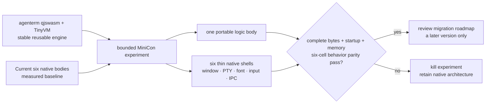

# PRD 02.28 — qjswasm portable-logic horizon

Status: **future exploration**. This is not v0.1.3 scope and is not evidence
that the dependency, architecture, or size reduction has shipped.

## Product outcome tree

```text
Future MiniCon qjswasm experiment
├── dependency
│   └── agenterm qjswasm engine, combining QuickJS/Wasm with TinyVM, is shipped and stable
├── user problem
│   └── six native products repeat portable Rust logic and inflate the combined payload
├── proposed boundary
│   ├── qjswasm portable layer: product/state/protocol logic proven independent of the OS
│   └── six native shells: window, PTY, font, input, clipboard, IME, IPC and presentation
├── hypothesis
│   └── one portable logic body plus thin native shells is smaller than six repeated native bodies
├── evidence
│   ├── exact total raw and compressed bytes before/after, including engine and glue
│   ├── cold start, first window, input latency and steady memory on all six cells
│   ├── public control and GUI behavior parity against the native baseline
│   └── deterministic failure and cleanup at the engine/native boundary
├── safe failure
│   └── retain the current six-native architecture and published artifacts unchanged
└── non-goals
    ├── no migration before the agenterm engine is a stable reusable dependency
    ├── no qjswasm work in v0.1.3 or the v0.1.4 signed minicon.com Candidate
    ├── no change to `CANDIDATE_CEILING_BYTES` / 9 MiB size court from this node
    └── no claim that Wasm is smaller until complete-product measurement proves it
```

## Memory palace



## Entry gate

The experiment may start only after agenterm exposes qjswasm as a versioned,
documented engine with a stable host-call boundary, bounded execution and
six-cell runtime evidence. A source directory or a passing engine unit test is
not a reusable dependency.

Before implementation, inventory MiniCon code by authority:

- portable candidates must have no OS handle, GUI-thread, PTY, font, input,
  clipboard, IME, IPC transport, path-layout or native-lifetime ownership;
- native shells retain every such authority and expose only typed operations;
- protocol compatibility remains observable through MiniCon's public control
  CLI, not an internal qjswasm-only test surface.

## Decisive experiment

Freeze one exact native baseline and one exact experimental source state. Build
and run both on `{win,lnx,osx} × {x86_64,aarch64}`. Count the complete
distributable body: engine, bytecode/Wasm, native shells, glue and metadata.
Report raw and release-compressed bytes per cell and in aggregate; do not report
only the portable module.

The experiment advances only when all public behavior gates pass and the total
package demonstrates a material reviewed reduction without violating startup,
interaction or memory budgets. Kill the route when engine plus glue erases the
size reduction, any native authority leaks into the portable layer, startup or
interaction exceeds the agreed budget, or a platform requires a divergent
portable implementation. A failed experiment changes no Release asset.

## Deferred decisions

- which MiniCon modules form the first portable slice;
- bytecode versus Wasm packaging and whether either is cached;
- engine update and compatibility policy;
- numeric size/latency/memory thresholds, which must be fixed before the
  experiment rather than selected after seeing its result.
